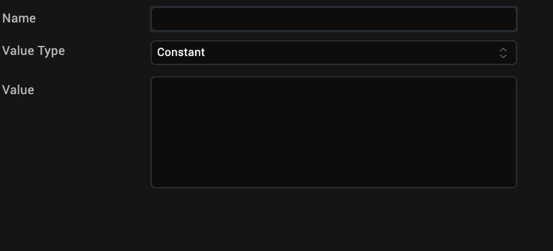

                         

General Actions
---------------

> **_Note:_** General actions are only supported for Apple Watch on V9 Servicepack 5 Fixpack 15 or later.

The general actions that you can use in an action sequence are as follows:

  
| Action | Property |
| --- | --- |
| [Loop Action](#loop-action) | Repeat a set of nested statements for the specified number of times. |
| [Add Local Variable](#add-local-variable) | Adds a variable that is available within a function. Local variable can be of type Constant or Expression and take the following data type: String, Number, Boolean and or Collection. |
| [Modify Variable](#modify-variable) | Modify an existing variable. |
| [Navigate to Form](#navigate-to-form) | Navigates from one form to another. |
| [String Operation](#string-operation) | Perform operations (such as combine or split) on strings. |
| [Try-Catch](#try-catch) | Marks a block of statements to try, and specifies a response, should an exception be thrown. |
| [Exit App](#exit-app) | Closes the application.(Not supported for Apple Watch) |
| [Set Timeout](#set-timeout) | Set a timeout variable. |
| [Clear Timeout](#clear-timeout) | Clear the timeout. |

### Loop Action

To define an action sequence for executing a loop action, do the following:

1.  From the **Project** tab of the Project Explorer, select the widget you want to apply the action to.    
    The widget is highlighted on the Iris Canvas.
2.  Right-click the widget and then select one of the actions for example, onTouchStart.  
    The Action Editor window opens and an action sequence is created.
3.  From the **General** section along the left column of the Action Editor, click **Loop Action**.  
    The action is added to the action sequence and is the current action of focus.
4.  In the properties pane of the Action Editor, configure the following
    1.  In the **Variable** field, you can either select `Set` and enter a name for the variable or select `Select` and select a variable from a list of existing variables.
    2.  In the **Starting Value** field, you can either select `Set` and enter a starting value for the variable or select `Select` and select a value from the list.
    3.  In the **End Value** field, you can either select `Set` and enter an ending value for the variable or select `Select` and select a value from the list.
    4.  In the **Step By** field, enter the value for the step.
    5.  Select the direction of the count, either `Increment` or `Decrement`.
    
        
    
5.  Click **Save** to save the action sequence, and close the Action Editor window.

### Add Local Variable

To define an action sequence to add a local variable, do the following:

1.  From the **Project** tab of the Project Explorer, select the widget you want to apply the action to.    
    The widget is highlighted on the Iris Canvas.
2.  Right-click the widget and then select one of the actions for example, onTouchStart.  
    The Action Editor window opens and an action sequence is created.
3.  From the **General** section along the left column of the Action Editor, click **Add Variable**.  
    The action is added to the action sequence and is the current action of focus.
4.  In the properties pane of the Action Editor, in the **Name** text box, enter a name for the variable.
5.  From the **Value Type** list, select a value type, either **Constant** or **Expression**.
6.  In the **Value** field, enter the value of the local variable.

     

7.  Click **Save** to save the action sequence, and close the Action Editor window.

### Modify Variable

To define an action sequence to modify an existing variable, do the following:

1.  From the **Project** tab of the Project Explorer, select the widget you want to apply the action to.    
    The widget is highlighted on the Iris Canvas.
2.  Right-click the widget and then select one of the actions for example, onTouchStart.  
    The Action Editor window opens and an action sequence is created.
3.  From the **General** section along the left column of the Action Editor, click **Modify Variable**.  
    The action is added to the action sequence and is the current action of focus.
4.  In the properties pane of the Action Editor, in the **Value** field, select `Local` to modify a local variable, or `Global` to modify a global variable.
5.  In the **Variable** field, select a variable from a list of existing variables.
5.  In the **Value Type** field, you can choose to either `Set` a value for the variable or `Increment` or `Decrement` the value of the variable.

If you choose to `Set` a value for the variable, select a value type from the **Type** list, either **Constant** or **Expression**, and then enter the value of the variable in the text box provided below.

   

Click **Save** to save the action sequence, and close the Action Editor window.

### String Operation

To define an action sequence to execute a String operation, do the following:

1.  From the **Project** tab of the Project Explorer, select the widget you want to apply the action to.    
    The widget is highlighted on the Iris Canvas.
2.  Right-click the widget and then select one of the actions for example, onTouchStart.  
    The Action Editor window opens and an action sequence is created.
3.  From the **General** section along the left column of the Action Editor, click **String Operations**.  
    The action is added to the action sequence and is the current action of focus.
4.  In the properties pane of the Action Editor, in the **Type** field, select the type of String operation, either **Combine** or **Split**.
5.  In the **String 1** field, you can choose to either `Set` a value for the string or select `Select` and select a string from a list of existing strings.
6.  The second field varies depending on the type of String operation you select.
    *   If you select the **Combine** option, in the **String 2** field, you can choose to either `Set` a value for the string or select `Select` and select a string from a list of existing strings. To add additional strings, click the green + icon. To delete a string, click its corresponding red x icon. 

        
        
    *   If you select the **Split** option, in the **Delimiter** field, you can choose to either `Set` a delimiter for the string or select `Select` and select a string from a list of existing strings.  

        

7.  In the **Assign To** list, select the variable to which you want to assign the resulting String.
8.  Click **Save** to save the action sequence, and close the Action Editor window.

### Try-Catch

To define an action sequence to execute a try-catch block of code, do the following:

1.  From the **Project** tab of the Project Explorer, select the widget you want to apply the action to.    
    The widget is highlighted on the Iris Canvas.
2.  Right-click the widget and then select one of the actions for example, onTouchStart.  
    The Action Editor window opens and an action sequence is created.
3.  From the **General** section along the left column of the Action Editor, click **Try-Catch**.  
    The action is added to the action sequence and is the current action of focus.
4.  In the properties pane of the Action Editor, three actions are available:
    *   The **try** statement allows you to define code to be tested for errors while it is being executed. Add the action or actions that you want to carry out in the try block by locating and clicking the action from the list of actions available along the left column of the Action Editor.
    *   The **catch** statement allows you to define a block of code to be executed, if an error occurs in the try block. In the code editor, enter the code that you want to execute or paste it in from another source by pressing Ctrl+V. For Apple Watch, you can also add the action or actions that you want to carry out in the catch block by locating and clicking the action from the list of actions available along the left column of the Action Editor.         
    
    *   The **finally** statement lets you execute code, after try and catch, regardless of the result. Add the action or actions that you want to carry out in the finally block by locating and clicking the action from the list of actions available along the left column of the Action Editor. (Finally is not supported for Apple Watch)

5.  Click **Save** to save the action sequence and close the Action Editor window.

### Navigation to Form

To define an action sequence for navigating to a form, or exit an app, do the following:

1.  From the **Project** tab of the Project Explorer, select the widget you want to apply the action to.    
    The widget is highlighted on the Iris Canvas.
2.  Right-click the widget and then select one of the actions for example, onTouchStart.  
    The Action Editor window opens and an action sequence is created.
3.  From the **General** section along the left column of the Action Editor, click **Navigate to Form**.
    The action is added to the action sequence and is the current action of focus.
4.  In the properties pane of the Action Editor, select the form to navigate to.

    

5.  Click **Save** to save the action sequence, and close the Action Editor window.

### Exit App

Exit App is not supported for Apple Watch. To define an action sequence for exiting an app, do the following:

1.	From the **Project** tab of the Project Explorer, select the widget you want to apply the action to.  
The widget is highlighted on the Iris Canvas.
2.	Right-click the widget and then select one of the actions for example, onTouchStart.
    The Action Editor window opens and an action sequence is created.
3.	From the **General** section along the left column of the Action Editor, click **Exit App**.
    The action is added to the action sequence and is the current action of focus.
4.	Click **Save** to save the action sequence and close the Action Editor window.

### Set Timeout

To define an action sequence to set a timeout, do the following:

1.  From the **Project** tab of the Project Explorer, select the widget you want to apply the action to.    
    The widget is highlighted on the Iris Canvas.
2.  Right-click the widget and then select one of the actions for example, onTouchStart.  
    The Action Editor window opens and an action sequence is created.
3.  From the **General** section along the left column of the Action Editor, click **Set Timeout**.  
    The action is added to the action sequence and is the current action of focus.
4.  In the properties pane of the Action Editor, in the Delay (s) field, enter a value for the time in seconds (s) after which the timeout must occur.
5.  In the **Assign To** list, select the variable that you want to use to set the timeout.  
6.	For Repeat, select either `True` or `False` to choose whether or not the timer will repeat.
    > **_Note:_** This will only apply to V9 Servicepack 5 Fixpack 15 or later.

    

7.  Click **Save** to save the action sequence, and close the Action Editor window.

### Clear Timeout

To define an action sequence to clear a timeout that has already been set, do the following:

1.  From the **Project** tab of the Project Explorer, select the widget you want to apply the action to.    
    The widget is highlighted on the Iris Canvas.
2.  Right-click the widget and then select one of the actions for example, onTouchStart.  
    The Action Editor window opens and an action sequence is created.
3.  From the **General** section along the left column of the Action Editor, click **ClearTimeout**.  
    The action is added to the action sequence and is the current action of focus.
4.  In the properties pane of the Action Editor, from the **Timeout Handle** list, select the variable for the timeout you want to clear.

    
    
5.  Click **Save** to save the action sequence, and close the Action Editor window.
