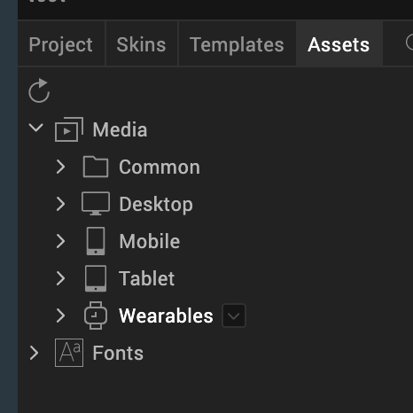

                          

Add and Manage Images and Other Media
=====================================

While designing an application, you will have the need to use images, videos, and other media in a form. To do so, you copy the media to a specific folder in the Workspace and then use the appropriate widget to insert the media in a form. You can see what media are a part of your project on the **Assets** tab of the Project Explorer. You can also specify media for a specific channel and then use them in your application.

After adding media to a media folder, to see them reflected in Volt MX Iris, refresh the list of media assets by clicking the **Refresh Folders** icon located on the top left corner of the **Assets** tab in the Project Explorer.

This section covers the following topics:

[Conventions for Images](#conventions-for-images)

[Import and Use Images](#import-and-use-images)

[Troubleshoot Invalid Images](#troubleshoot-invalid-images)

[Manage Android Image Folders](#manage-android-image-folders)

[Add a Favorite Icon (FavIcon) for Use in a Browser](#add-a-favorite-icon-favicon-for-use-in-a-browser)

[Add a Touch Icon for Apple for Use in a Browser](#add-a-touch-icon-for-apple-for-use-in-a-browser)

[Android App Icons - Mipmap Drawables](#android-app-icons-mipmap-drawables)

Conventions for Images
----------------------

This section covers the following subjects:

[Image Assets Based on Dots Per Inch (DPI) or Form Factors](#image-assets-based-on-dots-per-inch-dpi-or-form-factors)

[Gestures Using DPI](#gestures-using-dpi)

[Retina Display on iPhone](#retina-display-on-iphone)

[Apple Touch Icon](#apple-touch-icon)

[Naming Conventions for Images](#naming-conventions-for-images)

### Image Assets Based on Dots Per Inch (DPI) or Form Factors

Applications must have right image assets to handle various DPIs. SPA platform enables automatic detection of the device DPI by default and requests for the right set of images based on the DPI.

For devices with different form factors but same DPI, the SPA platform uses the device screen width as a factor while requesting the appropriate image assets. SPA platform also handles screen orientation specific asset requests.

### Gestures Using DPI

Besides using the DPI for the resource identification, SPA platform also uses DPI for calculating the threshold limits to identify various gestures like swipe, scroll, tap, and double-tap.

### Retina Display on iPhone

iPhone 4.0 has a high resolution screen (960x640) with a density of 326 ppi. When the screen density is more than 300 ppi, images, videos, text, and other objects appear very smooth with high clarity on the screen. This high resolution screen enables a very clear view of all the objects on the screen, which is similar to high quality printed output. Apple has named this technology Retina Display.

All the iPhone applications are developed for 320x480 resolution. The images used in the application are automatically scaled up to suit the high resolution screen. When the images are scaled up for a high resolution screen, the clarity of images is distorted. The Retina Display feature ensures excellent image clarity by preventing automatic scaling.

To support images within an application for Retina Display, do the following:

1.  Create an image with twice the pixel dimensions as the original image.
2.  Add the following suffix to the image name: `@2x`.

For example, if you have a company logo image named `logo.png` that is 50x50 pixels, and you want to use it for a high resolution screen, create the same image at a size of 100x100 pixels, and name it `logo@2x.png`.

4.  Place this high-resolution image in the Resources folder along with the other images. When you build your project, the resulting app automatically picks up the high resolution images for those devices that support the retina display.

### Apple Touch Icon

The Apple Touch Icon or apple-touch-icon.png is a file used for a web page icon on the Apple iPhone, iPod Touch, and iPad. When someone bookmarks your web page or adds your web page to his or her home screen, the Apple Touch icon is used. If this file is not found these Apple products will use the screenshot of the web page, which often looks like no more than a white square.

This file should be saved as a .png, have dimensions of 58 x 58, and be stored in your resources common directory.

### Naming Conventions for Images

This section explains the naming convention you should follow while naming the images. The allowed characters in the image file names are:

*   Lowercase alphabetical characters

> **_Note:_** The image name must start with a lowercase alphabetical character.

*   Numerical characters
*   Underscore (\_)
*   Period (.)

> **_Important:_** Do **not** use spaces in your image file names. Also, do not use any reserved words or keywords as the file names for the images.

You will want to be sure to use the following conventions when naming image files:

  
| Valid File Names | Invalid File Names | Remarks |
| --- | --- | --- |
| myicon.png | Myicon.png | Contains an uppercase character. |
| icon2.png | icon\_2.png | Contains an underscore. |
| accntsummary.png | accnt&summary.png | Contains a special character. |
| accountdetails.png | 2details.png | Begins with a number. |
| companylogo.png | company logo.png | Contains a space. |
| flightstatus123.png | continue.png | Contains a JavaScript keyword. |

Import and Use Images
---------------------

To use images in your application, you must import them into Volt MX Iris. For conventional 2D images, use either PNG, GIF, or JPEG image formats while working with an application. You can also use WebP image format for SPA and Desktop Web applications.

> **_Note:_** You cannot import images with the WebP format directly into your applications.  
To access an image with the WebP format in Desktop Web applications, copy the image into <workspace folder>/<application name> /resources /desktop/common.  
To access an image with WebP format in SPA applications, copy the image into <workspace folder >/<application name> /resources/mobile/web/spaandroid.  
After that you can use the [src](../../../Iris/iris_widget_prog_guide/Content/Image_Properties.md#src) property of the Image widget to dynamically add the images with WebP format.  

You can import an image into Volt MX Iris by using the following methods:

*   [Add an image to the Assets tab, and then use the image.](#import-images-to-assets-tab)
*   [Directly import an image into a widget.](#directly-import-images-into-a-widget)

> **_Note:_** GIFs are supported only in Image widget.

The 3D formats Volt MX Iris supports are as follows:

*   The Autodesk 3DS Max file format (.3ds)
*   The COLLADA file format (.dae)

Following are the subfolders in which you can store images, videos, and other media:

*   **Common.** The media assets stored here are available across all the channels (mobile and tablet applications) and modes (native and web).
*   **Desktop.** The media assets stored here are available for all Responsive Web applications.
    *   **Common.** The media assets stored here are available for native and web applications.
    *   **Native.** The media assets stored here are available only for native applications.
    *   **Web.** The media assets stored here are available only for web applications.
*   **Mobile.** The media assets stored here are available for all mobile devices.
    
    *   **Common.** The media assets stored here are available for native and web applications.
        
    *   **Native.** The media assets stored here are available only for native applications.
        
    *   **Web.** The media assets stored here are available only for web applications.
        
*   **Tablet.** The media assets stored here are available for all tablet devices.
    *   **Common.** The media assets stored here are available for native and web applications.
    *   **Native.** The media assets stored here are available only for native applications.
    *   **Web.** The media assets stored here are available only for web applications.
*   Wearables. The media assets stored here are available for all wearable devices.
    *   **Apple Watch.** The media assets stored here are available for only Apple Watch devices.
        *   **Common.** The media assets stored here are available for native and web Apple Watch applications.
            
        *   **Native.** The media assets stored here are available for only native Apple Watch applications.
    *   **Android Wear.** The media assets stored here are available for only Android Wear devices.
        *   **Common.** The media assets stored here are available for native and web Android Wear applications.
        *   **Native.** The media assets stored here are available for only native Android Wear applications.

### Import Images to Assets Tab

To add images to the Assets tab and then use them in a Volt MX Iris project, follow these steps:

1.  In Volt MX Iris, go to **Project Explorer** > **Assets**.
2.  Expand the channel to which you want to add the image files; whether Common (to be available to all channels), Desktop, Mobile, Tablet, or Wearables.
3.  Expand the environment that you want the image files to be accessible to; whether Common (to be available for all environments), Native, or Web.
4.  If you selected the Native environment, expand the platform that you want the SQLite database to be accessible to, whether Common (to be available to
     all platforms), Android, iOS, or Windows.
     Once the node is fully expanded, a **raw** folder is visible.
5.  Click the context menu arrow of the **raw** folder, and then click **Import Media**.
6.  Navigate to the folder containing the images you want to import, and then select them, holding down the **Ctrl** key as you click to select non-contiguously listed images, or the **Shift** key to select contiguously listed images.
7.  Click **Open**.
8.  To see the added files reflected in Volt MX Iris, on the **Project** menu in Volt MX Iris), click **Refresh**.

### Directly Import Images into a Widget

Alternatively, you can directly import images into a widget; without the need to add them to the Assets tab first. You can directly import images into an Image widget, as the skin of a widget (for example, Button), or into any widget property that takes an image name (for example, the selected and unselected images in a CheckBoxGroup). As an example, we have discussed the process of how to directly import images into an Image widget later in this section.

Furthermore, you can directly import images into the widgets inside a component. For more information, refer the [Import and Add Images to a Component](C_UsingComponents.md#directly-import-images-into-a-component) section.

**To directly import images into an Image widget, follow these steps:**

1.  From the **Default Library**, drag and drop an Image widget to your form.
2.  You can perform any of the following actions:
    
    *   On the Project Canvas, double-click the Image widget.
    *   In the Project Explorer, expand your form, right-click the Image widget, and then click **Edit Image Source**.
    
    The **Select Image** dialog box appears, containing the list of available imported images.  
      
     
    
3.  Click **Import**. The File Explorer of your local computer appears.
4.  Select the required image, and then click **Open**. The Import Images dialog box appears, indicating that the image has been imported successfully. If required, Volt MX Iris automatically modifies the file name of the imported image according to the Volt MX Irisresource name specification.  
      
     
5.  The imported image appears in the list of images of the **Select Image** dialog box. Select the image, and then click **OK**. The image is added to the Image widget.

Troubleshoot Invalid Images
---------------------------

If any of the images in the Media folder of the **Assets** tab have an invalid file name or are not a PNG file, the Media folder icon displays a yellow triangle with an exclamation mark. Similarly, the icon of any Media subfolder that contains such an invalid image displays a yellow triangle with an exclamation mark. To resolve this, you need to identify the invalid files and correct them.

To troubleshoot invalid images, do the following:

1.  On the Project Explorer, click the **Asset** tab. Observe if the Media folder icon displays a yellow triangle with an exclamation mark.
2.  If it does, expand the Media folder and for each affected channel, navigate to the lowest-level subfolder that displays the warning icon.
3.  Click the context menu arrow of the subfolder with the warning icon, and then click **Resource Location**. Your computer's file browser opens the folder.
4.  Examine the file names and the image formats of the files. All images need to be in the PNG format, and all files need to follow the naming conventions described in [Naming Conventions for Images](#naming-conventions-for-images). If necessary, use a graphics application to save images that are using invalid file formats as PNG, JPEG, or GIF files.
5.  Repeat the last step for any other sub folders in the channel, and then move on to any other affected channels.

When all files have been corrected, the Media folder icon returns to normal.

Manage Android Image Folders
----------------------------

This section covers the following subjects:

[Particulars for managing Android image folders](#particulars-for-managing-android-image-folders)

[Range of screen supported in Android](#range-of-screens-supported-in-android)

[Nine Patch Background Image](#nine-patch-background-image)

### Particulars for managing Android image folders

Following are some particulars for managing Android image folders: 

*   You can create a folder in which resources are added based on the specific scenarios: 
    
    *   **MCC and MNC**: Creates a folder based on the Mobile Country Code and Mobile Network code. Add images or resources in the folder based on the MCC and MNC. You can add an image when you right-click the newly created folder and select Add Resources.
    *   **Screen Size**: Screen size for which the application is built. Add the images based on the screen sizes specified. You can add an image when you right-click the newly created folder and select Add Resources.
    *   **Screen Aspect**: Aspect for which the application is built. Add the images based on the screen aspect specified. You can add an image when you right-click the newly created folder and select Add Resources.
    *   **Screen Orientation**: Can be set as portrait or landscape. A folder is created accordingly under android. You can add an image when you right-click the folder and select Add Resources. Ensure that the image name specified and added is the same as the image name specified in Splash Screen Properties.
    *   **Dock mode**: Creates a folder based on the dock mode specified. The dock mode can be car or normal. Add images in the respective folder based on the dock mode specified. You can add an image when you right-click the newly created folder and select Add Resources.
    *   **Night mode**: Mode in which the application is built. Add the images based on the mode specified. You can add an image when you right-click the newly created folder and select Add Resources.
    *   **Screen pixel density**: Creates a folder based on the dpi of the device. Add the images based on the dpi specified.You can add an image when you right-click the newly created folder and select Add Resources.
    *   **Touchscreen type**: Creates a folder based on the dpi of the device. Add the images based on the touch screen specified.You can add an image when you right-click the newly created folder and select Add Resources.
    *   **Keyboard availability**: Creates a folder based on the keyboard availability set. Add the images based on the keyboard mode specified.You can add an image when you right-click the newly created folder and select Add Resources.
    *   **Primary text input method**: Creates a folder based on the input method set . Add the images based on the method specified.You can add an image when you right-click the newly created folder and select Add Resources.
    *   **Navigation key availability**: Creates a folder based on the navigation key availability. Add the images based on the availability specified.You can add an image when you right-click the newly created folder and select Add Resources.
    *   **Primary non-touch navigation method**: Creates a folder based on the navigation set . Add the images based on the method specified.You can add an image when you right-click the newly created folder and select Add Resources.
    *   **Platform Version**: Creates a folder based on the Android Platform version. Add the images based on the method specified.You can add an image when you right-click the newly created folder and select Add Resources.
    
    *   **drawable-<language>-r<Region>** when you have resources specific to locales only. For example, if you want to add a resource for en\_US locale, then create a drawableen-rUS folder and place the resource in drawable-en-rUS folder.
    
    *   **drawable-<screensize>** when you have resources specific to screen size only. Possible screen sizes are small, normal, large, and xlarge. For example, if you want to add a resource for normal screen size, then create a drawable-normal folder and place the resource in drawable-normal folder.
    *   **drawable-<orientation>** when you have resources specific to orientation only. Possible values for orientation are land and port. For example, if you want to add a resource for landscape orientation, then create a drawable-land folder and place the resource in drawable-land folder.
    *   **drawable-<screen-pixel-density>** when you have resources specific to resolution or screen-pixel-density only. Possible values for screen-pixel-density are ldpi, mdpi, hdpi, xhdpi, and nodpi. For example, if you want to add a resource for hdpi pixel density, then create a drawable-hdpi folder and place the resource in drawable-hdpi folder.

> **_Note:_** To copy the contents into the generated native android root project, create a new folder with the name **RootFolderContents** in the following locations based on the build channel:
* For mobile devices: <workspace>/<app>/resources/mobile/native/android/
* For tablet devices: <workspace>/<app>/resources/tablet/native/androidtab/

If you have resources specific to a combination of the above folder, you must follow precedence rules and name the folders appropriately. The precedence rules are as follows:

*   Locales or language and region
*   Screen size
*   Orientation
*   Screen pixel density

The following table explains a few examples:

  
| Folder | Description |
| --- | --- |
| drawable-en-rUS-land | Resources specific to US-English devices in landscape mode |
| drawable-port-hdpi | Resources specific to devices in portrait mode with hdpi pixel-density |
| drawable-en-rUSlarge-land | Resources specific to US-English large screen devices in landscape mode |
| drawable-en-rUSlarge-land-hdpi | Resources specific to US-English large screen devices in landscape mode with hdpi density |

### Range of screens supported in Android

A set of four generalized sizes: small, normal, large, and xlarge

> **_Note:_** Beginning with Android 3.2 (API level 13), these size groups are deprecated in favor of a new technique for managing screen sizes based on the available screen width. If you're developing for Android 3.2 and greater, see Declaring Tablet Layouts for Android 3.2 for more information.

A set of six generalized densities:

*   ldpi (low) ~120dpi
*   mdpi (medium) ~160dpi
*   hdpi (high) ~240dpi
*   xhdpi (extra-high) ~320dpi
*   xxhdpi (extra-extra-high) ~480dpi
*   xxxhdpi (extra-extra-extra-high) ~640dpi

> **_Note:_** For more information on images, see [Supporting Multiple Screens](http://developer.android.com/guide/practices/screens_support.html) on the Android Developer site.

### Nine Patch Background Image

Volt MX  Iris supports Android's NinePatch image class. A NinePatchDrawable graphic is a resizeable bitmap image that Android automatically resizes to accommodate the contents of the view in which you have placed it as the background. Benefit of the NinePatch image is the ability to define what can be stretched. You can define what parts can be stretched and what remains as it was originally designed. This way you can have content appear without distortion on different screen size devices.

Use Case

*   Used as background image for a segment, textbox, popup and other widgets whose content increases dynamically. This image does not look stretched or loose proportions on different screen sizes.
*   Another advantage is memory, same small size image can be reused for different screen size devices.
*   Used as splash screen images to occupy complete width and height on different screen sizes.

> **_Note:_** For detailed information on NinePatch image, see [http://developer.android.com/guide/topics/graphics/2d-graphics.html#nine-patch](http://developer.android.com/guide/topics/graphics/2d-graphics.html#nine-patch).

On Windows, a draw9patch.bat file exists in the Android SDK folder within the tools folder. On Mac, a draw9patch executable file exists in the Android SDK folder within the tools folder. Launch this tool to create 9-patch images. This tool is developed by Android.

To launch the NinePatch tool, do the following:

1.  Navigate to Android SDK or tools folder.
2.  Run the file draw9patch.bat to launch the Draw 9-patch tool.
3.  Drag the PNG image that you want to edit into the Draw 9-patch window.
4.  The image appears with a blank one-pixel border around it. Click within the 1-pixel perimeter to draw the lines that define the stretchable patches.
5.  Remove any mistakes by holding the Shift key and clicking on a marked pixel.
6.  Once the editing is done, on the **File** menu, click **Save 9-patch**.You must save it with the file name format `<imagename>.9.png`, saving it to the following folder:  
    `\resources\mobilerichclient\android`

> **_Note:_** For more information about using the 9-patch tool, see [http://developer.android.com/guide/developing/tools/draw9patch.html](http://developer.android.com/guide/developing/tools/draw9patch.html).

Add a Favorite Icon (Favicon) for Use in a Browser
--------------------------------------------------

A favicon file is a .ico file containing one or more small icons for display in web browsers, and most commonly appear next to a web site's URL, on a browser tab, and can also be associated with shortcuts and bookmarks.

To add a favorite icon for use in a browser, do the following:

1.  On the **Project** menu click **Settings**.
2.  Click the **Responsive Web** tab.
3.  For the **Web Browser (favicon.ico)** field, click its corresponding **Browse** button.
4.  Navigate to the file you want to use, select it, and then click **Open**.  
    The file type used is .png.
5.  Click **Done**.

Add a Touch Icon for Apple for Use in a Browser
-----------------------------------------------

The Apple Touch Icon or Apple-touch-icon.png is a file used for a web page icon on the Apple iPhone, iPod Touch, and iPad. When someone bookmarks your web page or adds your web page to his or her home screen, the Apple Touch icon is used. If this file is not found these Apple products will use the screen shot of the web page, which often looks like no more than a white square.

This file should be saved as a .png, have dimensions of 58 x 58, and be stored in your resources common directory.

To add a touch icon for Apple for use in a browser, do the following:

1.  On the **Project** menu click **Settings**.
2.  Click the **Adaptive Web** tab.
3.  For the **iPhone Shortcut** field, click its corresponding **Browse** button.
4.  Navigate to the file you want to use, select it, and then click **Open**.
5.  Click **Done**.

Android App Icons - Mipmap Drawables
------------------------------------

Android guidelines recommend to use Mipmap drawables for launcher icons. The advantage of using mipmap icons is described in detailed below.

When you target your application to support a specific set of device densities, (by specifying android.splits.abi block in build.gradle), Android build eliminates other resources from the drawable folders that are not relevant to a user’s device density from apk. When a launcher app wants to upscale a low-resolution icon, the icon might look blurred. A user can use the Mipmap drawable folder to store app launcher icons for all densities. Android system never removes files in the Mipmaps folder that is packed into apk. Packing Mipmaps folder into the apk ensure that right icon is picked up by launcher apps for best resolution.

*   App uses Mipmap/ folders instead of the drawable/ folders for launcher icons.
*   If you are targeting a specific density deice, ensure to add higher resolution versions of the icons to enhance the visual experience of the icons on higher resolution devices. For example, if you target xxhdpi, ensure to pack xxxhdpi launcher mipmap icons.

### Adding Mipmap Resource

To add a Mipmap resource folder,

1.  In your platform folders, create a mipmap folder. For example, navigate to **Resources** > **Channel** > **Native** > **Platform**
2.  Create a folder, for example **mipmap-<screen-pixel-density>**.  
    Some possible values for screen-pixel-density are **ldpi** (low), **mdpi** (medium), **hdpi** (high), **xhdpi** (extra-high), **xxhdpi** (extra-extra-high), and **xxxhdpi**(extra-extra-extra-high).  
    
3.  Alternatively, you can also add mipmap resources in the following manner.  
    Copy **mipmap> <screen-pixel-density>** folders for the following:  
    For mobile - **<WorkSpace>\\<Application>\\resources\\mobile\\native\\android**  
    For tablet - **<WorkSpace>\\<Application>\\resources\\tablet\\native\\androidtab**

### Configure Mipmap in Project Settings

To ensure that Mipmaps feature works, you must do the following.

1.  Navigate to **Settings** > **Native** > **Android**.
2.  Scroll down to the **Manifest permissions, Tags and Gradle Build Entries** section.  
    The **Permissions** tab is open by default.
3.  Click the **Tags** tab.
4.  Under **Application-Tag-Attributes**, enter the following code in it.  
    `android:icon="@mipmap/<iconImageName without extension>"`  
    For example, if the image name is launcher.png  
    `android:icon="@mipmap/launcher"`
