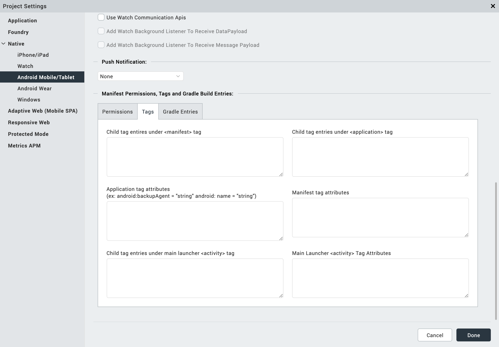

                           

Android Wear Properties
=======================

Native app properties are divided into two categories: those that are common to all platforms, and those that are platform-specific. These properties range from the logo image your app displays to the types of screens and SDKs the app supports, and how certificates are handled.

To set Native app properties, do the following:

1.  On the **File** menu, click **Settings**.
2.  Click the **Native** tab.
3.  On the **Common** secondary tab, set the following properties:
    1.  Enter a **Name** for the Native channel version of the application. If no name is specified, the name specified under **Application Properties** is used.
    2.  Browse and select an image file for the logo.
        
        > **_Important:_***   The logo you specify here will be renamed to `icon.png` while building the application on the iPhone platform.
        *   For Desktop/Kiosk, the icon dimension must be in multiples of 8. Minimum pixels can be 8 x 8 and maximum pixels can be 248 x 248.
        
4.  Click the **Android** secondary tab.
    
5.  Select the **Android Wear**tab and set the following properties:
    
    
    
    1.  In the **SDK Versions** section:
        
        *   Select the **Minimum** SDK Version that needs to be supported for the application. The default minimum SDK value is 7.1.
        
        *   Select the **Target** SDK Version that needs to be supported for the application.
            
            > **_Note:_** The Target SDK Version must be greater than or equal to the Minimum SDK Version.
            
        *   Select the **Maximum** SDK Version that needs to be supported for the application.
    2.  **Package Name**: This is the name with which the application is submitted to _Google Play_. _Google Play_ is an online software store developed by Google for Android mobile devices. A software program called _Market_ is pre-installed on most of Android mobile devices. This software allows the users to browse and download third-party applications. This name is used to search the application in _Google Play_.
        
        > **_Note:_** The name you specify for _Android Package_ must contain at least two segments.
        
    3.  **Version Code**. This is an internal version number. This number is used to determine whether the application is a recent version. This version number is not shown to users. The value must be an integer. You can increase each version by one to indicate a newer version.
    4.  In **Push Notification** section:
        *   **GCM** - Select this option to enable Push Notifications for the application. This option copies the libraries required for push notification into the project during build time.
            
            > **_Important:_** GCM (Google Cloud Messaging) is supported only for Android SDK Versions 2.3 and above.
            
            *   **Custom GCM Broadcast Receiver (Optional)** - If your application requires to override the default GCM broadcast receiver behavior, you can provide your own custom broadcast receiver. To customize the GCM receiver, see [Customizing GCM Broadcast Receiver](Custom_GCM.md).
        *   **FCM** Select this option to enable Push Notifications for the application. This option copies the libraries required for push notification into the project during build time.
            *   **Custom FCM Service (Optional)** - If your application requires to override the default FCM service, you can provide your own custom FCM service. To customize the FCM service, see [Customizing FCM Service](Custom_FCM.md).
    5.  In the **Miscellaneous** section:
        *   **Enable Local Notifications**: Selecting this option ensures that your Android Wear app supports local notifications.
        *   **Protected Mode** - Selecting this option ensures that your app is not run on a rooted/jail broken device.
        
        > **_Note:_** This option works only if the application is built in Release mode. The Protected Mode option works only if the application is built in Release mode. To know more about protecting your application, see [Applying Application Security](ApplicationSecurity.md).
        
    6.  **Signing** - Use this option to sign the android binary automatically during the build process.
        *   **Key Alias**\- Use this option to enter the alias of the key.
        *   **Key Password** - Use this option to enter the password for the key.
        *   **Store File** - Use this option to locate and configure the store file.
        *   **Store Password** - Use this option to enter the password for the store.
    <!-- 7.  **Support x86 Devices** - Select this option to support any Android-x86 devices. For more information on devices, see the [Porting Android to x86 Hardware List](http://www.android-x86.org/hardware-list). -->
    7.  **Support x86 Devices** - Select this option to support any Android-x86 devices. For more information on devices, see the [Porting Android to x86 Hardware List](https://www.android-x86.org/).
    8.  **Support 64-bit Devices** - Select this option to build Android APK with 64-bit support. If Support 64 bit option is not selected by a developer, 32 bit libraries/.so files (armeabi-v7a and x86) are packed by default. Once you select this option, only 64 bit .so files (arm64-v8a and x86\_64 ) are packed with the application leaving out 32 bit .so files(armeabi-v7a and x86).  
          
        Image manipulation APIs are not supported.  
        64 is not respected and it will fall back to 32 bit even when you have selected the 64 bit option in the following cases:  
        Charts (not supported in both arm64 and x86\_64 architectures)  
        
    9.  **Use Google Play Location Services**: Select this to use Google Play Location Services.
    10. **Support SQL DB Encryption (FIPS)**: Select this to support SQL DB encryption.
    11. **Bundle OpenSSL Library**: Select this to bundle Open SSL library.
    12. **Use Watch Communication APIs**: Select this to use watch communication APIs.
        1.  **Add Watch Background Listener To Receive DataPayload**: Select this option to enable watch to receive data payload.
        2.  **Add Watch Background Listener To Receive Message Payload**: Select this to enable watch to receive message payload.  
            
    13. In **Manifest Properties** section:
        *   **Permissions** tab: Set the permissions to _true_ or _false_ based on the application requirements. Set the appropriate permissions for Android Manifest file. For more information, see [The Android Manifest File](AndroidManifest_File.md).
            
            1.  To enable permissions, select the permissions from the left pane and click **Add >**.
            2.  To disable permissions, select the permissions from the right pane and click **< Remove**.
                
                
                
                > **_Important:_** Add the `WRITE_EXTERNAL_STORAGE` setting if you need to save images in an external storage like SD Card.
                
        *   **Tags** tab: You can add tags to the Android manifest file directly from Volt MX Iris by specifying tag entries and attributes on the Tags tab. You can specify child tag entries and attributes for <manifest> and <application> tags, and the Main Launcher <activity> tag. For more information on the tags you can add with the manifest or application tags, see [http://developer.android.com/guide/topics/manifest/manifest-intro.html](http://developer.android.com/guide/topics/manifest/manifest-intro.html).
        
        
        
        For more information on the tags you can add, see [http://developer.android.com/guide/topics/manifest/manifest-intro.html](http://developer.android.com/guide/topics/manifest/manifest-intro.html).
        
        *   **Deeplink URL Scheme** tab: You can use the URL Scheme tab for [Deeplinking](AppServiceEvent.md). The values for Scheme/ port/ path/host/pathprefix/path pattern specified under this tab can be used to deep-link to a particular URL directly. For instance, if you set the masterdata for a browser widget to be a URL to deep-link, use the following format, `scheme://host:port/path`_or_`pathPrefix`_or_`pathPattern`. For more information on each of the values available under the URL Scheme tab, see [http://developer.android.com/guide/topics/manifest/data-element.html#path](http://developer.android.com/guide/topics/manifest/data-element.html#path).
            
            > **_Important:_** For a URL scheme in Android, please note that the scheme name should be in lowercase; otherwise the scheme name will not work in higher versions (Android 4.0 and above) or Android devices.
            
        *   **Gradle Entries** tab: You can use the Gradle Entries tab to import additional gradle packages, apply external plugins, or specify build-related configuration information, build dependencies, or the location of any external repositories or modules used by your Android application.
        
        
        
        You can specify build.gradle entries as a prefix or suffix entries:
        
        *   Prefix entries are added just below any existing import statements in the build.gradle build script file. Use prefix entries to import additional gradle packages, or to specify external plugins to use in the build.
        
        *   Suffix entries are appended to the end of the generated build.gradle file. Use suffix entries to customize build logic; for example, to add compilation dependencies such as Google and Android support repositories, local library modules, or local and remote repository paths. For more information, see [Organizing Build Logic](https://docs.gradle.org/current/userguide/organizing_build_logic.md).
        
        Use the gradle.properties entry to configure project-wide Gradle settings, such as the Gradle daemon's maximum heap size or proxy settings. For more information, see [The Build Environment](https://docs.gradle.org/current/userguide/build_environment.md).
        
        Use the settings.gradle entry to specify external modules (Gradle-based third-party Android libraries) to include when building your application. For more information, see [Configure Your Build](https://developer.android.com/studio/build/index.md).
        
6.  Click **Finish**.

  
| Rev | Author | Edits |
| --- | --- | --- |
| 7.0 | NMK | NMK |
