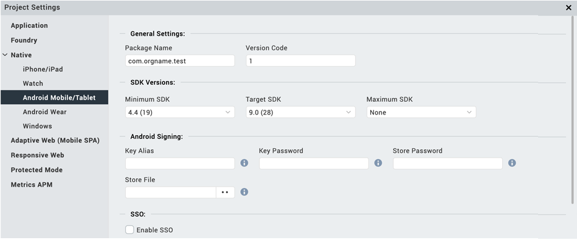

                         

Build an Android Application
============================

Once you have created and configured an app’s assets, resources, and services, you compile and link them by building your app.

**_Note:_** Android Native application builds can fail on MacOS because of permission issues with older versions of the Android SDK. To avoid this problem, run `sudo spctl --master-disable`. You can also go to Security & Privacy and add your terminal app or IDE to the list of apps in the Developer Tools section of the Privacy tab. On the General tab, under **Allow apps downloaded from**, click **Anywhere**. 
To build an app with new or different settings, do the following:

1.  On the **Build** menu, click **Build and Publish Native**.
2.  In the Build Generation dialog box, select the channels and platforms for which you want to build your app. For example, you may want to build a native type of app for Mobile (phone) devices and Tablet devices for the iOS and Android platforms. For more information about native and SPA apps, see [Types of Applications](TypesOfApplications.md).
3.  Select the build mode.

    *   **Debug mode** \- To help you identify and fix errors, Volt MX Iris emits the complete symbolic debug information . To lessen the amount of time necessary to complete the build, the build is not optimized for code execution, so it may tend to execute slower than a build optimized for release. Also, the inclusion of the symbolic debug information causes the final executable to be larger than a release build.
    *   **Release mode** - Volt MX Iris optimizes the build for execution, requiring more time to generate the build. It also does not emit the complete symbolic debug information, making the final executable smaller than a debug build.
    *   **Protected Mode** \- Applications built in Volt MX Iris can use the additional security enhancements by building the application in the _Protected Mode_. Volt MX IrisPlatform code for iOS and Android is equipped with mechanisms that can protect your application by detecting attacks like tampering, swizzling, debugging, jail breaking (iOS), rooting (Android), and information disclosure. Additional security mechanisms are provided through the use of White Box Cryptography to protect application business logic and source code. Application reacts to the attack by exiting upon detecting attacks to prevent further attempts.  
    If you choose to build an application in **Protected mode**, then setting the public and private keys is mandatory. To do so, go to **Project Settings** > **Protected Mode**. For more details on how to generate public and private keys, click [here](ApplicationSecurity.md#rsa-key-pair-generation-encryption-and-usage).
    *   **Test Mode** - To help you identify and fix errors, Volt MX Iris provides the ability to Test the application on the device or an emulator. When you build an app using the Test Mode, you can leverage the Jasmine testing framework of Volt MX Iris to thoroughly test your app and ensure your application is errors free. You can run jasmine test cases, test suites and test plans by building an app using the Test mode.

4.  Click **Build**.

Build and Sign an Android Application in Release Mode
-----------------------------------------------------

Introduced a new feature for Android application build where you can generate and sign an Android application in the release mode with a keystore certificate.

You must configure the settings for the keystore certificate in the Project Settings section.

During the build process in the release mode, keystore configuration from the Project Settings is used to sign the Android binary. Once the Android binary is built with the signing certificate, you can upload the binary to Google Playstore.

To configure the keystore certificate, do the following:

1.  On the **Project** menu, click **Settings**.
2.  Click the **Native** tab.
3.  Click **Android**.
4.  Under the **Android Signing** section, set the following properties:  
    
5.  **Key Alias**: Enter the alias for your key.  
    
6.  **Key Password**: Enter the password to access the key.
7.  **Store Password**: Enter the password to access the store.
8.  **Store File**: Browse to the location of your store and select the store certificate.
9.  Click **Done**.
    

Android SDK and Gradle Dependencies
-----------------------------------

From Volt MX release, Iris downloads the required dependencies before the Android build. If you have started the build for Android for the first time, all required SDK, support packages, and dependent libraries download in the background. Your build is blocked till the time the downloads are complete.

**Known Issues**:

*   When a download dependency is in progress, and the network disconnects in the middle, Android build may hang indefinitely. This is a known technical issue with Gradle. Refer [https://github.com/gradle/gradle/issues/868](https://github.com/gradle/gradle/issues/868) for more info. You may have to restart iris to build again.
*   When an SDK component is partially downloaded or corrupted, the build fails. Delete the corrupted SDK component and then proceed with the build.

Updating an Android App
-----------------------

If your Android app is published even once, when you modify the app, you must ensure to change the version of the app from project settings. Modifying the version number is a mandatory step for the changes to reflect in the app.

*   From the **Project** menu, navigate to **Project Settings**.
*   In the **Application** tab, update the version number to the next version. For example, if the **Version** is 1.0.0, modify it to 1.0.1.
