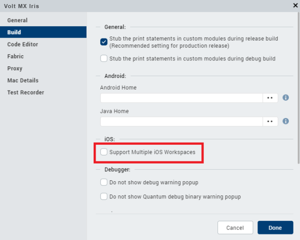
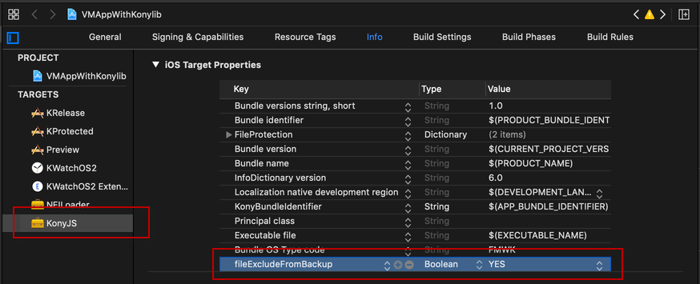

                         


Build an iOS Application
========================

Once you have created and configured an app’s assets, resources, and services, you compile and link them by building your app.

Prerequisites
-------------

*   [Configure Xcode on your Mac](iOS_Automatic_Output_Generation.md#prerequisites)
*   [Connect your Mac with Iris](iOS_Automatic_Output_Generation.md#ipa-generation)

This topic covers the following topics:

[About App Transport Security (ATS)](#about-app-transport-security-ats)

[Automatically Modify info.plist with Custom Key Value Pairs](#automatically-modify-infoplist-with-custom-key-value-pairs)

[Adding Privacy Manifest to the Volt MX Application](#adding-privacy-manifest-to-the-volt-mx-application)

[Using Application Reference Counting](#using-application-reference-counting)

[Automatically Add Required System Frameworks to the XCode Project](#automatically-add-required-system-frameworks-to-the-xcode-project)

[Build an App](#build-an-app)

[Exclude an app from iCloud backup](#exclude-an-app-from-icloud-backup)

About App Transport Security (ATS)
----------------------------------

As of January 2017, Apple Corp. requires that all iOS apps make use of App Transport Security (ATS), which implements the https protocol when communicating with internet resources. Introduced in iOS 9, ATS enforces secure connections between internet resources (such as the backend server) and an iOS app, ensuring that internet communications via the iOS platform conform secure connection best practices. Doing so lessens the likelihood of accidentally disclosing sensitive information either directly through an app or through a library consuming data.

Volt MX  Iris supports ATS and assumes that 1) your iOS applications make use of https, and 2) your communication through higher-level APIs is encrypted using TLS version 1.2 with forward secrecy. As a workaround to this requirement, if your app needs to make a request to an insecure domain, you have to specify this domain in your app's `info.plist` file. For more information, see the [Apple Developer site](https://developer.apple.com/).

### Automatically Modify info.plist with Custom Key Value Pairs

When you build an app for the iOS platform in Volt MX Iris, Xcode generates a build properties file called `info.plist`. By modifying this file, you can customize the properties of the build, which are reflected in the app the next time you build it. Modifications to `info.plist` take priority over whatever properties are set by Volt MX Iris.

If your app requires that the `info.plist` file be configured with sets of key value pairs of native SDK or custom-defined entries, you can automate this customization using a json file. The json file contains the key value pairs that you want added to `info.plist`, and during the building of the app, this json file is incorporated into the kar file. When the kar file is extracted, iOS incorporates the key value pairs in the json fie into `info.plist`.

To automatically modify info.plist with custom key value pairs, do the following:

1.  Create a json file with the following file name:  
    `infoplist_configuration.json`
2.  Place the json file in the following Volt MX Iris project folder:  
    <WorkspaceName>\\<ProjectName>\\resources\\common
3.  Edit the json file, adding the key value pairs that you want automatically incorporated into the `info.plist` file. Save the file and close it.
4.  In Volt MX Iris, build the app.

The json file is incorporated into the kar file. When the kar file is extracted, iOS incorporates the key value pairs in the json fie into `info.plist`.

### Adding Privacy Manifest to the Volt MX Application

1. After dowloading the plugin, open VMAppWithVoltmxlib.xcodeproj and add a PrivacyManifest.xcprivacy file. 
    1. Right-click VMAppWithVoltmxlib project. 
    2. Click New File, select App Privacy, and click Next.
    3. Name the file PrivacyInfo and click Create. This will create the PrivacyInfo.xcprivacy file. For information about updating PrivacyInfo, see [https://support.hcltechsw.com/csm?id=kb_article&amp;sysparm_article=KB0112251](https://support.hcltechsw.com/csm?id=kb_article&sysparm_article=KB0112251).
2. Place the newly created PrivacyInfo.xcprivacy in the Volt Iris project folder:

       `\\resources\common`

3. In Volt Iris, build the app.

### Enable Default Back Swipe

From iOS 7 apple introduced back swipe to go previews form. However, Volt MX doesn’t provide by default to support existing apps to work as it is. 

By default, all Volt MX applications are built without back swipe to go previous form. However, to enable back swipe to go previous form in the final Application by adding the following to 

`<WorkspaceName>\<ProjectName>\resources\common\infoplist_configuration.json`. 

```
{ "enableDefaultBackSwipe" : true }
```

> **_Note:_** Enabling default back swipe will stop the version 1.0 transition effects configured for your forms and uses default transition behaviour. 

### Using Application Reference Counting

Automatic Reference Counting (ARC) implements automatic memory management for Objective-C objects and blocks, freeing the programmer from the need to explicitly insert retains and releases.

By default, all Volt MX frameworks are built with ARC. However, in final application projects, ARC is disabled, to ensure that existing non-ARC FFI's work without breaking. If your application does not use FFI's, or if all the used FFI's are ARC-compatible, enable ARC in the final Application by adding the following to `<WorkspaceName>\<ProjectName>\resources\common\infoplist_configuration.json`.

```
"BuildSettings" :
    {
        "enableARC" : true
    }
```

### Automatically Add Required System Frameworks to the XCode Project

When you use FFIs with Volt MX Iris, if the FFI has dependencies on any system frameworks, you can add those system frameworks to your XCode project. You can do so by configuring a voltmx\_frameworks.json file.

**To add system frameworks to the XCode project, do the following**:

1.  Navigate to the common folder in your Volt MX Iris project. For example, <Workspace Name>/<Project Name>/resources/common
2.  In the folder, create a JSON file and name it **voltmx\_frameworks.json**.
3.  Open the JSON file in any text editor.
4.  Add a JSON object with the key as systemframeworks and value as an array containing all the system frameworks that are dependencies for FFI’s. For example 

```
     {  
     "systemframeworks" : ["AVFoundation", ”Security”, ”LocalAuthentication”]  
     }
     
 ```
5.  In Volt MX Iris, build the app.  
    The JSON file is incorporated into the KAR file. When the KAR file is extracted, system frameworks provided in the JSON is added to the XCode project.

### Build an App

To build an app with new or different settings, do the following:

1.  On the **Build** menu, click **Build and Publish Native**.
2.  In the Build Generation dialog box, select the channels and platforms for which you want to build your app. For example, you may want to build a native type of app for Mobile (phone) devices and Tablet devices for the iOS and Android platforms. For more information about native and SPA apps, see [Types of Applications](TypesOfApplications.md).
3.  Select the build mode.

    *   **Debug mode** \- To help you identify and fix errors, Volt MX Iris emits the complete symbolic debug information . To lessen the amount of time necessary to complete the build, the build is not optimized for code execution, so it may tend to execute slower than a build optimized for release. Also, the inclusion of the symbolic debug information causes the final executable to be larger than a release build.
    *   **Release mode** - Volt MX Iris optimizes the build for execution, requiring more time to generate the build. It also does not emit the complete symbolic debug information, making the final executable smaller than a debug build.
    *   **Protected Mode** \- Applications built in Volt MX Iris can use the additional security enhancements by building the application in the _Protected Mode_. Volt MX IrisPlatform code for iOS and Android is equipped with mechanisms that can protect your application by detecting attacks like tampering, swizzling, debugging, jail breaking (iOS), rooting (Android), and information disclosure. Additional security mechanisms are provided through the use of White Box Cryptography to protect application business logic and source code. Application reacts to the attack by exiting upon detecting attacks to prevent further attempts.  
    If you choose to build an application in **Protected mode**, then setting the public and private keys is mandatory. To do so, go to **Project Settings** > **Protected Mode**. For more details on how to generate public and private keys, click [here](ApplicationSecurity.md#rsa-key-pair-generation-encryption-and-usage).
   *   **Test Mode** - To help you identify and fix errors, Volt MX Iris provides the ability to Test the application on the device or an emulator. When you build an app using the Test Mode, you can leverage the Jasmine testing framework of Volt MX Iris to thoroughly test your app and ensure your application is errors free. You can run jasmine test cases, test suites and test plans by building an app using the Test mode.

4.  Click **Build**.

> **_Important:_** If you want to build your iOS app with multiple workspaces, you must select the **Support Multiple iOS Workspaces** from the Build section (**Edit** > **Preferences** > **Build**). If this option is not checked, the workspace is replaced for every build. When this option is checked, a separate workspace is created for each application. It will reduce the time and effort required for building applications every time you switch from one application to another.  
  


### Exclude an app from iCloud backup

If you want to exclude your application from the iCloud backup, you can configure the fileExcludeFromBackup Boolean value in the info.plist file.

To exclude the app from the backup, do the following:

1.  In Xcode, open the project you want to exclude from backup.
2.  From the **VoltMXJS** folder, open **info.plist**.
3.  Add a new key **fileExcludeFromBackup**
4.  Set the type of the key to **Boolean**  
    The default value for this property is No.
5.  Configure the value to **Yes**.  
    The application will be excluded from iCloud backups.
      
    
