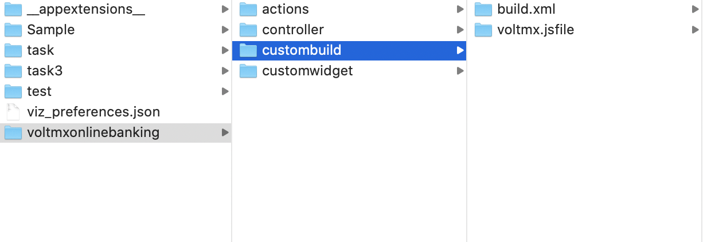

                          


Build an Adaptive web Application
=================================

To build an Adaptive Web application for Volt MX Iris, do the following:

1.  In Volt MX Iris, open the project in which you want to build the Adaptive Web app.
2.  From the Project menu, go to **Build** > **Build and Publish Web**.  
    The Build and Publish Web window appears.
3.  Under **Platform and Channels**, for **Adaptive Web**, select the checkbox next to **Mobile** or **Tablet**.
4.  Click **Build**.  
    If a Foundry app is not associated with the app, you will receive an error. You can choose to use an existing Foundry app or create a new one.
5.  Click **Create**.  
    You will see a Creating new Foundry application message. Once the app is created, you will get a success message.
6.  Click **OK**.
7.  After the build is completed, open your browser. Ensure that it is in Developer mode.
8.  Open the app. The URL for doing so should be as follows:  
    `localhost:9989/<ProjectName>/p`  
      
    For Desktopweb, the URL should be: `localhost:9989/<ProjectName>/kdw`
   

 

Securing your Web Applications
------------------------------

Client- side attacks leave your web applications vulnerable, allowing attackers to steal data. Obfuscators protect your apps from reverse engineering and malware attacks. Using Volt MX Iris V8 SP4, you can create a post-build hook for your Adaptive Web or Desktop Web applications.

> **_Note:_** Ensure that the Volt MX Iris Application is working before you implement obfuscation.  
Also, make sure that the obfuscation of the web artifact works before importing it into Volt MX Iris.

To implement obfuscation in your web apps, do the following:

1.  Navigate to the location of your project. For example, `<your workspace folder>/<appid>/`.
2.  Create a New Folder with the name **custombuild**.
3.  In the **custombuild** folder, create a new file, **build.xml**.
4.  In the build.xml file, create an ANT task, **postbuild**.
    
    1.  In the postbuild task, write a code that implements an obfuscation of your choice.
    2.  After you implement an obfuscation, write a code to replace the existing artifact in the web artifact folder with the protected artifact.  
        The protected artifact is generated as the output from the obfuscator tool.
    
    Here is an example of the contents of the **build.xml** file with the **postbuild** task:
    
```
<?xml version="1.0" encoding="UTF-8"?>
    <project name="CustomBuildTask" basedir=".">
        <target name="postbuild"  description="post build for spa/desktopweb">
            <echo message="Post Build Started for Project :: ${projname}" />
            <!-- Code to generate protected artifact from chosen obfucator and replacing the existing webartifact -->
            <!-- App Developer Code start -->
            <exec executable="cmd" failonerror="true">
                <arg line="${project.loc}\custombuild\somebatch.bat --app ${webartifactpath} -- ANY OTHER INPUTS FOR YOUR OBFUSCATOR" />
                <redirector output="${basedir}\protected_ob.log" alwayslog="true"></redirector>
            </exec>
            <!-- start error message code - to halt the system when any error occurs -->
            <loadfile srcfile="${basedir}\protected_ob.log" property="errorline">
                <filterchain>
                    <linecontains>
                        <contains value="ERROR, UNEXPECTED EXCEPTION"></contains>
                    </linecontains>
                </filterchain>
            </loadfile>
            <fail message="Unable to obfuscate - ${errorline}">
                <condition>
                    <contains string="${errorline}" substring="ERROR, UNEXPECTED EXCEPTION"/>
                </condition>
            </fail>
            <!-- error message Code end -->
            <!-- replacing old artifact with protected artifact start-->
            <move  file="${webartifactfolder}/${projname}.${webartifacttype}" tofile="${webartifactfolder}/${projname}-old.${webartifacttype}"/>
            <move  file="${basedir}/protected_${projname}.${webartifacttype}" tofile="${webartifactfolder}/${projname}.${webartifacttype}"/>
            <!-- replacing old artifact with protected artifact end-->
            <!-- App Developer Code end -->
        </target>
    </project>
```
5.  Once you create the ANT task, save and close the file.

> **_Note:_** Ensure that you exclude any variables with global scope from obfuscation.

7.  Build the project. After the project is built, the protected binary is uploaded to Volt MX Foundry.  
    Once the build is completed, you must publish the app to your [Foundry environment](PublishVoltMXFoundryServicesApp.md). Once you publish the app, you will get the Web Application URL.

Implement Obfuscation for Web Apps
----------------------------------

If you want to implement obfuscation for your web apps, do the following:

Before you get started, raise a ticket with the support team to get a **securejs.properties** file.

1.  Navigate to the location of your project. The path may look like `<your workspace folder>/<appid>/`  
    
2.  Download the [custombuild.zip](https://github.com/HCL-TECH-SOFTWARE/volt-mx-docs/raw/master/voltmxlibrary/iris/zip/user_guide/custombuild.zip) file
3.  Copy the **securejs.properties** file received over customer service ticket into `<your workspace folder>/<appid>/custombuild` folder.
4.  To exempt certain files from protection do the following, in the custombuild folder, create a text file excludefilelist.txt. In the text file, add sections of the application(you can add both files and/or directors) to exclude.
    *   Ensure that each path is defined in a new line. For example,  
        @cacheid@/desktopweb/jslib/tparty  
        @cacheid@/desktopweb/resources/strings
        
        > **_Note:_** @cacheid@ is the placeholder to be replaced within the **build.xml** in the custombuild folder.
        
          
        
        
5.  Build the project.  
    After the project is built, the protected binary uploads to the Foundry environment.
    
6.  Once the build is completed, publish the app to your [Foundry environment](../../../Iris/iris_user_guide/Content/PublishVoltMXFoundryServicesApp.md).  
    Once the app is published, you will receive the Web Application URL.
