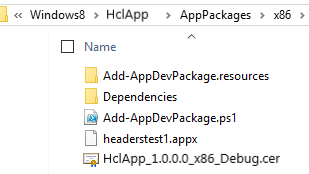
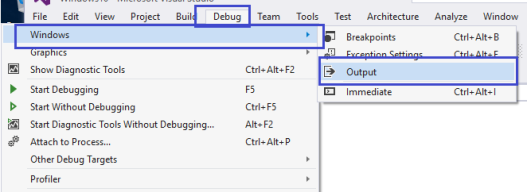

                         

Build a Windows 10 Application
==============================

> **_Note:_** Volt MX 9.2 does not support the building of Windows native applications.

The process of developing and deploying a Volt MX Iris app for the Windows 10 platform consists of three phases:

1.  Develop and build the application in Volt MX Iris.
2.  Create an APPX file on Windows 10.
3.  Deploy the APPX file on a Windows 10 target system.

In the pursuit of this process, this section covers the following topics:

[Prerequisites to building applications for Windows 10](#understanding-prerequisites-and-processor-architecture)

[Setting up the environment for development](#development-environment-setup)

[Secure application code](#secure-application-code)

[APPX Creation](#APPX%C2%A0Cre)

[Create APPX files from zip files (x86/x64/ARM)](#create-appx-files-from-zip-files-x86-x64-arm)

[Deploying APPX on a computer](#deploying-appx-on-a-computer)

[Deploying an x86 zip on a x86/x64 computer](#deploying-an-x86-zip-on-x86-x64-computer)

[Deploying an x64 APPX on ax64 computer](#deploying-an-x64-appx-on-x64-system)

[Deploying an ARM APPX on an ARM tablet](#deploying-an-arm-appx-on-arm-tablet)

[Deploying an ARM Zip on an ARM tablet](#deploying-an-arm-zip-on-arm-tablet-manual)

Understanding Prerequisites and Processor Architecture
------------------------------------------------------

Before building an application for Windows10, ensure you have knowledge about the [prerequisites,](#prerequisites) [compatibility matrix](#compatibility-matrix-appx-file-vs-machine-architecture), and [processor architecture](#processor-architecture) of the machine.

### Prerequisites

Following are the prerequisites and compatibility matrix to build applications: 

**Windows 10**

*   Volt MX Iris
*   [Development environment setup](#development-environment-setup) (to generate APPX files and test applications on the Windows 10).

> **_Important:_** While developing a Windows app, do not create a variable with the name `uid`.

### Compatibility Matrix (APPX File vs. Machine architecture)

The following compatibility matrix shows APPX install possibility in a machine. For example, if you want to install a 64-bit APPX file, you need a 64-bit system.

  
|   | x86 machine | x64 machine | ARM machine |
| --- | --- | --- | --- |
| x86 APPX | Yes | Yes | No |
| x64 APPX | No | Yes | No |
| ARM APPX | No | No | Yes |

### Processor Architecture

Before deploying an APPX file, you must know the processor architecture of the machine.

To know the processor architecture, follow these steps: 

1.  Open command prompt.
2.  Type **echo %PROCESSOR\_ARCHITECTURE%**. A list of results depending on the processor architecture appears.

  
| Processor Architecture | Result |
| --- | --- |
| x86 based | x86 |
| x64 | AMD64 |
| ARM based | ARM |

Alternatively, you can find the architecture type from the system properties.

1.  Open **Control Panel > All Control Panel Items > System**.
2.  Observe **System Type** under **View basic information about your computer > System**.

The following chart shows the system type and result.

  
| System Type | Result |
| --- | --- |
| X86 | x86 |
| X64 | x64 |
| ARM | ARM |

Development Environment Setup
-----------------------------

To run the Windows 10 simulator and test applications, you have to download and install **Visual Studio Community 2015 for Windows 10** from Microsoft's website.

In this section, you will learn about: 

1.  [Preliminary Steps Required to Set Up Development Environment](#Prelimin)
2.  [Enable Developer Mode](#enable-developer-mode)
3.  [Secure Application Code](#secure-application-code)
4.  [Restrict the Application to a Device Family](#restrict-the-application-to-a-device-family)
5.  [Issue in Universal Windows Applications](#issue-in-universal-windows-applications)

### Preliminary Steps Required to Set Up Development Environment

To setup development environment, follow these steps:

1.  Ensure you have a x86 or x64 Windows 10 machine.
2.  Ensure that the Universal Windows App Development Tools are selected from the optional features list.

4.  After installing this software, you need to enable your Windows 10 device for development.
5.  Download and install Visual Studio community 2015 for `Windows 10 vs_community.exe` file from [https://www.visualstudio.com/en-us/products/visual-studio-community-vs.aspx](https://www.visualstudio.com/en-us/products/visual-studio-community-vs.aspx)
6.  Launch Visual Studio.
7.  Complete the trial activation using Visual Studio onscreen instructions.
8.  Get a valid developer license.
9.  Install Visual C++ Redistributable Windows 8/8.1 (Optional) - Visual C++ Redistributable (for Visual Studio 2012 and Visual Studio 2013) packages install runtime components of visual C++ libraries that are required to run Windows 10.  
    Installing the package speeds up the application deployment time.
    1.  Visual C++ Redistributable for Visual Studio 2012 (x86) – English : [http://go.microsoft.com/?linkid=9815734](http://go.microsoft.com/?linkid=9815734)
    2.  Visual C++ Redistributable for Visual Studio 2012 (x64) – English : [http://go.microsoft.com/?linkid=9815744](http://go.microsoft.com/?linkid=9815744)
    3.  Visual C++ Redistributable for Visual Studio 2012 (ARM) – English : [http://go.microsoft.com/?linkid=9815754](http://go.microsoft.com/?linkid=9815754)
    4.  Visual C++ Redistributable for Visual Studio 2013 (x86) – English : [http://www.microsoft.com/en-us/download/details.aspx?id=40784](http://www.microsoft.com/en-us/download/details.aspx?id=40784)
    5.  Visual C++ Redistributable for Visual Studio 2013 (x64) – English : [http://www.microsoft.com/en-us/download/details.aspx?id=40784](http://www.microsoft.com/en-us/download/details.aspx?id=40784)
    6.  Visual C++ Redistributable for Visual Studio 2013 (ARM) – English : [http://www.microsoft.com/en-us/download/details.aspx?id=40784](http://www.microsoft.com/en-us/download/details.aspx?id=40784)

> **_Important:_** To build Windows 10 applications, either Windows 7, Windows 8/8.1, or Windows 10 can be used. But to run Windows 10 applications, you need a Windows 10 machine.

### Enable Developer Mode

To enable developer mode, follow these steps:

1.  In Visual Studio, open **Settings** and navigate to **Updates and Security > For Developer**.
2.  Click **Enable Developer Mode**.

### Secure Application Code

The Windows 10 binary contains platform code, application code (JavaScript) and other resources. Platform code is secured from disassembly when the application is built in Release mode. Windows internally uses native .Net Compilation in release mode and classic .net compilation in debug mode.

To hide the JavaScript code, Volt MX Iris needs to pass _hideSourceCode_ property with True as value to the build process. You have to set the flag so that the build process ensures the application is hidden from dis-assembly.

To set hideSourceCode property, follow these steps: 

1.  Open the Volt MX Iris installation location.
2.  Search for **Win10FfiGenerator.exe** in Windows Explorer.
3.  Open the folder location.
4.  Navigate a level up in the folder structure.
5.  Open `build.xml` in an editor.
6.  Create a property **hideSourceCode** and set its value to **True** or **False**. For example, `<property name="hideSourceCode" value="true"/>`.
7.  Save and close the file.
8.  Build the application.

### Restrict the Application to a Device Family

Windows 10 allows a single application binary to be deployed and run on multiple device families such as mobile, desktop/tablet, Xbox and IoT. You can choose the binary to be run on any Windows 10 device (of any device family) or you can restrict the binary to be allowed to run on particular device family/families only. Currently, the allowed device families are: 

1.  **Universal** – an app can be deployed and run on any Windows 10 device.
2.  **Mobile** – an app is allowed to be deployed and run on Windows 10 mobiles.
3.  **Desktop** – an app is allowed to deployed and run on Windows 10 desktops/tablets.

Volt MX  Iris needs to pass this option to platform build scripts. Currently, in 7.0 there is no way to pass this flag. By default, all apps are allowed to run on any Windows 10 device.

If you want to restrict the application to a device family, follow these steps: 

1.  Open the Volt MX Iris installation folder.
2.  Search for Windows 10 plug-in extracted location. Search for **Win10FfiGenerator.exe** in Windows Explorer.
3.  Open the folder location.
4.  Navigate one level up in the folder structure.
5.  Open `build.xml` in any editor.
6.  Create a property `win10targetdevicefamily`, and set its value to Universal/Mobile/Desktop. For example, `<property name="win10targetdevicefamily" value="Desktop"/>`.
7.  Save and close the file.
8.  Build the application.

> **_Note:_** You can also open the manifest file in Visual Studio and reuse the manifest.

### Issue in Universal Windows Applications

If you build the application for Windows 10, the build fails for the first time because of extension SDKs.

To resolve this issue, follow these steps:

1.  Open **voltmxApp.sln** once from the Visual Studio so that it installs the required packages for the universal Windows application.

Location of `VoltMXApp.sln` file:

`%Workspace% \ temp \ %Application% \ build \ windows10 \ windows10 \ VoltMXApp \ VoltMXApp.sln`

4.  Run the application in debug/release for x86/x64 in the local machine. Ensure you have internet connection at this time to download the required packages.
5.  Install the certificate.

APPX Creation
-------------

The deployable component for Windows 10 tablet/desktop is an APPX file. If an application is built using Volt MX Iris on Windows 10, the application creates an APPX file with the name `<applicationname>.appx` in target build output folders `<workspace>\temp\<eclipseproject>\build\windows10\windows10\VoltMXApp\x86|x64|ARM\<applicationname>.appx`.

If an application is built using Volt MX Iris on Windows 7 or Windows 8/8.1 system, a zip file is created with all the required information with name `voltmxwindows10.zip` in the build output folder. The file can help you to create an APPX file.

In this section, you will learn about:

1.  [Create APPX Files From Zip Files (x86/x64/ARM)](#create-appx-files-from-zip-files-x86-x64-arm)
2.  [Deploying APPX on a Computer](#debug-application-in-visual-studio)
    1.  [Deploying x86 Zip on x86/x64 Computer](#deploying-an-x86-zip-on-x86-x64-computer)
    2.  [Deploying x64 APPX on x64 System](#deploying-an-x64-appx-on-x64-system)
    3.  [Deploying ARM APPX on ARM Tablet](#deploying-an-arm-appx-on-arm-tablet)
    4.  [Deploying ARM Zip on ARM Tablet - Manual](#deploying-an-arm-zip-on-arm-tablet-manual)
    5.  [Use Different Developer Certificates](#use-different-developer-certificates)
        
3.  [Build the Windows Application](#build-the-windows-application)
4.  [Debug Volt MX Iris Application in Visual Studio](#debug-application-in-visual-studio)
5.  [Update Manifest File and Code Signing Certificate](#update-manifest-file-and-code-signing-certificate)
6.  [Application Submission to the Windows Store](#application-submission-to-the-windows-store)

Create APPX Files From Zip Files (x86/x64/ARM)
----------------------------------------------

If an application is built on Windows 7, Windows 8/8.1, or Windows 10, a zip file named `voltmxwindows10.zip` is created with all the required information at: 

*   <EclipseWorkspace>\\temp\\<Eclipse project name>\\build\\windows10\\Windows10
*   Volt MX Iris copies the zip file to Jetty server.

On a separate Windows 10 system with development configuration, copy the above output folder (through a USB or pen drive). Ensure the extracted folder is not a system folder such as Program Files or Windows. The folder has the following batch file:

*   `PackageFromZipFile.bat` – for x86, x64 and ARM.

You can use `PackageFromZipFile.bat` with either of the following options to deploy the application on to a x86/x64/ARM-based Windows 10 machine. Ensure APPX file is created in the same folder. The batch file deploys the application when the APPX file is created.

1.  **PackageFromZipFile.bat <jetty url>**
    *   URL must be a fully qualified name of the zip file on the Jetty server. Example - `http://10.10.4.56:8888/<appid>r?type=windows10`.
    *   **Windows 8** - [http://localhost:8888/<appid>r?type=windows8](http://localhost:8888/&lt;appid&gt;r?type=windows8)
    *   **Windows 10** - [http://localhost:8888/<appid>r?type=windows10](http://localhost:8888/&lt;appid&gt;r?type=windows10)
2.  **PackageFromZipFile.bat <zipfile name>**
    *   App developers must copy the zip to the extracted folder before using the command.
    *   Example - PackageFromZipFile `voltmxwindows10.zip debug|release x86|x64|arm`.

Deploying APPX on a Computer
----------------------------

APPX files can be deployed to the Windows 10 machine (x86/x64/ARM) as mentioned in the [compatibility matrix](#compatibility-matrix-appx-file-vs-machine-architecture).

1.  Open the target output folder, and ensure the APPX file is present in the folder.
2.  Run `Add-AppDevPackage.ps1` with PowerShell on device.
3.  Open PowerShell with elevated permissions, navigate to `Windows10\VoltMXApp\x86|x64|ARM`  folder, and execute `Add-AppDevPackage.ps1`.
4.  After you see a successful installation in the PowerShell, launch the application from the Start menu.

### Deploying an x86 Zip on x86/x64 Computer

If the application is built on Windows 7 or Windows 8/8.1, `voltmxwindows10.zip` file is created at `<EclipseWorkspace>\temp\<Eclipse project name>\build\windows10\Windows10`.

1.  Follow the APPX creation process in [APPX creation for x86 systems](#APPX%C2%A0Cre).
2.  When the APPX file is created, continue from step 3 in section [Deploying an APPX on respective system](#APPX%C2%A0Cre).

### Deploying an x64 APPX on x64 System

To deploy an x64 APPX on an x64 machine, follow these steps: 

1.  The application must be built on a Windows 10 system, and x64 must be selected in the Build option.
2.  Open the build folder and navigate to the **Windows10** folder. Ensure the APPX file is in the folder.
3.  Copy the **Windows10** folder to the x64-based system.
4.  If the APPX file is present in the target folder, continue from step 3 in section [Deploying an appx on respective system.](#APPX%C2%A0Cre)

### Deploying an ARM APPX on ARM Tablet

To deploy an ARM APPX on an ARM tablet, follow these steps:

1.  The application must be built on a Windows 10 system for ARM configuration.
2.  Open the build folder and navigate to the Windows10 folder.
3.  Ensure the APPX file is present.
4.  Copy the **Windows10** folder to surface/tablet with a USB/use network.
5.  If an APPX file is present in the target folder, continue from step 3 in [Deploying an APPX on respective system.](#deploying-appx-on-a-computer)

### Deploying an ARM Zip on ARM Tablet - Manual

If an application is built on Windows 7 or Windows 8/8.1 the `voltmxWindows10.zip` file is created at `<EclipseWorkspace>\temp\<Eclipse project name>\build\windows10\Windows10`.

To deploy an ARM zip file on an ARM tablet, follow these steps: 

1.  Follow the APPX creation process in [APPX creation for ARM systems](#create-appx-files-from-zip-files-x86-x64-arm).
2.  When the APPX file is created, continue from step 3 in section [Deploying an APPX on a machine](#deploying-appx-on-a-computer).

### Use Different Developer Certificates

Do not use Volt MX Developer certificate to sign the customer application. The Volt MX Developer certificate should be used only during the application development. When submitting the application to the store, you can use your own certificate to sign the APPX package.

To use different developer certificates, follow these steps: 

1.  Right-click on an application in Eclipse, and open the properties page.
2.  Navigate to **Native App > Windows Tablet > Packaging**.

4.  To use the existing certificate file, use the **Certificate file** section, and select the required PFX certificate file. Ensure the publisher name of the existing certificate matches the publisher name provided previously. The build fails if the publisher names does not match.
    
    1.  To create the certificate on your own see these articles:
        1.  [Article 1](https://msdn.microsoft.com/en-us/library/aa386968(VS.85).aspx)
        2.  [Article 2](https://msdn.microsoft.com/en-us/library/windows/apps/br230260(v=vs.110).aspx)
    2.  To create a certificate on your own, the following command can be used to create the certificate file. The .cer and .pvk file need to be used to generate the .pfx file, which is provided as input to Certificate file section in Volt MX Iris.
    3.  Execute the below command line with makecert.exe
    
    makecert -cy end -eku 1.3.6.1.5.5.7.3.3 -sv yourcompany.pvk -n "CN=yourcompany" yourcompany.cer -b mm/dd/yyyy -e mm/dd/yyyy –r
    
    5.  Execute the below command line with pvk2pfx.exe to get the certificate pfx file
    
    pvk2pfx -pvk yourcompany.pvk -spc yourcompany.cer -pfx yourcompany.pfx
    
5.  To create a new certificate, see [Create Your Own Test Certificate](https://msdn.microsoft.com/en-in/library/ff699202.aspx).
6.  Build the application.

Build the Windows Application
-----------------------------

Once you have created and configured an app’s assets, resources, and services, you compile and link them by building your app.

To save time and effort you can rebuild your app with your most recent build settings, or you can build with new or different settings.

To build an app with your most recent build settings, do the following:

*   On the **Product** menu, click **Build Last**.

To build an app with new or different settings, do the following:

1.  On the **Product** menu, click **Build**.
2.  In the Build Generation dialog box, select under each applicable channel the Windows versions you are configured to build for, along with the hardware architecture, and environment (e.g. Native,.md SPA). For more information about native and SPA apps, see [Types of Applications](TypesOfApplications.md).
3.  Select the build mode.

*   **Debug mode** \- To help you identify and fix errors, Volt MX Iris emits the complete symbolic debug information . To lessen the amount of time necessary to complete the build, the build is not optimized for code execution, so it may tend to execute slower than a build optimized for release. Also, the inclusion of the symbolic debug information causes the final executable to be larger than a release build.
*   **Release mode** - Volt MX Iris optimizes the build for execution, requiring more time to generate the build. It also does not emit the complete symbolic debug information, making the final executable smaller than a debug build.
*   **Protected Mode** \- Applications built in Volt MX Iris can use the additional security enhancements by building the application in the _Protected Mode_. Volt MX IrisPlatform code for iOS and Android is equipped with mechanisms that can protect your application by detecting attacks like tampering, swizzling, debugging, jail breaking (iOS), rooting (Android), and information disclosure. Additional security mechanisms are provided through the use of White Box Cryptography to protect application business logic and source code. Application reacts to the attack by exiting upon detecting attacks to prevent further attempts.  
    If you choose to build an application in **Protected mode**, then setting the public and private keys is mandatory. To do so, go to **Project Settings** > **Protected Mode**. For more details on how to generate public and private keys, click [here](ApplicationSecurity.md#rsa-key-pair-generation-encryption-and-usage).
*   **Test Mode** - To help you identify and fix errors, Volt MX Iris provides the ability to Test the application on the device or an emulator. When you build an app using the Test Mode, you can leverage the Jasmine testing framework of Volt MX Iris to thoroughly test your app and ensure your application is errors free. You can run jasmine test cases, test suites and test plans by building an app using the Test mode.

5.  Click **Build**.

> **_Note:_** While building a Windows application, you cannot build the app for other platforms. This is a limitation of Windows emulator.

Debug Volt MX Iris Application in Visual Studio
-----------------------------------------------------

Volt MX  helps you launch and debug applications in Visual Studio.

Debugging an application involves two steps: 

1.  [Open the Volt MX Iris Application in Visual Studio](#open-the-application-in-visual-studio)
2.  [Debug the VoltMX Application](#debug-the-application)

### Open the Volt MX Iris Application in Visual Studio

To open a Volt MX Iris Application in Visual Studio, follow these steps: 

1.  Open Visual Studio Community 2015. You can use any Visual Studio version that can open universal projects.
2.  Navigate to the build folder (<workspace>\\temp\\<eclipseproject>\\build\\windows10\\Windows10) and find the **VoltMXApp** folder.

4.  Open **VoltMXApp.sln** in Visual Studio.
5.  Change the configuration to x86, x64, or ARM depending on the requirement. The configuration must not be **Any CPU**. App developers can select the application to be deployed in Debug or Release mode by choosing the required value in the drop-down list.

7.  Right-click **VoltMXApp (Universal Windows)** project and select **Set as Startup Project**.
8.  Choose the right simulator/emulator/local machine to deploy the application.

### Debug the Application

To debug the application, follow these steps: 

1.  Press F5 on the keyboard, or select **Start > Visual Studio > Debug > Start debugging**.
2.  To see the application logs, open the output window under **Debug > Windows > Output**.

4.  You can use other debugging tools available in Visual Studio to debug the application like any other native Universal Windows application. The output window will not show logs when the release option is selected.

Update Manifest File and Code Signing Certificate
-------------------------------------------------

You can open the solution folder, and make changes to the app manifest file. You must place the updated manifest file in the **Resources** folder so that the build process picks and uses for application build.

> **_Note:_** After you place the new manifest file in resources, any change done in Volt MX Iris Application properties page will not be considered as the files provided by user replace all Volt MX Iris Application Properties page.

To update the manifest file and code signing certificate, follow these steps: 

1.  Launch Visual Studio.
2.  In Solution Explorer View, open the **Package.appxmanifest** file in design or XML view.
3.  For more information, see the following links: 
    1.   [https://msdn.microsoft.com/en-us/library/windows/desktop/br211474.aspx](https://msdn.microsoft.com/en-us/library/windows/desktop/br211474.aspx).
    2.  [https://channel9.msdn.com/Series/Windows-Phone-8-1-Development-for-Absolute-Beginners/Part-8-Working-with-the-package-appxmanifest](https://channel9.msdn.com/Series/Windows-Phone-8-1-Development-for-Absolute-Beginners/Part-8-Working-with-the-package-appxmanifest)
    3.  [https://msdn.microsoft.com/en-us/library/br230260.aspx](https://msdn.microsoft.com/en-us/library/br230260.aspx)

Application Submission to the Windows Store
-------------------------------------------

To create the app package, follow the Microsoft MSDN guidelines at [https://msdn.microsoft.com/en-us/library/hh454036.aspx](https://msdn.microsoft.com/en-us/library/hh454036.aspx). You can also refer, [https://msdn.microsoft.com/en-us/library/windows/hardware/dn265142%28v=vs.85%29.aspx](https://msdn.microsoft.com/en-us/library/windows/hardware/dn265142(v=vs.85).aspx).
