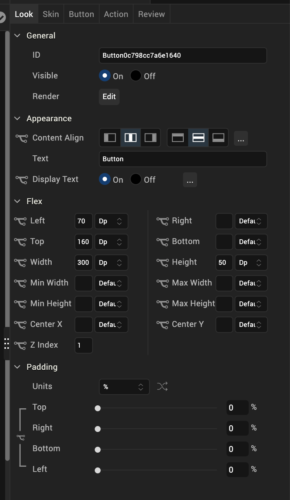
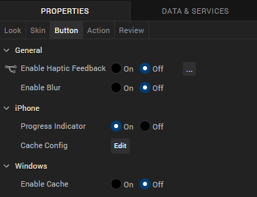

                            

Button
------

Use a Button widget to trigger an action or set of actions; for example, clicking the button might open a form or dialog box, start an action or series of actions, or confirm an action.

To learn how to use this widget programmatically, refer [VoltMX Iris Widget guide](../../../Iris/iris_widget_prog_guide/Content/Button.md).

### Important Considerations

The following are important considerations for a Button widget.

*   You can specify different skins for normal and focus states of a button.
*   You can specify a background image for normal and focus states of a button.
    
*   To avoid a jumping effect or toverlap of neighboring widgets, make sure the image for normal and focus skins are the same size.

### Look Properties

Look properties define the appearance of the widget. The following are the major properties you can set:

*   Whether the widget is visible.
*   The platforms on which the widget is rendered.
*   How the widget aligns with its parent widget and neighboring widgets.
*   If the widget displays content, where the content appears.

For descriptions of the properties available on the Look tab of the Properties pane, see [Look](Look.md#Flex).

### Skin Properties

Skin properties define a skin for the widget, including background color, borders, and shadows. If the widget includes text, you can also specify the text font.

For a Button widget, you can apply a skin and its associated properties for the following states:

  
| Skin | Definition |
| --- | --- |
| Normal | The default skin of the widget. |
| Focus | The skin applied when the focus is on the widget. |
| Blocked UI | The skin applied to block the interface until the action in progress is completed; for example, a service call . > **_Note:_** The Blocked UI skin is available only for SPA platforms. |
| Pressed | The skin to indicate that the widget is pressed or clicked. > **_Note:_** The Pressed skin is available only on Android Native platforms. |

For more information about applying skins, see [Understanding Skins and Themes](Customizing_the_Look_and_Feel_with_Skins.md).

### Button Properties

Button properties specify properties that are available on any platform supported by Volt MX Iris, and assign platform-specific properties.

#### Progress Indicator

For the iOS platform, specifies whether to display the progress indicator when a user clicks the button. Enable this property when the loading time for an application is long.

Default: The progress indicator is enabled.

#### Tool Tip

For the Windows Tablet platform, specifies a message that displays when you hover the mouse pointer over the widget.

### Actions

Actions define what happens when an event occurs. On a Button widget, you can run an action when the following event occurs:

*   onClick: The action is triggered when the user clicks on the button.
*   onTouchStart: The action is triggered when the user touches the touch surface. This event occurs asynchronously.
*   onTouchMove: The action is triggered when the touch moves on the touch surface continuously until movement ends. This event occurs asynchronously.
*   onTouchEnd: The action is triggered when the user touch is released from the touch surface. This event occurs asynchronously.

For more information, see [Add Actions](working_with_Action_Editor.md).

### Placement inside a Widget

The following table summarizes where a Button widget can be placed:

<table style="mc-table-style: url('Resources/TableStyles/2015DefinitiveBasicTable.css');" class="TableStyle-2015DefinitiveBasicTable" cellspacing="0"><colgroup><col class="TableStyle-2015DefinitiveBasicTable-Column-Column1"> <col class="TableStyle-2015DefinitiveBasicTable-Column-Column1"></colgroup><tbody><tr class="TableStyle-2015DefinitiveBasicTable-Body-Body1"><td class="TableStyle-2015DefinitiveBasicTable-BodyE-Column1-Body1">Flex Form</td><td class="TableStyle-2015DefinitiveBasicTable-BodyD-Column1-Body1">Yes</td></tr><tr class="TableStyle-2015DefinitiveBasicTable-Body-Body1"><td class="TableStyle-2015DefinitiveBasicTable-BodyE-Column1-Body1">FlexContainer</td><td class="TableStyle-2015DefinitiveBasicTable-BodyD-Column1-Body1">Yes</td></tr><tr class="TableStyle-2015DefinitiveBasicTable-Body-Body1"><td class="TableStyle-2015DefinitiveBasicTable-BodyE-Column1-Body1">FlexScrollContainer</td><td class="TableStyle-2015DefinitiveBasicTable-BodyD-Column1-Body1">Yes</td></tr><tr class="TableStyle-2015DefinitiveBasicTable-Body-Body1"><td class="TableStyle-2015DefinitiveBasicTable-BodyE-Column1-Body1">ScrollBox</td><td class="TableStyle-2015DefinitiveBasicTable-BodyD-Column1-Body1">Horizontal Orientation -YesVertical Orientation -Yes</td></tr><tr class="TableStyle-2015DefinitiveBasicTable-Body-Body1"><td class="TableStyle-2015DefinitiveBasicTable-BodyE-Column1-Body1">Tab</td><td class="TableStyle-2015DefinitiveBasicTable-BodyD-Column1-Body1">Yes</td></tr><tr class="TableStyle-2015DefinitiveBasicTable-Body-Body1"><td class="TableStyle-2015DefinitiveBasicTable-BodyE-Column1-Body1">Segment</td><td class="TableStyle-2015DefinitiveBasicTable-BodyD-Column1-Body1">Horizontal Orientation -YesVertical Orientation -Yes</td></tr><tr class="TableStyle-2015DefinitiveBasicTable-Body-Body1"><td class="TableStyle-2015DefinitiveBasicTable-BodyE-Column1-Body1">Popup</td><td class="TableStyle-2015DefinitiveBasicTable-BodyD-Column1-Body1">Yes</td></tr><tr class="TableStyle-2015DefinitiveBasicTable-Body-Body1"><td class="TableStyle-2015DefinitiveBasicTable-BodyB-Column1-Body1">Template&nbsp;</td><td class="TableStyle-2015DefinitiveBasicTable-BodyA-Column1-Body1">Header- NoFooter- No</td></tr></tbody></table>

<table style="margin-left: 0;margin-right: auto;mc-table-style: url]('Resources/TableStyles/RevisionTable.css');" class="TableStyle-RevisionTable" cellspacing="0" data-mc-conditions="Default.md5 Only"><colgroup><col class="TableStyle-RevisionTable-Column-Column1" style="width: 36px;"> <col class="TableStyle-RevisionTable-Column-Column1"> <col class="TableStyle-RevisionTable-Column-Column1"></colgroup><tbody><tr class="TableStyle-RevisionTable-Body-Body1"><td class="TableStyle-RevisionTable-BodyE-Column1-Body1" data-mc-conditions="Default.HTML5 Only">Rev</td><td class="TableStyle-RevisionTable-BodyE-Column1-Body1" data-mc-conditions="Default.HTML5 Only">Author</td><td class="TableStyle-RevisionTable-BodyD-Column1-Body1" data-mc-conditions="Default.HTML5 Only">Edits</td></tr><tr class="TableStyle-RevisionTable-Body-Body1"><td class="TableStyle-RevisionTable-BodyE-Column1-Body1" data-mc-conditions="Default.HTML5 Only">8</td><td class="TableStyle-RevisionTable-BodyE-Column1-Body1" data-mc-conditions="Default.HTML5 Only">SHS</td><td class="TableStyle-RevisionTable-BodyD-Column1-Body1" data-mc-conditions="Default.HTML5 Only">SHS</td></tr><tr class="TableStyle-RevisionTable-Body-Body1"><td class="TableStyle-RevisionTable-BodyB-Column1-Body1" data-mc-conditions="Default.HTML5 Only">7.2.1</td><td class="TableStyle-RevisionTable-BodyB-Column1-Body1" data-mc-conditions="Default.HTML5 Only">SHS</td><td class="TableStyle-RevisionTable-BodyA-Column1-Body1" data-mc-conditions="Default.HTML5 Only">SHS</td></tr></tbody></table>
