Create a Component
==================

The most powerful way to create reusable components is to create a component that includes a defined _contract_. The contract is a JSON file that specifies the component's exposed properties, events, and methods. You can specify those properties, events, and methods within the Iris interface, and then define the behavior of custom properties, events, and methods by adding code to the component's controller module.

When you create a component, you have a choice of creating a component with or without a contract. A component without a contract is similar to a master in earlier versions of , except that it includes a controller module. You can also convert a component that does not have a contract, or an imported master, to a component with a contract.

Once you create a component with a contract, you can control what is exposed to users of the component. You expose only the properties, events, and methods that you want to make available to your target audience, enhancing your ability to rapidly create and deploy digitalapplications for different audiences. The exposed properties, events, and methods are part of the contract.

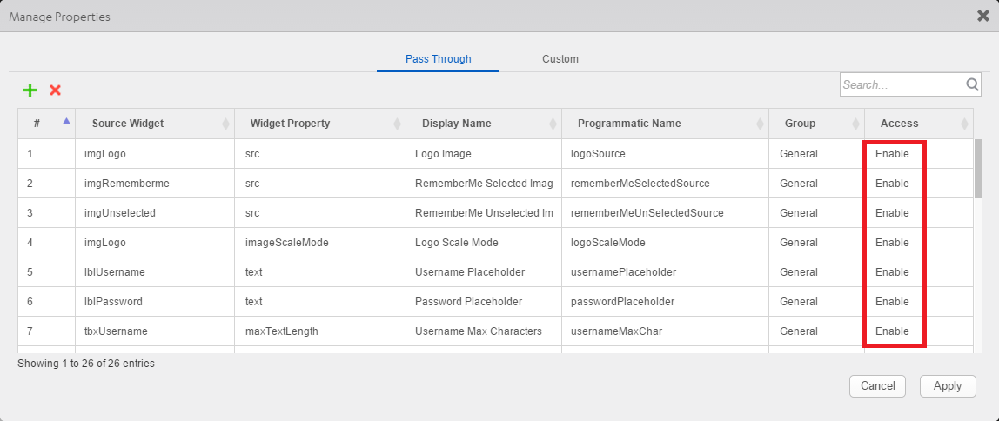


You can then use the component in other applications, or share your custom components with other digital application developers by publishing them to . For more information about using components, see [Using Components](C_UsingComponents.md).

Parent value for components will always be null. In component controller code, **this.view.parent** will always return a null value.

The following topics provide additional information about creating components:

*   [Create a Component without Contract](#create-a-component-without-contract)
*   [Create a Component with Contract](#create-a-component-with-contract)
*   [Manage Properties of a Component with Contract](#manage-properties-of-a-component-with-contract)
*   [Manage Events of a Component with Contract](#manage-events-of-a-component-with-contract)
*   [Manage Methods of a Component with Contract](#manage-methods-of-a-component-with-contract)
*   [Group Properties, Events, and Methods of a Component with Contract](#group-properties_-events_-and-methods-of-a-component-with-contract)
*   [Set Data for Components with Contract by using Mapping Editor](#set-data-for-components-with-contract-by-using-mapping-editor)
*   [Map Service Parameters to the Segment in a Component](Segment2.md)
*   [Define the Behavior of a Custom Property in Code](#define-the-behavior-of-a-custom-property-in-code)
*   [Define a Custom Event in Code](#define-a-custom-event-in-code)
*   [Data & Services Panel Support for Components](#dataservices-panel-support-for-components)
*   [Expose a Component's Widgets](#expose-a-components-widgets)
*   [Specify a Container Widget as a Target Container](#specify-a-container-widget-as-a-target-container)
*   [Expose a Component's Skins](#expose-a-components-skins)
*   [Lock a Component](#lock-a-component)
*   [Delete a Component](#delete-a-component)

## Create a Component Without Contract

A component without contract is similar to a Master in earlier versions of Iris, except that a component includes a Controller module. You can reuse the component within your application and distribute it via Forge. However, you cannot control which of the component's properties, events, and methods are exposed, or create custom properties, events, and methods. To control the exposed properties, events, and methods of a component, [create a component with contract.](#create-a-component-with-contract)

To create a component without contract, follow these steps:

1.  In the Project Explorer, click the **Templates** tab.
2.  Right-click **Components**, point to **New**, and then select **w/o Contract**. The **Create new Component without Contract** dialog box appears.
3.  Enter a **Namespace** ,**Name** and **Version** for the component.  
    The component must follow this naming convention: _\<first part>.\<second part>_; for example, _my.namespace_.  
    The component version helps you track changes or upgrades made to the component.  
    

The new component without contract is created. The component includes a FlexContainer to contain any widgets that you add to the component and a Modules node, comprising the component's _Controller_ and _Actions Controller_ JavaScript files. The Actions Controller module is auto-generated and contains any defined action sequences.

5.  Add widgets to the FlexContainer, just as you would for a standard form.
6.  Add code to the component's controller module or to actions for widgets on the form. To add code to widget actions, select the FlexContainer. On the **Properties** panel, on the **Action** tab, click **Edit** for the event to which you want to add code. For more information, refer to [Add Actions](working_with_Action_Editor.md).

## Create a Component With Contract

To create a reusable component that can be published to , create a component with contract. Components with a contract use the Reference Architecture: a structured, modular framework based on the Model-View-Controller (MVC) architecture. For more information on how to create a Reference Architecture project, refer [Create a Reference Architecture Project](CreateKRAProject.md).

To create a component with contract, follow these steps:

1.  In the Project Explorer, click the **Templates** tab.
2.  Right-click **Components**, point to **New**, and then select **with Contract**. The **Create new Component with Contract** dialog box appears.
3.  Enter a **Namespace** ,**Name** and **Version** for the component.  
    The component must follow this naming convention: _\<first part>.\<second part>_; for example, _my.namespace_.  
    The component version helps you track changes or upgrades made to the component.  
    


The new component with contract is created. The component includes a FlexContainer to contain any widgets that you add to the component and a Modules node, comprising the component's _Controller_ and _Actions Controller_ JavaScript files. The Actions Controller module is auto-generated and contains any defined action sequences.

6.  Add widgets to the FlexContainer, just as you would for a standard form.
7.  Add code to the component's controller module or to actions for widgets on the form. To add code to widget actions, select the FlexContainer. On the **Properties** panel, on the **Action** tab, click **Edit** for the event to which you want to add code. For more information, refer [Add Actions](working_with_Action_Editor.md).
8.  Manage properties, events, and methods for the component with contract. For more information, refer [Manage Properties of a Component with a Contract](#manage-properties-of-a-component-with-a-contract), [Manage Events of a Component with a Contract](#manage-events-of-a-component-with-a-contract), and [Manage Methods of a Component with a Contract](#manage-methods-of-a-component-with-a-contract).

Each component's controller module contains the JavaScript code associated with the component.  You can add additional modules containing any supporting code to the Modules node. The actions Controller module is auto-generated and should not be modified. A component creator can also use services as part of the component.

### Create a New View for a Component

Once you create a Component with contract, you can create different views for it.

To create a new view for a component, follow these steps:

1.  In the Project Explorer, navigate to the **Templates** tab.
2.  Expand the **Components** node, and then select the Component for which you want to create the new view.
3.  Right-click the component, and then select **Create New View**.  
    The **Create New View** dialog box appears.  
    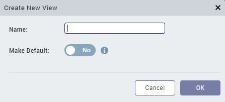
4.  Enter a **Name** for the new view, and then click **OK**.
    
    If you want to mark this new view as the default view for the component, select the Yes value for the **Make Default** button.
    

The new view appears in the Templates tab, and the Controller and Actions Controller JavaScript files for the new view are added in the **Modules** node of the component.

#### Important Considerations

*   You can configure each view (by adding widgets, action sequences, and other configurations) according to the business requirement.
*   When you use the Component in the project, the name of the component along with the active view appears in the **Component** Tab of the **Properties** pane.  
    You can switch the active view of the component through the **Active View** drop-down list (that displays all the available views of the component).
*   You can change the default view of a component from the Templates tab of Iris. To change the default view for a component, right-click the view from the **Templates** tab, and then select **Mark as Default View**.
*   After you create a view, you can update the name of the View. To do so, right-click the view from the **Templates** tab, and then select **Edit Details**.

### Create a New BusinessController for a Component

You can only create one BusinessController for a component.

To create a new BusinessController for a component, follow these steps:

1.  In the Project Explorer, navigate to the **Templates** tab.
2.  Expand the **Components** node, and then select the Component for which you want to create a new BusinessController.
3.  Right-click the **Modules** Node of the Component, and then select **New BusinessController**.  
    

The new BusinessController appears in the **Modules** node of the **Templates** tab of Iris.

### Extend the BusinessController of a Component

You can only create one BusinessControllerExtension for a component.

To extend the BusinessController of a component, follow these steps:

1.  In the Project Explorer, navigate to the **Templates** tab.
2.  Expand the **Components** node, and then select the Component for which you want to extend the BusinessController.
3.  Expand the **Modules** Node of the Component.
4.  Right-click the BusinessController file of the component, and then select **Create New Extension**.  
    

The new BusinessControllerExtension appears in the **Modules** node of the **Templates** tab of Iris.

### Manage Properties of a Component with a Contract

Once you create a component with a contract, you can specify which properties of the component to expose to users. The specified properties are called _pass-through_ properties. You can also define custom properties.

To manage properties of a component with a contract:

1.  Click the **Templates** tab in the Project Explorer or the Library Explorer.
2.  Expand the components node, if necessary, and then select the component.
3.  In the **Properties** pane, click the **Component** tab.
4.  Click **Manage Properties**. displays the **Manage Properties** dialog box.
5.  To define pass through properties, select the **Pass Through** tab on the **Manage Properties** dialog box.

Click the plus sign (+) for each pass-through property you want to define. Click the delete symbol (X) to delete an existing property. To define a new pass-through property, specify the following for each property:

*   Source Widget — The widget that contains the property. Click in the **Source Widget** field to display a hierarchical list of the component's widgets, and then select the widget.
*   Widget Property — The property that you want to define as a pass-through property. Click in the **Widget Property** field to display a list of the source widget's properties, and then select the property.
*   Display Name — The name to display in the **Component** tab of the **Properties** pane. Click in the **Display Name** field and enter a name. The display name should start with a non-numeric character, and can contain only alphanumeric characters and spaces.
*   Programmatic Name — The name to identify the property in code. Click in the **Programmatic Name** field, and enter a name. The programmatic name can contain only alphanumeric characters, and cannot start with a number or contain spaces.
*   Tooltip: Enter the information about the property. Developers can enter detailed information about the property to convey the functionality of the property. When a user hovers over the property of the component, information entered in this property will appear.
*   Group — The group to which the property belongs. Use groups to display related properties in their own section in the **Properties** pane.
*   Access — Whether the property is enabled or disabled. Click in the **Access** field, and select either _Enable_ or _Disable_.
*   Conditions: Set a property as a conditional property. You can also define dependent properties. Based on the value of the conditional property, dependent properties will be shown or hidden on the property panel.  
      
    To set a conditional property, in the **Manage Properties** section of the Properties panel, click the **Conditions** column corresponding to the property. Click **Define Properties** to set dependant properties. Select the **Type of Property** (either pass-through or custom), and provide the name of the **Dependant Property**, and then click **Done**. In the **Conditions** dialog box, click **Set Visibility** for a conditional value to set the show/hide conditions for the property on the Properties Panel.

*   All conditional values must be unique. You cannot set the same dependant property for different conditional properties.
*   The supported data types for the property are String, Integer, Boolean, List Selector.
*   You cannot define cyclic dependencies and dependant properties for Templates, Image Identifiers, and Flex Properties.
*   You cannot set forkable properties as conditional properties. Only properties of type String, Integer, Boolean, and List Selector (that do not support forking) can be set as conditional properties.
*   If a property does not support conditions, the **Conditions** button is disabled and a tool tip appears with the ‘This property can't be used as a conditional property’ message.
*   Properties that are already implicitly dependent on other properties cannot be set as dependent properties. For example, The **Separator Thickness** property of the Segment widget is implicitly dependent on the **Separator** property, and therefore cannot be set as a dependent property.
*   If you add a component with defined conditional properties into another component, the conditional properties of the child component are not retained as part of the parent component. You must define the properties as pass through properties for the parent component again.

Click **Apply** to add the pass-through property.

You can also designate a widget's property as a pass-through property by navigating to the widget and right-clicking on the property name.

10.  To define custom properties, select the **Custom** tab on the **Manage Properties** dialog box.

Click the plus sign (+) for each custom property you want to define. Click the delete symbol (X) to delete an existing property. To define a new custom property, specify the following for each property:

*   Property Name — The name you want to give the property. Click in the **Property Name** field and enter a name. The property name can contain only alphanumeric characters, and cannot start with a number or contain spaces. The property name is used to refer to the property in code.
*   Display Name — The name to display in the **Component** tab of the **Properties** pane. Click in the **Display Name** field and enter a name. The display name should start with a non-numeric character, and can contain only alphanumeric characters and spaces.
*   Tooltip: Enter the information about the property. Developers can enter detailed information about the property to convey the functionality of the property. When a user hovers over the property of the component, information entered in this property will appear.
*   Property Type — The data type of the property. Click in the **Property Type** field, and select a value, either _boolean_, _List Selector_, _String_, or _HTML_, _Data Grid_, _Integer_, _JSON_, or Color.
*   Value — For a property with a List Selector data type, the key-value pairs that make up the list. If the property type value is _List Selector_ and you click in the **Value** field, displays the **Key Value Popup** dialog box. Enter the values and click **OK**. For a _boolean_ property type, the **Value** field is automatically set to _true/false_. For other property types, the value field is not applicable.
*   Default Value — The default property value. Click in the **Default Value** field, and enter a default value.
    
    When you click the default value field for a HTML property, a new HTML editor appears. Enter the HTML code in the HTML Editor window.
    
    When you click the default value field for a JSON property type, a new JSON editor appears. Enter the JSON code in the JSON Editor window.
    
    When you click the default value field for a Color property type, a color palette appears. To select a particular hue, on the vertical color bar drag the two opposing arrows to the hue you want, and then change the hue’s lightness, darkness, and saturation by dragging to the desired location on the large color square. You can also assign a color by changing the RGB values, the HSB values, or pasting a hexadecimal value from another program into the # text box. To close the Color Palette window, click anywhere outside of it.
    
*   Group — The group to which the property belongs. Use groups to display related properties in their own section in the **Properties** pane.
*   Read/Write — Whether the property is read-only or read-write. Click in the **Read/Write** field, and select either _Read_ or _Write_.
*   Conditions: Set a property as a conditional property. You can also define dependent properties. Based on the value of the conditional property, dependent properties will be shown or hidden on the property panel.  
      
    

To set a conditional property, in the **Manage Properties** section of the Properties panel, click the **Conditions** column corresponding to the property. Click **Define Properties** to set dependent properties. Select the **Type of Property** (either pass-through or custom), and provide the name of the **Dependent Property**, and then click **Done**. In the **Conditions** dialog box, click **Set Visibility** for a conditional value to set the show/hide conditions for the property on the Properties Panel.  
  

Conditional rendering of properties has been introduced to de-clutter the Properties Panel during the designing phase. Configuring conditions does not affect the properties or the values of the properties at runtime. Users can access the properties at runtime irrespective of any conditions configured for the property. Following is a list of limitations that you must consider when you configure conditions for a custom property:

*   All conditional values must be unique. You cannot set the same dependent property for different conditional properties.
*   The supported data types for the property are String, Integer, Boolean, List Selector.
*   You cannot define cyclic dependencies and dependent properties for Templates, Image Identifiers, and Flex Properties.
*   You cannot set forkable properties as conditional properties. Only properties of type String, Integer, Boolean, and List Selector (that do not support forking) can be set as conditional properties.
*   If a property does not support conditions, the **Conditions** button is disabled and a tool tip appears with the ‘This property can't be used as a conditional property’ message.
*   Properties that are already implicitly dependent on other properties cannot be set as dependent properties. For example, The **Separator Thickness** property of the Segment widget is implicitly dependent on the **Separator** property, and therefore cannot be set as a dependent property.
*   If you add a component with defined conditional properties into another component, the conditional properties of the child component are not retained as part of the parent component. You must define the properties as pass through properties for the parent component again.

Click **Apply** to add the custom property.

Unlike a pass-through property, which is based on an existing property of the component, a custom property has no built-in behavior. You must define the property's behavior programmatically. On the Templates tab, expand the component's **Modules** node, open the controller module, and add code defining the property's behavior to the controller code. For more information, see [Define the Behavior of a Custom Property, Event, or Method in Code](#define-the-behavior-of-a-custom-property_-event_-or-method-in-code).

From the V9 Service Pack 5 release, support for Breakpoint Forking is available for the custom properties of a component in a Responsive Web app. You can also configure breakpoint forking for custom properties of a component at runtime. Breakpoint forking is also available for components created on previous versions of that are imported into V9 Service Pack 5.

### Reorder Properties or Groups

To reorder properties of a component with contract, follow these steps:

**Pre-requisites**: Pass-through properties or Custom properties must be defined for the component. For more information on how to define these properties, refer [Manage Properties of a Component with a Contract](#manage-properties-of-a-component-with-a-contract).

1.  In Iris, open the project.
2.  In the Project explorer, click **Templates**.
3.  Expand **Components**.
4.  Select the component for which you want to reorder the properties.  
    The component Properties panel appears on the right-hand side with the **Component** tab open by default.
5.  Click **Manage Properties**.  
    The Manage Properties window appears.
6.  Click **Reorder Properties**.  
    The Reorder Properties window appears.  
7.  Select the group or property that you want to reorder.
8.  Use the up or down arrow icons to reorder.
9.  Click **Apply**.  
    The new order is successfully applied.

### Manage Events of a Component with a Contract

In addition to specifying pass-through properties, you can specify which of the component's events to expose to users. You can also define custom events.

To manage events of a component with a contract:

1.  Click the **Templates** tab in the Project Explorer or the Library Explorer.
2.  Expand the components node, if necessary, and then select the component.
3.  In the **Properties** pane, click the **Action** tab.
4.  Click **Manage Events**. displays the **Manage Events** dialog box.
5.  To define pass-through events, select the **Pass Through** tab on the **Manage Events** dialog box.

Click the plus sign (+) for each pass-through event you want to define. To delete an existing event, select the event and click the delete symbol (X). To define a new pass-through event, specify the following for each event:

*   Source Widget — The widget that contains the event. Click in the **Source Widget** field to display a hierarchical list of the component's widgets, and then select the widget.
*   Event — The event that you want to define as a pass-through event. Click in the **Event** field to display a list of the source widget's events, and then select the event.
*   Programmatic Name — The name to identify the event in code. Click in the **Programmatic Name** field and enter a name. The programmatic name can contain only alphanumeric characters, and cannot start with a number or contain spaces.
*   Group — The group to which the event belongs. Use groups to display related events in their own section on the **Action** tab of the **Properties** pane.  
      
    

Click **Apply** to add the pass through event. adds the event to the **Pass Through** section of the **Properties** pane's **Action** tab.

9.  To define custom events, select the **Custom** tab on the **Manage Events** dialog box.

Click the plus sign (+) for each custom event you want to define. Click the delete symbol (X) to delete an existing event. To define a new custom event, specify the following for each event:

*   Raised Event — The name you want to give the event. Click in the **Raised Events** field and enter a name. The event name can contain only alphanumeric characters, and cannot start with a number or contain spaces.
*   Group — The group to which the event belongs. Use groups to display related events in their own section on the **Action** tab of the **Properties** pane.

To add parameters to the custom event, click the **Manage Events** button, and specify the parameter information in the dialog box.

Click **Apply** to add the custom event. adds the event to the **Custom** section of the **Properties** pane's **Action** tab.

Unlike a pass-through event, which is based on an existing event of the component, a custom event has no built-in behavior. You must define the event's behavior programmatically. On the Templates tab, expand the component's **Modules** node, open the controller module, and add code defining the event's behavior to the controller code. For more information, see [Define the Behavior of a Custom Property, Event, or Method in Code](#define-the-behavior-of-a-custom-property_-event_-or-method-in-code).

### Expose Events of a Component

To add a widget's event as a pass-through event in a component, follow these steps:

1.  Navigate to the **Templates** tab of the **Project Explorer**, and select the component.
2.  From the **Properties** Panel, right-click an event, and then select one of the following options:
    *   **Add Event to Component**: The event is added as a pass-through event to the component.
    *   **Add Event to Component with Action Sequence**: The event along with the associated action sequence is added as a pass-through event to the component.

Limitations:

When you select the **Add Event to Component with Action Sequence** option, the action sequence is translated at runtime. However, the action sequence is not created if it contains actions that cannot be translated.

*   The following actions can be translated as part of the action sequence based on the existence of a criterion:
    *   Set Widget Property
    *   If Condition
    *   Else Condition
    *   Else If Condition
    *   Add Mapping
    *   Invoke Service
    *   Pass-through properties or top-level flex properties  
          
        For example, the **Set Widget Property** of a Button widget with the text property can be translated, if the text property is a pass-through property.
*   The following actions cannot be translated as part of the action sequence:
    *   Move
    *   Scale
    *   Rotate
    *   Rotate 3D
    *   Transform
    *   Style
    *   Invoke Function
    *   Add Snippet
    *   Set Map Location
    *   Raise Custom Event

### Manage Methods of a Component with a Contract

In addition to specifying pass through properties and events, you can specify which of the component's methods to expose to users. You can also define custom methods.

To manage methods of a component with a contract:

1.  Click the **Templates** tab in the Project Explorer or the Library Explorer.
2.  Expand the components node, if necessary, and then select the component.
3.  In the **Properties** pane, click the **Action** tab.
4.  Click **Manage Methods**. displays the **Manage Methods** dialog box.
5.  To define pass-through methods, select the **Pass Through** tab on the **Manage Methods** dialog box.

Click the plus sign (+) for each pass-through method you want to define. Click the delete symbol (X) to delete an existing method. To define a new pass-through method, specify the following for each method:

*   Source Widget — The widget that contains the method. Click in the **Source Widget** field to display a hierarchical list of the component's widgets, and then select the widget.
*   Method — The method that you want to define as a pass-through method. Click in the **Method** field to display a list of the source widget's methods, and then select the method.
*   Programmatic Name — The name to identify the method in code. Click in the **Programmatic Name** field and enter a name. The programmatic name can contain only alphanumeric characters, and cannot start with a number or contain spaces.
*   Group — The group to which the event belongs. Use groups to display related events in their own section on the **Action** tab of the **Properties** pane.

Click **Apply** to add the pass-through method.

9.  To define custom properties, select the **Custom** tab on the **Manage Methods** dialog box.

Click the plus sign (+) for each custom method you want to define. Click the delete symbol (X) to delete an existing method. To define a new custom method, specify the following for each method:

*   Method — The name you want to give the method. Click in the **Method** field and enter a name. The method name can contain only alphanumeric characters, and cannot start with a number or contain spaces.
*   Group — The group to which the event belongs. Use groups to display related events in their own section on the **Action** tab of the **Properties** pane.

To add parameters to the custom method, click the **Manage Methods** button, and specify the parameter information in the dialog box.

Click **Apply** to add the custom method.

Unlike a pass-through method, which is based on an existing method of the component, a custom method has no built-in behavior. You must define the method's behavior programmatically. On the Templates tab, expand the component's **Modules** node, open the controller module, and add code defining the method's behavior to the controller code. For more information, see [Define the Behavior of a Custom Property, Event, or Method in Code](#define-the-behavior-of-a-custom-property_-event_-or-method-in-code).

### Group Properties, Events and Methods of a Component with a Contract

When you define pass-through or custom properties, events, and methods for a component, you can specify how they are displayed in the **Properties** pane by organizing them in groups.

For example, you can specify that two custom properties are displayed in a group under the heading, "General," and that a third property is displayed under the heading "Special" by defining them as follows in the **Manage Properties** dialog box.

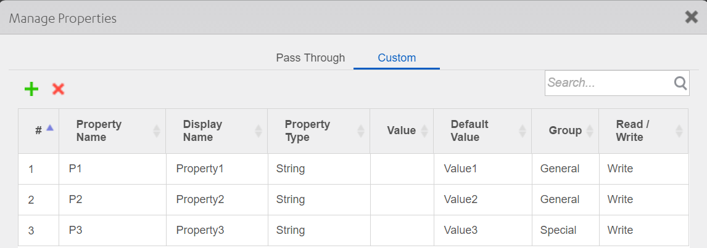

The properties will be displayed in the **Properties** pane.

You can also group both pass-through and custom properties under the same heading. For example, the following General properties of the Rating Prompt component include a mixture of pass-through and custom properties:

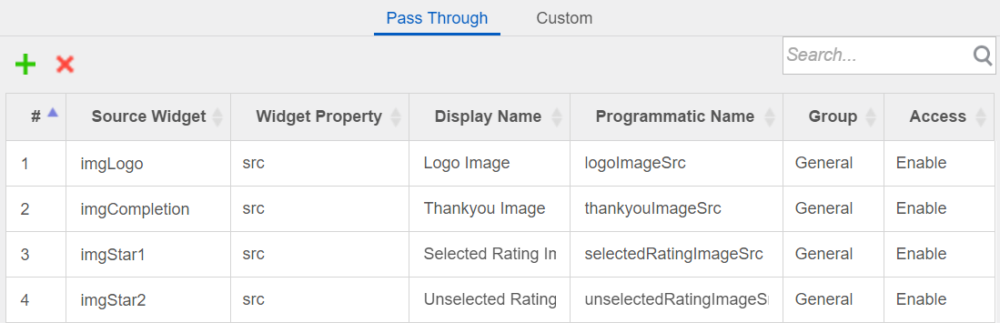

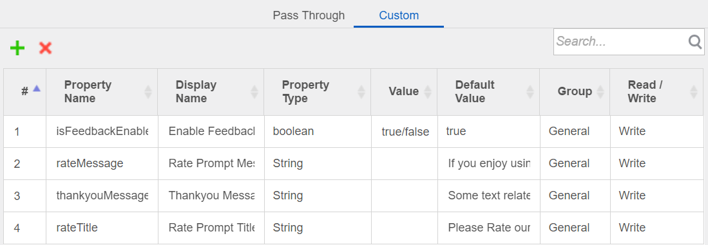

To group properties of a component with a contract:

1.  Follow the steps in [Manage Properties of a Component with a Contract](#manage-properties-of-a-component-with-a-contract) to define a pass-through or custom property.
2.  Under **Group**, specify the group where you want the property to be displayed.

If the group name does not exist, click in the **Group** field, select **Manage Group** to open the **Manage Groups** dialog box, and then add the group name.

4.  Click **Apply** to add the custom property.

To group events of a component with a contract:

1.  Follow the steps in [Manage Events of a Component with a Contract](#manage-events-of-a-component-with-a-contract) to define a pass-through or custom event.
2.  Under **Group**, specify the group where you want the event to be displayed.

If the group name does not exist, click in the **Group** field, select **Manage Group** to open the **Manage Groups** dialog box, and then add the group name.

4.  Click **Apply** to add the custom event.

To group methods of a component with a contract:

1.  Follow the steps in [Manage Methods of a Component with a Contract](#manage-methods-of-a-component-with-a-contract) to define a pass-through or custom method.
2.  Under **Group**, specify the group where you want the method to be displayed.

If the group name does not exist, click in the **Group** field, select **Manage Group** to open the **Manage Groups** dialog box, and then add the group name.

4.  Click **Apply** to add the custom method.

### Set Data for Components with Contract by using Mapping Editor

To set data for a component with contract by using Mapping Editor, follow these steps:

1.  In Iris, [create a component with contract](#create-a-component-with-contract), add the required widgets, define the [pass through](#pass-through-properties) and [custom properties](#custom-properties) of the component, and then click **Apply**.  
      
      
      
    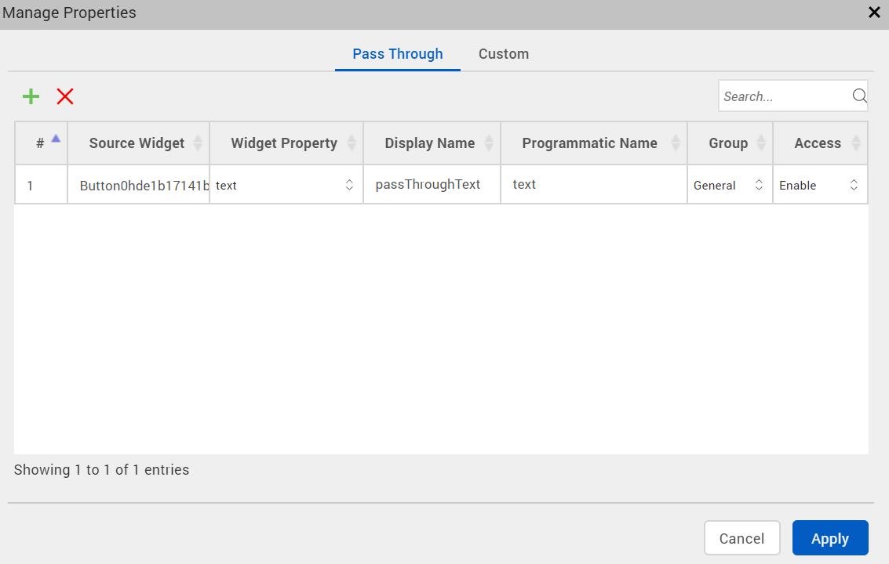  
      
      
      
    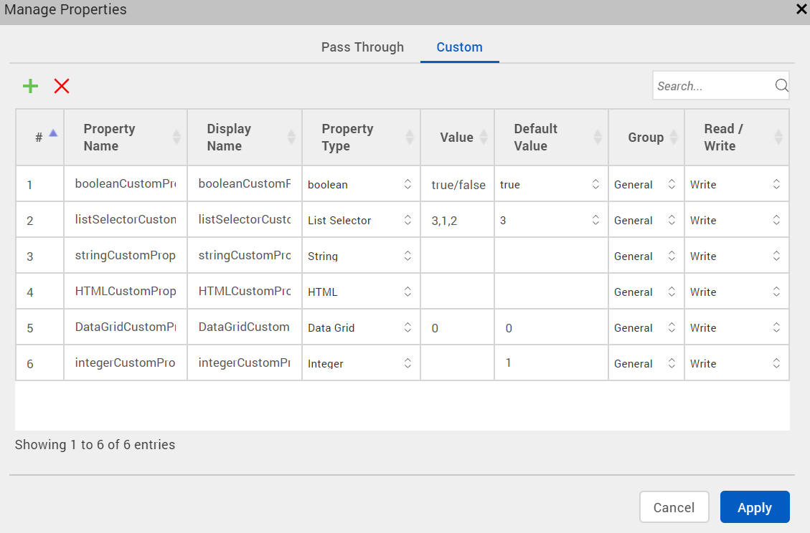
2.  In Project Explorer, select the form into which you want to insert the component with contract.
3.  Go back to **Templates** > **Components**, and right-click the newly created component. A list of options appears.
4.  Click **Insert Into**. The component with contract is inserted into the selected form.
5.  Select the form, and then go to **Properties** panel > **Action**.
6.  For any Event (for example, **onMapping**), click **Edit**. The **Action Editor** window appears, with **Diagram View** open by default.
7.  On the left pane of [Action Editor](working_with_Action_Editor.md), locate and click the **Add Mapping** action. The Add Mapping action is added to the flow diagram, as shown here.  
        
    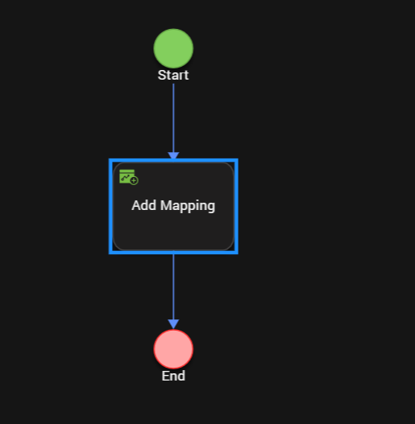

8.  Select **Add Mapping** from the flow diagram. [Mapping Editor](ActionsMapping.md) opens on the right pane of [Action Editor](working_with_Action_Editor.md).
9.  You can use [Mapping Editor](ActionsMapping.md) to expand and create mappings among various form, component, and widget elements as well as [global variables](Global_Variables_and_Data_Store_Keys.md).  
      
    
10.  Click **Code View** to see the generated sample code details of the data mappings. 

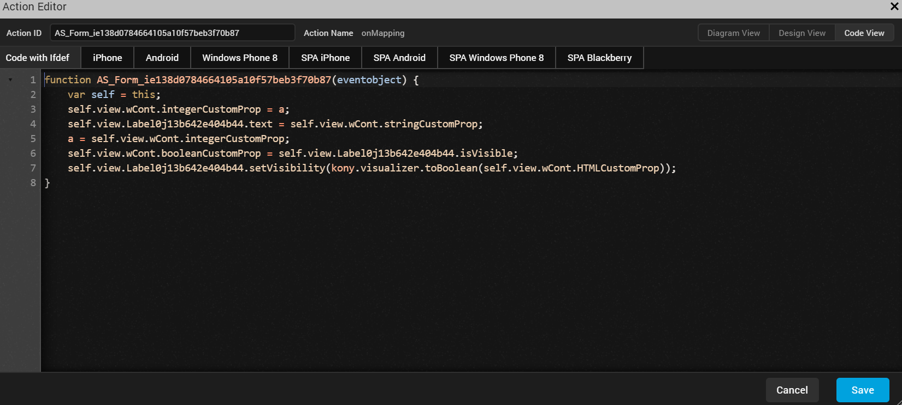

11.  Click **Save**. You have successfully set data for the component with contract by using [Mapping Editor](ActionsMapping.md).

### Define the Behavior of a Custom Property in Code

When you create a component with a contract, you can define pass-through and custom properties, events, and methods for the component. Defining pass-through properties, events, and methods does not require that you write code. You simply specify the built-in properties, events, and methods that you want to expose. However, a custom property, event, or method does not have any built-in behavior. You must define its behavior in code.
First, specify a name for the custom property, event, or method using the **Manage Properties** dialog box. For a custom property, you can also specify a display name, data type, and default value, and whether the property is read-only or read-write. If the property has a list selector, you can specify the key value pairs that make up the list. For more information on working with the **Manage Properties** dialog box, see [Manage Properties of a Component with a Contract](#manage-properties-of-a-component-with-a-contract), [Manage Events of a Component with a Contract](#manage-events-of-a-component-with-a-contract), or [Manage Methods of a Component with a Contract](#manage-methods-of-a-component-with-a-contract).

Once you specify information in the **Manage Properties** dialog box, you can add code to the component's controller module to define the behavior of the custom property, event, or method.

To define the behavior of a custom property, event, or method in code (Beta):

1.  Specify the required information in the **Manage Properties** dialog box.
2.  On the Templates tab, expand the **Modules** node of the component that contains the property, event, or method.
3.  Open the component's controller module; for example, _loginController.js_.

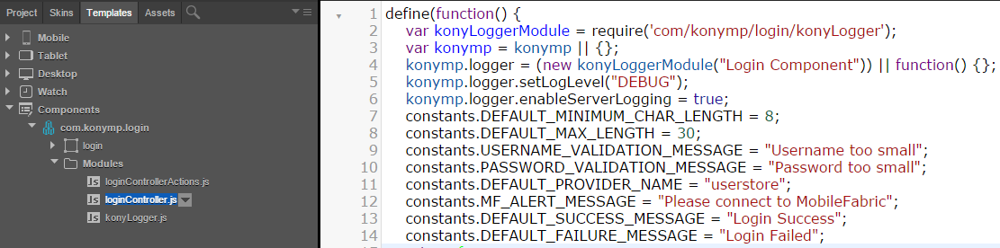


6.  Add JavaScript code that defines the behavior of the property, event, or method.

For example, the following code defines custom properties for the Login component, which can be downloaded from [](http://community.voltmx.com/marketplace). For examples of custom events and methods, see the _loginController.js_ controller module example.

```
/**
 * @function initGettersSetters
 * @description contains getters/setters for the usernameMinimumChar and usernameValidationMsg custom properties
 */
initGettersSetters: function() { 
    defineGetter(this, "usernameMinimumChar", function() {
        voltmxmp.logger.trace("----------Entering usernameMinimumCharacter Getter---------", voltmxmp.logger.FUNCTION\_ENTRY);
        return this.\_usernameMinimumChar;
    }); 
    defineSetter(this, "usernameMinimumChar", function(val) {
        voltmxmp.logger.trace("----------Entering usernameMinimumCharacter Setter---------", voltmxmp.logger.FUNCTION\_ENTRY);
        try {
            if (val == null || val == undefined) {
                voltmxmp.logger.warn("Username Min Char is undefined");
                throw {
                    "Error": "LoginComponent",
                    "message": "Username Min Char is undefined"
                };
            }
            if (isNaN(val)) {
                voltmxmp.logger.warn("Invalid datatype for Username Min Characters Property");
                throw {
                    "Error": "LoginComponent",
                    "message": "Invalid datatype for Username Min Characters Property"
                };
            }
            if (this.usernameMaxChar & amp; lt; val) {
                voltmxmp.logger.warn("usernameMaxChar is less than usernameMinimumChar");
                throw {
                    "Error": "LoginComponent",
                    "message": "username Max Char is less than Username Min Character propert"
                };
            }
            this.\_usernameMinimumChar = val;
        } catch (exception) {
            if (exception\["Error"\] === "LoginComponent")
                alert(JSON.stringify(exception));
        }
    }); 
    defineGetter(this, "usernameValidationMsg", function() {
        voltmxmp.logger.trace("----------Entering usernameValidationMsg Getter---------", voltmxmp.logger.FUNCTION\_ENTRY);
        return this.\_usernameValidationMsg;
    }); 
    defineSetter(this, "usernameValidationMsg", function(val) {
        voltmxmp.logger.trace("----------Entering usernameValidationMsg Setter---------", voltmxmp.logger.FUNCTION\_ENTRY);
        this.\_usernameValidationMsg = val;
    });
}
```

### Define a Custom Event

Creating and using a Custom Event involves three stages, creating a custom event, invoking the custom event, and consuming the custom event.

To create, consume, and invoke a custom event, do the following:

1.  In your Iris Project, from the **Project Explorer** section, click **Templates** tab.
2.  From **Components**, select **Create new Component with Contract**.
3.  Enter the **Namespace**
4.  Enter **Name**
5.  Click **OK**.  
      
    
6.  Navigate to **Project**
7.  Navigate to **Mobile** > **Forms** > New Form. A new form is created.
8.  Navigate to the **Templates** tab, and drag and drop the new template you created earlier onto this form. Your component is created, and it is added to the form. Now, let us define a custom event.
9.  Navigate to the component you created.
10.  In the **Properties** pane, click **Action**.
11.  Click **Manage Events**. The Manage Events pane displays.
12.  Click **Custom** tab.
13.  Click on the **+** sign to add a new custom event.
14.  In the **RaisedEvents** column, enter a name for your event. For example, testEvent.
15.  Click **Apply**.  
    The event is created, and you can view it in the **Action** tab under **General**. Now, the custom event is defined. Let us now invoke the custom event.  
16.  In your component, add a button.
17.  Name the button. For example, Trigger Event.
18.  In the **Properties** pane of the button, navigate to the **Action** tab and click onClick event **Edit** button. The Action Editor opens.
19.  From the list of functions available, select **Raise Event**.
20.  From the **Function****Name** dropdown, select **testEvent**.  
21.  Close the Action Editor.  
    Now, let us consume the event.
22.  Navigate to your form on your Mobile channel.
23.  On the form, select the component and from the **Properties** pane, click **Action** tab.
24.  Under **General**, you will notice the testEvent you created. Click **Edit**. The Action Editor opens.
25.  From the Functions list, select **Add Snippet**.
26.  In the code pane, enter `alert('Trigger Custom event');`.
27.  Close the action editor.
28.  From the File Explorer menu of Iris, from **Run**, select **Run**.
29.  The Building pane appears.
30.  Navigate to your local preview. You will see your form in local preview in Chrome.
31.  Click **Trigger Event**.  
    An alert Yay! custom event is displayed.

32.  Click **OK** to close the alert.

## Data & Services Panel Support for Components

From V8 SP4 Fixpack 20, you can directly drag and drop services from the Data & Services panel to a component. In addition, you can drag and drop individual parameters of a sample service to a component. This enhancement will enable you to quickly customize components according to your requirement, and reuse them at various places in your and projects. Furthermore, you can [publish customized components to Forge](C_UsingComponents.html#publish-a-component-to-hcl-forge) . You can leverage Data Panel support for both [components with contract](#create-a-component-with-contract) and [components without contract](#create-a-component-without-contract). For more information on the Data & Services panel, click [here](DataPanel.md).

Once you drag and drop a sample service from the Data & Services panel to a component, a corresponding project service is added. That particular project service and its associated parameters are auto-highlighted in the Data & Services panel. So if multiple components exist and when you select a specific component, only those services which have been added to that component are highlighted in the Project Services of the Data & Services panel. The Data & Services panel also allows you to view the mappings for each project service operation in the component. The **onMapping** Event of the operations in the component is not generated separately in the CodeGen. You can view the onMapping Event in the **preShow** Event of the component

Currently, only the Details form and List form UI are supported for the drag and drop of services into a component; Entry form UI is not supported.

If the sample service that you are trying to add to a component has already been added to another component, a **Conflict** window appears. In such a scenario, you must perform any one of the following actions to resolve this issue:

*   Select the Skip radio button, and then click **OK** to use the original service.
    *   If multiple instances of the same service exist and you want to use the original service, click Skip All.
*   Select the Replace radio button, and then click **OK** to use a new service.
    
    *   If multiple instances of the same service exist and you want to use a new service, click Replace All.
    
    
    

This section contains the following topics:

*   [How to Create a Component with Services](#how-to-create-a-component-with-services)
*   [How to Use a Component with Services](#how-to-use-a-component-with-services)

### How to Create a Component with Services

Create a component and leverage sample services from the Data & Services panel. You can bundle these services to the required widgets of a component. You can directly drag and drop services into a component and customize it according to your requirement.

In this scenario, we will use the [List-Details (Employee)](https://marketplace.voltmx.com/items/list-details-employee) component and add services to the widgets of the component. You can add parameters (for example, **Name**) to specific widgets (for example, **empname** Label) of the component. This component contains the following two screens:

*   **Employee List**  
    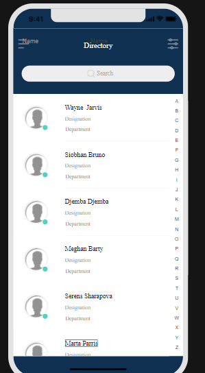
*   **Employee Details**  
    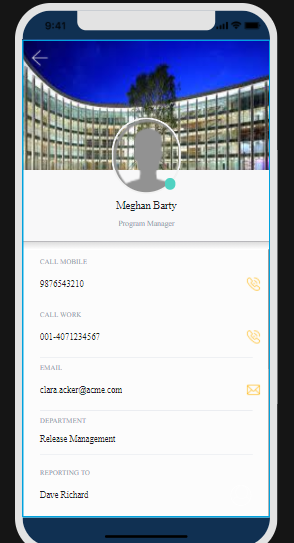

**To import the List-Details (Employee) component and add services to the component, follow these steps**:

1.  In , create a new **Sample App** project , and then import the [List-Details (Employee)](https://marketplace.voltmx.com/items/list-details-employee) component.  
    The landing page of the [List-Details (Employee)](https://marketplace.voltmx.com/items/list-details-employee) component is displayed on the Project Canvas and its associated widgets are displayed in the Project Explorer.

1.  To add services to the Employee List screen, follow these steps:
    1.  In the Project Explorer, go to **Mobile** > **Forms**, and then click **frmList**. The list screen is displayed on the Project Canvas.
    2.  Go to **Data & Services** panel > **Sample Services**, and then expand **Employee Services**.
    3.  Under the **employees** > **get** > **Response** > **records** operation, drag and drop the following parameters to the respective widgets:
        
        *   Name > empname
        *   Designation > designation
        *   Department > department
        
        
        
2.  To add services to the Employee Details screen, follow these steps:
    
    1.  In the Project Explorer, go to **Mobile** > **Forms**, and then click **frmDetails**. The details screen is displayed on the Project Canvas.
    2.  Go to **Data & Services** panel > **Sample Services**, and then expand **Employee Services**.
    3.  Under the **employees** > **get** > **Response** > **records** operation, drag and drop the following parameters to the respective widgets:
        
        *   Designation > lblEmployeeDesignation
        *   Primary\_Phone > callMobileFlex
        *   Email > emailFlex
        *   Department > departmentFlex
        *   Manager\_Name > reportingToFlex
        
        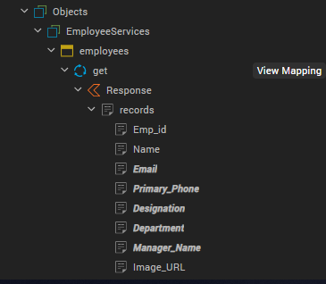
        
    4.  Go to **Data & Services** panel > **Sample Services**, and then expand **Contacts**.
    5.  Under the **getContacts** > **Response** > **responseList** operation, drag and drop the following parameters to the respective widgets:
        
        *   Name > lblEmployeeName
        *   Phone > callWorkFlex
        
        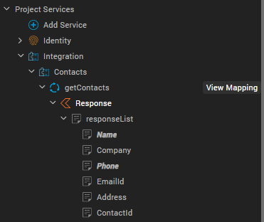
        
    
    The parameters are mapped to the corresponding component widgets, and the services are created in your instance. In addition, the mappings are highlighted and displayed under **Project Services** on the Data & Services panel.  
    
3.  Click **View Mapping** for a service, and then click **Generate Code** to view the respective mappings of the operations in the component. Alternatively, you can go to **Properties panel** > **Component**, click **Edit** for the **onMapping** Event, and then click **Generate Code**.
4.  You can then reuse the updated component across your projects or [publish this customized component to](C_UsingComponents.html#publish-a-component-to-hcl-forge) Forge.

### How to Use a Component with Services

Users can import the component with bundled services that you published on Forge. They can then modify the component as per their requirement.

Consider a scenario where Valerie (a user who wants to create a CRM app) imports your Employee List-Detail component to . However, she does not want to view employee data. Instead, Valerie wants to view the data of her customers. She can use the Data Panel support for Components feature to map data from another service that fetches customer data to the widgets, wherever required. Valerie can leverage an Object service to fetch the data, and she can directly map the response parameters from the Data & Services panel.

**Valerie can follow these steps to import the Employee List-detail component from and customize the services bundled with it**:

1.  Create a new project in Iris, and then import the component to Collection Library.
2.  Create a new form, say **frm1**.
3.  Drag and drop the component from Collection Library to frm1. The component is added to the form and the bundled services are displayed under Project Services of the Data & Services panel.
4.  For the List and Details screen, add response parameters of the required Object service (that fetches customer data) to the corresponding widgets of the component. Response parameters of other services (such as **Contacts**) can also be used wherever necessary. The new parameters are mapped to the corresponding component widgets, and the services are created in . Furthermore, the mappings are highlighted and displayed under **Project Services** on the Data & Services panel.

1.  Click **View Mapping** for the service, and then click **Generate Code** to view all the mappings of the parameters in the component.  
    Alternatively, you can go to **Properties panel** > **Component**, click **Edit** for the **onMapping** Event, and then click **Generate Code**.
2.  This component can now be used in the CRM app to display the list of customers on the Customer List screen and specific customers' information on the Customer Details screen.

### Modify a Component with Services

You can drag and drop individual Sample service parameters to the widgets in the component of a form. This feature helps you to [organize forms containing distinct components and services in multiple Collections within the Library Explorer](C_UsingComponents.html.add-a-component-to-a-collection). Furthermore, you can [import forms containing components from a Collection](C_UsingComponents.html#import-a-component-into-your-project) in the Library Explorer and use these forms in your project. By using these forms in your project, you can accomplish specific purposes within your application.

For instance, consider a scenario where a simple Employee Details screen needs to be created for an Employee Directory app. You can create a Employee Details form and add a component containing the **Employee ID** and **Employee Name** fields with associated Label widgets. You can then leverage the **Name** parameter of the **getContacts** operation in the **Contacts** Integration service and the **Emp\_id** parameter of the **get** operation in the **EmployeeServices** Object service. You can drag and drop the Name and Emp\_id parameters onto the respective Label widgets of the Employee ID and Employee Name fields.

The parameters will call the unique Name and Employee ID details of a particular employee in the Employee Directory app. In addition, whenever a similar kind of functionality needs to be designed for another app, this customized form can be leveraged and reused.

**To add Sample service parameters to the widgets in the component of a form, follow these steps**:

1.  [Add a component to a form](C_UsingComponents.html#add-a-component-to-a-form).
2.  Go to **Data & Services panel** > **Sample Services**, and then expand the required service.
3.  Drag and drop a specific parameter of the service to a particular widget of the component. The parameter is added to the specific widget of the component, and that parameter is auto-highlighted in the Data & Services panel.

You can drag and drop multiple service parameters to the widgets of a component within a form.

1.  Click **View Mapping** for the service, and then click **Generate Code** to view all the mappings of the operations in the component.  
    Alternatively, you can go to **Properties panel** > **Component**, click **Edit** for the **onMapping** Event, and then click **Generate Code**.
2.  Once you have successfully added the service operation parameters to the component in the form, the form can be [added to a Collection](C_UsingComponents.html#add-a-component-to-a-collection) and then [imported to be used for a particular channel in your project](C_UsingComponents.html#mport-a-component-into-your-project).

## Expose a Component's Widgets

Typically, a component comprises multiple widgets. Once you create a component with a contract, you can specify which of the component's widgets to expose to users.

To expose a component's widgets:

1.  Select a component's widget on the Iris canvas or on the **Templates** tab of Project Explorer.

    You can select a container widget or a child widget of a container widget.

3.  Right-click the widget and select **Expose Widget**, or click on the **Look** tab in the **Properties** pane and set the **Expose Widget** property to _On_.

    Iris displays the **Programmatic Key** property. Use this value to refer to the exposed widget in code. You can use the default value or specify a different programmatic key.

    >**Note:** The Expose property will allow a component creator to make the widget visible in the form or another component. A developer who is using the component cannot access the widget directly through code.

    If you select a container widget, all widgets within the container will be exposed. If you do not want to expose an individual widget within the container widget, select the widget and set its **Expose Widget** property to _Off_.

    >**Note:** You can set the **Expose Widget** property of a container widget to _Off_ but expose an individual widget within the container by setting its **Expose Widget** property to _On_.

8.  Repeat the process for each widget that you want to expose.

## Expose Child Components of a Nested Component

A component can contain multiple widgets or child components. Once you create a component with a contract, you can specify which of the component's child components to expose to users.

When you expose a child component within another component, all the pass-through and custom properties, events, and methods of the child component appear as pass-through entities in the properties pane of the parent component.

To expose a child component of a nested component, follow these steps:

1.  Select the child component on the Iris canvas or on the **Templates** tab of the **Project Explorer**.
2.  Right-click the component and select **Expose Component**.  
    Alternatively, you can navigate to the **Look** tab in the **Properties Pane** and set the **Expose Component** property to ON.
    
    > **Note:** The Expose Component property allows a component creator to make the child component visible in a Form or another component. A developer using the component cannot access the child component directly through code.
    
3.  Repeat the process for each child component that you want to expose.

    >**Note:** In case of multiple layers of nested components, you can only view properties of the child components that have been exposed within the parent component.

## Specify a Container Widget as a Target Container

A _target container_ is a Container widget that can contain other child widgets. To specify a Container widget as a target container, set both its **Expose Widget** and **Set As Target Container** properties to _On_.

To specify a Container widget as a target container:

1.  Select the container widget on the Iris canvas or on the **Templates** tab of Project Explorer.
2.  Click on the **Look** tab in the **Properties** pane.
3.  Set the **Expose Widget** property to _On_, and then set the **Set As Target Container** property to _On_.

    >**Note:** If the **Expose Widget** property is set to _Off_, setting the **Set As Target Container** property to _On_ will set both the **Expose Widget** and **Set As Target Container** properties to _On_.

    Iris displays the **Placeholder** property. The Placeholder property lets you specify further information or direction to a user; for example "Add Content Here" or "Drop Image Here."

## Expose a Component's Skins

In addition to specifying which of a component's widgets to expose to users, you can specify the skins to expose.

To expose a component's skins:

1.  Select the component on the Iris canvas or on the **Templates** tab of Project Explorer.
2.  Select the **Skin** tab in the **Properties** pane and select the skin that you want to expose.
3.  Set the **Expose Skins** property to _On_.
4.  Repeat the process for each skin that you want to expose.

## Lock a Component

To prevent your component from being modified by users, you can lock the component. Users will not be able to view or modify the component's source code.

To lock a component:

1.  Select the component on the Iris canvas or on the **Templates** tab of Project Explorer.
2.  Right-click the component and select **Lock**.

## Delete a Component

Follow these steps to delete a component and the assets associated with the component from the project:

1.  From the **Project Explorer**, navigate to the **Templates** tab.
2.  Expand the **Components** Node, and right-click the component that you want to delete.
3.  From the context menu that appears, select **Delete**.  
    The **Confirm Delete** dialog box appears.
4.  Click **Delete** to delete the component along with all the skins and assets associated with the component.
5.  Click **More Details** to view the list of Skins associated with the component.  
    Select the Skins that you want to delete, and then click **Delete**.
6.  Click **Cancel** if you do not want to delete the component and its associated Skins.

Once you click **Delete**, the component is deleted from the project along with its associated Skins, and a **Deletion Success** dialog box appears. Click **Done**.