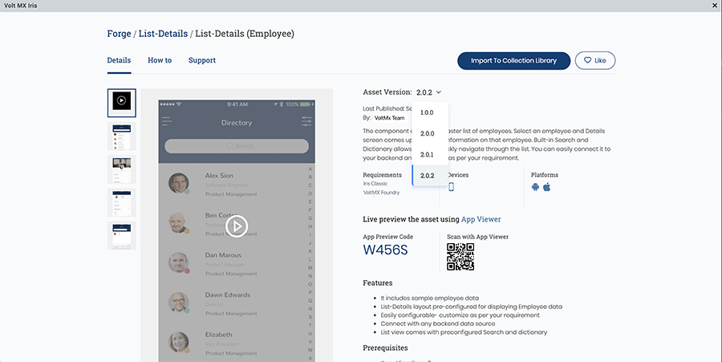
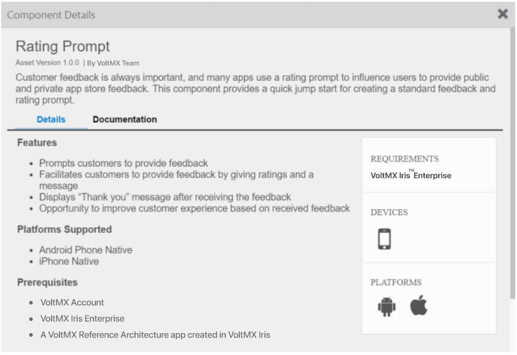
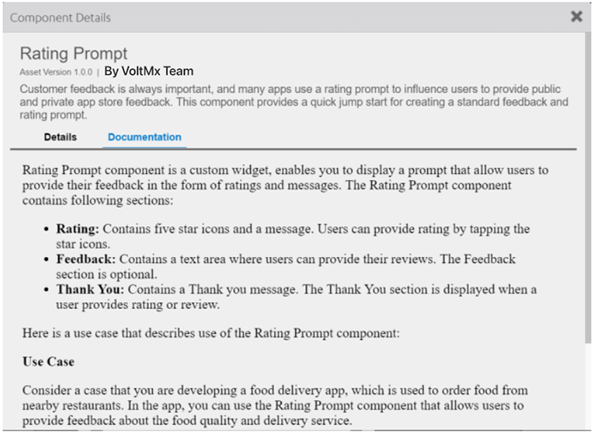
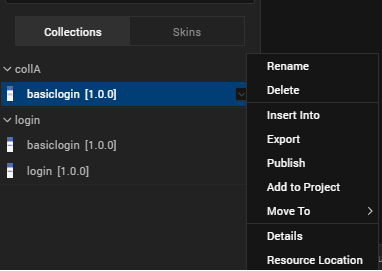
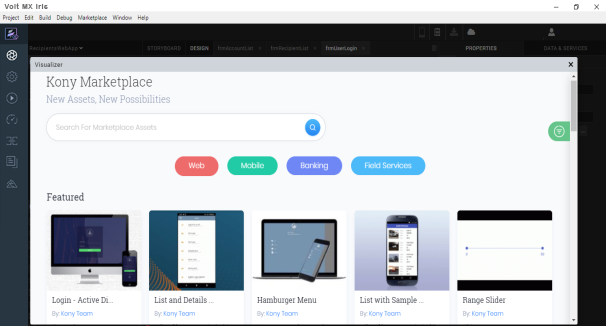

                          


Use Components
==============

You can simplify and accelerate the development of digital applications by using a variety of existing components as building blocks, allowing you to create sophisticated digital applications without having to write all the code yourself. You can download a variety of components from HCL Forge and import them into your projects, or import reusable components that you create yourself.

For example, you can download the following free components developed by the HCL Forge Assets team, and drag and drop them into your applications:

*   **Sliding Menu**: Lets you hide the navigation beyond the edge of the screen, and reveal it only after a user’s action.
*   **Login**: Provides a standard log-in interface with the ability to enforce a minimum password and minimum user ID length, and local password encryption.
*   **Place Locator**: Provides a powerful map interface that allows you to search for points of interest near a specified location.
*   **Floating Action**: Represents and promotes the primary action in an application.
*   **Employee Directory**: Provides standard features associated with an employee directory.


You can also import masters created in an earlier version of Volt MX Iris into a Free Form JavaScript project. You can continue to use the masters in your applications, or make them available as reusable components that can be published to HCL Forge by converting them to components. A master is similar to a component without a contract, except that a component includes a controller module.

For information about creating components, see [Creating a Component](C_CreatingComponent.md). For information on the types of projects, you can create, see [Types of Projects](TypesOfProjects.md).

The following topics provide additional information about using components:

*   [Download a Component from HCL Forge](#download-a-component-from-hcl-forge)
*   [Import a Component into Your Project](#import-a-component-into-your-project)
*   [Update a Component instance into your Project](#update-a-component-instance)
*   [Add a Component to a Collection](#add-a-component-to-a-collection)
*   [Add Dependent Assets to a Component](#add-dependent-assets-to-a-component)
*   [View Details and Documentation for a Component](#view-details-and-documentation-of-a-component)
*   [Add a Component to a Form](#add-a-component-to-a-form)
*   [Import a Master into Your Project](#export-a-component)
*   [Export a Component](#export-a-component)
*   [Publish a Component to HCL Forge](#publish-a-component-to-hcl-forge)
*   [Work With a Private Section of HCL Forge](#work-with-a-private-section-of-hcl-forge)
*   [Moderator Capabilities for the Private Section of HCL Forge](#moderator-capabilities-for-the-private-section-of-hcl-forge)
*   [Configure Snap Mode for Components](#Configur2)
*   [Flatten a Component](#customizing-a-component)
*   [Configure Z Index for Responsive Web Components](#steps-to-add-components-to-a-segment-template)
*   [Add Components to Segment Template](#add-components-to-a-segment-template)

Download a Component from HCL Forge
---------------------------------------

HCL Forge gives you access to a rich assortment of components. You can download a component, and then import it into your project.

Check the Video to learn more about HCL Forge and how to download one to use it in your application.

<div class="youtube-wrapper"><iframe src="https://www.youtube.com/embed/VTaeJKqvKqc" allowfullscreen=""></iframe></div>

To download a component from HCL Forge:

1.  Select **Browse** from the **HCL Forge** menu, or navigate to the [HCL Forge](http://community.hclvoltmx.com/marketplace) website in your web browser. If you are not already logged into Volt MX Cloud from the Iris, a login window appears. Enter the Volt MX Cloud account credentials.

      

2.  Select the component you want to download to open a web page that describes the component.

From Asset Version, select the version of the component to download. Once you are done selecting the asset version, scroll down.  
  
    

3.  Click the **Login to Download** button to log in to your Volt MX account and download the component.

4.  From **Select Destination** list, select one of the options  
    • Select **Collection Library** to add the component to your library in Iris  
    • Select **Local Drive** to download the component to your local drive. You can import this component later in your Iris project.  
      
     

Import a Component into Your Project
------------------------------------

You can import components to your Volt MX Iris project and reuse them at necessary places in the application. Components can be imported from the following sources:

*   Components that you download from HCL Forge.
*   Components that you create and export to your computer, network, or the cloud.
*   Components that others create and export to your computer, network, or the cloud.

To import a component to your project, follow these steps:

1.  In the Project Explorer, click the **Templates** tab.

    

2.  Right-click **Components**, and then select **Import Component**. The **Import Component** dialog box appears.

     

3.  Click **Browse** to navigate to the location of the component, select the component, and then click **Import**. The component and its associated widgets and modules are added to your project.

     

Once you have imported a component to your project, you can easily add the component to a form. For more information, refer [Add a Component to a Form](#add-a-component-to-a-form).

You can also save the component to a collection. For more information, refer [Add a Component to a Collection](#add-a-component-to-a-collection).

### Import Different Versions of an Existing Component

*   When you import an older version of an existing component, Volt MX Iris displays a message for permission to save the imported component as a new copy of the component. Click **OK** to import the component as a new copy. Click **Cancel** to stop the import process.  
    
*   When you import a newer version of an existing component, by default, the component is saved as a new copy.

Instances of existing components are not automatically upgraded when you import a newer version of the component. To upgrade a component instance in a form, follow these steps:

1.  From the Project Explorer of Volt MX Iris, navigate to the Form in which the component is present.
2.  Right-click the component, and select the **Replace Component** option.  
    A list of available components appears.
3.  Select the required version of the component.

The component is replaced with the selected version.

> **_Note:_** When you replace a component with another version, the elements (child widgets and nested components) of the component are replaced with the elements of the new component. However, the data, properties, and events of the elements are retained if the data type and widget type match.

Update a Component Instance
---------------------------

The Update Component Instance feature enables you to update the existing versions of components in a Volt MX Iris project to higher versions of the same component. You can view the higher versions that are available and choose the version you want to update to.

You can update a component instance in three different ways.

*   You can update a specific component instance in a project.
*   You can update a specific component on the canvas.
*   You can update a multiple component instance in the Template.

> **_Note:_** If a higher version is not available on the selected component, then the **Update Component** option is disabled.

#### Update a Component In a Project

To update a specific component in your project, follow these steps:

1.  In the Project Explorer, click **Project** tab.
2.  Select **Form**.
3.  Right-click the component and select **Update Component**.  
    You can view the higher versions of the component.
4.  Select the version you want to update to.  
    The selected component is updated to the selected version.

#### Update a Component on the Canvas

To update a specific component on your canvas, follow these steps:

1.  In the Project Explorer, locate and open the form in which you want to update the component.
2.  On the canvas, right-click the form and select **Update Component Instance**.  
    You can view the higher versions of the component.  
    
    > **_Note:_**  When you update a component instance on the canvas, if there are no updates available for the component, the Update Component option does not appear.
    
3.  Select the version you want to update to.  
    The selected component is updated to the selected version.
    
    > **_Note:_** By using this method, you can only update a single component instance in one go. If you want to update multiple instances of the same component, follow the instructions available at [Update a multiple components instance in the Template](#update-multiple-component-instances-from-template).
    

#### Update Multiple Component Instances from Template

To update multiple component instances from a template, follow these steps:

1.  In the Project Explorer, click **Templates**.
2.  Expand the component node and select the components.
    
3.  Right-click the component and select **Update Component Instance**.  
    The Update Component Instance dialog appears with the list of higher versions of the component where added.  
    
    > **_Note:_** The Select Version drop-down displays all the higher versions of the component.
    

    

4.  Select the components you want to update.
5.  Click **Update**  
    A confirmation window appears with the Success alert.  
    

Add a Component to a Collection
-------------------------------

To help you organize your components, you can group them in a collection within the Library Explorer. You can organize related components, or organize them however you like, in multiple collections within a library. You can then easily drag and drop the component from the Collections pane of Library Explorer onto a form in any of your digital application projects.

From Volt MX Iris V9 SP2 GA onwards, you can add multiple versions of components from the **Templates** tab into **My Libraries**. When you import or add the same version or lower version of an existing component to the My Libraries section, Volt MX Iris displays a message stating that a same version of the component exists. Click **OK** to add the component. If a higher version of the component is added, Volt MX Iris directly adds the component into My libraries.

##### Add Components to My Libraries

When you add a component, the create new **Library Component** dialog box appears. The Library Component dialog box contains the following options:

*   **Display Name**: The name of the Component is pre-populated with the existing name. Users can change the name, if required.

> **_Note:_** If a component with this name already exists then an alert icon appears to change the display name.

*   **Component Name**: The name of the component for user reference. This field is in the read-only format.

*   **Version**: Displays the version number of the component in a read-only format.

*   **Description**: Add the description for the Component, if required.

Click **OK** to add the component to a collection and the version tag is added to the component.

To add a component to a collection, follow these steps:

1.  Click the Templates tab in either the Project Explorer or the Library Explorer.
2.  If it is not expanded already, expand the Components node.
3.  Click the context menu arrow of the component you want to add to a collection, and hover over **Add to Collection**. Then hover over the library that contains the collection, and click the collection where you want to save the component. If the library or collection does not exist, you can create the library or collection.

If the component uses any Volt MX Foundry services, Volt Iris prompts you to select the services that you want to include with the component. Volt MX Iris creates a trial Volt MX Foundry account and includes any required services.

You can also add a master created in earlier versions of Volt MX Iris to a collection.

Add Dependent Assets to a Component
-----------------------------------

In Volt MX Iris, you can add skins, media assets, and images to components. In previous releases, when you create a component and export the component to the HCL Forge , associated dynamic skins, and media assets were not added to the collection automatically. These skins and media assets used to be accessed through the code that you customized within the component.

> **_Important:_** When you are importing a component into a project, ensure that the component assets do not have the same name as any of the assets in the project you are importing the component. Iris does not warn you of any duplication, and you may lose some functionality.

### Add Skins to a Component

To add skins to a component, do the following:

1.  In Project Explorer, click **Skins**.
2.  Right-click on the skin you want to add to a component. A list of options appears.
3.  Click **Add to Component**. The Add to Component dialog appears.
4.  Select the component to which you want to add the skin. The skin is added to the selected component.

When you add a skin to a component, a live two-way dependency map is maintained to track skins associated to a component. If you delete a skin from a project, the skin is removed from associated components.

### Add Media Assets to a Component

To add media assets to a component, do the following:

1.  In Project Explorer, click **Assets**. The assets tab appears.
2.  Browse to the asset you want to add to a component.
3.  Right-click on the asset. A list of options appears.
4.  Click **Add to Component**. The Add to Component dialog appears.
5.  Select the component you to which you want to add the media asset. The asset is added to the selected component.

If you delete an asset from a project, the asset is removed from associated components.

### Directly Import Images into a Component

From Volt Quantum V8 SP4 onwards, you can directly import an image from your local computer and add it to the widget in a component. Previously, to change the asscoiated image of a Login component, you had to first import the image to the Assets tab and only then you could add it to the component.

**To directly import an image and add it to a component, follow these steps**:

1.  Drag and drop a component to your form. For instance, the **ACME Login** component from the **Default Library**.
2.  You can perform any of the following actions:
    
    *   On the Project Canvas, double-click the success image .
    *   In the Project Explorer, go to your form > ACMELogin, right-click **imgLogo**, and then click **Edit Image Source**.
    
    The **Select Image** dialog box appears, containing the list of available imported images.  
      
    
    
3.  Click **Import**. The File Explorer of your local computer appears.
4.  Select the required image, and then click **Open**. The Import Images dialog box appears, indicating that the image has been imported successfully. If required, Volt MX Iris automatically modifies the file name of the imported image according to the Volt MX Irisresource name specification.  
      
    
5.  The imported image appears in the list of images of the **Select Image** dialog box. Select the image, and then click **OK**. The image is added to the ACMELogin component.

View Details and Documentation of a Component
---------------------------------------------

Components downloaded from HCL Forge often include documentation supplied by the component creator. For example, the Rating Prompt component developed by the Volt MX team includes a summary of key details about the component, along with a more complete description of the component and how to use it.

  

  
 
You can view this documentation, if it exists, from within Library Explorer in the collection where you saved the component.

To view details and documentation about a component:

1.  In Library Explorer, go to the **Default Library** and **Collection** where you saved the component.

2.  Right-click the component name and select **Details**. Volt MX Iris opens a viewing pane and displays the documentation.

To switch between details and documentation view, click **Details** or **Documentation**.

Add a Component to a Form
-------------------------

You can add a component to a form in a project in virtually any form scenario, including using components within another component. You can then drag and drop the component into your application to create sophisticated, full-featured digital applications without writing all of the code.

For example, rather than creating a log-in form from scratch for each of your digital applications, you can download the Login component from HCL Forge. You can add the Login component to a collection of components, and then add it to a form.

From Volt MX Iris V9 SP2 GA onwards, you can view the version number of the component in the **My Libraries** section and also store multiple versions of the same component in **My Libraries**. In addition, you can add components directly from the My Libraries section to a project. To do so, click the context menu arrow of the component and selecting **Add to Project**.



If a component of the same version or a higher version is already present in the **Templates** tab, Volt MX Iris displays a message stating that the project already has a latest version of the component. If you still want to add the component, you can do so. The component gets added to the project templates with Copy1 appended to its name.

To add a component to a form:

1.  On the Project tab of the Project Explorer, locate and open the form where you want to add the component. The form displays on the Iris Canvas and has the focus.
2.  If you have added the component to a collection, open the library and collection that contains the component in Library Explorer. Then drag and drop the component onto the form.

> **_Note:_** From Volt Quantum V8 SP4 onwards, the Default Library filter has been enhanced to segregate components according to their respective channels. As a result, mobile-only components are displayed in the Default Library when a Mobile form or a Tablet form is open at that time on the Project Canvas. Similarly, web-only components are displayed Default Library when a Web form is open on the Project Canvas. However, when there is no form open on the Project Canvas, all the available components are displayed in the Default Library.

If the component is added to the project and appears on the **Templates** tab, you can also do one of the following:

*   Click the context menu arrow of the component you want to use, and then click **Insert Into**. An instance of the component is placed on the form you originally selected.
*   Drag the component from the **Templates** tab to the Iris Canvas, and drop the component onto the form.

The instance appears in the Project Explorer as blue text with a different icon, making it easy to identify as a component instance.

Export a Component
------------------

Just as you can import a component into your project, you can export a component to your computer, network, or the cloud. You can then import the component into another project or share it with others.

To prevent your component from being modified by users, you may want to lock the component. This prevents users from viewing or modifying the component's source code. For more information about locking a component, see [Creating a Component](C_CreatingComponent.md).

> **_Note:_** Locales are not exported with a component. For more information about locales, see [Appendix A • Internationalizing (i18n) Application Content](Internationalization.md).

To export a component, follow these steps:

If you have added the component to a collection, open the library and collection that contains the component in Library Explorer. Then select the component.

If the component has been added to the project and appears on the **Templates** tab, select the component there.

2.  Right-click the component, and then select **Export**. Volt MX Iris displays the **Save As** dialog box.
3.  Navigate to the location where you want to export the component, and then click **Save**. Volt MX Iris exports the component to that location.

> **_Note:_** While exporting a component, if any project-level properties have been enabled, these properties are automatically applied to the exported component. To avoid this issue, you must first disable the required NFIs for either iOS or Android from Edit > Manage Native Function APIs > iOS/Android and then export the component.

If the component uses any Volt MX Foundry dependencies, including .jar files, service definitions, connectors, or node.js files, a pop-up is displayed with the list services used in the component.

  

Select the required services by clicking the checkbox and click **Package** to export (or) to add it to the library.

**If you create a component that requires configuration of Volt MX Foundry service parameters, follow these steps:**

1.  Extract the exported component package file to your local file system.
2.  Go to **Components** folder and extract the services.zip package.
3.  Create a Parameters.json file with all the configurable parameters.
    
    The JSON file includes the information about all the configurable parameters for the services included in the component.
    
4.  Place the Parameters.json file in the Services folder of the services package.
    
    Here is a sample JSON file with the default parameters.
    
```
[{           
        "name": database_url,
                    "displayName": < Display name of the parameter to show in Properties Window > ,
                    "defaultValue": < Mandatory
        if property is readOnly,
        Optional otherwise > ,
                    "type": < Type of the parameter.Can be one of String / Integer / Double > ,
                    "serviceName": < Name of the MF service > ,
                    "serviceType": < Type of the MF service.Can be one of identity / integration / object / orchestration > ,
        "readOnly": true / false
    }, { < configurable param 2 >
    }]
    
```
Update the corresponding file located in component_package/component/services/services/services/service_type/meta.json with the placeholders. Example, endpoint file for service RDBMS123 is updated as:
```
<? xml version = "1.0"
    encoding = "UTF-8"
    standalone = "yes" ?> < endpoint dataAdapterId = "1"
    encryptSecureInfo = "false"
    name = "default"
    type = "CustomDataAdapter" >     < apiThrottling / >     < config >         < entry >         < entry >             < key > jdbcUrl < /key> 
                <value>${database_url }</value >         < /entry> 
                <key>jdbcClass</key >             < value > com.mysql.jdbc.Driver < /value> 
            </entry >     < /config> 
    </endpoint >
    
```
Zip the services folder and the component folder and import the package to Iris. For more information on configuring the parameters in Iris, refer [Configuring Volt MX Foundry service parameters in Iris](#Configure_Services_Params).

Publish a Component to HCL Forge
------------------------------------

To publish a component to HCL Forge, first add it to a collection in your project. For more information on adding a component to a collection, see [Add a Component to a Collection](#add-a-component-to-a-collection).

Click the video to learn about how to submit Volt MX Iris components to Volt MX public HCL Forge or to your private Marketplace.

<div class="youtube-wrapper"><iframe src="https://www.youtube.com/embed/-u_BIcHc49c" allowfullscreen=""></iframe></div> 

> **_Note:_** You can only publish a component with a contract to HCL Forge. For more information about components with a contract, see [Components Overview](C_ComponentsOverview.md) and [Creating a Component](C_CreatingComponent.md).

To publish a component to HCL Forge:

1.  Open the collection that contains the component that you want you publish.
2.  Right-click the component that you want to publish, and then select **Publish**.
3.  Supply log-in information to your Volt MX account, if necessary, and provide the necessary information to HCL Forge.
4.  Supply log-in information to your Volt MX account, if necessary, and provide the following information to HCL Forge  
    *   The name of the component
    *   The asset version
    *   Description of the asset
    *   The new feature added in the component in this version(optional)
    *   Details such as code snippets(optional)
    *   Asset Display view(optional)
    *   Detail View Images/Video(optional)
    *   Developer guide documentation (optional)
    *   Volt MX documentation link (optional)
    *   External links(optional)
    *   Asset requirements (optional)
    *   Related tags (optional)
    *   Domain (optional)
    *   Additional information (optional).
5.  Click 'Submit for Review' to upload the component to the HCL Forge .  
      
    

> **_Note:_** While uploading a component again, you must change the asset version.

Work With a Private Section of HCL Forge
--------------------------------------------

If you are an enterprise customer whose organization uses a private section of HCL Forge, you can download a component from that private section or upload a component to that private section using your organization's cloud account. First, configure Volt Iris to use the cloud account.

Click the video to learn about the various features of Private section of HCL Forge ..

<div class="youtube-wrapper"><iframe src="https://www.youtube.com/embed/WsYzziTouqs" allowfullscreen=""></iframe></div>
To work with a private section of HCL Forge in Volt MX Iris:

1.  Close Volt MX Iris.
2.  Open the _default.js_ file in the _config_ directory of your Volt MX Iris installation.
3.  Add the following to the _default.js_ file.

mp:{privateMPAccountId: _<MyAccountId>_}

  _<MyAccountId>_ is the account identifier of your cloud account. The account identifyer is displayed in the top-right corner of your cloud console on _manage.hclvoltmx.com_.

Save and close the _default.js_ file, and then reopen Volt MX Iris.

To work with a private section of HCL Forge in Volt Iris:

1.  Click **Project Settings** on the **Quick Launch Bar** or in **Project Explorer** to open the **Project Settings** dialog box, and then click the **VoltMX Foundry** tab.
2.  In the **Cloud Account** box, select your cloud account.

To download a component, see [Download a Component from HCL Forge](#download-a-component-from) . To upload a component, see [Publish a Component to HCL Forge](#publish-a-component-to) .

Moderator Capabilities for the Private Section of HCL Forge
---------------------------------------------------------------

HCL Forge offers a private section where you can upload your own components, distribute them among your teams, download them, and use them.  

Moderators manage the private section. As a moderator, you can review a component, approves them, or delete them.  

If you want to be a moderator, you must have a Volt MX Cloud account, and your cloud administrator must provide access to the private marketplace as a moderator.

To Manage components as a moderator, follow these steps.

1.  In Iris, navigate to HCL Forge > Browse. Or Navigate to your private marketplace website using a web browser. In case you are not logged in to Volt MX Cloud, Iris displays a login window. Enter your Volt MX Cloud account credentials. Once you are logged in, the list of available assets appears.
2.  Click Moderate Assets. The list of components appears.  
      
      
      
    The components are sorted under two tabs: Awaiting Approval and Disabled.  
    
3.  To modify a component, in the Awaiting Approval tab, click the ellipsis.  
      
    
4.  From the list, select an action. Options are:  
    · Live Preview- Shows the moderator how the component will look when approved  
    · Disable- Disables the component and move it to the Disabled tab  
    · Approve- Approves the component for publishing it  
    · Reject- Rejects the component. It will not be visible even in the Disabled tab  
    · Edit- Gives option to edit the whole component details such as Description, title, version, etc.
5.  In the Disabled tab, click on the ellipsis of the component.
6.  From the list, select an option. Options are:  
    • Enable- Enables the component and moves it to the Awaiting Approval tab  
    • Delete- Deletes the component from the list  
      
      
      
      
    

Customizing a Component
-----------------------

A feature is provided to help you to get the UI elements of a component on to a form without affecting the parent component and reuse the component’s UI elements. You can use Component Flattening to:

*   Use UI elements without the pre-bundled logic
*   Modify Skin or the UI
*   Modify Widget properties

You can further bundle your modified form to a new component.

The feature, **Flatten Component** is applicable for components with contracts and components without contracts. It is also applicable to pre-built components.

**To flatten a component, perform these steps**:

1.  In Volt MX Iris, open your project in which you have a component that you want to flatten.  
    If you do not have a component already in the project, see [Import a Component into Your Project](#import-a-component-into-your-project).
2.  In the project explorer, navigate to the form on which you have the component added.
3.  Right-click on the component and select **Flatten Component**.  
    A confirmation message appears.
4.  Click **OK**.  
    All widgets that are in the component are unpacked and are available on a new flexContainer and you can edit those widgets. Actions associated with widgets in the component are carried forward to the widgets.
    
    > **_Important:_** All associated controllers and module files in component are lost after flattening. This might result in loss of functionality of your component.
    
    Any actions associated with the source model widgets present in the form are copied to the newly created flexContainer. All actions also are moved to a channel specific directory.  
    

**Limitations**:

*   During the flattening process, nested instances are not further unpacked.
*   You cannot flatten locked components.
*   During the flattening of the UserWidgetInstance, exposed properties for children inside a target container will not be retained.

Configure Z Index for Responsive Web components.
------------------------------------------------

From Volt MX Iris V9 SP2 FP 7, support for the Clip Bounds property is available for custom widgets in a Responsive Web app. Using this feature, developers can enable or disable the visibility of the content overflow. Content overflow is the content that appears outside the view area of the widget. The default value for the Clip Bounds property is OFF. When the Clip Bounds property is set to OFF, the content overflow is visible. Prior to the V9 SP2 FP7 release, to display the content overflow, developers had to modify the custom widget dimensions, which creates layout issues in some cases.

> **_Note:_** For existing custom widgets, the default value of the Clip Bounds property is ON. For new custom widgets, the default value of the clip Bounds property is OFF.

For example, if the HTML content that is rendered by a third-party library exceeds the custom widget dimensions, content overflow occurs. Using the Clip Bounds property, developers can configure whether the content must be clipped or must be allowed to overflow.

For existing components, the value of the Z Index is configured as **1** for the Native channel. For the Responsive Web channel, the Z Index will be set as **Custom** with **1** as the value.

For new components, the value of the Z Index is configured as **1** for the Native channel. For the Responsive Web channel, the Z Index will be set as **Auto** or **1** based on the project level settings.

> **_Note:_** If ModalContainer property is set to true in any of the FlexContainer widget, the Z Index value of that container and all of its parent containers should be set to **Custom**.

Add Components to a Segment Template
------------------------------------

From Iris V9 SP1 GA onwards, you can add a component to a Segment template including using components within another component. This template can then be added to your segment as a row template.

For example, in a banking application, for displaying the date and time of the list of transactions performed by a user, you can add a component, with a Label and a Calendar widget to the Segment template. This component can also be reused in a list of scheduled transactions or a list of payees.

In this section, the following topics are discussed:

*   [Adding Component without contract](#adding-components-without-contract)
*   [Adding Component with Contract](#limitations-of-adding-components-to-the-segment-template)
*   [Limitations of Adding Components to the Segment Template](#limitations-of-adding-components-to-the-segment-template)
*   [Steps to add Components to a Segment Template](#steps-to-add-components-to-a-segment-template)

### Adding Components without Contract

A Component without contract exposes all the properties, events and methods of the widgets inside it. This means that to access the data of a widget inside the component, you must provide the full path of the widget.

Consider a scenario where you have a Segment template(say SegTemplate) containing an image widget and two components inside it. This component has been added to the template, of the mySegment Segment. In this scenario, the must look like this.

Here is the code for setting the [widgetDataMap](../../../Iris/iris_widget_prog_guide/Content/Segment_Properties.md#widgetDa) and [data](../../../Iris/iris_widget_prog_guide/Content/Segment_Properties.md#data) of the Segment widget.

```
var mySegment = new voltmx.ui.SegmentedUI2({
  "id": "mySegment",
  "rowTemplate": "SegTemplate",
  //The data that is displayed in the Segment widget
  "data": [{
    "img1": {
      "src": "logo1.png"
    },
    "comp1.btn1": {
      "text": "Button 001"
    },
    "comp1.comp2.lbl1": {
      "text": "Label 001"
    }
  }, {
    "img1": {
      "src": "logo2.png"
    },
    "comp1.btn1": {
      "text": "Button 002"
    },
    "comp1.comp2.lbl1": {
      "text": "Label 002"
    }
  }, {
    "img1": {
      "src": "logo3.png"
    },
    "comp1.btn1": {
      "text": "Button 003"
    },
    "comp1.comp2.lbl1": {
      "text": "Label 003"
    }
  }, {
    "img1": {
      "src": "logo4.png"
    },
    "comp1.btn1": {
      "text": "Button 004"
    },
    "comp1.comp2.lbl1": {
      "text": "Label 004"
    }
  }, {
    "img1": {
      "src": "logo5.png"
    },
    "comp1.btn1": {
      "text": "Button 005"
    },
    "comp1.comp2.lbl1": {
      "text": "Label 005"
    }
  }],
  //The widgetDataMap of the 
  "widgetDataMap": {
    "img1": "img1",
    "comp1.btn1": "comp1.btn1",
    "comp1.comp2.lbl1": "comp1.comp2.lbl1"
  }
});
frmSegment.add(mySegment);
```

### Adding Components with Contract

Components with a contract use the Volt MX Iris Reference Architecture: a structured, modular framework based on the Model-View-Controller (MVC) architecture. While using a component with contract, you can access only the pass through and custom properties, methods and events exposed by the component developer.

Consider a scenario in which there is segment template containing an image widget and a Component with contract. This component contains two Label widgets, one TextBox widget, and one Button widget. The component has exposed the text property (for Label and TextBox widgets), width property (for Button widget), and Left property ( for a Label widget).

You can set the data for a component through the Master Data Editor, or by using code.

Here is a sample code of how to set data inside this Segment widget.

```
frmSegment.mySegment.widgetdatamap = {
  "img1": "img1",
  "temp1CompWithCon": "wccompdata"
};
var data = [{
      img1: "emp.png",
      "wccompdata": {
        "lb1text": "R0 - WC Lbl",
        "btn1width": "40%",
        "tf1text": "R0 - WC TextF ",
        "lbox1left": "20dp",
      },
      {
        img1: "emp.png",
        "wccompdata": {
          "lb1text": "R1 - WC Lbl",
          "btn1width": "40%",
          "tf1text": "R0 - WC TextF ",
          "lbox1left": "20dp",
        },
      ];
      frmSegment.mySegment.setData(data);
```

### Limitations of Adding Components to the Segment Template

*   A Component cannot be used as a template to a Segment widget. You must add the component as a child widget to a Template.
*   You cannot add a component within a Segment Template in Adaptive Web apps.
*   The component must contain only those widgets that are supported by Segment widget. These widgets are **Button**, **Calendar**, **Image**, **Label**, **RichText**, **Phone**, **Slider**, **Switch**, **TextArea**, and **TextBox** widgets. In the Desktop Web platform, you can also add **CheckBoxGroup** and **RadioButtonGroup** widgets.
*   You cannot assign an anonymous function to any events or gesture callbacks of the component using the masterdata of the Segment widget. You must define the component callbacks of the master-data inside the component controller.
*   The event or gesture callbacks inside the component will only bind with a row-specific controller.
*   In Component without contract, you cannot access a specific row inside a controller using `this.view`.  
    Consider a scenario, where you have a component with a Button and a Label widget. This component controller has two properties, _counter_ (a variable that records the number of clicks) and _increment_ (a function that records the counter). When the button is clicked, the _increment_ function is triggered. If the definition of the _increment_ is as follows, the number of clicks per row will not be recorded.  
```
function increment(){
    this.counter+=1;
    this.view.CompLabel.text=this.counter;
    }// Here, CompLabel, is the Label inside the component.
    
    
```This code will provide the sum of all clicks in the Segment widget. It will not provide the data of the individual row.  
      
    If you want the component to have the information related to a specific row, then the code must be modified in the following manner.  
```
function increment(){
    this.view.CompLabel.text = (parseInt(this.view.CompLabel.text) + 1);
    }// Here, CompLabel, is the Label inside the component.
```
*   To update the value of a pass through property of a Component with contract inside the Segment template, you must use the [setData](../../../Iris/iris_widget_prog_guide/Content/Segment_Methods.md#setData), [setDataAt](../../../Iris/iris_widget_prog_guide/Content/Segment_Methods.md#setDataA), or [addDataAt](../../../Iris/iris_widget_prog_guide/Content/Segment_Methods.md#addDataA) methods of the Segment widget. The data of the component will not be updated when there is a change in any property.
*   In Android platform, when the [viewType](../../../Iris/iris_widget_prog_guide/Content/Segment_Properties.md#viewType) property of the Segment widget is: `constants.SEGUI_VIEW_TYPE_COVERFLOW`, if the dimensional properties (such as width and height) are provided as the pass-through property of the component, any change in the value of the properties is not reflected. This is applicable while using Component with contract.
*   While using Component with contract inside a Segment Template, you might experience some delay while updating the data.  
    

### Steps to add Components to a Segment Template

Here are the steps to add a component to a Segment Template.

1.  Open the Iris project in **VoltMX Iris**.
2.  From the top-left corner of the Iris, navigate to the **Templates** explorer.
3.  Under the **Templates** explorer, navigate to the platform for which you are creating the Segment Templates and then expand the Segments section.  
    For mobile applications, expand **Mobile** > **Segments** and for **Responsive Web** applications expand **Desktop** > **Segments**.
4.  Right-Click on **Segments** and select **New Template**, to create a new Segment Template.  
    A new Segment template with a FlexContainer is created.  
    If you already have a template, then open the first FlexContainer of the Segment Template.
5.  Under the **Templates** explorer, navigate to the Components section and select the required component.  
    Click the context menu arrow of the component you want to use, and then click **Insert Into**.  
    An instance of the component is placed in the Segment template you originally selected.  
      
    Alternatively, you can drag and drop the component into the row template of the Iris canvas.  
      
    The instance appears in the **Templates** explorer under the Segment template as a blue text with a different icon, making it easy to identify as a component instance.
