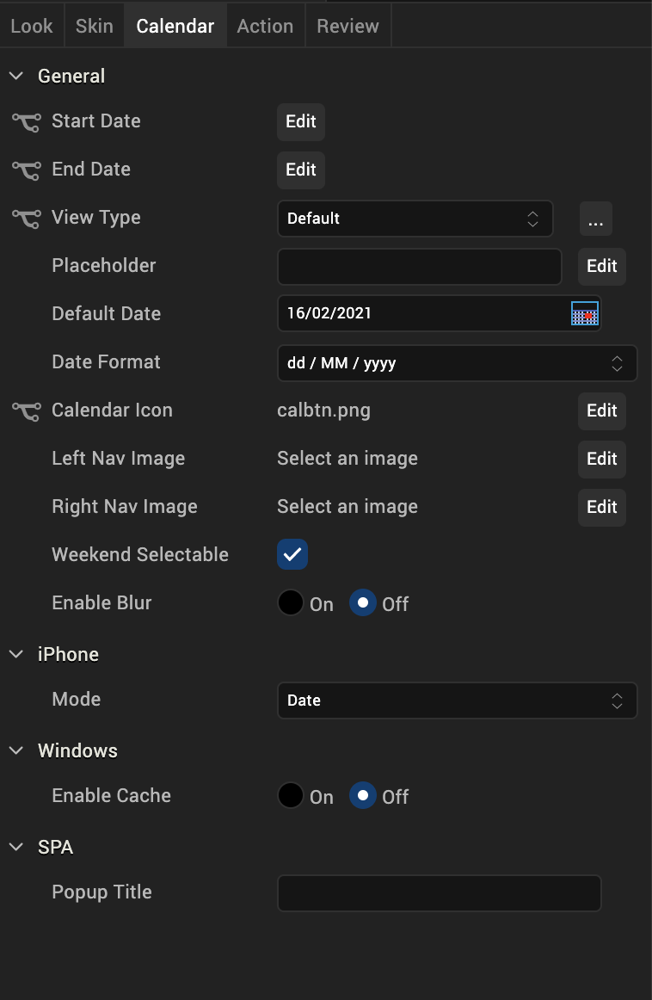
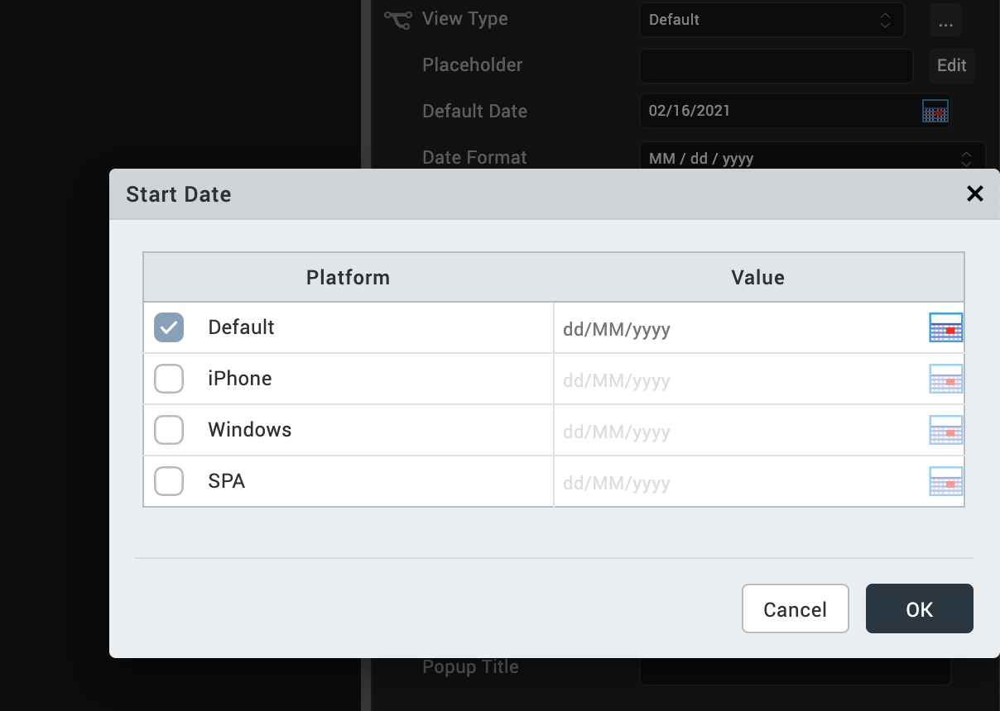
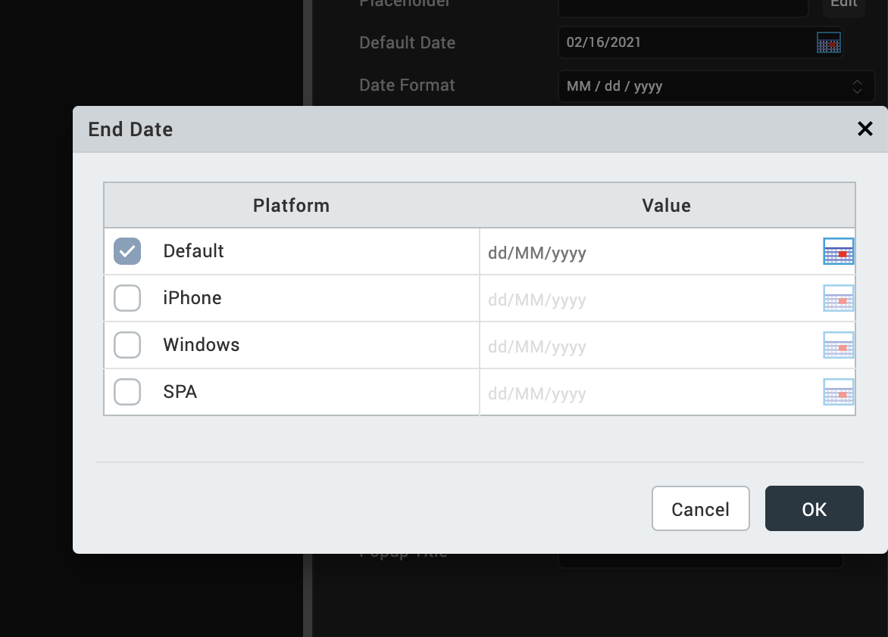
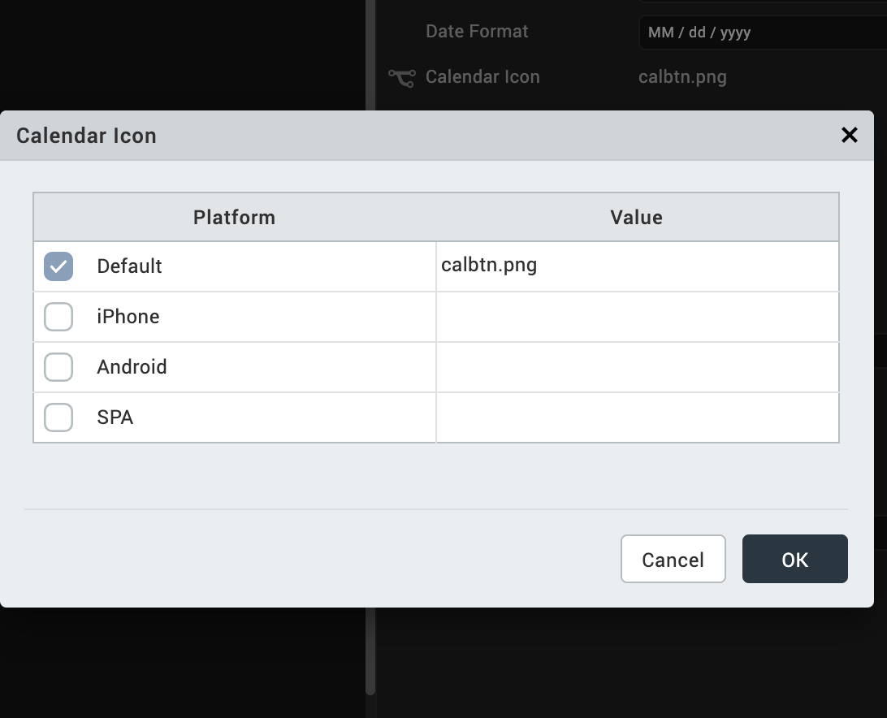

                           

import Calendar
---------------

Use a Calendar widget to display or select a date from a calendar. Click the calendar icon to select a date. The date and the calendar display in the format you specify. The icon does not appear on Mobile Web platforms .

To learn how to use this widget programmatically, refer [VoltMX Iris Widget guide](../../../Iris/iris_widget_prog_guide/Content/Calendar.md).

### Important Considerations

The following are important considerations for a Calendar widget:

*   If you do not specify an image, clicking the calendar icon displays the default calendar image.
    
*   By default, the Calendar widget occupies the complete width of its parent widget.
*   Clicking the calendar icon opens the current month calendar. On the Android platform, it is not possible to restrict the date selection between validStartDate and validEndDate with the native calendar view.

### Look Properties

Look properties define the appearance of the widget. The following are the major properties you can set:

*   Whether the widget is visible.
*   The platforms on which the widget is rendered.
*   How the widget aligns with its parent widget and neighboring widgets.
*   If the widget displays content, where the content appears.

For descriptions of the properties available on the Look tab of the Properties pane, see [Look](Look.md#Flex).

### Skin Properties

Skin properties define a skin for the widget, including background color, borders, and shadows. If the widget includes text, you can also specify the text font.

For a Calendar widget, you can apply a skin and its associated properties for the following states:

> **_Important:_** Custom border capability is now extended to iOS for the Calender widget.

  
| Skin | Definition |
| --- | --- |
| Normal | The default skin of the widget. |
| Focus | The skin applied when the focus is on the widget. |
| Grid | The skin properties applied for the grid calendar. |
| Cell | The skin properties applied for the grid calendar cell. |
| Cell - Selected | The skin applied when a grid calendar cell is selected. |
| Cell - Focus | The skin applied when there is a focus on the grid calendar cell. |
| Cell - Today | The skin applied for the grid calendar today cell. |
| Cell -Weekend | The skin applied for the weekend days of a grid calendar. |
| Cell - Inactive | The skin applied for non-working inactive days of a grid calendar. |
| Done Button | The skin to be applied for Done button that appear on a calendar pop up. |
| Cancel Button | The skin to be applied for a Cancel button that appear on a calendar pop up. |
| Day | The day portion of the currently selected date. |
| Month | The month portion of the currently selected date. |
| Hover Skin | The look and feel of a widget when the cursor hovers over the widget. > **_Note:_** Hover Skin is available only on the Windows (native) Tablet platform. |

For more information about applying skins, see [Understanding Skins and Themes](Customizing_the_Look_and_Feel_with_Skins.md).

### Calendar Properties

Calendar properties specify properties that are available on any platform supported by Volt MX Iris, and assign platform-specific properties.

> **_Note:_** In this section, properties that can be forked are identified by an icon  located to the left of the property. For more information, see [Fork a Widget Property](Forking.md#fork-a-widget-property).

#### Start Date

Specifies the start date in the specified [Data Format](#data-format). The default start date is the current date.

To input a different default start date or to provide a platform-specific start date, click **Edit** to open the **Start Date** dialog box.

The **Default** value is the current date. To change this value, click the calendar icon and select a date from the calendar.

To provide a platform-specific start date, click the desired platform check box, and then click the calendar icon in the corresponding **Value** field. Select a date from the calendar.

#### End Date

Specifies the end date in the specified [Data Format](#data-format). The default end date is the current date.

To input a different default end date or to provide a platform-specific end date, click **Edit** to open the **End Date** dialog box.

The **Default** value is the current date. To change this value, click the calendar icon and select a date from the calendar.

To provide a platform-specific start date, click the desired platform check box, and then click the calendar icon in the corresponding **Value** field. Select a date from the calendar.

#### View Type

Specifies the calendar view type:

*   Default: Specifies the default native calendar view in respective platforms.
*   Onscreen Grid
*   Popup Grid (only SPA platforms supports this option.)

The **View Type** of the widget selected from this list becomes the default for all the platforms. You can provide a platform-specific value for a platform by forking the **View Type** property. See [Fork a Widget Property](Forking.md#fork-a-widget-property) for more details.

#### Default Date

Specifies a default date to be displayed on a Calendar widget. You can choose a date by clicking the calendar icon, and then selecting a date.

This date replaces any Placeholder value.

#### Data Format

Specifies the date format.

**Default**: DD/MM/YYY

Following date formats are supported:

*   DD/MM/YYYY
*   MM/DD/YYYY
*   MM/DD/YY

#### Calendar Icon

Specifies the calendar icon.

Volt MX  Iris provides a default calendar icon. You can replace the default icon or provide a platform-specific icon by clicking the **Edit** button to open the **Calendar Icon** dialog box.

Select the platform and click the **value** field to open the **Select Image** dialog box. You can either select an image in the dialog box or provide an image URL.

#### Left Nav Image

Specifies the left navigation image that appears on the calendar popup. Click this image to navigate and select a past date from the calendar.

To specify an image, click the **Edit** button to open the **Left Nav Image** dialog box. You can either select an image in the dialog box or provide an image URL.

#### Right Nav Image

Specifies the right navigation image that appears on the calendar popup. Click this image to navigate and select a future date from the calendar.

To specifiy an image, click the **Edit** button to open the **Right Nav Image** dialog box. You can either select an image in the dialog box or provide an image URL.

#### Weekend Selectable

Select the check box to enable selection of weekend dates.

#### Mode

Specifies the calendar mode. (iOS only)

Following are the options:

*   Date (Default): Allows selection of a date only.
*   Time: Allows selection of a time only
*   Date & Time: Allows selection of both date and time.

#### Hide Days Header

This property is available only when View Type is set to Onscreen Grid or Popup Grid. It specifies whether the weekdays are hidden on the header of a grid calendar.

*   **On** hides weekdays.
*   **Off** displays weekdays.

> **_Note:_** This property is specific to iOS and Android platforms.

#### Hide Months Header

This property is available only when View Type is set as _Onscreen Grid_ or _Popup Grid_. It indicates whether the months header is hidden for the grid calendar, including the navigation buttons.

*   Click **On** to hide the months header.
*   Click **Off** to display the months header.

> **_Note:_** This property is specific to iOS and Android platforms.

#### Day Text Alignment In Cell

This property is available only when the View Type is set to _Onscreen Grid_ or _Popup Grid_. It specifies the alignment of the text for a Calendar Day cell, regarding its boundaries. The alignment values are:

*   Top-Left: Specifies the text should align at the top left corner of a Calendar Day cell.
*   Top-Center: Specifies the text should align at the top center of a Calendar Day cell.
*   Top-Right: Specifies the text should align at the top right of a Calendar Day cell.
*   Middle-Left: Specifies the text should align at the middle left of a Calendar Day cell.
*   Center: Specifies the text should align at the center of a Calendar Day cell.
*   Middle-Right: Specifies the text should align at the middle right of a Calendar Day cell.
*   Bottom-Left: Specifies the text should align at the bottom left of a Calendar Day cell.
*   Bottom-Center: Specifies the text should align at the bottom center of a Calendar Day cell.
*   Bottom-Right: Specifies the text should align at the bottom right of a Calendar Day cell.

> **_Note:_** This property is specific to iOS and Android platforms.

#### Cell Template

This property is available only when the View Type is set to _Onscreen Grid_ or _Popup Grid_. It specifies the common template to be used for a Calendar Day cell. A template is used only when the data is present for a Calendar Day cell. If the data is not set to a cell, the cell appears with the default look, which has no template.

To assign a template for **cell template**:

1.  Click **Edit** to display the **cellTemplate** window.
2.  From the list of templates, select a template.
3.  Click **OK**.

> **_Note:_** This property is specific to iOS and Android platforms.

#### Data

To modify the **Data** property, you need to assign a grid template to the Cell Template property.

Data represents the actual data to be rendered in each cell.

To specify the data:

1.  Click Edit to display the **Master Data for GridCalendar** window.
2.  From the **Data** column, click the calendar icon.
3.  Select a date.
4.  From the **Template Data** column, click the ellipsis button to display the **Template Data** window and update the data or skin of the widget.
5.  Click **OK**.

> **_Note:_** This property is specific to iOS and Android platforms.

#### Height

This property is available only when View Type is set as _Onscreen Grid_ or _Popup Grid_. It specifies the available height of the container in terms of percentage. The percentage is with reference to the value of [Height Reference](#height-reference) property.

> **_Note:_** This property is specific to the iOS and Android platforms.

#### Height Reference

This property is available only when View Type is set as _Onscreen Grid_ or _Popup Grid_ and when you set the Height property.

The container height percentage is calculated based on the following:

*   Form Reference: The Calendar height is a percentage based on the height of the Form excluding header and footer.
*   Parent Width: Use this option if the Calendar is placed inside a Box. The width is calculated based on the width of the Box.

> **_Note:_** This property is specific to iOS and Android platforms.

#### Popup Title

For the SPA platform, specifies the title text to be displayed on the calendar popup.

#### Tool Tip

For the Windows platform, specifies a message that displays when you hover the mouse pointer over the widget.

### Actions

Actions define what happens when an event occurs. On a Calendar widget, you can run an action when the following event occurs:

*   onSelection: The action is triggered when an item is selected.
*   onTouchStart: The action is triggered when the user touches the touch surface. This event occurs asynchronously.
*   onTouchMove: The action is triggered when the touch moves on the touch surface continuously until movement ends. This event occurs asynchronously.
*   onTouchEnd: The action is triggered when the user touch is released from the touch surface. This event occurs asynchronously.

For more information, see [Add Actions](working_with_Action_Editor.md).

### Placement Inside a Widget

The following table summarizes where a Calendar widget can be placed:

<table style="mc-table-style: url('Resources/TableStyles/Basic.css');" class="TableStyle-Basic" cellspacing="0"><colgroup><col class="TableStyle-Basic-Column-Column1"> <col class="TableStyle-Basic-Column-Column1"></colgroup><tbody><tr class="TableStyle-Basic-Body-Body1"><td class="TableStyle-Basic-BodyE-Column1-Body1">Flex Form</td><td class="TableStyle-Basic-BodyD-Column1-Body1">Yes</td></tr><tr class="TableStyle-Basic-Body-Body1"><td class="TableStyle-Basic-BodyE-Column1-Body1">FlexContainer</td><td class="TableStyle-Basic-BodyD-Column1-Body1">Yes</td></tr><tr class="TableStyle-Basic-Body-Body1"><td class="TableStyle-Basic-BodyE-Column1-Body1">FlexScrollContainer</td><td class="TableStyle-Basic-BodyD-Column1-Body1">Yes</td></tr><tr class="TableStyle-Basic-Body-Body1"><td class="TableStyle-Basic-BodyE-Column1-Body1">ScrollBox</td><td class="TableStyle-Basic-BodyD-Column1-Body1">Horizontal Orientation - Yes Vertical Orientation- Yes</td></tr><tr class="TableStyle-Basic-Body-Body1"><td class="TableStyle-Basic-BodyE-Column1-Body1">Tab</td><td class="TableStyle-Basic-BodyD-Column1-Body1">Yes</td></tr><tr class="TableStyle-Basic-Body-Body1"><td class="TableStyle-Basic-BodyE-Column1-Body1">Segment</td><td class="TableStyle-Basic-BodyD-Column1-Body1">No</td></tr><tr class="TableStyle-Basic-Body-Body1"><td class="TableStyle-Basic-BodyE-Column1-Body1">Popup</td><td class="TableStyle-Basic-BodyD-Column1-Body1">Yes</td></tr><tr class="TableStyle-Basic-Body-Body1"><td class="TableStyle-Basic-BodyB-Column1-Body1">Template&nbsp;</td><td class="TableStyle-Basic-BodyA-Column1-Body1">Header- NoFooter- No</td></tr></tbody></table>

<table style="margin-left: 0;margin-right: auto;mc-table-style: url]('Resources/TableStyles/RevisionTable.css');" class="TableStyle-RevisionTable" cellspacing="0" data-mc-conditions="Default.md5 Only"><colgroup><col class="TableStyle-RevisionTable-Column-Column1" style="width: 26px;"> <col class="TableStyle-RevisionTable-Column-Column1"> <col class="TableStyle-RevisionTable-Column-Column1"></colgroup><tbody><tr class="TableStyle-RevisionTable-Body-Body1"><td class="TableStyle-RevisionTable-BodyE-Column1-Body1" data-mc-conditions="Default.HTML5 Only">Rev</td><td class="TableStyle-RevisionTable-BodyE-Column1-Body1" data-mc-conditions="Default.HTML5 Only">Author</td><td class="TableStyle-RevisionTable-BodyD-Column1-Body1" data-mc-conditions="Default.HTML5 Only">Edits</td></tr><tr class="TableStyle-RevisionTable-Body-Body1"><td class="TableStyle-RevisionTable-BodyE-Column1-Body1" data-mc-conditions="Default.HTML5 Only">8</td><td class="TableStyle-RevisionTable-BodyE-Column1-Body1" data-mc-conditions="Default.HTML5 Only">SHS</td><td class="TableStyle-RevisionTable-BodyD-Column1-Body1" data-mc-conditions="Default.HTML5 Only">SHS</td></tr><tr class="TableStyle-RevisionTable-Body-Body1"><td class="TableStyle-RevisionTable-BodyB-Column1-Body1" data-mc-conditions="Default.HTML5 Only">7.2.1</td><td class="TableStyle-RevisionTable-BodyB-Column1-Body1" data-mc-conditions="Default.HTML5 Only">SHS</td><td class="TableStyle-RevisionTable-BodyA-Column1-Body1" data-mc-conditions="Default.HTML5 Only">SHS</td></tr></tbody></table>
