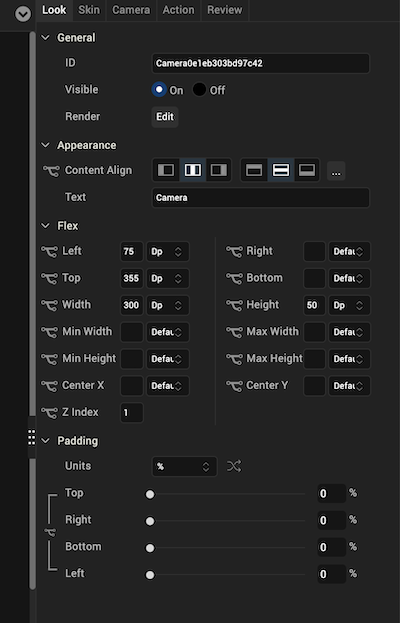
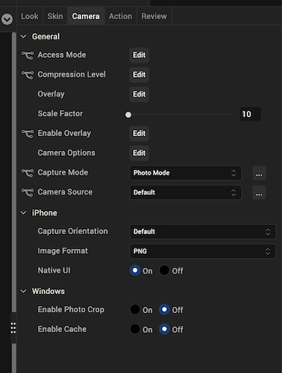
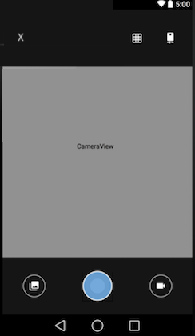
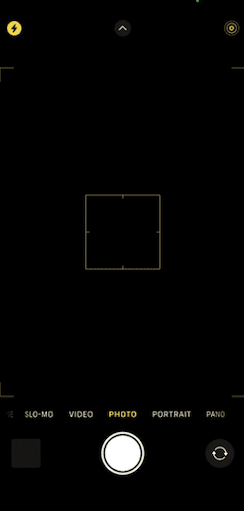

                           

Camera
------

Use a Camera widget to display a button that opens the device's native camera application to capture an image. By default, a saved image is stored as a PNG (Portable Network Graphics) image with the original size.

To learn how to use this widget programmatically, refer [VoltMX Iris Widget guide](../../../Iris/iris_widget_prog_guide/Content/Camera.md).

> **_Note:_** The Camera widget is not supported on SPA platforms.

### Look Properties

Look properties define the appearance of the widget. The following are the major properties you can set:

*   Whether the widget is visible.
*   The platforms on which the widget is rendered.
*   How the widget aligns with its parent widget and neighboring widgets.
*   If the widget displays content, where the content appears.

For descriptions of the properties available on the Look tab of the Properties pane, see [Look](Look.md#Flex).

### Skin Properties

Skin properties define a skin for the widget, including background color, borders, and shadows. If the widget includes text, you can also specify the text font.

For the Camera widget, you can apply a skin and its associated properties for the following states:

  
| Skin | Definition |
| --- | --- |
| Normal | The default skin of the widget. |
| Focus | The skin applied when the widget has the focus. |
| Hover Skin | The look and feel of the widget when the cursor hovers over it. > **_Note:_** Hover skins are available only on the Windows (native) Tablet platform. |

For more information about applying skins, see [Understanding Skins and Themes](Customizing_the_Look_and_Feel_with_Skins.md).

### Camera Properties

Camera properties specify properties that are available on any platform supported by Volt MX Iris, and assign platform-specific properties.

> **_Note:_** In this section, the properties that can be forked are identified by an icon  located to the left of the property. For more information, see [Fork a Widget Property](Forking.md#fork-a-widget-property).

#### Access Mode

Specifies how the captured image is stored.

Following are the options:

*   Public: The captured image is stored on the device and is accessible to all the applications on the device. For example, the captured images are accessible in ImageGallery.
*   Private: This is the default option for Windows. The captured image is stored on the device but is not accessible to any other application on the device and remains private to the application.
*   In-Memory: The captured camera image is stored in memory and is never written to disk. Captured images are lost when the application closes.

To specify the access mode, click the **Edit** button to open the **Access Mode** dialog box. To change the default access mode, select Default and then select an access mode from the value list. To specify a platform-specific access mode, select the platform and then select an access mode from the list.

#### Compression Level

For JPEG images, specifies the compression level with which a captured image is stored. The compression level determines picture quality. You can specify a compression level value between 0 (best picture quality) and 100 (low picture quality).

Default: 0

To specify the compression level, click **Edit** to open the **Compression Level** dialog box. To change the default compression level, select Default and then select a compression level from the value list. To specify a platform-specific compression level, select the platform and then select a compression level from the list.

#### Overlay - Photo Mode

Applicable when the capture mode is photo mode.

Specifies the overlay configuration parameters for overlaying a form.

The following are the configurable properties available for various platforms:

**iOS**

*   Overlay Form : Specifies the reference of the form to be rendered over the camera view. When this option is set, the [Capture Orientation](#capture-orientation) property is not respected.
    
    Default : None
    
*   Cropping Reference Image : Specifies the reference of the Image widget in the Overlay Form which guides the camera to crop the captured image to the Reference Image Dimensions.
    
    Default : None
    

Android

*   Overlay Form : Specifies the reference of the form to be rendered over the camera view. When this option is set, the [Capture Orientation](#capture-orientation) property is not respected.
    
    Default : None
    
*   Cropping Reference Image : Specifies the reference of the Image widget in the Overlay Form which guides the camera to crop the captured image to the Reference Image Dimensions.
    
    Default : None
    

*   Capture Button Skin : Specifies the skin for a captured button.
*   Capture Button Text : Specifies the text for a captured button.
*   Tap Anywhere: Specifies to capture an image with a tap on the camera overlay view.
    
    Default : false
    

**Windows 8**

*   Overlay Form : Specifies the reference of the form to be rendered over the camera view. When this option is set, the [Capture Orientation](#capture-orientation) property is not respected.
    
    Default : None
    

*   Cropping Reference Image : Specifies the reference of the Image widget in the Overlay Form which guides the camera to crop the captured image to the Reference Image Dimensions.
    
    Default : None
    

*   Tap Anywhere: Specifies to capture an image with a tap on the camera overlay view.
    
    Default : false
    

#### Overlay - Video Mode

Applicable when the capture mode is video mode.

Specifies the overlay configuration parameters for overlaying a form.

The following are the configurable properties available for various platforms:

**iOS**

*   Overlay Form : Specifies the reference of the form to be rendered over the camera view.
    
    Default : None
    
*   Start Button Text: Specifies the text on the start button for the camera. You can enter text here.
*   Stop Button Text: Specifies the text on the stop button for the camera. You can enter text here.
*   Start Button Skin: Specifies the skin on the start button for the camera. Default is none. You can select a skin from the drop-down list.
*   Stop Button Skin: Specifies the skin on the stop button for the camera. Default is none. You can select a skin from the drop-down list.
*   Timer Control Skin: Specifies the skin on time controller for the camera. Default is none. You can select a skin from the drop-down list.

Android

*   Overlay Form : Specifies the reference of the form to be rendered over the camera view. When this option is set, the [Capture Orientation](#capture-orientation) property is not respected.
    
    Default : None
    

*   Start Button Text: Specifies the text on the start button for the camera. You can enter text here.
*   Stop Button Text: Specifies the text on the stop button for the camera. You can enter text here.
*   Start Button Skin: Specifies the skin on the start button for the camera. Default is none. You can select a skin from the drop-down list.
*   Stop Button Skin: Specifies the skin on the stop button for the camera. Default is none. You can select a skin from the drop-down list.
*   Timer Control Skin: Specifies the skin on time controller for the camera. Default is none. You can select a skin from the drop-down list.

**Windows 8**

*   Overlay Form : Specifies the reference of the form to be rendered over the camera view. When this option is set, the [Capture Orientation](#capture-orientation) property is not respected.
    
    Default : None
    

*   Cropping Reference Image : Specifies the reference of the Image widget in the Overlay Form which guides the camera to crop the captured image to the Reference Image Dimensions.
    
    Default : None
    

*   Tap Anywhere: Specifies to capture an image with a tap on the camera overlay view.
    
    Default : false
    

#### Scale Factor

Specifies the ratio by which a captured image is scaled down. You can specify a scale factor between 10 percent of the captured image and 100 percent (no reduction).

#### Enable Overlay

Specifies whether to enable overlay of a form interface over the camera view.

Default: Disabled.

To specify the **Enable Overlay** property, click **Edit** to display the **Enable Overlay** dialog box. To change the default Enable Overlay setting, select Default and then select a value from the list. To specify a platform-specific Enable Overlay setting, select the platform and then select a value from the list.

#### Capture Mode

Specifies the capture mode of the camera. You can select Photo Mode or Video Mode.

#### Camera Source

Specifies the camera source, either Default, Rear, or Front.

#### Video Duration

When Capture Mode is set to Video Mode, specifies the duration of the video in seconds.

#### Capture Orientation

For the iOS platform, specifies the orientation of the captured image, either Default, Landscape, or Portrait.

Default: Default

#### Image Format

For the iOS platform, specifies whether the image is saved as a PNG (Portable Network Graphics) or a JPEG (Joint Photographic Experts Group) image.

Default: PNG

#### Native UI

For the iOS platform, specifies whether the camera uses the native interface with the default platform controls for the camera, or a user interface with custom options.

Default: On (the camera uses the native interface)

#### Video Format

For the iOS platform when Capture Mode is set to Video Mode, specifies whether the video is saved in Mp4 or MOV format.

Default: MP4

#### Video Stabilization

For the Android platform, specifies whether video stabilization is enabled.

Default: Off (video stabilization is disabled)

#### Enable Photo Crop

For the Windows platform, specifies whether the captured image can be cropped.

Default: Off (photo crop is disabled)

#### Tool Tip

For the Windows Tablet platform, specifies a message that displays when you hover the mouse pointer over the widget.

### Actions

Actions define what happens when an event occurs. On a Camera widget, you can run an action when the following events occur:

*   onCapture: The action is triggered when the user captures a picture.
*   onTouchStart: The action is triggered when the user touches the touch surface. This event occurs asynchronously.
*   onTouchMove: The action is triggered when the touch moves on the touch surface continuously until movement ends. This event occurs asynchronously.
*   onTouchEnd: The action is triggered when the user touch is released from the touch surface. This event occurs asynchronously.
*   onFailure: The action is triggered when an error occurs using a Camera widget. For example, you set a camera source but it is not available on the device (iOS and Android).

For more information, see [Add Actions](working_with_Action_Editor.md).

### Placement inside a Widget

The following table summarizes where a Camera widget can be placed:

<table style="mc-table-style: url('Resources/TableStyles/Basic.css');" class="TableStyle-Basic" cellspacing="0"><colgroup><col class="TableStyle-Basic-Column-Column1"> <col class="TableStyle-Basic-Column-Column1"></colgroup><tbody><tr class="TableStyle-Basic-Body-Body1"><td class="TableStyle-Basic-BodyE-Column1-Body1">Form</td><td class="TableStyle-Basic-BodyD-Column1-Body1">Yes</td></tr><tr class="TableStyle-Basic-Body-Body1"><td class="TableStyle-Basic-BodyE-Column1-Body1">ScrollBox</td><td class="TableStyle-Basic-BodyD-Column1-Body1">Horizontal Orientation -YesVertical Orientation- Yes</td></tr><tr class="TableStyle-Basic-Body-Body1"><td class="TableStyle-Basic-BodyE-Column1-Body1">Tab</td><td class="TableStyle-Basic-BodyD-Column1-Body1">Yes</td></tr><tr class="TableStyle-Basic-Body-Body1"><td class="TableStyle-Basic-BodyE-Column1-Body1">FlexContainer</td><td class="TableStyle-Basic-BodyD-Column1-Body1">Yes</td></tr><tr class="TableStyle-Basic-Body-Body1"><td class="TableStyle-Basic-BodyE-Column1-Body1">FlexScrollContainer</td><td class="TableStyle-Basic-BodyD-Column1-Body1">Yes</td></tr><tr class="TableStyle-Basic-Body-Body1"><td class="TableStyle-Basic-BodyE-Column1-Body1">Segment</td><td class="TableStyle-Basic-BodyD-Column1-Body1">No</td></tr><tr class="TableStyle-Basic-Body-Body1"><td class="TableStyle-Basic-BodyE-Column1-Body1">Popup</td><td class="TableStyle-Basic-BodyD-Column1-Body1">Yes</td></tr><tr class="TableStyle-Basic-Body-Body1"><td class="TableStyle-Basic-BodyB-Column1-Body1">Template&nbsp;</td><td class="TableStyle-Basic-BodyA-Column1-Body1">Header- NoFooter- No</td></tr></tbody></table>

### Widget Appearance on Platforms

The appearance of the Camera widget varies as follows:

  
| Platform | Appearance |
| --- | --- |
| Android |  |
| iOS |  |

