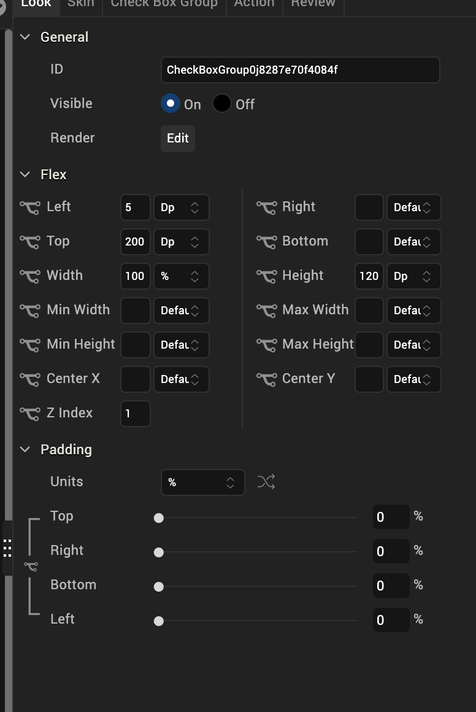
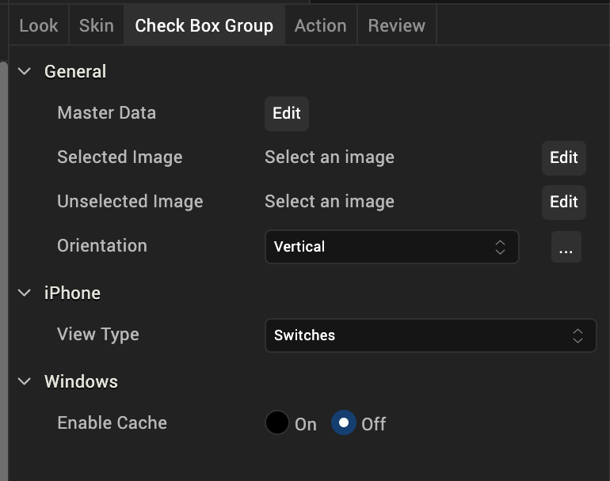
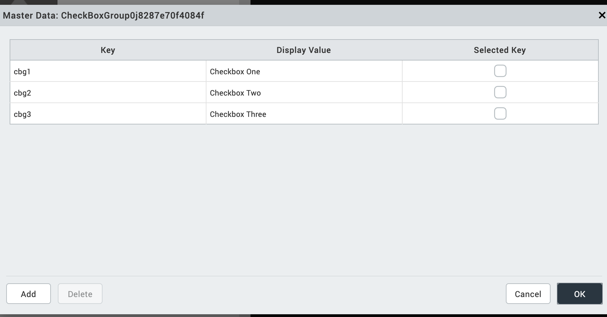
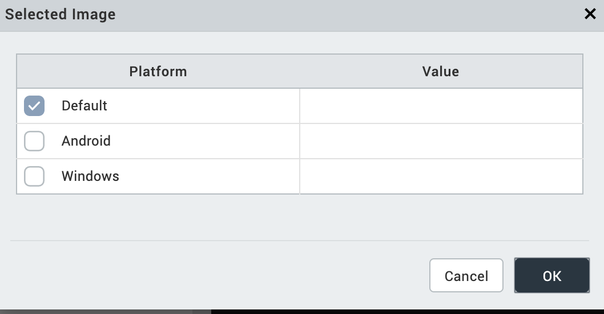
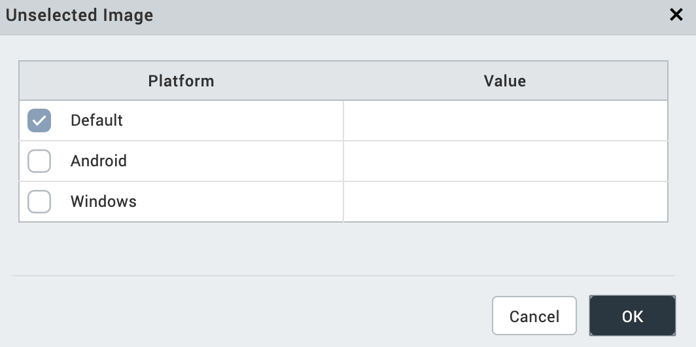

                           

CheckBoxGroup
-------------

Use a CheckBoxGroup widget to select from a group of check boxes when a user can make one or more selections. A check mark inside the check box indicates the selection.

To learn how to use this widget programmatically, refer [VoltMX Iris Widget guide](../../../Iris/iris_widget_prog_guide/Content/CheckBox.md).

### Important Considerations

The following are important considerations for a CheckBoxGroup Widget.

#### All Platforms

*   A CheckBoxGroup widget is always a group widget.
*   Use a CheckBoxGroup widget if there are a limited number of possible selections and you can make more than one selection. If you can make only one selection from the group, use a [RadioButtonGroup](RadioButtonGroup.md) widget. To display a list of selections, use a [ListBox](ListBox.md) widget.

#### Android

*   If you set the [Orientation](#orientation) property to horizontal, do not place more than two items in the group. If you place more than two items and the associated text is large, additional items may not fit in the screen width and will not be visible.

#### iPhone

*   You cannot apply skins in the on-off switch view.

#### SPA

*   The Focus skin is not supported.

### Look Properties

Look properties define the appearance of the widget. The following are the major properties you can set:

*   Whether the widget is visible.
*   The platforms on which the widget is rendered.
*   How the widget aligns with its parent widget and neighboring widgets.
*   If the widget displays content, where the content appears.

For descriptions of the properties available on the Look tab of the Properties pane, see [Look](Look.md#Flex).

### Skin Properties

Skin properties define a skin for the widget, including background color, borders, and shadows. If the widget includes text, you can also specify the text font.

For a CheckBoxGroup widget, you can apply a skin and its associated properties for the following states:

  
| Skin | Definition |
| --- | --- |
| Normal | The default skin of the widget. |
| Focus | The skin applied when the focus is on the widget. |

For more information about applying skins, see [Understanding Skins and Themes](Customizing_the_Look_and_Feel_with_Skins.md).

### CheckBoxGroup Properties

CheckBoxGroup properties specify properties that are available on any platform supported by Volt MX Iris, and assign platform-specific properties.

#### Master Data

Specifies the set of values that must be displayed for the user to make a selection from the available choices.

To specify this set of values, click the **Edit** button of the **Master Data** field to open the **Master Data** dialog box.

The Master Data dialog box contains the following columns:

*   Key: The unique identifier of each check box.
*   Display Value: The label or descriptive text displayed for each check box
*   Selected Key: Whether each check box is selected by default. You can select more than one check box.

To add more check boxes to the widget, click **Add**. To delete a check box, click inside a check box, and then click **Delete**.

Click **Apply** to create the master data.

#### Selected Image

Specifies the image to be displayed when you make a selection.

To provide a default or platform-specific image, click the **Edit** button to open the **Selected Image** dialog box.

To provide a platform-specific image or replace the default image, select the platform and click inside the corresponding **Value** field to open the **Selected Image** dialog box. You can either:

*   Select an available image.
*   Provide an image URL.

#### Unselected Image

Specifies the image to be displayed when a selection is cleared.

To provide a default or platform-specific image, click the **Edit** button to open the **Unselected Image** dialog box.

To provide a platform-specific image or replace the default image, select the platform and click inside the corresponding **Value** field to open the **Selected Image** dialog box. You can either:

*   Select an available image.
*   Provide an image URL.

#### Orientation

Specifies whether the alignment of the check boxes is horizontal or vertical.

Default: Vertical

#### View Type

For the iOS platform, specifies the view type of the CheckBoxGroup, either Switches, Table, or On-screen Wheel.

Default: Switches

#### Group Cells

When the view type is **Table**, specifies whether the Group Cells style is applied. The Group Cells style groups items in the check box group.

Default: The Group Cells style is applied.

#### Tool Tip

For the Windows Tablet platform, specifies a message that displays when you hover the mouse pointer over the widget .

### Actions

Actions define what happens when an event occurs. On a CheckBoxGroup widget, you can run an action when the following event occurs:

*   onSelection: The action is triggered when an item is selected.
*   onTouchStart: The action is triggered when the user touches the touch surface. This event occurs asynchronously.
*   onTouchMove: The action is triggered when the touch moves on the touch surface continuously until movement ends. This event occurs asynchronously.
*   onTouchEnd: The action is triggered when the user touch is released from the touch surface. This event occurs asynchronously.

For more information, see [Add Actions](working_with_Action_Editor.md).

### Placement Inside a Widget

The following table summarizes where a CheckBoxGroup widget can be placed:

<table style="mc-table-style: url('Resources/TableStyles/Basic.css');" class="TableStyle-Basic" cellspacing="0"><colgroup><col class="TableStyle-Basic-Column-Column1"> <col class="TableStyle-Basic-Column-Column1"></colgroup><tbody><tr class="TableStyle-Basic-Body-Body1"><td class="TableStyle-Basic-BodyE-Column1-Body1">Flex Form</td><td class="TableStyle-Basic-BodyD-Column1-Body1">Yes</td></tr><tr class="TableStyle-Basic-Body-Body1"><td class="TableStyle-Basic-BodyE-Column1-Body1">VBox Form</td><td class="TableStyle-Basic-BodyD-Column1-Body1">Yes</td></tr><tr class="TableStyle-Basic-Body-Body1"><td class="TableStyle-Basic-BodyE-Column1-Body1">FlexContainer</td><td class="TableStyle-Basic-BodyD-Column1-Body1">Yes</td></tr><tr class="TableStyle-Basic-Body-Body1"><td class="TableStyle-Basic-BodyE-Column1-Body1">FlexScrollContainer</td><td class="TableStyle-Basic-BodyD-Column1-Body1">Yes</td></tr><tr class="TableStyle-Basic-Body-Body1"><td class="TableStyle-Basic-BodyE-Column1-Body1">ScrollBox</td><td class="TableStyle-Basic-BodyD-Column1-Body1">Horizontal Orientation - YesVertical Orientation- Yes</td></tr><tr class="TableStyle-Basic-Body-Body1"><td class="TableStyle-Basic-BodyE-Column1-Body1">Tab</td><td class="TableStyle-Basic-BodyD-Column1-Body1">Yes</td></tr><tr class="TableStyle-Basic-Body-Body1"><td class="TableStyle-Basic-BodyE-Column1-Body1">Segment</td><td class="TableStyle-Basic-BodyD-Column1-Body1">No</td></tr><tr class="TableStyle-Basic-Body-Body1"><td class="TableStyle-Basic-BodyE-Column1-Body1">Popup</td><td class="TableStyle-Basic-BodyD-Column1-Body1">Yes</td></tr><tr class="TableStyle-Basic-Body-Body1"><td class="TableStyle-Basic-BodyB-Column1-Body1">Template&nbsp;</td><td class="TableStyle-Basic-BodyA-Column1-Body1">Header- NoFooter- No</td></tr></tbody></table>

<table style="margin-left: 0;margin-right: auto;mc-table-style: url]('Resources/TableStyles/RevisionTable.css');" class="TableStyle-RevisionTable" cellspacing="0" data-mc-conditions="Default.md5 Only"><colgroup><col class="TableStyle-RevisionTable-Column-Column1" style="width: 26px;"> <col class="TableStyle-RevisionTable-Column-Column1"> <col class="TableStyle-RevisionTable-Column-Column1"></colgroup><tbody><tr class="TableStyle-RevisionTable-Body-Body1"><td class="TableStyle-RevisionTable-BodyE-Column1-Body1" data-mc-conditions="Default.HTML5 Only">Rev</td><td class="TableStyle-RevisionTable-BodyE-Column1-Body1" data-mc-conditions="Default.HTML5 Only">Author</td><td class="TableStyle-RevisionTable-BodyD-Column1-Body1" data-mc-conditions="Default.HTML5 Only">Edits</td></tr><tr class="TableStyle-RevisionTable-Body-Body1"><td class="TableStyle-RevisionTable-BodyE-Column1-Body1" data-mc-conditions="Default.HTML5 Only">8</td><td class="TableStyle-RevisionTable-BodyE-Column1-Body1" data-mc-conditions="Default.HTML5 Only">SHS</td><td class="TableStyle-RevisionTable-BodyD-Column1-Body1" data-mc-conditions="Default.HTML5 Only">SHS</td></tr><tr class="TableStyle-RevisionTable-Body-Body1"><td class="TableStyle-RevisionTable-BodyB-Column1-Body1" data-mc-conditions="Default.HTML5 Only">7.2.1</td><td class="TableStyle-RevisionTable-BodyB-Column1-Body1" data-mc-conditions="Default.HTML5 Only">SHS</td><td class="TableStyle-RevisionTable-BodyA-Column1-Body1" data-mc-conditions="Default.HTML5 Only">SHS</td></tr></tbody></table>
