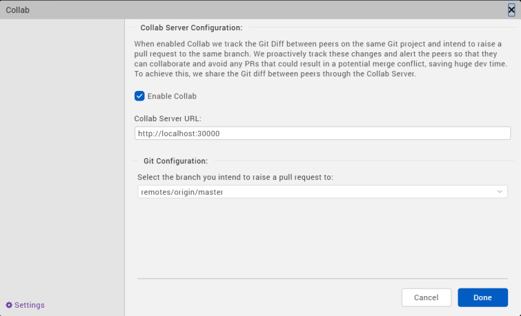
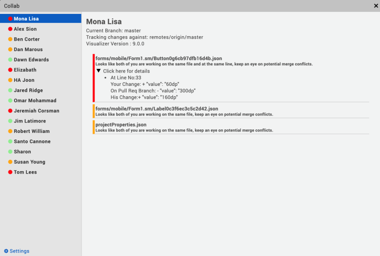

                          

Collab
======

Developing applications using Volt MX Iris, as in the case of developing any software, involves collaborating with other developers. While collaboration accelerates app development, improves efficiency, and saves time; it brings its own set of issues. One of the main issues is code merge conflicts.

Volt MX  Iris V9 introduces a new feature, Collab, which enables you to coordinate with the developers working on a single Volt MX Iris project while using Git as the collaboration tool.

Collab tracks the activity of developers working on the same project and displays alert messages if multiple developers work on a single file. The Collab window highlights merge conflicts that may occur when code is pushed to a remote project in the GIT repository.

There are three stages involved in the process of installing and configuring Collab:

*   [Download and Start the Collab Server](#download-and-start-collab-server) – One-time activity usually performed by an admin in an organization.
*   [Install and configure Git](#install-and-configure-git) – One-time activity performed by all the developers in a project.
*   [Add a Iris project on GIT and collaborate](#add-a-iris-project-on-git-and-collaborate) – Pushing a Iris project on Git is a one-time activity and is usually done by the project lead. The developers then clone the project and collaborate to work on their local projects.

Download and Start Collab Server
--------------------------------

The first step in making Collab work is to download the Collab server. The administrator in an organization must download the Collab server and share the server’s address with developers working on a project. All the developers working on the project must connect to the server.

### Download and Configure Collab Server

In the Collab Server, you can configure the sever security to Http or Https. Follow the steps respective to the Server protocol you want to configure, to download and install the Collab Server.

#### Http Sever protocol

Follow these steps to download and configure the Collab Server:

1.  Download the Collab server from [here](https://github.com/HCL-TECH-SOFTWARE/volt-mx-docs/raw/master/voltmxlibrary/iris/zip/user_guide/CollabServer_Win.zip).   
    The installer is downloaded as a zip file to your computer.  
    
2.  Extract the contents of the zip file.
3.  Navigate to the folder specific to the OS you are using and open the **collabConfig.json** file with a text editor.
    1.  On a Windows machine, navigate to the **CollabServer** > **CollabServer\_WIN** > **collabConfig** > **collabConfig.json** file.
    2.  On a Mac machine, navigate to the **CollabServer** > **CollabServer\_MACOS** > **collabConfig** > **collabConfig.json** file.
4.  In the **collabConfig.json** file, configure the **Port** key to an available port number on the server.
5.  Save and close the file.

#### Https Sever protocol

Follow these steps to download and configure the Collab Server:

1.  Download the Collab server from [here](https://github.com/HCL-TECH-SOFTWARE/volt-mx-docs/raw/master/voltmxlibrary/iris/zip/user_guide/CollabServer_Win.zip).
    The installer is downloaded as a zip file to your computer.  

2.  Extract the contents of the zip file.  
    

    > **_Note:_** Ensure you have your HTTPS server key and server certificate with you.  

3.  Place your HTTPS server key and server certificate in the collabConfig (specific to the OS you are using) folder.
    1.  On a Windows machine, navigate to the **CollabServer** > **CollabServer\_WIN** > **collabConfig**
    2.  On a Mac machine, navigate to the **CollabServer** > **CollabServer\_MACOS** > **collabConfig**
4.  Navigate to the folder specific to the OS you are using and open the **collabConfig.json** file with a text editor.
    
    1.  On a Windows machine, navigate to the **CollabServer** > **CollabServer\_WIN** > **collabConfig** > **collabConfig.json** file.
    2.  On a Mac machine, navigate to the **CollabServer** > **CollabServer\_MACOS** > **collabConfig** > **collabConfig.json** file.
    
5.  In the **CollabConfig.json** file, configure the **Server\_protocol** key to **Https**.
6.  Enter the server key and the server certificate file names for the **Server\_key** and **Server\_cert** keys respectively.
7.  Configure the **Port** key to an available port number on the server. By default, the Port key is set to 30000.
    
8.  Save and close the file.
    

### Run the Collab Server

Once you have configured the Collab server, you must start the server. The process of starting the server varies depending on the OS you are using. For instructions on the Windows machine, click here. For information on Mac machine, click here.

#### Run the Collab Server on a Windows Machine

To run the Collab server on a Windows machine, follow these steps:

1.  From the file explorer, navigate to the location where the Server is downloaded.
2.  Navigate to **CollabServer** > **CollabServer\_WIN**
3.  Double-click the **CollabServer.exe** file.  
    A terminal opens, and the server starts running.

> **_Note:_** Close the terminal to stop the server.  

#### Run the Collab Server on a Mac Machine

To run the Collab server on a Windows machine, follow these steps:

1.  Navigate to the location where the Collab Server is downloaded.
2.  Copy the **CollabServer** folder.
3.  From the main menu, navigate to **Go** > **Home**.
4.  Paste the **CollabServer** folder in the Home directory.
5.  Navigate to **CollabServer** > **CollabServer\_MACOS**.
6.  Double-click on the **CollabServer** file.  
    A terminal opens, and the server starts running.  
    

Your Collab server is now installed and configured. You can now start associating the server with the Iris project in your GIT repository.

Install and Configure Git
-------------------------

To install and configure Git for the first time, follow these steps:

> **_Note:_** Skip these steps if you already have GIT installed and configured.

1.  Download and install Git from here.  
    Ensure you have an account in Git. Create an account if you do not have one already.  
    
2.  Open the terminal.
3.  Enter the following command to configure your username:

     git config --global user.name "UserName"

4.  Enter the following command to configure your email address:

git config --global user.email "emailID"

Your email address is now associated with the local commits you make to a project.

Add a Iris project on Git and Collaborate
-----------------------------------------------

Once Git is installed and configured on your system, you can add the project to a repository in Git. The project lead creates a repository in Git and adds a Iris project to the repository. The developers working on this project can then clone the project and push the changes to the remote project in the repository.

### Create a New Repository in Git

Ensure you have created a new repository in Git. For more information on how to create a repository, refer to [Github documentation](https://help.github.com/en/github/getting-started-with-github/create-a-repo).

### Add Iris Project to Git Repository

Once a repository is created in your Git account, you can now add a Iris project to the repository.

To add an existing Iris project to the repository, follow these steps:

1.  Open the Iris project.
2.  In the **Terminal** tab of Volt MX Iris, enter the following commands to push the code to your repository:
    
    cd <project name> git init git add –all git commit -m “Initial Commit” git remote add origin <web URL to where you want to raise a pull request> git push -u origin master
    
    The project files are uploaded to the specified Git repository.
    

### Clone the Iris project from the Repository

Once the Iris project is added to a repository in Git, developers working on the project can clone the project from the repository and work on a local version of the project.

To clone an existing project from a repository, follow these steps:

1.  Open the Iris project.
2.  In the **Terminal** tab of Volt MX Iris, enter the following commands:

    pwd //opens current working directory is the workspace git clone <URL of the project in the repository>

3.  From the main menu, navigate to **Project** > **Open**, and click **Refresh**.
4.  Navigate to **Project** > **Open** > **VoltMX Iris Reference Architecture**/**Free Form JavaScript**.
5.  You will see the cloned project in the list of projects that appears.
6.  Select the project that you have downloaded.  
    The cloned project opens.  
    The developers can further work on the local project and push the changes to the remote project in Git repository.  
    

Using Collab
------------

Once the Git and the Collab Server are setup, you must configure the Collab settings in Iris to start using Collab.

### Configure the Collab Settings in Iris

Before you get started with using the Collab feature, you must configure the Collab Server to connect to the remote project that is hosted on the Git repository.

To configure the Collab settings in Volt MX Iris, follow these steps:

1.  In Iris, from the **Project** menu, go to **Window** > **Collab**.  
    The **Collab** window appears.  
    
    
    
      
    
2.  In the **Collab Server Configuration** section, enter the local address where the Collab server is installed. The format of the server URL is `https://<IP address of the machine on which the server is installed>:<port number>`
3.  Select the **Enable Collab** check box.
4.  In the **Git Configuration** section, select the remote branch to which you want to raise a pull request.

You have successfully configured the Collab settings in Iris.

Interact with Collab
--------------------

After configuring all the required settings, and developers start working on their projects, Collab starts tracking the changes that developers make to their local projects.

Collab detects potential conflicts among developers that push their code to the same branch in a Git repository and displays an alert on the screen.

To view more details about the possible merge conflicts, follow these steps:

1.  In Iris, from the **Project** menu, go to **Window** > **Collab**.  
    The **Collab** window appears.  
    
    
    
    The left panel of the window displays the list of developers working on the same project and the risk of causing a merge conflict.
    
    A merge conflict can occur when a developer pushes the code to the same branch in the Git repository that you have been working on. The magnitude of the risk that can cause a merge conflict is represented based on the color of the badge:
    
    *   **Red:** There is at least one file that can cause merge conflict while pushing the changes into remote repository in Git.
    *   **Yellow:** There is at least one file in common that is edited by both developers, but there are no possible merge conflicts in it.
    *   **Green:** There are no files in common that are edited by both the developers.
    
    The right panel displays the possible merger conflicts with the selected developer. The color of each potential conflict is represents the following:
    
    *   **Red:** Multiple developers are working on the same line in a project file. This will result in a merge conflict when the code is pushed to the repository.
    *   **Yellow:** When multiple developers work on the same file in a project but on different lines in the file. This might create a merge conflict when the code is pushed to the repository.
    *   **Green:** When multiple developers work on the same project but on different files or forms. This will not result in a merge conflict when the code is pushed to the repository.
    
      
    
2.  Click on a potential conflict to view more details about the conflict.

You can now coordinate with other developers to avoid merge conflicts.
