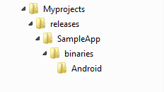

# Perform a Headless Build

A headless build is a method of building and publishing an app without launching the Eclipse environment that hosts Volt MX Iris. Instead, **[Ant](#, "An open-source software tool developed by the Apache Software Foundation that automates software build processes.")** manages the build and publish process.

Conducting headless builds has a number of advantages.

- A developer does not have to open Volt MX Iris to build the application. This helps to integrate the compilation and building of Volt MX Iris projects with continuous build and integration tools like Cruise Control, Maven, and Hudson.
- A non-developer can handle release management.
- You can specify the binaries to be copied to a specific location of your choice, which reducing the manual effort of copying the files to a specific location.
- You can easily deploy an application to multiple servers.
- You can build the applications for multiple platforms with a single command.
- You can build applications with binaries protected mode enabled.  
  You will need to configure few other settings for this to work. See [Application Security](ApplicationSecurity.md) for more information.

Running a headless build involves the following tasks:

1.  [Prerequisites for a Headless Build](#prerequisites)
2.  [Configure the HeadlessBuild.properties File](#configure-the-headlessbuild-properties-file)
3.  [Configure the HeadlessBuild-Global.properties File](#configure-the-headlessbuild-global-properties-file)
4.  [Increase Heap Memory](#increase-heap-memory)
5.  [Build the Application](#ConductTheBuild)

> **_Note:_** Before using conducting a headless build, ensure you have the files mentioned in [Prerequisites](Prerequisite.md)

For headless builds, the following two files are required:

- HeadlessBuild.properties
- HeadlessBuild-Global.properties

Most of the effort in preparing a headless build involves configuring these files. Ant gives you the flexibility to build an app or publish it. The decision of building or publishing is configured using Modes. The modes are:

- **Mode 0** - The application is built, and all the binaries are generated.
- **Mode 1** - The application is published on Volt MX Foundry.
- **Mode 2** - Application will be built for selected build platforms and Foundry app publish will be performed, Binary upload conditional on "web.binary.upload" flag".
- **Mode 3** - This mode generates a web archive file that is combined with the Volt MX Foundry archive and also generates either a `.war` or `.ear` file, depending on what you specify. You must manually deploy the app on the server, or use a separate script.
- **Mode 4.** A combination of modes 0 and 3. The application is built and a web archive file that is combined with the Volt MX Foundry archive also is generated, along with either a `.war` or `.ear` file, depending on what you specify. You must manually deploy the app on the server, or use a separate script.

### Prerequisites

Following are the prerequisites for doing headless build:

- Before doing headless builds, you have to do a blank publish to Volt MX Foundry to use services in your app. Building the application is not required in this case.
- Volt MX Iris is installed on your computer.
- Headless builds are supported only on Volt MX Studio 4.1 plug-ins and above.
- Ensure that there is no space in the file or folder names, and in the parents folder name.
- If you are doing headless builds for iPhone or iPad, ensure that the Xcode in the Mac machine is available in the `/Applications` directory instead of the `/Developers` directory. To change the directory, use the command. `xcode-select`.
- For iOS, make sure to obtain a 10-digit development team identifier from Apple. The Team ID can be found in the Membership Details of your Apple Developer account.

  
Note: The Team ID must not include spaces. Otherwise, the IPA generation in Volt MX Iris fails.

### Configure the HeadlessBuild.properties File

The following sections explain where to find the `HeadlessBuild.properties` file and how to configure it. Depending on what mode you are building (either 0, 1, 2, 3, or 4), you need to set particular values in the `HeadlessBuild.properties` file. These are detailed in [Configure the Mode](#configure-the-mode).

1.  [How to Find the HeadlessBuild.properties File](#how-to-find-the-headlessbuild-properties-file)
2.  [Configure the Mode](#configure-the-mode)

##### How to Find the HeadlessBuild.properties File

The file `HeadlessBuild.properties` is stored in the project folder of your workspace. For example, if the name of your project is HelloWorld, and the name of your workspace folder is `Workspace`, the path in Microsoft Windows will be:

`C:\Users\<username>\Workspace\HelloWorld`

##### Example of HeadlessBuild.properties file

Following is an example of sections that are present in the `HeadlessBuild.properties` file and the values that can be used.

> **_Important:_** If the values for any variables are left blank, then the values set through Volt MX Iris will be retained while building the application.

```
#Note: Please escape '\' with '\\' in all file paths#
#This file represents the Application level properties used by headless build.
project.name=CIBuildProject

#mode 0-Build; 1-Publish; 2-Build & Publish; 3-Combine Web Application+Kony Server Archive; 4-Build & Combine Web Application+Kony Server Archive;
#mode-0: Application will be built for the selected build platforms
#mode-1: Foundry app will be published along with services and web archive.
#mode-2: Application will be built for selected build platforms Foundry app publish will be performed, Binary upload conditional on "web.binary.upload" flag
#mode-3: Combines web archive of app & kony server archive and generates combined war/ear file
#mode-4: Application will be built & Generated web archive will be combined with Kony server archive and final war/ear will be generated
mode=0

#build mode [release | debug]
build.mode=release

#Application details
appid=app1
#Please ensure that this is incremented while doing multiple Headless builds involving the modes 0 or 1 or 2
version=1.0.0
map_google_key=
default_locale=
#The android packagename can follow the pattern com.<orgname>.<appid>
android.packagename=com.orgname.app1
android.versioncode=1

ios.bundleversion=1.0

#Foundry credentials, applicable for on-premise/cloud Foundry
cloud.username=
cloud.password=

#Foundry claims token if not providing user credentials, user can pass the token for authentication.
fabric.token=

#Provide mobilefabric specific details 
mobilefabric.url=

#These are required if your application is using services and needs Foundry integration.
environment.name=
account.id =
mf.appname =
mf.app.version=
upLoadBinary =

#Specify the environment you want to publish Ex:qa,dev,stg
cloud.environment=q

#Specify the web binary extension to upload into cloud
#possible values war, zip. Note zip can only be published to runtime version 8.2 and above. 
web.binary.extension = 
#web.binary.upload = true by default. Set to false to stop web binary upload to Foundry.
web.binary.upload = true
#Specify the platforms for which the headless build needs to run.
#Mobile Channel.
iphone=false
android=false
androidwearos=false
windowsphone81s=false
windowsphone10=false

spa.iphone=false
spa.android=false
spa.winphone=false

#Tablet Channel.
ipad=false
androidtablet=false

#Selecting Windows8.1 or Windows10 will also trigger builds for X86,X64,ARM architectures.
windows8.1=false
windows10=false

spa.ipad=false
spa.androidtablet=false
spa.windowstablet=false


#Desktop Channel.
desktop_kiosk=false
desktopweb=false

#Wearbles channel.
iphonewatch=false

#Universal Channel.
universal.iphone=false
universal.android=false

#App Extensions
iosappextension=false

#Provide iOS deployment target details in the case of iPhone or iPad.

#Ex: 8.0, 9.0, 10.0
mac.iosdeploymenttarget=
#Ex: 2.0, 3.0, 4.0
mac.watchosdeploymenttarget=
#Ex: 4.0, 5.0
mac.swiftversion=

#Provide following details to generate IPA file in the case of iPhone or iPad.
mac.ipaddress=
mac.username=
mac.password=

 
 
keychain.password=
development.team.id=
#Possible value  Ex:  method= "app-store","package","ad-hoc","enterprise","development","developer-id"
method=


#Possible values are true/false
genipaiphone=false
genipaipad=false


#iOS push certificate type. Possible values are none, development, production
pushcertificatetype=

#If not specified, by default final binaries will be copied to 'binaries' folder inside project
binaries.location=

#Specify to skip porting of project
skip.porting=

#Stub the print statements in custom modules during release build (Recommended setting for production release)
stub.kony.print=true

#Combine Web Application+Kony Server Archive. Applicable for mode = 3 or 4 #
#Full path of middleware archive (war/ear).If project has Kony session Manager, 
#provide with-cache archive, for Http session Manager, provide without-cache archive.
combinewar.middlewarearchive=
combinewar.context=
#combinewar.war,combinewar.ear are mutually exclusive(Only one of them should be true)
combinewar.war=false
combinewar.ear=false
#Provide full path of dependant libraries,Separate with semicolon(;) if there are multiple libraries
combinewar.dependencylibraries=
 

#Specify contexts for Foundry components
context.path.identity=
context.path.workspace=
context.path.accounts=
context.path.console=

#To build binaries with protected mode enabled.
protectedmodeenabled.ios=false
protectedmodeenabled.android=false

#Siteminder login url if Foundry instance is protected by SiteMinder
login.siteminder.url=

#Android Signing Keys
keyAlias=
keyPassword=
keyStoreFilePath=
keyStorePassword=

#Test Automation Server URL
test.automation.server.url=

#Set the value to true to fetch automation scripts from local device storage
test.automation.storage.local=

#properties for doing Web Protected build.
#This feature only supports web platforms

#Set the value to true to enable Web obfuscation
protectedmodeenabled.web=false

#Provide Absolute path of securejs properties file
web.protection.properties=

#Provide Absolute path of web encryption directory
web.encryption.dirs=

#Provide Web Protection Configuration Options: BASIC,MODERATE
web.protection.preset=BASIC

#Provide Absolute path of custom protection blueprint json file
web.protection.custom.blueprint=

#Provide Absolute path of excludelist.txt file
web.protection.excludelist=

#used for CI App Factory
plugin.dir=
javaloc=
androidHome=
proxy.host=
proxy.port=
proxy.username=
proxy.password=
proxy.bypass.list=
proxy.scheme=

#Configure path to Python installation. Applicable for Mac Monterey version >= 12.3.
PYTHON_HOME=

```

> **_Important:_** If you do not want to store your password in the headless build.properties file, you can use mfcli to encrypt your password. You can download the mfcli.jar from [https://community.hclvoltmx.com/downloads](https://community.hclvoltmx.com/downloads).  
> Ensure that you use the corresponding version of MFCLI as that of the Iris. i.e 7.x iris, 7.x mfcli, 8.x iris, 8.x mfcli.  
> To encrypt the password using mfcli (using default password.encryption.key),  
> `java -jar mfcli.jar encrypt "VoltMX@1234" Encrypted password is: en1801f1abee7b9e12426c062509e1b18epd`

##### Configure the Mode

Depending on what mode you are building for (either 0, 1, 2, 3, or 4), you need to set values in the `HeadlessBuild.properties` file.

###### Mode 0 Properties

In Mode 0, the application is built, binaries are generated at the location specified in HeadlessBuild.properties, additionally if no location is specified they will also be copied to <drive>/<workspace>/<project>/binaries, apart from the temp folder. To configure `build.properties` for mode 0, in addition to setting `mode=0`, simply set the platform you are building for to <em>true</em>.

<pre><code style="display:block;background-color:#eee;">For example, iphone=true</code></pre>

###### Mode 1 Properties

In mode 1, the application or services are published, the application or services are published to Volt MX Foundry, depending on the Volt MX Foundry details in `HeadlessBuild.properties` file. The properties are in addition to setting `mode=1`.

> **_Note:_** In order to publish, initial build has to be done in mode 0 before you execute mode 1 and mode 2.

###### Mode 2 Properties

Because mode 2 is a combination of modes 0 and 1, you must set the properties described in the Mode 0 properties and Mode 1 properties, and set the property `mode=2` in order to build and publish to Volt MX Foundry. For example:

```
#Cloud Mode credentials (Applicable only for cloud)
cloud.username=username@voltmx.com
cloud.password=Abc@123

#Provide Volt MX Foundry specific details
voltmxfoundry.url=https://mbaastest25.hcl.net:443

#Environment.Name used for publishing example using the format LocalDevEnv  
#For example, if your Volt MX Foundry Environment URL is:  
#https://mycompany.voltmxcloud.com  
#then the value is as follows: environment.name=mycompany
environment.name=

#web.binary.upload = true by default. Set to false to stop web binary upload to Foundry.
web.binary.upload = true


```

###### Mode 3 Properties
<p>In mode 3, Volt MX Iris combines the web archive and the Volt MX Foundry archive which presumes the web archive is already built and generates a combined war/ear file. If the application is not built or the web archive is not available, then Volt MX Iris displays an error. To configure <code>HeadlessBuild.properties</code> for mode 3, in addition to setting <code>mode=3</code>, the following properties must be set:</p>
<pre><code style="display:block;background-color:#eee;"><p>Full path of middleware archive (war/ear). If project has Volt MX session Manager, provide with-cache archive, for Http session Manager, provide without-cache</p>
<p>archive.combinewar.middlewarearchive= &lt;Path to middleware archive (war/ear, based on whether combinewar.ear / combinewar.war properties)&gt;<br/>combinewar.context= &lt;Provide context name with which final war/ear will be generated.&gt;</p>
<p>#combinewar.war and combinewar.ear are mutually exclusive(only one of them should be true)<br/>combinewar.war=false<br/>combinewar.ear=false</p>
<p>#Provide full path of dependent libraries, separated by semicolons(;) if there are multiple libraries<br/>combinewar.dependencylibraries= &lt;All MobileWeb dependency jars (full path) separated by semicolons(;) should be provided.&gt;</p>
</code></pre>

###### Mode 4 Properties

Because mode 4 is a combination of modes 0 and 3, you must set the properties described in the headings _Mode 0 Properties_ and _Mode 3 Properties_, and set the property `mode=4`.

<h4>CONFIGURE VOLT MX FOUNDRY PARAMETERS</h4>
<p>To configure Volt MX Foundry parameters, follow these steps:</p>
<ol>
  <li>Open HeadlessBuild.properties file.</li>  
  <li>Provide user-name at <em>cloud.username.</em></li>  
  <li>Provide password at <em>cloud.password.</em></li>  
  <li>Provide Volt MX Foundry URL at <em>voltmxfoundry.url.</em></li>  
  <li>Provide Volt MX Foundry environment name at <em>environment.name.</em>
    <blockquote><em>Note:</em> Providing user-name, password, and Volt MX Foundry URL are mandatory to build an application from the command line.</blockquote>
    <br/>
    <pre><code style="margin-left:20px;display:block;background-color:#eee;">#Cloud Mode credentials (Applicable only for cloud)
    cloud.username=username@voltmx.com
    cloud.password=Abc@123
        
    #Provide Volt MX Foundry specific details 
    voltmxfoundry.url=https://mbaastest25.hcl.net:443  
        
    # Environment.Name used for publishing example using the format LocalDevEnv  
    # For example, if your Volt MX Foundry Environment URL is:  
    # https://mycompany.voltmxcloud.com  
    # then the value is as follows: environment.name=mycompany
    environment.name=     
   </code></pre>
  </li>  
  <li>In order to enable services, you need to publish the app at least once from IDE.</li>
</ol>

### Configure the HeadlessBuild-Global.properties File

The following sections explain where to find the `HeadlessBuild-Global.properties` file and how to configure it.

##### How to Find the build.properties File

The file `HeadlessBuild-Global.properties` is stored in the root folder of your workspace. For example, if the name of your workspace folder is Workspace, the path in Microsoft Windows would be something like this:

`C:\Users\<username>\Workspace`

##### Example of HeadlessBuild-Global.properties File

The following illustrates the sections that comprise the global.properties file and the values that can be used.

```
#The file represents the workspace level properties relevant for Headless Build
#Note: Please escape '\' with '\\' in file paths (Ex: C:\\workspace\\project)

#Specify the eclipse workspace path where the project exists.
workspace.location=

#Full Path to a jar file whose name starts with 'org.eclipse.equinox.launcher\_' in eclipse plugins folder
#Example: D:\\eclipse\\plugins\\org.eclipse.equinox.launcher_1.1.0.v20100507.jar
eclipse.equinox.path=

#Android Home-Please specify the path of Android SDK. This is needed only if Android Builds are being triggered
android.home=

```

#### Increase Heap Memory

If required, you can increase the heap memory available to your build by modifying the `run` file (either `run.bat` or `run.sh`). To increase the heap memory, type the following memory options in the `run` file.

```
java -Xms40m -Xmx512m -Dinput.file=%1 -Dglobal.file=%4 -cp %3 org.eclipse.core.launcher.Main -data %2 -application com.pat.tool.keditor.voltmxapplication
```

<h3>Generating IPA</h3>
<p>To generate IPA, following fields need to be configured before triggering the build.</p>
<ol>
  <li>Open HeadlessBuild.properties file.</li>
  <li>Provide Mac User-name at mac.username.</li>
  <li>Provide Mac password at mac.password.</li>
  <li>Provide IP address at mac.ipaddress.
        <pre><code style="margin-left:20px;display:block;background-color=#eee;">#Provide following details to generate IPA file in the case of iPhone or iPad.
        mac.ipaddress=xx.xx.xx.xx
        mac.username=Username
        mac.password=p@ssword</code></pre></li>
<li>Provide profile key chain password, export method, and Team ID.
        <pre><code style="margin-left:20px;display:block;background-color=#eee;">keychain.password=p@ssword
        #Possible values for method are "app-store", "ad-hoc", "enterprise", "development"
        method="development"
        #Examples for development.team are "G9B5P7QDV2", "PM7453S8QE"
        development.team="G9B5P7QDV2"</code></pre></li>  
<li>Based on the requirement, user should set <strong>genipaiphone</strong> or <strong>genipaipad</strong> value to true.
        <pre><code style="margin-left:20px;display:block;background-color=#eee;">#Possible values are true/false
        genipaiphone=true
        genipaipad=false</code></pre></li>
<li>Value of the respective channel should be set to true.
        <pre><code style="margin-left:20px;display:block;background-color=#eee;">#Mobile Channel.
        iphone=True
        android=false
        windowsphone8=false
        windowsphone81s=false</code></pre></li> 
<li>Build the application to generate IPA.</li>
</ol>

### **Build the Application**

To build the application, follow these steps:

1.  Navigate to your application's workspace.
2.  Make sure the files _run.bat_, _build.xml_, _HeadlessBuild.properties_, and _HeadlessBuild-Global.properties_ are present in the workspace.
3.  Update the _HeadlessBuild-Global.properties_ file with details like workspace location, _eclipse.equinox.path_, and preference. For example.

    workspace.location = c:\\\\Myprojects\\\\Releases  
    eclipse.equinox.path = c:\\\\Eclipse_6.5\\\\plugins\\\\org.eclipse.equinox.launcher_1.1.1.R36x_v20101122_1400.jar

4.  Update the _HeadlessBuild.properties_ file with details like project.name, application, and platforms that you are building the application for.
5.  Open the command prompt in the workspace.
6.  Type `ant` in the command prompt. You can see the status of the build on the command prompt window.

    > **_Note:_** If you want to write the console statements to a file for later viewing, such as for evaluating errors, use the command `ant > <drive:\filename>`

7.  If the app is built for Android, you can expect the folder to have the following structure (unless otherwise defined in the binaries section of the _HeadlessBuild.properties_ file).

    
