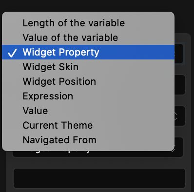
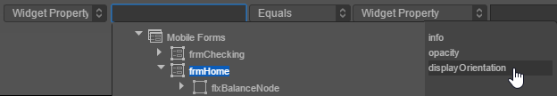
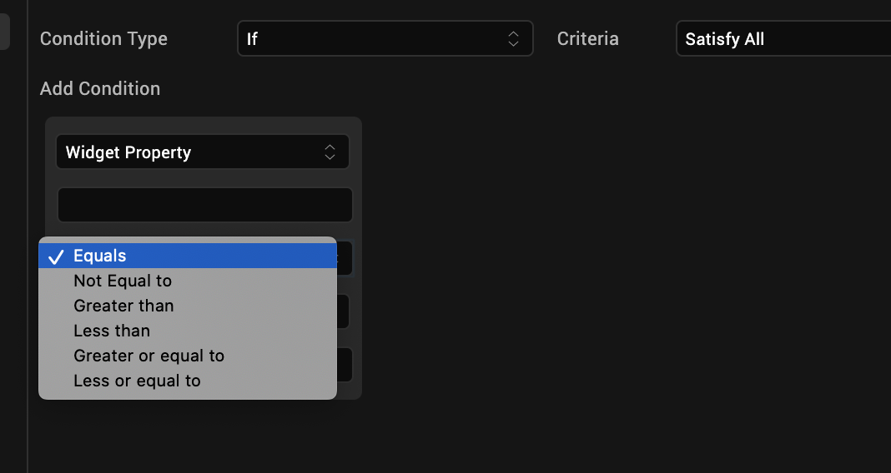
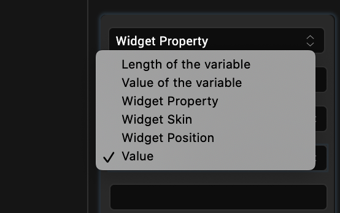
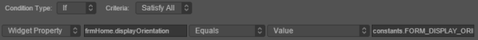

                          

Create a Condition Based on a Form's Orientation
================================================

With Volt MX Iris, you can have an action sequence execute a conditional statement based on a form's orientation.

To create a conditional statement based on a form's orientation, do the following:

1.  From the **Project** tab of the Project Explorer, select the form you want to apply the action to. Once it’s highlighted on the Iris Canvas, right-click it, and then select one of the action sequences, such as postShow. Doing so opens the Action Editor and creates an action sequence for you to configure.
2.  From the list of actions available along the left column of the Action Editor, click one of the four types of conditions from the Conditions section. The action is added to the action sequence and is the current action of focus.
3.  In the bottom pane of the Action Editor, from the leftmost drop-down list, set the condition to **Widget Property**.

    

4.  Click the next field over, and with the form being the widget of choice, click **displayOrientation**.

    

5.  Set the operator you want, most likely either **Equals** or **Not Equal to**.

   

6.  Set the second condition to **Value**.

    

7.  In the last field, enter one of the following values, depending on whether the condition is portrait, landscape, or both:

   `constants.FORM_DISPLAY_ORIENTATION_PORTRAIT`  
   `constants.FORM_DISPLAY_ORIENTATION_LANDSCAPE`  
   `constants.FORM_DISPLAY_ORIENTATION_BOTH`

   

8.  Save the action sequence by pressing **Ctrl+S**.
