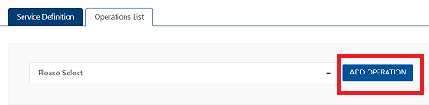
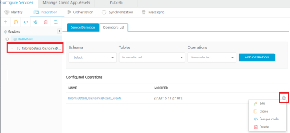

                         

Create a Database Service
=========================

With Volt MX Foundry database connector, you can connect to your own database as an endpoint. After you configure the database connector in Volt MX FoundryConsole, you can perform create, read, update, and delete (CRUD) operations on data in the tables.

For example, banks maintain a store of users and their details. With Volt MX Foundry database connector, banks can connect to their own databases and manage customers data.

In this topic, you will learn about: 

[Advantages of Volt MX Foundry Database Connector](#advantages-of-volt-mx-foundry-database-connector)

[Limitations of Volt MX Foundry Database Connector](#limitations-of-volt-mx-foundry-database-connector)

[Publishing the Service](PublishVoltMXFoundryServicesApp.md)

[Mapping the Service Output to Widgets on a Form](ActionsMapping.md).

Advantages of Volt MX Foundry Database Connector
-----------------------------------------------

*   Admins can connect to the given database.
*   Admins can mange the databases using CRUD operations.
*   When an admin is creating CRUD operations, the admin can access the configured schema.

Limitations of Volt MX Foundry Database Connector
------------------------------------------------

*   Currently Volt MX Foundry database connector supports MySQL database, Oracle, MS SQL, and PostgreSQL databases.
*   Plain SQL commands are not supported - for example, insert, select, and alter.
*   Using the database adapter:
    *   An admin can only alter the data in tables - Data Manipulation Language (DML).
    *   An admin cannot alter the structure of the table - Data Definition Language (DDL).  
        For example, an admin cannot add a column in the table.
*   Using the update operation, an admin can update multiple records at a time based on primary value.
*   Using the delete operation, an admin can delete one record at a time based on primary value.
*   Support for a single operation on multiple tables is not available.  
    For example, the system does not allow the `<Update>` operation for  `Table1` and `Table2`.
*   For on-premises, the primary key should be auto-incrementing in MySQL database. Otherwise, the system throws an error for the create operation.
*   Data types: All major data types are supported. In  Date data type, the YEAR() data type is not supported.
*   Binary Support is available in RDBMS DataAdapter with Range header.
*   Volt MX supports six ODATA parameters for the read operation such as `$filter, $orderby, $top,` `$skip` , `$select,` and `$expand`.
*   Volt MX supports `eq`, `ne`, `lt`, `le`, `gt`, `ge`, and  `or` operators with the `$filter` ODATA parameter.
    
    *   For `$expand`, MySQL version must be 5.7.7+.
    *   The `$expand` fails, if any related table has binary (bolb (or) bit) columns where MySQL itself fails to convert the binary data into a valid JSON.
    *   If the child payload is higher than 1024 bytes, MySQL truncates the excess data with its default properties on `group_concat()`. To resolve the issue, you must configure a higher value than the max payload size for `group_concat_max_len` property.
    *   For SQL Server, Oracle, and PostgreSQL databases, `$expand`  is limited to one level.
*   > **_Note:_**  Open Data Protocol (OData) is an open protocol to allow the creation and consumption of queryable and interoperable RESTful APIs in a simple and standard way. For more details, refer to [http://www.odata.org/](http://www.odata.org/)
    

Create a Database Service
-------------------------

Adding a Database Service involves the following steps:

[Configure a Service Definition for a Database Service](#configure-a-service-definition-for-a-database-service)

[Create CRUD Operations for a Database Service](#create-crud-operations-for-a-database-service)

[Configure CRUD Operations for a Database Service](#configure-crud-operations-for-a-database-service)

### Configure a Service Definition for a Database Service

This procedure assumes that you have already configured Volt MX Foundry in Volt MX Iris. 

To configure a service definition, follow these steps: 

1.  In Volt MX Iris, open either an existing application or create a new one.
2.  If you have not done so already, log in to your Volt MX account. To do so, in the top right corner of the Volt MX Iris window, click **Login**. The Volt MX Account sign-in window opens. Enter your email and password credentials for your Volt MX user account, and then click **Sign in**.
3.  Create a new Volt MX Foundry application or use an existing one. To do so, on the **Data and Services** panel, click the context menu arrow, and then click either **Create New App**, or **Use Existing App**, and then select from the Volt MX Foundry Application dialog box the services application that you want to publish. The Volt MX Foundry Console opens.

    

    > **_Note:_** If you want to associate your Volt MX Iris project with a different Volt MX Foundry app, on the **Project** tab of the Project Explorer, click the context menu arrow for **VoltMX Foundry**, and then click **Unlink App**. To link to a different Volt MX Foundry app, click the context menu arrow for **VoltMX Foundry**, and then click either **Create New App**, or **Use Existing App**.

4.  To create a new integration service, on the **Integration** tab, click **CONFIGURE NEW**. The **Service Definition** section appears.  
      
    

      

5.  In the **Service Definition** section, follow these steps:
    *   In the **Name** text box, enter a unique name for your service. When you enter the name, the name is updated for the active service under the **Services** section in the left pane.
    *   From the **Service Type** list, select **Relational Database**.  
        By default, XML is selected. If you select **Database**, the **Database Type, Database Connection URL**, and other details are displayed, shown below.
    
      
    
    *   In the **Database Type** list, select **MYSQL**.
    *   In the **Database Connection URL**, enter the database connection URL - for example, `jdbc:mysql://<ip_address>:<port>/`
    *   Under the **User ID**, type a valid user name for your database.
    *   Under the **Password**, type a valid password for your database.
        
        To test your database connection details, click **Test Connection**. If the entered details are correct, the system displays the message: Valid Database connection details.
        
    *   In the **Description**, type the appropriate description about the service.
        
        > **_Note:_**  For on-premises, proxy support is not available for database service.
        
    *   Click the **Advanced** tab to specify dependent JAR and API throttling. All options in the Advanced section are optional.
        *   **To specify dependent JAR, follow these steps**:
            
            Select the JAR containing preprocessor or postprocessor libraries from the drop-down list, or click **Upload New** to browse the JAR file from your local system. The step allows you to further filter the data sent to the back end:
            
            > **_Important:_** Make sure that you upload a custom JAR file that is built on the same JDK version used for installing Volt MX Foundry Integration.  
              
            For example, if the JDK version on the machine where Volt MX Foundry Integration is installed is 1.6, you must use the same JDK version to build your custom jar files. If the JDK version is different, an unsupported class version error will appear when a service is used from a device.
            
        *   **API throttling** enables you to limit the number of request calls within a minute. If an API exceeds the throttling limit, the API will not return the service response.**  
            To specify throttling, follow these steps:**  
            1.  In the **Total Rate Limit** text box, enter a required value. With this value, you can limit the number of requests configured in your Volt MX Foundry console in terms of Total Rate Limit.
                
            2.  In the **Rate Limit Per IP** text box, enter a required value. With this value, you can limit the number of IP address requests configured in your Volt MX Foundry console in terms of Per IP Rate Limit.
                
                To override throttling, refer to [Override API Throttling Configuration](../../../Foundry/voltmx_foundry_user_guide/Content/API_Throttling_Override.md).
                
                > **_Note:_** In case of On-premises, the number of nodes in a clustered environment is set by configuring the `VOLTMX_SERVER_NUMBER_OF_NODES` property in the Admin Console. This property indicates the number of nodes configured in the cluster. The default value is 1.  
                Refer to [The Runtime Configuration tab on the Settings screen of App Services](../../../Foundry/vmf_integrationservice_admin_console_userguide/Content/Runtime_Configuration.md).  
                  
                The total limit set in the Volt MX Foundry Console will be divided by the number of configured nodes. For example, a throttling limit of 600 requests/minute with three nodes will be calculated to be 200 requests/minute per node.  
                This is applicable for Cloud and On-premises.
                
    *   Click **SAVE** to save your service definition. The system displays the success message.  
        The **Operations List** tab appears only after the **Service Definition** is saved. For creating operations for a database service, refer to [How To Create CRUD Operations for Database Service.](#create-crud-operations-for-a-database-service)

### Create CRUD Operations for a Database Service

This procedure assumes that you have already configured Volt MX Foundry in Volt MX Iris. 

To create CRUD operations, follow these steps: 

1.  After you configure the [service definition](#configure-a-service-definition-for-a-database-service) for a database service, click **ADD OPERATION** to display the **Operations List** tab.  
    
    > **_Note:_**  You can also display the **Operations List** tab, by following steps:  
     -  Click the **Operations List** tab.  
     -  From the tree in the left pane, click **Add > Add New Operation**, shown below:
    
    
    
2.  In the **Operations List** tab, follow these steps to configure operations:
3.  From the **Schema** list, select the schema that is loaded based on your database configuration.
    
    Based on the selected schema, the **Tables** list is loaded with the tables in the schema. You can select one or more tables.  
    
4.  From the **Tables** list, select the required boxes. You can click **Select all** box to select all the tables in the list.
5.  From the **Operations** list, select the required check boxes for CRUD operations. You can click **Select all** box to select four operations.
    
    
    
6.  Click the **ADD OPERATION** button. The new operations are created under the **Configured Operations** section.
    
    
    
    The default name format of a database operation is `<schema_name>_<table_name>_<operations>`. You can change the operation name if required.  
    For example, `RdbmsDetails_CustomerDetails_create`.
    
    
    
    When an admin creates CRUD operations for a database connector, the admin is under a particular schema. To customize fields, refer to [How to Configure CRUD Operations for Database Service](#configure-crud-operations-for-a-database-service).
    

### Configure CRUD Operations for a Database Service

After you create [CRUD operations](#create-crud-operations-for-a-database-service) for database service, you can configure CRUD operations as follows:

[Create a Database Record with Create Operation](#how-to-create-a-database-record-with-create-operation)

[Query a Database and Display Information with Read Operation](#query-a-database-and-display-information-with-the-read-operation)

[Update a Database Record with Update Operation](#update-a-database-record-with-update-operation)

[Delete a Database Record with Delete Operation](#how-to-delete-a-database-record-with-delete-operation)

#### How to Create a Database Record with Create Operation

This procedure assumes that you have already configured Volt MX Foundry in Volt MX Iris. 

To create a database record with create operation, follow these steps: 

1.  Under **Configured Operations**, hover the cursor over the create operation, click **Settings** , and then click **Edit**.
    
    > **_Note:_**  To edit an operation, you can also click the operation from the service tree pane.
    
    
    
    The system displays the selected operation in the edit mode. The create operation has the Request Input tab.
    
    
    
    > **_Note:_**  You can add an entry by clicking the **Add Parameter** button if entries for the input and the output tabs do not exist.  
      
    \-  To make duplicate entries, select the check box for the entry, click **Copy**, and then click **Paste**.  
      
    \-  To delete an entry, select the check box for an entry, and then click the **Delete** button.
    
    The **Name** field is pre-populated with fields names of the selected database. You can edit this field.
    
2.  Select one of the following security operations in the **Operation Security Level** field. By default, this field is set to **Authenticated App User.**
    
    **Authenticated App User** – indicates that this operation is secured. To use this operation, an app user must be authenticated by an associated identity service.
    
    **Anonymous App User** – indicates that a user must have the app key and app secret to access this operation.
    
    **Public** – indicates that this operation requires no special security.
    
    The **Action** field is pre-populated with operation names of the selected database. You cannot edit this field.
    
3.  Click the **Advanced** tab, and follow these steps:
    1.  Under the **Custom Code Invocation**, upload the JAR file containing the preprocessor class name and postprocessor class name. This step allows you to further filter the data received from a service call.
        
        **Specify Custom Jar** \- Browse and select the JAR containing preprocessor or postprocessor libraries.
        
        **Preprocessor class** - Enables a developer to include any business logic on the data before forwarding the request to the external data source. Select the JAR file from the list.
        
        **Postprocessor class** - Enables a developer to include any business logic on the data before sending the response to a mobile device. Select the JAR file from the list.
        
    2.  Based on the operation - for example, post or get - provide custom HTTP headers.  
        To provide customer headers, click **HTTP Headers** . In the **Test values** text box, provide custom HTTP headers required by the external data source, shown below:
        
        **ID**: The rows are created based on the selected operation. Change the value if required.
        
        **Test value**: Enter a value. A test value is used for testing the service.
        
        **Default value:** change the syntax if required.
        
        **Scope:** select request or session. By default, this field is set to **Request.**
        
    3.  Under the **Properties** section, provide details for the following advanced service properties:
        
        
        
        **Timeout (in ms)** - the duration in milliseconds after which the service call times out. Provide the details in the text box.
        
        **Cachable(sec)** - the duration in seconds within which the service response is fetched from the cache. Select the **Cachable(in sec)** check box and provide the details in the text box.
        
        **Decode Response Body -** To ignore the Database response received in the XMLvalue field, select the **Decode Response Body response** check box.
        
        **Response Encoding -** select the appropriate response encoding. The default value is UTF-8. For more information about different encoding schemes, refer to [Response Encoding Schemes](../../../Iris/iris_user_guide/Content/Response_Encoding.md).
        
4.  In the **Request Input** tab, do the following:
    
    1.  In the **TEST VALUE** filed, enter the user input for the selected column.
    2.  In the **DEFAULT VALUE**, enter the value if required. The default value will be used if the test value is empty.
    3.  Select request or session in the **Scope** field. By default, the Scope field is set to Request.
        
        **Request** - Indicates that the value must be retrieved from the HTTP request received from a mobile device.
        
        **Session** - Indicates that the value must be retrieved from the HTTP session stored on Volt MX Foundry.
        
        The default data type for the selected column is loaded under the **DATATYPE** field.
        
    4.  In the **DESCRIPTION**, provide the description.
    
    To validate the details, click **Fetch Response**. The result of the operation appears.
    
5.  Click **SAVE OPERATION** to save the changes in the create operation.

#### Query a Database and Display Information with the Read Operation

This procedure assumes that you have already configured Volt MX Foundry in Volt MX Iris. 

1.  Under **Configured Operations**, hover your cursor over the **Read** operation, click the **Settings** button, and then click **Edit**.The system displays the selected operation in the edit mode. The Read operation has the **Request Input** and **Response Output** tabs.
    
    
    
    > **_Note:_**  You can add an entry by clicking the **Add Parameter** button if entries for the input and the output tabs do not exist.  
      
    In the read operation, the **Name** drop-down list contains a **Select** option that acts as a label for the list. **Select** itself is not a command.  
      
      
      
    \-  To make duplicate entries, select the check box for the entry, click **Copy**, and then click **Paste**.  
      
      
    \-  To delete an entry, select the check box for an entry, and then click the **Delete** button.
    
2.  In the **Request Input**, configure the following ODATA commands to filter the data:
    
    
    
    The **NAME** field in the **Request Input** is pre-populated with ODATA commands.
    
    1.  In the **TEST VALUE** filed, enter the query parameter for the selected ODATA command.
        
        For example (sample employee table), shown below:
        
        | Command Name | Test value for the command | Result |
        | --- | --- | --- |
        | $filter | emp\_Id ge 30 | Filters and displays data in the table based on age of employes who are older than 30. |
        | $orderby | emp\_Age | Arranges data in the table based on employees' age. |
        | $top | 5 | Displays top five records in the table. |
        | $skip | 5 | Displays all records in the table except top five records. |
        
        For example (sample configuration for ODATA commands), shown below:
        
        
        
    2.  In the **DEFAULT VALUE**, enter the value if required.
    3.  In the **DESCRIPTION**, provide the description.
        
        To validate the details, click **Fetch Response**. The result of the operation appears.
        
        Click **SAVE OPERATION** to save the changes in the read operation.
        
3.  In the **Response Output** tab, configure the fields of the table for displaying the data:  
    
    The **Name** field in the Response Output tab is pre-populated with database columns.
    
     Select request or session in the **SCOPE** field. By default, this field is set to **Request**.
    
    **Request** - Indicates that the value must be retrieved from the HTTP request received from a mobile device.
    
    **Session** - Indicates that the value must be retrieved from the HTTP session stored on Volt MX Foundry.
    
    In the **DESCRIPTION**, provide the description.
    
    To validate the details, click **Test**. The result of the operation appears.
    
4.  Click **SAVE OPERATION** to save the changes in the read operation.

#### Update a Database Record with Update Operation

This procedure assumes that you have already configured Volt MX Foundry in Volt MX Iris. 

To update a database record with update operation, follow these steps: 

1.  Under **Configured Operations**, hover your cursor over the **Update** operation, click the **Settings** button, and then click **Edit**.
    
    The system displays the selected operation in the edit mode. The update operation has the Request Input tab.
    
    
    
2.  The **NAME** field contains primary key of the table. You cannot modify these details.
    
    The Name column is pre-populated with fields names in the database.
    
    > **_Note:_**  You can add an entry by clicking the **Add Parameter** button if entries for the input and the output tabs do not exist.  
      
    \-  To make duplicate entries, select the check box for the entry, click **Copy**, and then click **Paste**.  
      
    \-  To delete an entry, select the check box for an entry, and then click the **Delete** button.
    
3.  Update the values in the fields, such as **TEST VALUE**, **DEFAULT VALUE**, and **SCOPE**, if required.
    
    To validate the details, click **Fetch Response**. The result of the operation appears.
    
4.  Click **SAVE OPERATION** to save the changes in the update operation.
    

#### How to Delete a Database Record with Delete Operation

This procedure assumes that you have already configured Volt MX Foundry in Volt MX Iris. 

1.  Under **Configured Operations**, hover your cursor over the **Delete** operation, click the **Settings** button, and then click **Edit**. The system displays the selected operation in the edit mode. The delete operation has the Request Input tab.
    
    
    
2.  The **NAME** field contains the primary key of the table. You cannot modify these details. The **Request Input** tab contains only the primary key of the table.
    
3.  In the **TEST VALUE** field, enter the valid primary key value.
4.  Click **Fetch Response** to validate the details. If the test value matches the primary key in the database, the system deletes the record from the database.
    
5.  Click **SAVE OPERATION** to save the changes in the delete operation.
    
6.  To close the Volt MX Foundry Console and return to the panes, views, and tabs of the Volt MX Iris integrated development environment (IDE), from the Quick Launch Bar along the upper left edge of Volt MX Iris, click the Workspace icon . Since you are still logged in to your Volt MX account, Volt MX Iris continues to have access to your Volt MX Foundry services.
