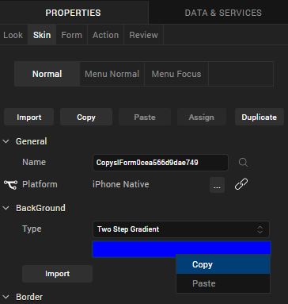
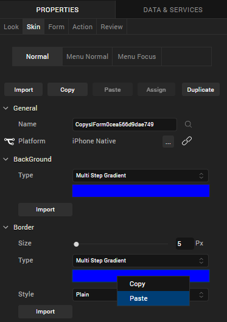

                         

Copy and Paste a Color or Gradient
==================================

With Volt MX Iris, you can reuse a color or gradient by copying it from one widget property and pasting it to another property, such as from a background to a border. Gradients are especially tedious to replicate, so being able to copy and paste them can save you considerable time and effort.

To reuse a color or gradient, follow these steps:

1.  On the Properties tab of a widget, click **Skin**.
2.  Right-click the color palette of a property and then click
    **Copy**.
    
3.  Depending on whether you want to paste the color and gradient
    within the same widget or another widget, do one of the following:
    
    *   **Within the same widget****.** Right-click the color palette of a property, and then click **Paste**.
        
    *   **Different widget****.** Navigate to the Skin tab of the widget, right-click the color palette of a property, and then click **Paste**.
    
     .
    

  > **_Note:_**  The color palette of the copied property and the pasted property should be of the same type. That is, if the copied color is of multi-step gradient, the pasted property color should also be multi-step gradient.
*   You can reuse a color across the widgets. That is, you can copy the color of a button widget and paste it to a Flex Container widget.
*   You cannot copy and paste an image.
