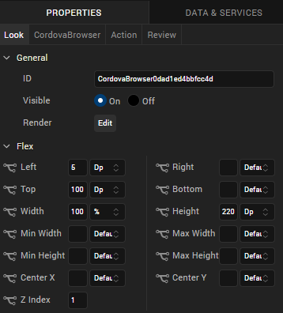
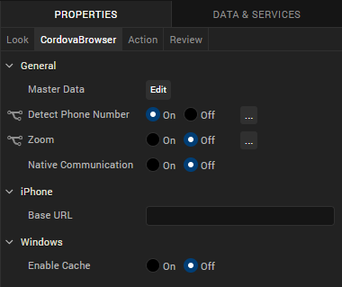
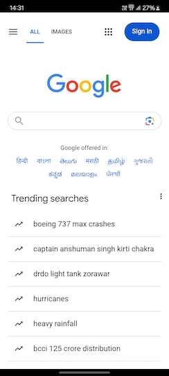
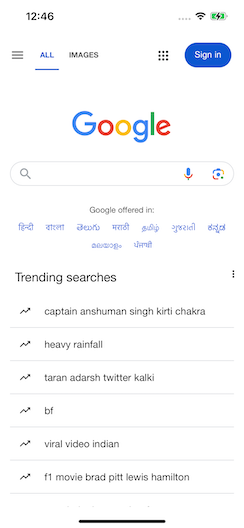

                           

Cordova Browser
---------------

Use a Cordova Browser widget to display Cordova-based HTML content in your application. The HTML content can be static or obtained from a URL.

To learn how to use this widget programmatically, refer [VoltMX Iris Widget guide](../../../Iris/iris_widget_prog_guide/Content/CordovaBrowser.md).

### Important Considerations

The following are important considerations for a Cordova Browser widget:

*   For the iOS platform, use a Cordova Browser widget as a screen-level widget and move other widgets to the header or footer. Otherwise, dual scrolling bars may be displayed.
*   The Cordova Browser widget is memory- and performance-intensive. Initial RAM usage is high, and the RAM usage grows in proportion to the size and number of rendered images and static text.
*   If there are multiple instances of a Cordova Browser widget in the same application, information sharing (for example, cookies) may not behave as expected. Do not place multiple Cordova Browser widgets on a form, or more than two Cordova Browser widgets in an application.
*   Do not use a Cordova Browser widget to display rich text. It should be used only to display large HTML content. Use a RichText widget to display rich text.
*   Avoid using a Cordova Browser widget to create an application that looks and behaves like a web browser. Typically, users expect to use the native browser to browse web content.

### Look Properties

Look properties define the appearance of the widget. The following are the major properties you can set:

*   Whether the widget is visible.
*   The platforms on which the widget is rendered.
*   How the widget aligns with its parent widget and neighboring widgets.
*   If the widget displays content, where the content appears.

For descriptions of the properties available on the Look tab of the Properties pane, see [Look](Look.md#Flex).

### Cordova Browser Properties

Cordova Browser properties specify properties that are available on any platform supported by Volt MX Iris, and assign platform-specific properties.

#### Master Data

Specifies the content source for the Cordova Browser widget. Click **Edit** button to open the **Master Data** dialog box, and select one of the following options:

*   **Content.** Displays a text field where you enter or paste the HTML content to be displayed.
*   **URL.** Displays a text box where you specify the URL of an HTML page to display. The URL must begin with http:// .
*   **Local File.** Displays a text box where you specify a local web-based file for launching local HTML content, such as a web app. For more information, see [Add Local HTML Content](AddLocalHTMLContent.md).

#### Detect Phone Number

Specifies whether the Cordova Browser widget supports the detection of phone numbers on the web page and displays them as clickable links. When a user clicks a phone link, the Phone application launches and dials the number.

The option you choose becomes the default for all the platforms. You can change the default option or provide a platform-specific option by forking the **Detect Phone Number** property. For more information, see [Fork a Widget Property](Forking.md#fork-a-widget-property).

#### Native Communication

Specifies whether to enable a web app JavaScript module running in the Cordova Browser widget to execute JavaScript code in the Volt MX native context.

#### Zoom

Specifies whether enable the Zoom feature for the Cordova Browser widget. The Zoom feature provides the ability to change the scale of the view area.

The option you choose here becomes the default for all the platforms. You can change the default option or provide a platform-specific option by forking the **Zoom** property. For more information, see [Fork a Widget Property](Forking.md#fork-a-widget-property).

#### Base URL

For the iOS platform, specifies a URL to provide additional web-based functionality.

#### Enable Cache

For the Windows 8 platform, specifies whether data is cached relative to the Cordova Browser widget. For more information, refer to _voltmx.evaluateJavaScriptInNativeContext_ in the [VoltMX Iris API Developer's Guide](../../../Iris/iris_api_dev_guide/content/voltmx_functions.md).

### Actions

Actions define what happens when an event occurs. On a Cordova Browser widget, you can run an action when the following events occur:

*   onFailure: The action is triggered when the specified Master Data URL fails to load content.
    
    > **_Note:_** This action is executed only for the given request URL, but not for the subsequent web navigation request failures.
    
*   onSuccess: The action is triggered when the specified Master Data URL successfully loads content.

> **_Note:_** This action is called only for the given request URL, but not for the subsequent web navigation requests.

*   onTouchStart: The action is triggered when the user touches the touch surface. This event occurs asynchronously.
*   onTouchMove: The action is triggered when the touch moves on the touch surface continuously until movement ends. This event occurs asynchronously.
*   onTouchEnd: The action is triggered when the user touch is released from the touch surface. This event occurs asynchronously.

### Placement Inside a Widget

The following table summarizes where a Calendar widget can be placed:

<table style="mc-table-style: url('Resources/TableStyles/Basic.css');" class="TableStyle-Basic" cellspacing="0"><colgroup><col class="TableStyle-Basic-Column-Column1"> <col class="TableStyle-Basic-Column-Column1"></colgroup><tbody><tr class="TableStyle-Basic-Body-Body1"><td class="TableStyle-Basic-BodyE-Column1-Body1">Flex Form</td><td class="TableStyle-Basic-BodyD-Column1-Body1">Yes</td></tr><tr class="TableStyle-Basic-Body-Body1"><td class="TableStyle-Basic-BodyE-Column1-Body1">FlexContainer</td><td class="TableStyle-Basic-BodyD-Column1-Body1">Yes</td></tr><tr class="TableStyle-Basic-Body-Body1"><td class="TableStyle-Basic-BodyE-Column1-Body1">FlexScrollContainer</td><td class="TableStyle-Basic-BodyD-Column1-Body1">Yes</td></tr><tr class="TableStyle-Basic-Body-Body1"><td class="TableStyle-Basic-BodyE-Column1-Body1">ScrollBox</td><td class="TableStyle-Basic-BodyD-Column1-Body1">Horizontal Orientation -YesVertical Orientation- Yes</td></tr><tr class="TableStyle-Basic-Body-Body1"><td class="TableStyle-Basic-BodyE-Column1-Body1">Tab</td><td class="TableStyle-Basic-BodyD-Column1-Body1">Yes</td></tr><tr class="TableStyle-Basic-Body-Body1"><td class="TableStyle-Basic-BodyE-Column1-Body1">Segment</td><td class="TableStyle-Basic-BodyD-Column1-Body1">No</td></tr><tr class="TableStyle-Basic-Body-Body1"><td class="TableStyle-Basic-BodyE-Column1-Body1">Popup</td><td class="TableStyle-Basic-BodyD-Column1-Body1">Yes</td></tr><tr class="TableStyle-Basic-Body-Body1"><td class="TableStyle-Basic-BodyB-Column1-Body1">Template&nbsp;</td><td class="TableStyle-Basic-BodyA-Column1-Body1">Header- NoFooter- No</td></tr></tbody></table>

### Widget Appearance on Platforms

The appearance of the Cordova Browser widget varies as follows:

  
| Platform | Appearance |
| --- | --- |
| Android |  |
| iOS |  |

