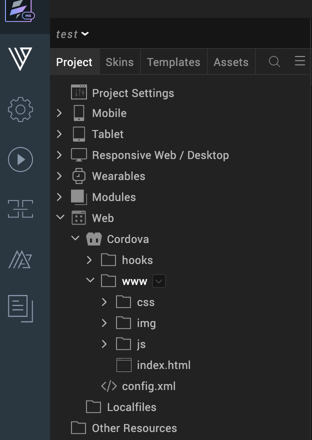

                          

Create Cordova Applications
===========================

Volt MX  Iris supports the creation of Apache Cordova apps. Cordova is an open-source development framework for mobile applications that rely on JavaScript, HTML5, and CSS3 rather than the APIs that are specific to a given platform, such as iOS and Android. The layout of a Cordova app is rendered using web views rather than any platform's native UI framework, and yet unlike web apps, they're capable of accessing native APIs and are bundled as apps for publication. For these reasons, Cordova applications are hybrid in nature, being neither native to a particular platform, nor entirely web-based, and are capable of mixing native and web-based code snippets.

Volt MX  Iris supports internationalization in Cordova applications.

To enable apps to be build with Cordova 11, ability to select Java 11 has been added in Iris preferences.

> **_Note:_** User can now set either Java 8 or Java 11 in Iris preferences. 

> **_Important:_***   
*   For Android: Adding Gradle to the global scope is a pre-requisite for building Cordova applications. For more information, refer to Gradle in [Android Platform Guide](https://cordova.apache.org/docs/en/latest/guide/platforms/android#installing-the-requirements).
*   For Windows: You must integrate Gradle home into your machine by setting the PATH environment variable.
*   For Mac: You can integrate Gradle into your Mac using any of the following procedures and verify the command "ls -l /usr/local/bin/gradle" points to the installed Gradle.
    1.  Create a symbolic link to "/usr/local/bin/gradle" to the actual Gradle installation.
    2.  Install Gradle using the command "brew install gradle".

  
Creating a Cordova app involves the following tasks:

*   [Enable Cordova](#enable-cordova)
*   [Import or Create Cordova Assets](#import-or-create-cordova-assets)
*   [Add a Cordova Browser Widget to a Form](#add-a-cordova-browser-widget-to-a-form)
*   [Add or Import Cordova Plugins](#add-or-import-cordova-plugins)
*   [Default Cordova Plugins for Volt MX App](#default-cordova-plugins-for-volt-mx-app)
    
*   [Best Practices for Creating Cordova Applications](#best-practices-for-creating-cordova-applications)
*   [Manually Customize the Cordova-Generated Android Project](#manually-customize-the-cordova-generated-android-project)
*   [Errors and Workarounds](#errors-and-workarounds)

Enable Cordova
--------------

To enable Cordova, do the following:

1.  On the **Project** menu in Volt MX Iris , click **Settings**.
2.  On the Application tab, select the **Enable Cordova Settings** checkbox.
3.  By default, Volt MX Iris uses the version of Cordova that you have installed, as indicated by the checkbox **Use globally installed Cordova version** being checked. However, if you want to use a different version of the Cordova command line interface (CLI), clear the **Use globally installed Cordova version** checkbox, and then from the **Cordova CLI** drop-down list, select the version you want. After you close the dialog box, Volt MX Iris installs the version of Cordova that you selected. Volt MX Iris supports Cordova version 4.2 and up.

    > **_Important:_** Changing the Cordova CLI version may affect your application code.

4.  Click **Finish** (**Apply** in Volt MX Iris).

Volt MX  Iris creates a Cordova folder structure accessible on the Project tab of the Project Explorer, under the **Web** section.

Import or Create Cordova Assets
-------------------------------

With Volt MX Iris, you can import existing Cordova content or create new content.

### Import Cordova Assets

You can import an entire existing Cordova project into Volt MX Iris, or import one or more assets into individual Cordova folders.

To import an entire existing Cordova project into Volt MX Iris, do the following:

1.  Using your computer's folder browser, navigate to the Cordova project that you want to import, and compress it into an archive (.zip) file.
2.  In Volt MX Iris, on the **Project** menu in Volt MX Iris), click **Import Cordova Project**.
3.  Navigate to the archive file that contains the Cordova project that you want to import, click it, and then click **Open**.

Volt MX  Iris imports the Cordova assets into the Cordova file structure within your Volt MX Iris project.

To import one or more assets into individual Cordova folders, do the following:

1.  On the **Project** tab of the Project Explorer, expand the **Web** section, and then expand the **Cordova** folder.
2.  Navigate to any of the folders within the **Cordova** folder, click that folder's context menu arrow, and then click **Import File(s)**. This command is also available from the context menu of the **Cordova** folder itself.
3.  Navigate to the file or files you want to import, select them, and then click **Open**.

The file or files you selected are imported into that folder.

### Create Cordova Assets

To create Cordova assets, do the following:

1.  On the **Project** tab of the Project Explorer, expand the **Web** section, and then expand the **Cordova** folder.
2.  Navigate to the folder within the Cordova folder structure where you want to add the asset, click that folder's context menu arrow, hover over **New**, and then select one of the following options:  
    Folder  
    JS File  
    HTML File  
    CSS File

In the case of a folder, a new folder is added. In the case of a file, a new file is opened in the code editor. You can rename the file or folder by clicking its context menu arrow in the Project Explorer, clicking **Rename**, and then entering the name you want.

Add a Cordova Browser Widget to a Form
--------------------------------------

To make Cordova content accessible to the user of your app, you add a Cordova browser widget to a form. For information about its properties, see [Cordova Browser](CordovaBrowser.md).

To add a Cordova browser widget to a form, do the following:

1.  Open the form that you want to add the Cordova browser widget to.
2.  From the **Widget** tab of the Library Explorer, under the Advanced Widgets section, drag a CordovaBrowser widget onto the form. The Cordova browser widget becomes the widget of focus on the Iris Canvas.
3.  Associate an HTML file—typically Index.html for Cordova content—with the Cordova browser widget. To do so, on the **Project** tab of the Project Explorer, in the Cordova folder structure, locate the HTML file you want to associate with the browser widget—typically Index.html for Cordova content—and then drag it onto the Cordova browser widget. The widget's Master Data property is updated to associate with the HTML file you selected.

Add or Import Cordova Plugins
-----------------------------

A Cordova plugin is a code module that extends Cordova's functionality beyond what is available in a purely web-based app, giving your Cordova context an interface to a device's native components and capabilities, such as the battery status or camera.

Cordova plugins can either be added or imported. When you add a plugin in Volt MX Iris, you are in fact fetching it from the Apache Cordova web site. Volt MX Iris searches the Cordova plugin catalog and lists the available plugins so that you can add the ones you want. In contrast, when you import a Cordova plugin into a Volt MX Iris project, you browse your computer for a plugin that you have already downloaded.

By default, a number of Cordova plugins are supported in Volt MX App. For more information, see [Default Cordova Plugins for Volt MX App](#default-cordova-plugins-for).

To add Cordova plugins, do the following:

1.  On the **Edit** menu, click **Manage Cordova Plugins**. The Manage Cordova Plugins dialog box displays, and lists any plugins that you have already added to the project.
2.  Click **Add**. Volt MX Iris populates the dialog box with the Cordova plugins available on the [Cordova Plugins page](http://cordova.apache.org/plugins/) of the Apache Cordova web site.
3.  In the Search text box, type keywords that help narrow the scope of the plugins listed.
4.  Click the name of the plugin you want, and then click **Add**. The plugin is added to the list of plugins associated with your project.
5.  Code your Cordova context to access the plugin. For more information, see _CordovaBrowser Widget_ in the [VoltMX Iris Widget Programmer's Guide](../../../Iris/iris_widget_prog_guide/Content/Overview.md).

To import Cordova plugins, do the following:

1.  On the **Edit** menu, click **Manage Cordova Plugins**. The Manage Cordova Plugins dialog box displays, and lists any plugins that you have already added to the project.
2.  Click **Import**.
3.  Navigate to the location of the plugin, select it, and then click **OK**. The plugin is added to the list of plugins associated with your project.
4.  Code your Cordova context to access the plugin. For more information, see _CordovaBrowser Widget_ in the [VoltMX Iris Widget Programmer's Guide](../../../Iris/iris_widget_prog_guide/Content/Overview.md).

### Default Cordova Plugins for Volt MX App

Volt MX  Iris by default supports the following plugins for Volt MX App:

<table style="margin-left: 0;margin-right: auto;mc-table-style: url('Resources/TableStyles/2015BasicTable.css');" class="TableStyle-Basic" cellspacing="0"><colgroup><col class="TableStyle-Basic-Column-Column1" style="width: 202px;"> <col class="TableStyle-Basic-Column-Column1" style="width: 179px;"> <col class="TableStyle-Basic-Column-Column1" style="width: 154px;"></colgroup><tbody><tr class="TableStyle-Basic-Body-Body1"><td class="TableStyle-Basic-BodyE-Column1-Body1" data-mc-conditions="Default.Iris7-2">Battery</td><td class="TableStyle-Basic-BodyE-Column1-Body1" data-mc-conditions="Default.Iris7-2">Device</td><td class="TableStyle-Basic-BodyD-Column1-Body1" data-mc-conditions="Default.Iris7-2">Network Information</td></tr><tr class="TableStyle-Basic-Body-Body1"><td class="TableStyle-Basic-BodyE-Column1-Body1" data-mc-conditions="Default.Iris7-2">BlueTooth LE</td><td class="TableStyle-Basic-BodyE-Column1-Body1" data-mc-conditions="Default.Iris7-2">Device Motion</td><td class="TableStyle-Basic-BodyD-Column1-Body1" data-mc-conditions="Default.Iris7-2">Notification</td></tr><tr class="TableStyle-Basic-Body-Body1"><td class="TableStyle-Basic-BodyE-Column1-Body1" data-mc-conditions="Default.Iris7-2">Camera</td><td class="TableStyle-Basic-BodyE-Column1-Body1" data-mc-conditions="Default.Iris7-2">Device Orientation</td><td class="TableStyle-Basic-BodyD-Column1-Body1" data-mc-conditions="Default.Iris7-2">Push</td></tr><tr class="TableStyle-Basic-Body-Body1"><td class="TableStyle-Basic-BodyE-Column1-Body1" data-mc-conditions="Default.Iris7-2">Capture</td><td class="TableStyle-Basic-BodyE-Column1-Body1" data-mc-conditions="Default.Iris7-2">File</td><td class="TableStyle-Basic-BodyD-Column1-Body1" data-mc-conditions="Default.Iris7-2">Splashscreen</td></tr><tr class="TableStyle-Basic-Body-Body1"><td class="TableStyle-Basic-BodyE-Column1-Body1" data-mc-conditions="Default.Iris7-2">CodePush</td><td class="TableStyle-Basic-BodyE-Column1-Body1" data-mc-conditions="Default.Iris7-2">File Transfer</td><td class="TableStyle-Basic-BodyD-Column1-Body1" data-mc-conditions="Default.Iris7-2">StatusBar</td></tr><tr class="TableStyle-Basic-Body-Body1"><td class="TableStyle-Basic-BodyE-Column1-Body1" data-mc-conditions="Default.Iris7-2">Console</td><td class="TableStyle-Basic-BodyE-Column1-Body1" data-mc-conditions="Default.Iris7-2">Geolocation</td><td class="TableStyle-Basic-BodyD-Column1-Body1" data-mc-conditions="Default.Iris7-2">Vibration</td></tr><tr class="TableStyle-Basic-Body-Body1"><td class="TableStyle-Basic-BodyE-Column1-Body1" data-mc-conditions="Default.Iris7-2">Contacts</td><td class="TableStyle-Basic-BodyE-Column1-Body1" data-mc-conditions="Default.Iris7-2">Globalization</td><td class="TableStyle-Basic-BodyD-Column1-Body1" data-mc-conditions="Default.Iris7-2">Whitelist</td></tr><tr class="TableStyle-Basic-Body-Body1"><td class="TableStyle-Basic-BodyE-Column1-Body1" data-mc-conditions="Default.Iris7-2">Cordova SQLite storage</td><td class="TableStyle-Basic-BodyE-Column1-Body1" data-mc-conditions="Default.Iris7-2">InAppBrowser</td><td class="TableStyle-Basic-BodyD-Column1-Body1" data-mc-conditions="Default.Iris7-2">&nbsp;</td></tr><tr class="TableStyle-Basic-Body-Body1"><td class="TableStyle-Basic-BodyB-Column1-Body1" data-mc-conditions="Default.Iris7-2">CrossWalk WebView engine</td><td class="TableStyle-Basic-BodyB-Column1-Body1" data-mc-conditions="Default.Iris7-2">Media</td><td class="TableStyle-Basic-BodyA-Column1-Body1" data-mc-conditions="Default.Iris7-2">&nbsp;</td></tr></tbody></table>

Best Practices for Creating Cordova Applications
------------------------------------------------

To ensure the best performance and security, it is recommended that you adhere to the following best practices.

### Invoking Volt MX Foundry Services from Cordova

With Volt MX Iris, a Cordova application can invoke Volt MX Foundry services. And if your application requires it, you can invoke Volt MX Foundry services from both a Cordova context and a native context.

If your Volt MX Iris project includes both native forms and Cordova forms, it is best to invoke Volt MX Foundry services from the native context, and then pass the required data to the Cordova browser widget.

### Prevent the Execution of Unverified JavaScript Functions

To prevent the execution of any unverified JavaScript functions on a device, any functions that are invoked for use in the Browser or Cordova Browser widgets should exist in the underlying JavaScript files of your project.

Manually Customize the Cordova-Generated Android Project
--------------------------------------------------------

While integrating your Cordova-generated Android project, certain gradle dependency conflicts or `android.support` to `androidx` conversion issues can arise. From In Volt MX Iris, you can manually customize this Cordova project and then resolve these issues.

You can bundle this customized Cordova project by specifying the `cordovabuildmode` property as `incremental` in the [`androidbuild.properties` file](Native_App_Properties.md#add-android-properties-to-androidbuild-properties-file). For more information about the `cordovabuildmode` property, click [here](Native_App_Properties.md#bundle-a-customized-cordova-generated-android-project).

To manually customize your Cordova-generated Android project, follow these steps: 

1.  You must build your Volt MX Iris project at least once to get a temporary **cordova** folder, where the actual Cordova project is copied and built.
2.  After the Volt MX Iris project is built once (which may fail due to unresolved `android.support` references or due to some other build conflicts), you must copy all the contents in the `<voltmxproject>\cordovatemp\platforms\android` folder to the `<voltmxproject>/cordovaprebuilt` folder.  
    The Cordova project (which is,**`<voltmxproject>/cordovaprebuilt`**) is now available for customization.   
> **_Note:_** If you face any `android.support` to `androidx`conflicts, you can manually change those references. Alternatively, with Android Studio 3.2 and later, you can migrate an existing project to AndroidX by selecting **Refactor** > **Migrate to AndroidX** from the menu bar. This action converts all `android.support` references to `androidx`.

3.  To pick the customization from the new Cordova project, you must specify the value of the `cordovabuildmode` property as `incremental` in the `androidbuild.properties` file, which is located at: **`<voltmxproject>/androidbuild.properties`**.

> **_Note:_** If you do not specify the `cordovabuildmode` property, the `<voltmxproject>/cordovaprebuilt` folder will be ignored.

> **_Note:_** If you specify the `cordovabuildmode` property, the `<voltmxproject>/cordovaprebuilt` folder must be available; otherwise, the build will fail.

Errors and Workarounds
----------------------

While developing Cordova supported applications in Volt MX Iris, you might see the following errors due to memory-related issues.

**Execution failed for task ':mergeDebugResources'**

**Error: java.util.concurrent.ExecutionException: java.io.IOException: The pipe is being closed**

Follow the steps below to fix the problem:

1.  Navigate to the home directory of the user.  
    You can navigate to the User home directory by running the command (Windows + R) `%userprofile%` on Windows machines and `~/` on Macs.
2.  In the directory, create a new file with the name **gradle.properties**.
3.  Copy the code below and paste it in the gradle.properties file.  
    
    org.gradle.jvmargs=-Xms512M -Xmx4g -XX:MaxPermSize=2048m -XX:MaxMetaspaceSize=1g -Dkotlin.daemon.jvm.options="-Xmx1g"
    
4.  Save and close the gradle.properties file.
5.  Run the command `gradle -- stop` on your machine. This action stops the Gradle process and unlocks any locked files by Gradle.
