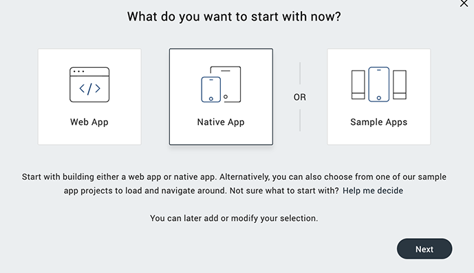
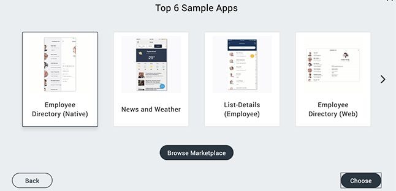

                           

Create a Project from Sample Applications and Components
--------------------------------------------------------

To help you easily and quickly develop your applications, Volt MX Iris provides access to a variety of sample applications and components. You can create a project based on a sample application and use that application as a template or starting point for your application, or use a rich assortment of pre-built components as building blocks for your application.

To create a project from a sample application or component, follow these steps: 

1.  Click the **Project** menu and then click **New Project**. The **What do you want to start with now?** screen of the **New Project** wizard appears.  
      
    
2.  Click **Sample Apps**, and then click **Next**. The **Sample Apps** screen appears.

4.  Select one of applications and components displayed on the **Sample Apps** screen, and then click **Choose**. The selected application or component is imported to your project. Alternatively, you can click **Browse HCL Forge** to open the [HCL Forge](http://community.hclvoltmx.com/marketplace) website. HCL Forge provides a variety of samples and components that you can add to your project.
5.  Continue adding any additional components that help you build your application.

You can use components as building blocks for rapid application development without having to write all the code yourself, or create you own custom components. For more information about working with and customizing components, see [Creating Applications with Components](C_DesigningWorkingWithComponents.md).

You can also use the **New Project** wizard to create a custom Volt MX Iris Reference Architecture project or a custom Free Form JavaScript project. For information on the different types of Volt MX Iris projects, see [Types of Projects](TypesOfProjects.md).

For information about creating a custom Volt MX Iris Reference Architecture project, see [Create a Volt MX Iris Reference Architecture Project](#). For information about creating a custom free form JavaScript project, see [Create a Free Form JavaScript Project](CreateNewProject.md).
