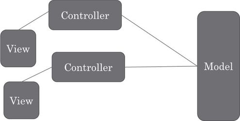
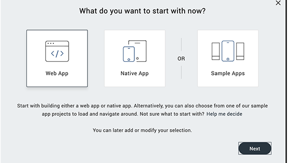
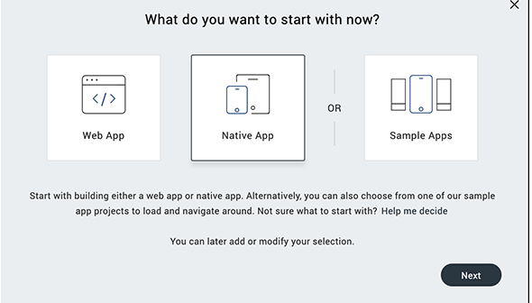
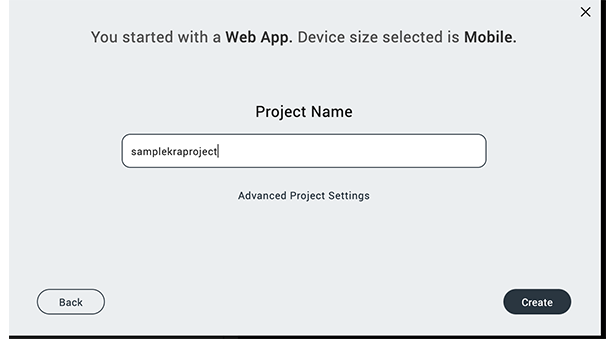
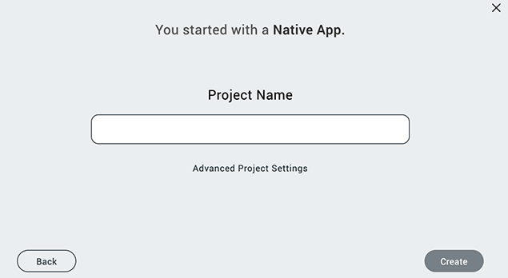
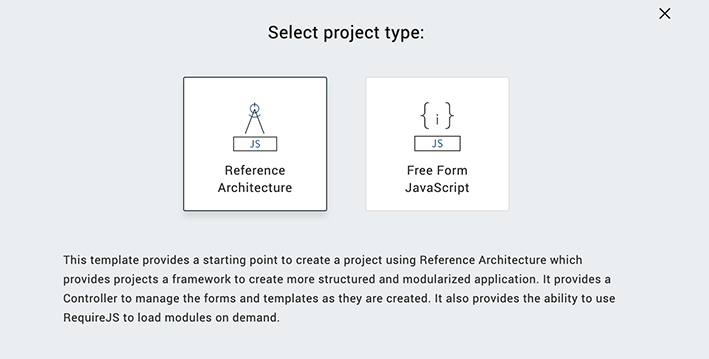
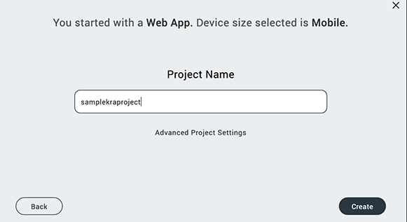
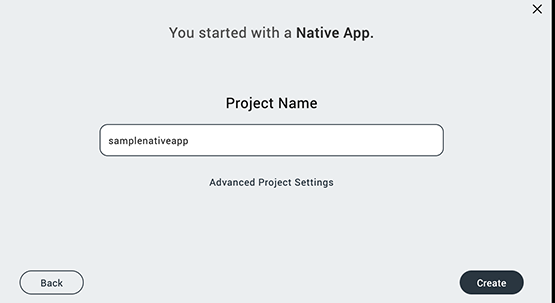

                          

Create a Volt MX Iris Reference Architecture Project
----------------------------------------------------------

A Volt MX Iris Reference Architecture project lets you create a custom application using a structured, modular framework based on the Model-View-Controller (MVC) architecture. Forms represent the _view_ of the application, and there is a _controller_ associated with each form that manipulates the view, handles navigation, and interacts with a statically defined _model_ or dynamic object services layer.

You can use the **New Project** wizard to create a custom Volt MX Iris Reference Architecture project, a custom Free Form JavaScript project, or a project that is built from sample applications and components. For information on the different types of Volt MX Iris projects, see [Types of Projects](TypesOfProjects.md).

To create a new custom Volt MX Iris Reference Architecture project, follow these steps: 

1.  Click the **Project** menu, and then click **New Project**. The **What do you want to start with now?** screen of the **New Project** wizard appears.
2.  You can choose to create any one of the following types of apps:

    *   **Web App**: Click **Web App**,and then click **Next**.  

          
       

    *   **Native App**: Click **Native App**,and then click
         **Next**.  

          

       

3.  Perform these steps for the following types of apps:

    *   **Web App**: Select the channel for which you want to create a Web app: Desktop, Tablet, or Mobile. Here, **Mobile**. Click **Advance Project Settings**.  
          

          
          

        

    *   **Native App**: Click **Advance Project Settings**.  
          

        

4.  The **Select project type** window appears. Click the **VoltMX Iris Reference Architecture** option, and then click the Close icon 
      

     

     > **_Note:_** By default, the **VoltMX Iris Reference Architecture** option is auto-selected in the **Select project type** window.

5.  In the **Project Name** box, type the name of the project.
    *   **Web App**  
          

        

    *   **Native App**  

          
        

     > **_Note:_** A project name must contain fewer than 18 characters. You cannot use any special characters or spaces in the project name.

     > **_Note:_** A project name can be alphanumeric. However, the first character of a project must be an alphabet.

     > **_Note:_** Do not use any of the following reserved keywords as a project name: authService, workspace, mfconsole, vpns, middleware, accounts, syncservice, syncconsole, services, admin, middleware, and appdownload.  

6.  Click **Create**. Volt MX Iris creates a Volt MX Iris Reference Architecture project with folders for forms, popups, templates, modules, resources, actions, and services. For a Volt MX Iris Reference Architecture application project, Volt MX Iris also creates a **Controllers** folder.

When you create a form or template, Volt MX Iris automatically creates associated _controller_ and _controller actions_ modules in the **Controllers** folder, using the form name as a prefix. When you rename the form or template, Volt MX Iris automatically updates the names of the associated modules to use the new form or template name.

For more information about the Volt MX Iris Reference Architecture, see the [VoltMX Iris Reference Architecture SDK API Programmer's Guide](../../../Iris/voltmx_ref_arch_api/Content/VoltMX_Reference_Architecture_Guide.md)

For information about creating a project from sample applications and components, see [Create a Project from Sample Applications and Components](CreateFromSampleApp.md). For information about creating a free form JavaScript project, see [Create a Free Form JavaScript Project](CreateNewProject.md).
