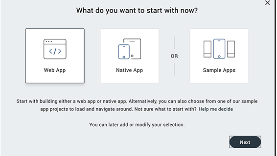
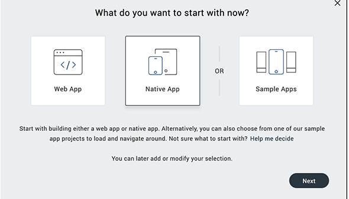
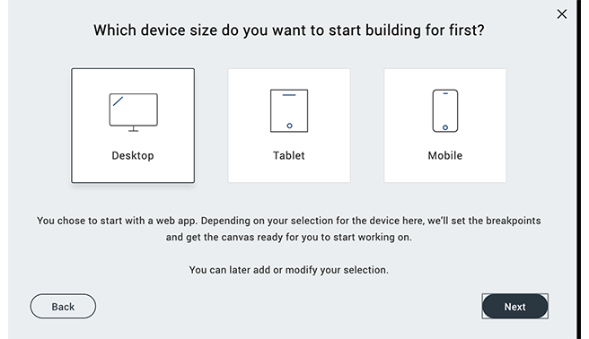
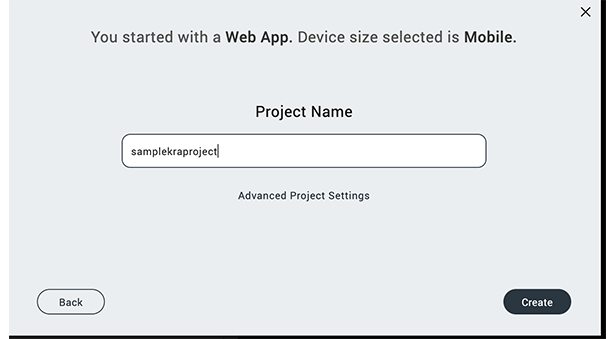
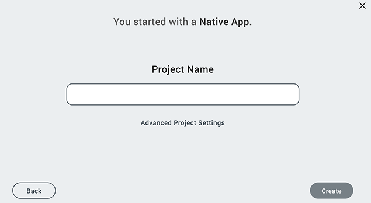
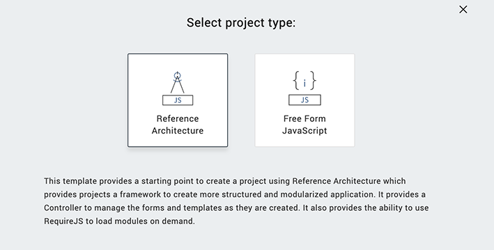
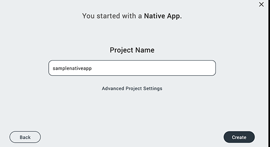

                          

Create a Free Form JavaScript Project
-------------------------------------

A Free Form JavaScript project lets you create a custom application without using an application development framework.

You can use the **New Project** wizard to create a custom Free Form JavaScript project, a custom Volt MX Iris Reference Architecture project, or a project that is built from sample applications and components. For information on the different types of Volt MX Iris projects, see [Types of Projects](TypesOfProjects.md).

To create a new custom Free Form JavaScript project, follow these steps: 

1.  Click the **Project** menu, and then click **New Project**. The **What do you want to start with now?** screen of the **New Project** wizard appears.
2.  You can choose to create any one of the following types of apps:
    *   **Web App**: Click **Web App**,and then click **Next**.  

          
        

    *   **Native App**: Click **Native App**,and then click **Next**.  
          
        

3.  Perform these steps for the following types of apps:
    *   **Web App**: Select the channel for which you want to create a Web app: Desktop, Tablet, or Mobile. Here, **Mobile**. Click **Advance Project Settings**.  
          

          
          

        

    *   **Native App**: Click **Advance Project Settings**.  
          
        

4.  The **Select project type** window appears. Click the **Free Form JavaScript** option, and then click the Close icon 
         
      
      

    > **_Note:_** By default, the **VoltMX Iris Reference Architecture** option is auto-selected in the **Select project type** window.

5.  In the **Project Name** box, type the name of the project.
    *   **Web App**  
          

        

    *   **Native App**  
          

        

      > **_Note:_** A project name must contain fewer than 18 characters. You cannot use any special characters or spaces in the project name.  

     > **_Note:_** A project name can be alphanumeric. However, the first character of a project must be an alphabet.  

     > **_Note:_** Do not use any of the following reserved keywords as a project name: authService, workspace, mfconsole, vpns, middleware, accounts, syncservice, syncconsole, services, admin, middleware, and appdownload.  

6.  Click **Create**. Volt MX Iris creates a Free Form JavaScript project with folders for forms, popups, templates, modules, resources, actions, and services.

By default, Volt MX Iris creates folders for forms, popups, templates, modules, resources, actions and services.

For information on creating a Volt MX Iris Reference Architecture project, refer [Create a Volt MX Iris Reference Architecture Project](CreateKRAProject.md).

For information about creating a project from sample applications and components, see [Create a Project from Sample Applications and Components](CreateFromSampleApp.md). For information about creating a Volt MX Iris Reference Architecture project, see [Create a Volt MX Iris Reference Architecture Project](CreateKRAProject.md).
