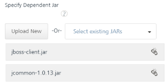

                         

Create a Java Service
---------------------

A service that uses a custom Java connector is called a Java service. The Java connector is a custom Java Class that implements the **com.hcl.voltmx.middleware.common.JavaService** interface or **com.hcl.voltmx.middleware.common.JavaService2** interface. It is recommended that you use JavaService2 as you can get an access to `DataControllerRequest` and `DataControllerResponse` objects.

You must load the required JAR files to define a Java service. JAR files contain Java classes. The Java classes contain Java methods. These methods have the logic defined that is required for a service. Java services are mostly used in conjunction with Webconnector Services.

> **_Note:_** The `middleware-system.jar` helps you to develop a Java adapter. You can download the `middleware-system.jar` from Admin Console's download page.

### Prerequisites

The prerequisites for creating a Java Service are:

[Conversion of JSON Data to a Volt MX Object](../../../Foundry/voltmx_foundry_user_guide/Content/Services.md#Data)

[How to write a Java Class for a Java Adapter](../../../Foundry/voltmx_foundry_user_guide/Content/Services.md#Writing)

In this topic, you will learn about:

[Creating a Java Service](#creating-a-java-service)

[Publishing the Service](PublishVoltMXFoundryServicesApp.md)

[Mapping the Service Output to Widgets on a Form](ActionsMapping.md).

### Creating a Java Service

With Java service, you can interact with your software application that does not support RESTful APIs. A service that uses a custom Java connector is a Java service. The Java connector is a custom Java class that implements the `com.hcl.voltmx.middleware.common.JavaService` interface.

Adding a Java service involves the following steps:

[Configure a New Java Connector - Integration Service](#configure-a-new-java-connector)

[Edit an Existing Java Connector - Integration Service](#how-to-edit-an-existing-java-connector-integration-service)

### Configure a New Java Connector

This procedure assumes that you have already configured Volt MX Foundry in Volt MX Iris. 

To configure your Java Adapter, follow these steps:

1.  In Volt MX Iris, open either an existing application or create a new one.
2.  If you have not done so already, log in to your Volt MX account. To do so, in the top right corner of the Volt MX Iris window, click **Login**. The Volt MX Account sign-in window opens. Enter your email and password credentials for your Volt MX user account, and then click **Sign in**.
3.  Create a new Volt MX Foundry application or use an existing one. To do so, on the **Data and Services** panel, click the context menu arrow, and then click either **Create New App**, or **Use Existing App**, and then select from the Volt MX Foundry Application dialog box the services application that you want to publish. The Volt MX Foundry Console opens.

    

    > **_Note:_** If you want to associate your Volt MX Iris project with a different Volt MX Foundry app, on the **Project** tab of the Project Explorer, click the context menu arrow for **VoltMX Foundry**, and then click **Unlink App**. To link to a different Volt MX Foundryapp, click the context menu arrow for **VoltMX Foundry**, and then click either **Create New App**, or **Use Existing App**.

The Volt MX Foundry Console opens. To create a new integration service, on the **Integration** tab, click **CONFIGURE NEW**. The **Service Definition** section appears.

4.  Click the **Integration** tab, click **CONFIGURE NEW** to create an integration service.
5.  In the **Name** box, type a unique name for the service.
6.  From the **Service Type** list, select **Java**.  
    By default, XML is selected. If you select **Java**, the **Specify Java Connector Jar** section appears.
    
    
    
7. From the **Specify Java Connector Jar** list, select a JAR file, or click **Upload New** to select the JARs from your local machine.
    1.  The system adds your main JAR file to the console. The system displays the added JAR file's name under the **Specify Java Connector Jar** field.
        
        
        
        You can select and upload only one JAR file at **Specify Java Connector Jar**. The main JAR file contains Volt MX Integration Java services.  
        
        You can delete an uploaded JAR file by clicking the **Delete** button.
        
        > **_Important:_** To upload an updated JAR file, upload the new file, which must have the same name as the old JAR file. The new JAR file overrides the existing file.
        
8. Under the **Specify Dependent Jar** list, select one or more JAR files if the main JAR depends only on external JARs. You can also click **Upload New** to select the JARs from your local machine. The system adds JAR files to the console.
    
    
    
    To remove an existing dependent JAR file from the console, click the **Unlink** button. An **Unlink JAR** confirmation message window appears. Click **CONFIRM**. The JAR file is removed from the **Specify Dependent Jar** section.
    
    
    
    > **_Important:_** To update a JAR file, you must upload the JAR file with name matching your previous JAR file. The existing JAR file gets replaced by the new JAR file.
    
9. Click the **Advanced** tab to specify dependent JAR and API throttling. All configurable parameters in the Advanced section are optional.
    
    *   **To specify dependent JAR, follow these steps**:
        
        Select the JAR containing preprocessor or post processor libraries from the drop-down list, or click **Upload New** to browse the JAR file from your local system. The step allows you to further filter the data sent to the back end:
        
        > **_Important:_** Make sure that you upload a custom JAR file that is built on the same JDK version used for installing Volt MX Foundry Integration.  
          
        For example, if the JDK version on the machine where Volt MX Foundry Integration is installed is 1.6, you must use the same JDK version to build your custom jar files. If the JDK version is different, an unsupported class version error will appear when a service is used from a device.
        
    *   **API throttling** enables you to limit the number of request calls within a minute. If an API exceeds the throttling limit, the API will not return the service response.**  
        To specify throttling, follow these steps:**  
        1.  In the **Total Rate Limit** text box, enter a required value. With this value, you can limit the number of requests configured in your Volt MX Foundry console in terms of Total Rate Limit.
            
        2.  In the **Rate Limit Per IP** text box, enter a required value. With this value, you can limit the number of IP address requests configured in your Volt MX Foundry console in terms of Per IP Rate Limit.
            
            To override throttling, refer to [Override API Throttling Configuration](../../../Foundry/voltmx_foundry_user_guide/Content/API_Throttling_Override.md).
            
    
10. Click **SAVE** to save your service definition. The system displays the success message: Service Saved Successfully.  
    The **Operations List** tab appears only after the **Service Definition** is saved. The **ADD OPERATION** button in the Service Definition page is active only after you click the **SAVE** button.
11. Click **ADD OPERATION**. The Operations List tab appears.  
    Based on your JAR files, the system loads all Java classes into the console.
12. In the **Operation List** section, follow these steps to configure operations for your Java service:
    
    In the **Operation** name text box, enter a name. For example, Java\_operation.
    
    From the **Class Name** drop-down list, select the Java class that has the method defined.
    
    Click **ADD OPERATION** to display the Operation Modal tab.
    
13. In the **Operation Modal** tab, follow these steps:
    
    The following dialog contains the request input, response output, and advanced tabs. The input values are data types, scope, and format types. By default, the system will display the **Request Input** tab.  
    
    
    
    > **_Note:_** You can add an entry by clicking the **Add** button if entries for the input and the output tabs do not exist.  
      
    You can also delete an entry. Select the check box for an entry, and then click the **Delete** button.
    
    1.  In the **Operation Name** box, modify the name if required.
    2.  Select a class name from the list.
    3.  Click **Add Operation**. The operation gets added and appears in the Operations List tab.
    4.  Click the operation name.
    5.  Select one of the following security operations in the **Operation Security Level** field. By default, this field is set to **Authenticated App User.**
        
        You can restrict access to this operation based on the following levels:
        
        **Authenticated App User** – indicates that this operation is secured. To use this operation, an app user must be authenticated by an associated identity service.
        
        **Anonymous App User** – indicates that a user must have the app key and app secret to access this operation.
        
        **Public** – indicates that this operation require no special security.
        
14. In the **Request Input** > **Body** tab, to configure parameters in the clients body, provide the following details:  
    
    To forward the body of the client's request to backend as it is, select the **Enable pass-through input body** check box. For more details on API Proxy service, refer to [How to Enable Pass-through Proxy for Operations](../../../Foundry/voltmx_foundry_user_guide/Content/Services.md#APIProxyCheckBox).
    
    Integration services accept only `form-url-encoded` inputs for all input parameters provided in service input parameters (request input).
    
    > **_Note:_**  You can add an entry by clicking the **Add Parameter** button if entries for the input and the output tabs do not exist.  
      
    \-  To make duplicate entries, select the check box for the entry, click **Copy**, and then click **Paste**.  
      
    \-  To delete an entry, select the check box for an entry, and then click the **Delete** button.
    
    1.  The **NAME** field contains a unique identifier for a parameter. Change the identifier if required.
    2.  In the **VALUE** field, select request or session. By default, this field is set to **Request.** Three different options are available in Volt MX Foundry under **Request Input > Body** > **VALUE** during configuration of any operation. When you start editing this field, dependent identity services are auto populated. These options primarily determine the source of the value of the header**.**
        *   **Request**: If this option is selected, the Integration Server picks the value pairs from the client's request during run time and forwards the same to the back-end.
            
            User has the option to configure the default value. This default value is taken if the request does not have the header.
            
        *   **Session**: If this option is selected, the value of header is picked from session context based on the user configuration.
        *   **Identity**: If this is selected, you can filter the request parameters based on the response from the identity provider. For more details to configure identity filters, refer to [Enhanced Identity Filters - Integration Services](../../../Foundry/voltmx_foundry_user_guide/Content/Identity_Filters_Integration.md).
    3.  **TEST VALUE**: Enter a value. A test value is used for testing the service.
    4.  **DEFAULT VALUE:** enter the value if required. The default value will be used if the test value is empty.
    5.  Select a data type in the **DATA TYPE** field:
        *   **String** - A combination of alphanumeric and special characters. String supports all formats including UTF-8 and UTF-16 with no maximum size limit.
        *   **Boolean** - A value that is true or false.
        *   **Number** - An integer or a floating number.
        *   **Collection** - A group of data or data set.
    6.  Select the **Encode** check box to enable an input parameter to be encoded. For example, the name New York Times would be encoded as _New_York_Times_  when the encoding is set to True. The encoding must also adhere to the HTML URL encoding standards.
    7.  In the **Description**, provide the description.
15. Click the **Response Output** tab, and enter the values for required fields such as name, scope, data type, collection ID, record ID, format and format value.
    
    > **_Note:_** If you define parameters inside a record as the session, the session scope will not get reflected for the parameters.
    
    In Java service, the response (output) from a backend is not parsed based on the response values. The complete response from the backend is sent to the client device.
    
    > **_Note:_** By default, the `opStatus` and `httpStatusCode` values for Java and JavaScript services are added as 0 and 200.
    
    
    
    1.  The **NAME** field contains a unique identifier for a parameter. Change the identifier if required.
    2.  Select request or session in the **SCOPE** field. By default, this field is set to **Request**.
        
        **Request** - Indicates that the value must be retrieved from the HTTP request received from a mobile device.
        
        **Session** - Indicates that the value must be retrieved from the HTTP session stored on Volt MX Foundry.
        
    3.  Select a data type in the **DATA TYPE** field:
        
        **String** - A combination of alphanumeric and special characters. String supports all formats including UTF-8 and UTF-16 with no maximum size limit.
        
        **Boolean** - A value that is true or false.
        
        **Number** - An integer or a floating number.
        
        **Collection** - A group of data, also referred to as data set. A collection contains only records, and a record contains string, Boolean, or number values.
        
        **Record** - A group data elements under the specified parameter. A record can also be part of a collection. Typically, a record provides metadata to a segment.
        
    4.  Select a format type in the **FORMAT** list.
        *   **None** - No format.
        *   **Currency**\-Currency format.
        *   **Number** \- Number format.
        *   **Date**\- Date format.
        
        *   If datatype is String, then the options in the Format Type are Currency, Number and Date.
            
        *   If the datatype is Number, then the options in the Format Type are Currency and Date.
            
        *   If the datatype is Boolean, then the options in the Format Type and Format Value text box are disabled.
            
        
    5.  In the **FORMAT VALUE** field, provide the standard for converting the specified format.  
        For example, enter a date format as **MMDDYY** to display the date in Month/Date/Year.
        *   **Currency** - For currency format, refer to [java.text.DecimalFormat](http://docs.oracle.com/javase/7/docs/api/java/text/DecimalFormat.html).
        *   **Number** - For number format, refer to [java.text.DecimalFormat](http://docs.oracle.com/javase/7/docs/api/java/text/DecimalFormat.html).
        *   **Date** - For date format, refer to [java.text.SimpleDateFormat](http://docs.oracle.com/javase/7/docs/api/java/text/SimpleDateFormat.html).
16. Click the **Advanced** tab to configure the following options for request or response operations.  
    
    > **_Note:_** All options in the **Advanced** section for operations are optional.
    
    
    
    *   [Custom Code Invocation - Preprocessor and Postprocessor](../../../Foundry/voltmx_foundry_user_guide/Content/Java_Preprocessor_Postprocessor_.md)  
        You can add preprocessing and post processing logic to services to modify the request inputs. When you test, the services details of various stages in the service execution are presented to you for better debugging.  
        Upload the JAR file containing the preprocessor class name and post processor class name. This step allows you to further filter the data received from a service call.
    *   [Additional configuration properties](../../../Foundry/voltmx_foundry_user_guide/Content/Java_Preprocessor_Postprocessor_.md#timeout_cachable) allow you to configure service call time out cache response:  
        
    
    *   **Specify Custom Jar** \- Browse and select the JAR containing preprocessor or post processor libraries.
    *   **Preprocessor class** - Enables a developer to include any business logic on the data before forwarding the request to the external data source. Select the JAR file from the list.
    *   **Postprocessor class** - Enables a developer to include any business logic on the data before sending the response to a mobile device. Select the JAR file from the list.
    *   Under the **Properties** section, provide details for the following advanced service properties:
        
        **Timeout (in ms)** - the duration in milliseconds after which the service call times out. Provide the details in the text box.
        
        **Cachable(in sec)** - the duration in seconds within which the service response is fetched from the cache. Select the **Cachable(in sec)** check box and provide the details in the text box.
        
    
    *   [Front End API](../../../Foundry/voltmx_foundry_user_guide/Content/FrontEndAPI.md) allows you map your endpoint or back-end URL of an operation to a front-end URL.
17. Click **Save Operation** to save the operation. The system adds your operation under the **Configured Operations** section. The system also adds your new Java service to the **Integration** page.
    
    If you click **Cancel**, the **Edit Service Parameters** window will close without saving any information.
    
    > **_Note:_** To add more operations for your Java service, repeat steps for [Configure New](#CONFIGURE_NEW).
    
18. From the **Operation** section, click **Done** to complete the configuration and go to the **Integration** page.
19. To close the Volt MX Foundry Console and return to the panes, views, and tabs of the Volt MX Iris integrated development environment (IDE), from the Quick Launch Bar along the upper left edge of Volt MX Iris, click the Workspace icon . Since you are still logged in to your Volt MX account, Volt MX Iris continues to have access to your Volt MX Foundry services.

### How to Edit an Existing Java Connector Integration Service

If you want to edit an existing Java service, you can edit details such as service name, JAR files, operation modal details. While editing a Java service, you can change the Java service type. A Java service must be available in the Integration home screen.

This procedure assumes that you have already configured Volt MX Foundry in Volt MX Iris. 

To edit an existing Java service, follow these steps:

1.  In the **Integration** page, click one of your Java services.
2.  Under **Operations** > **Configured** **Operations**, hover your cursor over the required service, click the **Settings** button, and then click **Edit**.
    
    The operation details are displayed in the **Edit Service Parameters** dialog.
    
    
    
3.  Make the necessary changes in the **Service Definition** section, and click **Update**.  
    For more details, refer to [How to Configure Service Definition for Java Service](#CONFIGURE_NEW).
4.  Under the **Operation** section, hover your cursor over the required service, click the **Settings** button, and then click **Edit** to display the **Operation Modal** dialog.  
    To modify Java operations, refer to **[How to Configure and Edit Operation Modal](#JC_OperationModal)**.
5.  Click **Done** to update your Java service. The Integration page appears.
6.  To close the Volt MX Foundry Console and return to the panes, views, and tabs of the Volt MX Iris integrated development environment (IDE), from the Quick Launch Bar along the upper left edge of Volt MX Iris, click the Workspace icon . Since you are still logged in to your Volt MX account, Volt MX Iris continues to have access to your Volt MX Foundry services.
