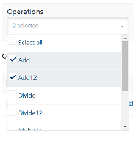
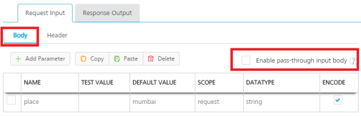
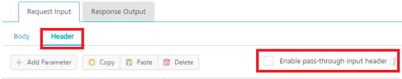
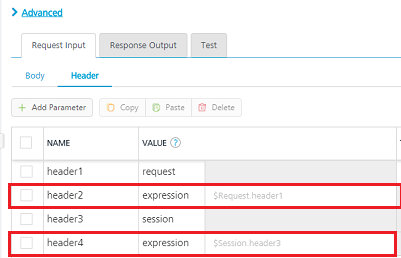
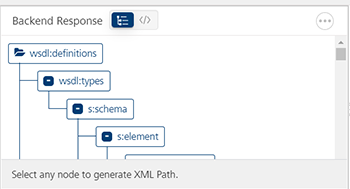

                         

Create a Web (SOAP)/SharePoint Service
--------------------------------------

A service that communicates with an external data source using a SOAP data connector over the HTTP protocol is known as an SOAP service, and you can construct your application to use multiple SOAP web services from various sources that work together. Configured using the Volt MX Foundry Console, SOAP web services manage the interface between the requests of your app to an SOAP based data source and the data source's responses to those requests.

To create the service definitions for an external data source providing SOAP interface, use the Web Service (SOAP) service definition tool. You need to have a WSDL URL or file to create the service definition.

### A SOAP Service Scenario

The remainder of this topic describes how you would use an SOAP service to retrieve data from a web site, such as a weather report. In this scenario, the following take place:

1.  In the digital application, the user enters a zip code (a keyword) directed to the URL of a weather website. The device initiates the service request.
2.  The response is fetched from the SharePoint service and is sent to the application.
3.  The response is displayed on a form to the user.

To view a video on using web services, see [Using Web Services](../../../video_tutorials/Content/StockTrack.md).

**_Notes:_***   After you provide the SharePoint server's IP address and port, Volt MX Iris loads all WSDLs exposed by SharePoint server. You can browse the WSDLs and their services associated with WSDLs. Users can view the WSDL service input and output parameters in the Web service definition files.
*   The input and output parameters can be classes or primitive types.
*   If you have defined the credentials of the SharePoint server, the credentials will show up within the **Web Services** folder. Expand the Web Services/SharePoint server folder and click the service you want to add.

The following procedures describe how you would configure a SOAP service to carry out this scenario.

[Create a SOAP Service](#create-a-soap-service)

[Publish the Service](PublishVoltMXFoundryServicesApp.md)

[Map the Service Output to Widgets on a Form](ActionsMapping.md).

### Create a SOAP Service

This procedure assumes that you have already configured Volt MX Foundry in Volt MX Iris. For more information, see [Connect to the Volt MX Foundry Console](Connect_to_VoltMXFoundry.md).

To create a SOAP service, follow these steps:

1.  In Volt MX Iris, open either an existing application or create a new one.
2.  If you have not done so already, log in to your Volt MX account. To do so, in the top right corner of the Volt MX Iris window, click **Login**. The Volt MX Account sign-in window opens. Enter your email and password credentials for your Volt MX user account, and then click **Sign in**.
3.  Create a new Volt MX Foundry application or use an existing one. To do so, on the **Data and Services** panel, click the context menu arrow, and then click either **Create New App**, or **Use Existing App**, and then select from the Volt MX Foundry Application dialog box the services application that you want to publish. The Volt MX Foundry Console opens.

    

    > **_Note:_** If you want to associate your Volt MX Iris project with a different Volt MX Foundry app, on the **Project** tab of the Project Explorer, click the context menu arrow for **VoltMX Foundry**, and then click **Unlink App**. To link to a different Volt MX Foundry app, click the context menu arrow for **VoltMX Foundry**, and then click either **Create New App**, or **Use Existing App**.

4.  To create a new integration service, on the **Integration** tab, click **CONFIGURE NEW**. The **Service Definition** section appears.

    

5.  In the **Name** box, provide a unique name for your service.
6.  Select _SOAP_ from the Service Type list.
7. In the **Base URL**, type or paste the URL from which the SOAP services are extracted.
8. In the **Client Authentication** list, select a value.
9. Click the **Advanced** tab to specify dependent JAR and API throttling. All options in the Advanced section are optional.
    *   **To specify dependent JAR, follow these steps**:
        
        Select the JAR containing preprocessor or postprocessor libraries from the drop-down list, or click **Upload New** to browse the JAR file from your local system. The step allows you to further filter the data sent to the back end:
        
        > **_Important:_** Make sure that you upload a custom JAR file that is built on the same JDK version used for installing Volt MX Foundry Integration.  
          
        For example, if the JDK version on the machine where Volt MX Foundry Integration is installed is 1.6, you must use the same JDK version to build your custom jar files. If the JDK version is different, an unsupported class version error will appear when a service is used from a device.
        
    *   **API throttling** enables you to limit the number of request calls within a minute. If an API exceeds the throttling limit, the API will not return the service response.**  
        To specify throttling, follow these steps:**  
        1.  In the **Total Rate Limit** text box, enter a required value. With this value, you can limit the number of requests configured in your Volt MX Foundry console in terms of Total Rate Limit.
            
        2.  In the **Rate Limit Per IP** text box, enter a required value. With this value, you can limit the number of IP address requests configured in your Volt MX Foundry console in terms of Per IP Rate Limit.
            
            > **_Note:_** In case of On-premises, the number of nodes in a clustered environment is set by configuring the `VOLTMX_SERVER_NUMBER_OF_NODES` property in the Admin Console. This property indicates the number of nodes configured in the cluster. The default value is 1.  
            Refer to [The Runtime Configuration tab on the Settings screen of App Services](../../../Foundry/vmf_integrationservice_admin_console_userguide/Content/Runtime_Configuration.md).  
              
            The total limit set in the Volt MX Foundry Console will be divided by the number of configured nodes. For example, a throttling limit of 600 requests/minute with three nodes will be calculated to be 200 requests/minute per node.  
            This is applicable for Cloud and On-premises.
            
    *   Enter the qualified name of the URL Provider Class. For more information, refer [URL Provider Support for XML, JSON, SOAP, and API Proxy](../../../MBaasDocs/ConsoleAndID/Foundry8.0ConsoleAndIDSrvUG/Content/URL Provider Support for XML, JSON, SOAP and API Proxy.md).
10. In the **Web Service Authentication**, select one of the following modes:
    
    *   **None**: Select this option if you do not want to provide any authentication for the service.
    *   **Basic**: Provide User ID and Password if the external Web service requires form or basic authentication.
    *   **NTLM**: Your service follows the NT LAN Manager authentication process. You are required to provide the User ID, Password, NTLM Host, and NTLM Domain.
    
    > **_Important:_** If you configure an integration service with Basic web service authentication, ensure that reserved IDs are not used as input or header IDs since some key words such as userid, pwd and password are reserved by middleware services.
    
11. Click **Save**. A new tab titled **Operations List** appears. Click it.
12. Select an operation from the list of operations.

    

13. Click **Add Operation**. The operation is added to the service.

    > **_Important:_** While configuring an integration service with basic auth mode, ensure that some reserved IDs are not used as input/header IDs. Key words such as userid, pwd and password are reserved by middleware when a user selects basic auth mode.

14. Click the added service.
15. Select one of the following security operations in the Operation Security Level field. By default, this field is set to Authenticated App User. You can restrict access to this operation based on the following levels:
    *   Authenticated App User – indicates that this operation is secured. To use this operation, an app user must be authenticated by an associated identity service.
    *   Anonymous App User – indicates that a user must have the app key and app secret to access this operation.
    *   Public – indicates that this operation requires no special security.
16. In the **Operation Path** box, modify the path if required.
17. Select a method for the operation from **HTTP Methods** list.
18. Click **Request Input** and do the following.
    
    Integration services accept only `form-url-encoded` inputs for all input parameters provided in service input parameters (request input).
    
    > **_Note:_**  You can add an entry by clicking the **Add Parameter** button if entries for the input and the output tabs do not exist.  
      
    \-  To make duplicate entries, select the check box for the entry, click **Copy**, and then click **Paste**.  
      
    \-  To delete an entry, select the check box for an entry, and then click the **Delete** button.
    
    1.  Under the **Body** tab, do the following:
        
        *   To forward the body of the client's request to backend as it is, select the **Enable pass-through input body** check box. For more details on API Proxy service, refer to [How to Enable Pass-through Proxy for Operations](#APIProxyCheckBox).
            
            
            
        *   To configure parameters in the client's body, do the following.
            1.  In the **NAME** field, enter the name for the request input parameter.
            2.  **VALUE:** select request or session. By default, this field is set to **Request.** three different options are available in Volt MX Foundry under **Request Input > Body** > **VALUE** during configuration of any operation. When you start editing this field, dependent identity services are auto populated. These options primarily determine the source of the value of the header**.**
                *   **Request**: If this option is selected, the Integration Server picks the value pairs from the client's request during run time and forwards the same to the back-end.
                    
                    User has the option to configure the default value. This default value is taken if the request does not have the header.
                    
                *   **Session**: If this option is selected, the value of header is picked from session context based on the user configuration.
                *   **Identity**: If this is selected, you can filter the request parameters based on the response from the identity provider. For more details to configure identity filters.
            3.  **TEST VALUE**: Enter a value. A test value is used for testing the service.
            4.  **DEFAULT VALUE:** enter the value if required. The default value will be used if the test value is empty.
            5.  Select the **ENCODE** check box to enable an input parameter to be encoded. For example, the name New York Times would be encoded as _New_York_Times_  when the encoding is set to True. The encoding must also adhere to the HTML URL encoding standards.
    2.  Click the **Header** tab to provide the following customer headers:
        
        Based on the operation - for example, post or get -, provide custom HTTP headers. To provide customer headers, click **Header**.
        
        
        
        *   To forward the header of the client's request to backend as it is, select the **Enable pass-through input header** check box. For more details on API Proxy service, refer to [How to Enable Pass-through Proxy for Operations](#APIProxyCheckBox).
        *   To configure parameters in the client's header, do the following.
            
            1.  In the **NAME** field, enter the name for the request input parameter.
            2.  **VALUE:** select request or session. By default, this field is set to **Request.** Five different options are available in Volt MX Foundry under **Request Input > Headers** > **VALUE** during configuration of any operation. When you start editing this field, dependent identity services are auto populated. These options primarily determine the source of the value of the header**.**
                *   **Request**: If this option is selected, the Integration Server picks the value pairs from the client's request during run time and forwards the same to the back-end.
                    
                    User has the option to configure the default value. This default value is taken if the request does not have the header.
                    
                *   **Session**: If this option is selected, the value of header is picked from session context based on the user configuration.
                *   **Constant**: Constant is used to configure the value that is picked and sent to back-end by the Integration Server during the run-time.
                *   **Expression**: Select this option to configure the velocity template expressions for the header values.
                    
                    You cannot edit the default value for expression.
                    
                *   **Identity**: If this is selected, you can filter the request parameters based on the response from the identity provider. For more details to configure identity filters.
                    > **_Note:_** If the header value is scoped as a **Request** (or) **Session** and the same header is accessed under the **Expression** header value, then the expression must be represented as $request.header (or) $session.header.  
                      
                    **Example**: If a header 1 value is a request and header 2 value is an expression, then the value of the expression must be $Request.header1.  
                      
                    
                    
            3.  **TEST VALUE**: Enter a value. A test value is used for testing the service.
            4.  **DEFAULT VALUE:** enter the value if required. The default value will be used if the test value is empty.
            5.  **DESCRIPTION**: Enter a proper description.
            
            To validate the details, click **Fetch Response**. The result of the operation appears.
            
19. In the **Response Output** tab, provide the following details.

Output parameters are the parameters that are fetched from the response of a service call and return to the calling device. You can configure as many or few output parameters as you need. Trimming the dataset saves bandwidth. You can define output parameters as collections or single values. Collections are useful when you have repeating rows of data like the images that appear in your application

*   Click **Add**. A row gets added to the table.
*   Enter values for **ID**. It is advisable to create an ID that easily identifies the elements that is likely to capture from the response.
*   Apply **XPath** for extracting the required elements from the response of the service call. XPath is used to navigate through elements and attributes in an XML document. For more information about _XPath_, see [https://www.w3schools.com/xml/xml\_xpath.asp](https://www.w3schools.com/xml/xml_xpath.asp).
    
    In this example, XPath is configured as:
    
    > **_Note:_** Volt MX Iris supports all functions of XPath 1.0, except the translate function.
    
    | ID | XPath |
    | --- | --- |
    | State | //GetCityWeatherByZIPResponse/GetCityWeatherByZIPResult/State |
    | City | //GetCityWeatherByZIPResponse/GetCityWeatherByZIPResult/City |
    | Temperature | //GetCityWeatherByZIPResponse/GetCityWeatherByZIPResult/Temperature |
    | Humidity | //GetCityWeatherByZIPResponse/GetCityWeatherByZIPResult/RelativeHumidity |
    | Wind | //GetCityWeatherByZIPResponse/GetCityWeatherByZIPResult/Wind |
    
    *   Select a value for **Scope** from the drop-down list. **Scope** denotes the scope of the parameter, if it is limited to _response_ or _session_.
    *   Select a value for **Datatype** from the drop-down list. Datatype denotes the type of the parameter.
    *   **Collection ID** - Groups data elements under the specified parameter as a collection. Collection is created to assign grouped data to segment or a table in the UI.
    *   **Record ID** - Groups data elements under the specified parameter as a record. Typically this is used to provide metadata to the segment.
    *   **Format** - Can be set to None, currency, number or date.
    *   **Format Value** - Provide the conversion standard for the selected format.
    *   If a parameter row needs to be deleted, select the parameter row to be deleted and click **Delete**. This action removes the parameter row from the list of service parameters.

20. Click **Advanced**.
    *   **Custom Code Invocation**: Upload a JAR file containing the pre-processor class name and post-processor class name. This step allows you to further filter the data received from a service call.
    
    > **_Note:_** For more information on Pre-processor and Post-processor, see the section [Preprocessor/Post Processor](Preprocessor_Postprocessor.md).
    
    *   **HTTP Headers**: You can provide the HTTP Headers for the call.
    *   **Properties**: You can configure various advanced service properties.
    *   **Timeout** (in ms) - Specify the maximum time (in milli-seconds) the service waits for a response, before terminating the connection to the external data source.
    *   **Cacheable** - Specify if the service response must be stored in the cache.
    *   **Cacheable Duration** - This option is enabled if you select the **Cacheable** property. This property specifies the time duration in seconds.
        
        > **_Note:_** If this service is **Cacheable** and a call is made before the specified time duration, the service response is fetched from the Cache, else a fresh service call is made to fetch response from the server.
        
    *   Click **Save Operation** to the save the operation.
21. Click **Test** to view the result of the operation. The results are displayed in Output Result area.

*   You can view the back-end response in Backend Response tab.
*   In Backend Response, you can view the raw response or view the response in a tree format. Clicking on a element in the tree displays the Xpath of that tag.

    

22. Click **Test**. The Result of the operation appears.
23. Click **Save Operation** to the save the operation.
24. To close the Volt MX Foundry Console and return to the panes, views, and tabs of the Volt MX Iris integrated development environment (IDE), from the Quick Launch Bar along the upper left edge of Volt MX Iris, click the Workspace icon . Since you are still logged in to your Volt MX account, Volt MX Iris continues to have access to your Volt MX Foundry services.
