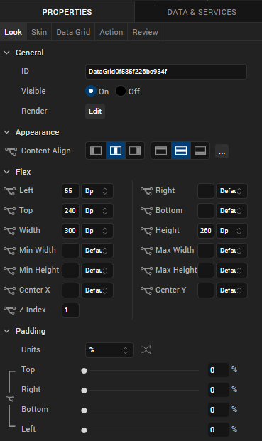
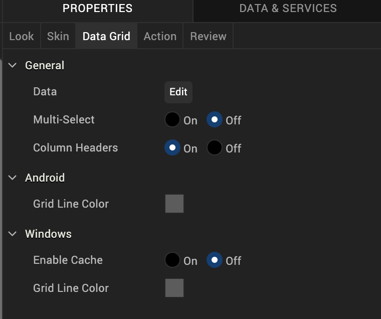
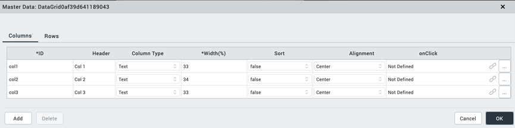

                           

DataGrid
--------

Use a DataGrid widget to display a collection of data in rows and columns (tabular format). The DataGrid widget supports common table formatting options, such as alternating the row background color, customizing the grid line, and the ability to hide or show headers.

To learn how to use this widget programmatically, refer [VoltMX Iris Widget guide](../../../Iris/iris_widget_prog_guide/Content/DataGrid.md).

### Important Considerations

The following are important considerations for a DataGrid widget.

*   To set the data, first specify the rows and columns using the [Data](#data) property.
*   If the DataGrid supports the [Multi-Select](#multi-select) property, make sure to specify a [Row - Focus](#multi-select) property. Otherwise, you will not be able to distinguish multiple selections.
    

### Look Properties

Look properties define the appearance of the widget. The following are the major properties you can set:

*   Whether the widget is visible.
*   The platforms on which the widget is rendered.
*   How the widget aligns with its parent widget and neighboring widgets.
*   If the widget displays content, where the content appears.

For descriptions of the properties available on the Look tab of the Properties pane, see [Look](Look.md#Flex).

### Skin Properties

Skin properties define a skin for the widget, including background color, borders, and shadows. If the widget includes text, you can also specify the text font.

For a DataGrid widget, you can apply a skin and its associated properties for the following states:

  
| Skin | Definition |
| --- | --- |
| Header | The skin applied to the Header row. |
| Row | The skin applied when the row does not have the focus. |
| Row - Alternate | The skin applied to alternate rows. |
| Row - Focus | The skin applied when the row has the focus. |
| Hover Skin | The look and feel of the widget when the cursor hovers over the widget. > **_Note:_** Hover skins are available only on the Windows (native) Tablet platform. |

For more information about applying skins, see [Understanding Skins and Themes](Customizing_the_Look_and_Feel_with_Skins.md).

### DataGrid Properties

DataGrid properties specify properties that are available on any platform supported by Volt MX Iris, and assign platform-specific properties.

#### Data

Represents the data displayed in each cell of the data grid.

To input the data, click the **Edit** button to open the **Master Data : DataGrid** dialog box.

The **Master Data : DataGrid** dialog box includes two tabs:

*   Columns
*   Rows

**Columns**

The Columns table lets you provide details such as:

*   ID: Specifies the unique identifier of a column.
*   Header: Specifies the Column header.
*   Column Type: Specifies whether the column type is text or image.
*   Width (%): Specifies the width of each column as percentage of the data grid.
*   Sort: Specifies whether sorting is enabled for the column.
*   Alignment: Specifies the alignment of the content in each column. The following alignment options are available:
    *   Top-Left
        
    *   Top-Center
    *   Top-Right
    *   Middle-Left
    *   Center
        
    *   Middle-Right
    *   Bottom-Left
    *   Bottom-Center
        
    *   Bottom-Right
        
*   OnClick: Specifies an action that takes place when you click on the header of a column. To specify an OnClick action for a column, click the ellipses button (...).

**Rows**

The fields in the **Rows** tab are based on the inputs provided in the **Columns** tab and include:

*   Column Headers are the **Header** values specified in the **Columns** tab.
*   Table cells whose **Column Type** is **Text** are text fields. You can type the text within these cells.
*   Table cells whose **Column Type** is **Image** are image fields. You can choose an image to be displayed in these cells. Click the ellipses button (...) in the image field to open the**Select Image** dialog box, and then select an image or provide the URL of the image and click **OK**. The selected image displays in the cell.
*   The text or image is aligned according to the **Alignment** setting.

#### Multi-Select

Specifies whether you can choose multiple rows of the DataGird. The [Row - Focus](#Specifies) skin is applied to selected rows.

#### Column Headers

Specifies the visibility of the DataGrid column headers.

#### Grid Line Color

Specifies the color of the grid line.

> **_Note:_** This property is specific to the Android platform.

#### Tool Tip

For the Windows Tablet platform, specifies a message that displays when you hover the mouse pointer over the widget .

### Actions

Actions define what happens when an event occurs. On a DataGrid widget, you can run an action when the following event occurs:

*   onRowSelected: The action is triggered when a row is selected.
*   onTouchStart: The action is triggered when the user touches the touch surface. This event occurs asynchronously.
*   onTouchMove: The action is triggered when the touch moves on the touch surface continuously until movement ends. This event occurs asynchronously.
*   onTouchEnd: The action is triggered when the user touch is released from the touch surface. This event occurs asynchronously.

For more information on using this action, see [Add Actions](working_with_Action_Editor.md).

### Placement Inside a Widget

The following table summarizes where a DataGrid widget can be placed:

<table style="mc-table-style: url('Resources/TableStyles/Basic.css');" class="TableStyle-Basic" cellspacing="0"><colgroup><col class="TableStyle-Basic-Column-Column1"> <col class="TableStyle-Basic-Column-Column1"></colgroup><tbody><tr class="TableStyle-Basic-Body-Body1"><td class="TableStyle-Basic-BodyE-Column1-Body1">Flex Form</td><td class="TableStyle-Basic-BodyD-Column1-Body1">Yes</td></tr><tr class="TableStyle-Basic-Body-Body1"><td class="TableStyle-Basic-BodyE-Column1-Body1">VBox Form</td><td class="TableStyle-Basic-BodyD-Column1-Body1">Yes</td></tr><tr class="TableStyle-Basic-Body-Body1"><td class="TableStyle-Basic-BodyE-Column1-Body1">FlexContainer</td><td class="TableStyle-Basic-BodyD-Column1-Body1">Yes</td></tr><tr class="TableStyle-Basic-Body-Body1"><td class="TableStyle-Basic-BodyE-Column1-Body1">FlexScrollContainer</td><td class="TableStyle-Basic-BodyD-Column1-Body1">Yes</td></tr><tr class="TableStyle-Basic-Body-Body1"><td class="TableStyle-Basic-BodyE-Column1-Body1">ScrollBox</td><td class="TableStyle-Basic-BodyD-Column1-Body1">Horizontal Orientation - YesVertical Orientation - Yes</td></tr><tr class="TableStyle-Basic-Body-Body1"><td class="TableStyle-Basic-BodyE-Column1-Body1">Tab</td><td class="TableStyle-Basic-BodyD-Column1-Body1">Yes</td></tr><tr class="TableStyle-Basic-Body-Body1"><td class="TableStyle-Basic-BodyE-Column1-Body1">Segment</td><td class="TableStyle-Basic-BodyD-Column1-Body1">No</td></tr><tr class="TableStyle-Basic-Body-Body1"><td class="TableStyle-Basic-BodyE-Column1-Body1">Popup</td><td class="TableStyle-Basic-BodyD-Column1-Body1">Yes</td></tr><tr class="TableStyle-Basic-Body-Body1"><td class="TableStyle-Basic-BodyB-Column1-Body1">Template&nbsp;</td><td class="TableStyle-Basic-BodyA-Column1-Body1">Header- NoFooter- No</td></tr></tbody></table>

<table style="margin-left: 0;margin-right: auto;mc-table-style: url]('Resources/TableStyles/RevisionTable.css');" class="TableStyle-RevisionTable" cellspacing="0" data-mc-conditions="Default.md5 Only"><colgroup><col class="TableStyle-RevisionTable-Column-Column1" style="width: 26px;"> <col class="TableStyle-RevisionTable-Column-Column1"> <col class="TableStyle-RevisionTable-Column-Column1"></colgroup><tbody><tr class="TableStyle-RevisionTable-Body-Body1"><td class="TableStyle-RevisionTable-BodyE-Column1-Body1" data-mc-conditions="Default.HTML5 Only">Rev</td><td class="TableStyle-RevisionTable-BodyE-Column1-Body1" data-mc-conditions="Default.HTML5 Only">Author</td><td class="TableStyle-RevisionTable-BodyD-Column1-Body1" data-mc-conditions="Default.HTML5 Only">Edits</td></tr><tr class="TableStyle-RevisionTable-Body-Body1"><td class="TableStyle-RevisionTable-BodyE-Column1-Body1" data-mc-conditions="Default.HTML5 Only">8</td><td class="TableStyle-RevisionTable-BodyE-Column1-Body1" data-mc-conditions="Default.HTML5 Only">SHS</td><td class="TableStyle-RevisionTable-BodyD-Column1-Body1" data-mc-conditions="Default.HTML5 Only">SHS</td></tr><tr class="TableStyle-RevisionTable-Body-Body1"><td class="TableStyle-RevisionTable-BodyB-Column1-Body1" data-mc-conditions="Default.HTML5 Only">7.2.1</td><td class="TableStyle-RevisionTable-BodyB-Column1-Body1" data-mc-conditions="Default.HTML5 Only">SHS</td><td class="TableStyle-RevisionTable-BodyA-Column1-Body1" data-mc-conditions="Default.HTML5 Only">SHS</td></tr></tbody></table>
