                          

Use Data & Services Panel Features
==================================

Use Sample Services
-------------------

This section provides information on how to discover and use existing sample services in an app.

In Iris, a set of sample Integration and Object services are bundled. These services are uploaded to Volt MX Foundry when the sample data is dragged onto a form. When you drag and drop a sample service operation on a form, a project service is added. This is the operation with which the view mapping action is associated.

If the sample service that you are trying to create already exists, a **Conflict** window appears. You must perform any one of the following actions:

*   Select the Skip radio button, and then click Ok to use the original service.
    *   If multiple instances of the same service exist and you want to use the original service, click Skip All.
*   Select the Replace radio button, and then click Ok to use a new service.
    *   If multiple instances of the same service exist and you want to use a new service, click Replace All.

If any services are already associated to your Volt MX Foundry application, you can view them in the Data & Services panel. You can drag and drop these services on to various widgets in a form. When you perform the drag and drop action, the code is auto-generated to bind the UI element to the back-end service.

The type of code generated depends on:

*   The type of service that is being created (GET, POST, DELETE, UPDATE)
*   The type of widget it is being mapped to
*   Once a data widget is linked to the Post Operation, the data is sent based on test parameters and not based on the label's text value.

You can use the following types of sample services and bind them to various forms in your application:

*   Use a Sample Identity Service
*   Use a Sample Integration Service
*   Use a Sample Object Service

> **_Note:_** If you invoke the same service and operation on any action in a form or its child widgets, the mapping gets added to that service call. If multiple such service calls exist, you must select the service call to which you want to add the mapping.

#### Use a Sample Identity Service

You can view Identity services in the Data & Services panel. You can also set up new Identity services. Once you configure the Identity service, you can view the request and response parameters in the Data & Services panel.

The login credentials for the bundled sample Identity service are as follows:

*   **User ID**: testuser@samples.voltmx.com
*   **Password**: test@123

To use a sample Identity service, do the following:

1.  In Volt MX Iris, create a new project or open an existing one.
2.  Create a form; for example, frmSample.
3.  From the **Data & Services** panel, click Sample Services. The list of pre-configured services appears.  
      
    
4.  Expand **MicrosoftActiveDirectory**; the login and logout services appear.
5.  Drag and drop the login service on to the form.  
      
    
6.  Post this action, widgets are added to the form and the Identity service is associated with the form. The service also appears under Project Services in an auto-highlighted state. Here, the **MicrosoftActiveDirectory** service is auto-highlighted.  
      
    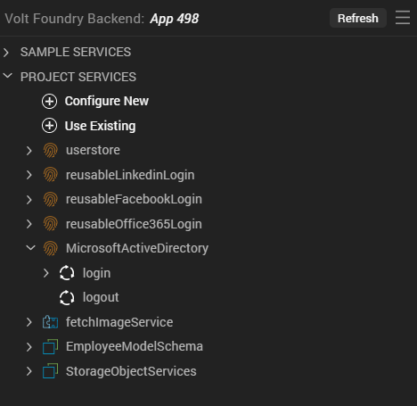  
    You can expand the **login** service to view its Request parameters. The mapped parameters of any service appear in a bold and italics style to differentiate from unmapped parameters. Here, **userid** and **password** are displayed in a bolded and italicized manner.  
      
    You can also click **View Mapping** to view the mapping details of the **login** service in the Action Editor. The specific operation of the service is auto-highlighted in the Action Editor. Click **Generate Code** to view all the mappings of the **login** operation.  
    Dragging and dropping operations onto the form leads to the auto-generation of UI elements.  
      
    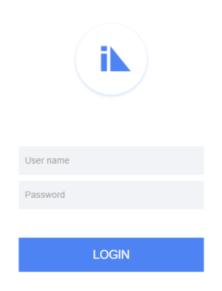  
    

#### Use a Sample Integration Service

You can view Integration services in the Data Panel. You can also set up new data sources. Once you configure the Integration service, you can view the request and response parameters in the Data & Services panel.

To use a sample Integration service, do the following:

1.  In Volt MX Iris, create a new project or open an existing one.
2.  Create a form; for example, frmSample.
3.  From the **Data & Services** panel, select **Sample Services**. The list of pre-configured services appears.  
      
    
4.  Expand any Integration service. Here, **Locations**, **Countries**, and **Contacts** are the sample Integration services.  
      
    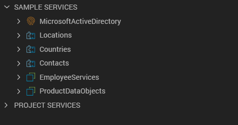
5.  Expand any service to view its available Request or Response parameter. The respective responseList or requestList is auto-displayed. Here, **Contacts > getContacts > Response > responseList**.  
      
    
6.  You can perform any of the following actions:
    *   Drag and drop the service onto your form.  
        A dialog box appears asking you to generate either a List, or a Details, or an Entry form. You can select any of the three options as follows:
        *   List Using Response: If the response contains a collection, a Segment is added to the parent form. This Segment is mapped to the Response parameter of the service.
        *   Details Using Response: A FlexContainer with Labels is added. These Labels are mapped to the Response parameter of the service.
        *   Entry form for Request: A FlexScrollContainer containing TextBoxes and Labels is added. The TextBoxes are mapped to the Request parameter of the operation.
    *   Alternatively, you can directly drag and drop either the Response or Request parameter of the service onto the form:
        *   Drag and drop Response parameter: If a service invocation already exists in the form, the Response parameter is added to the mapping of that service invocation. Otherwise, a new service invocation is added to the form's onMapping Event.
        *   Drag and drop Request parameter: If a service invocation already exists in the form, this mapping is appended to it. Otherwise, a new service invocation is added on a generated Button widget.
7.  Post this action, widgets are added to the form and the Integration service is associated with the form.  
    

The selected Integration service appears under Project Services. You can expand any service to view its Request or Response parameters. The mapped parameters of any service appear in a bold and italics style to differentiate from unmapped parameters. Here, **responseList** appears in bold and italics format.

You can also click **View Mapping** to view the mapping details of the **getContacts** service in the Action Editor. The specific operation of the service is auto-highlighted in the Action Editor. Click **Generate Code** to view all the mappings of the **getContacts** operation.

Dragging and dropping operations onto the form leads to the auto-generation of UI elements.

#### Use a Sample Object Service

To use a sample Object service, do the following:

1.  In Volt MX Iris, create a new project or open an existing one.
2.  Create a form; for example, frmSample.
3.  From the **Data & Services** panel, select **Sample Services**. The list of pre-configured services appears.  
      
    
4.  Expand any Object service. Here, **EmployeeDataObjects** and **ProductDataObjects** are the sample Object services.  
      
    
5.  Expand any Object service to view its available Request parameter. The respective responseList or requestList is auto-displayed. Here, **Employee Services > employees > get > Response > records**.  
      
    
6.  You can perform any of the following actions:
    *   Drag and drop the service on to your form.  
        A dialog box appears asking you to generate either a List, or a Details, or an Entry form. You can select any of the three options as follows:
        
        *   List Using Response: If the response contains a collection, a Segment is added to the parent form. This Segment is mapped to the Response parameter of the service.
            
        *   Entry form for Request: A FlexScrollContainer containing TextBoxes and Labels is added. The TextBoxes are mapped to the Request parameters of the service.
        
        > **_Note:_** For the GET method in Object Services, the Entry form for Request option is disabled.
        
        *   Details Using Response: A FlexContainer containing Labels is added. These Labels are mapped to the Response parameters of the service.
    *   Alternatively, you can directly drag and drop either the Response or Request parameter of the service onto the form:
        *   Drag and drop Response parameter: If a service invocation already exists in the form, this is added to the mapping of that service invocation. Otherwise, a new service invocation is added to the form's onMapping Event.
            
        *   Drag and drop Request parameter: If a service invocation already exists in the form, this mapping is appended to it. Otherwise, a new service invocation is added on a generated Button widget.
7.  Post this action, widgets are added to the form and the Object service is associated with the form.  
      
    

The selected Object service appears under Project Services. You can expand any service to view its Request or Response parameters. The mapped parameters of any service appear in a bold and italics style to differentiate from unmapped parameters.

  

When you use the **create** method with primary key as **incidentID**, a Response parameter is automatically generated based on the run-time response of the app. under **create** > **Response** on the Data & Services panel.

You can also click **View Mapping** to view the mapping details of the **get** service in the Action Editor. The specific operation of the service is auto-highlighted in the Action Editor. Click **Generate Code** to view all the mappings of the **get** operation.

Dragging and dropping operations onto the form leads to the auto-generation of UI elements.

Use Existing Services
---------------------

This section explains how to use and configure existing Identity, Integration, and Object services in your application by using the Data & Services panel.

From the Data & Services panel, configure existing sample services through a simplified view of Volt MX Foundry console. You can view the associated services in your corresponding Volt MX Foundry app.

To select and use an existing Identity/Integration/Object service, do the following:

1.  In Volt MX Iris, create or open your project.
2.  From the **Data & Services** panel, select **Project Services** from the list. The list of available services appears.
3.  Click **Use Existing**. A list of options appears.
    
4.  Select either **Identity**, **Integration**, or **Objects**, and then sign in to your Volt MX account to use the required service available in your Volt MX Foundry instance:
    *   For Identity service: The **Select Identity Service(s)** window appears.  
        Choose the required Identity service; if no service is available in your Volt MX Foundry Console, you need to configure one. Specify the details in the required fields, and then click **Save**. For more information on how to create an Identity service, click [here](../../../Foundry/voltmx_foundry_user_guide/Content/Identity.md).
    *   For Integration service: The **Select Integration Service(s)** window appears.  
        Choose the required Integration service; if no service is available in your Volt MX Foundry Console, you need to configure one. Specify the details in the required fields, and then click **Save & Add Operation**. For more information on how to create an Integration service, click [here](../../../Iris/iris_user_guide/Content/Connecting_to_Services.md). In this case, the [Salesforce Integration](../../../Iris/iris_user_guide/Content/Sfdc_service.md) service.  
          
        
    *   For Object service: The **Select Object Service(s)** window appears.  
        Choose the required Object service; if no service is available in your Volt MX Foundry Console, you need to configure one. Specify the details in the required fields, and then click **Save & Generate**. For more information on how to create an Object service, click [here](../../../Foundry/voltmx_foundry_user_guide/Content/ObjectsServices/Objectservices_Stage1.md).  
          
        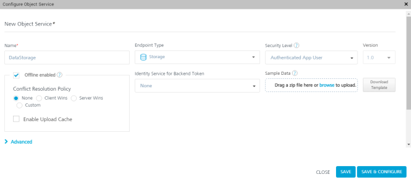
5.  Once the service is created, it is displayed in the Project Services list. You can then directly drag and drop the service onto a form and start using it.

Create and Use New Services
---------------------------

This section explains how to create new services by using the Data & Services panel and how to use those services in your application.

From the Data Panel, you can set up new data sources (VoltMX Foundry services) through a simplified view of Volt MX Foundry console. You can view the associated services in your corresponding Volt MX Foundry app.

### Create an Identity Service

If your Identity service type is a basic one, the input parameters are username and password. Even for the OAuth password grant type of service, the parameters are username and password. For all other types of OAuth services, there are no input parameters. The SAML Identity service follows a similar pattern as the OAuth service.

You can view two types of operations for Identity services: login and logout. The SDK code is auto-generated for each operation. You can edit an Identity service by right-clicking on the service and then selecting the Edit option.

To create a new Identity service, do the following:

1.  In Volt MX Iris, open your project.
2.  From the **Data & Services panel**, select **Project Services** from the list. The list of available services appears.
3.  Click **Configure New**. A list of services that you can configure appears.
4.  Under Authenticate, select an Identity service; in this case, **Microsoft Active Directory**.  
      
    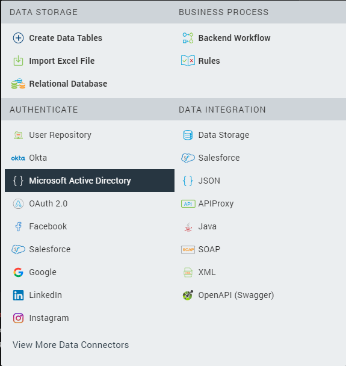
5.  The **Configure Identity Service** window appears, by using which you need to configure the **Microsoft Active Directory** service. Specify the details in the required fields, and then click **Save**. For more information on how to create an Identity service, click [here](../../../Foundry/voltmx_foundry_user_guide/Content/Identity.md).  
      
     
6.  Once the service is created, it is displayed in the Project Services list. You can then directly drag and drop the service onto a form and start using it.

When you drag and drop an Identity service onto a form, various widgets are created automatically on the form based on the type of service: OAuth or Non-OAuth. For a Non-OAuth service, two text fields (username and password) and a button (Login) are generated. For an OAuth service, only a Login button is generated.

When you click the View button, the newly created form appears. The form’s pre-show invokes the Identity service and passes the reference of the Browser widget. You can modify the Browser widget, which you linked to the button, with a different Browser widget.

> **_Note:_** The Data & Services panel supports all types of Identity providers such as Volt MX user Store, Google, Salesforce, and Facebook.

> **_Note:_** The reference of the device Browser widget is mandatory for Google OAuth 2.0 services. For this service, the deeplink URL is auto-generated by Volt MX Iris.

### Create an Integration Service

By default, you can view Integration services in the Data & Services panel. You can also set up new data sources. Once you configure the Integration service, you can view the request and response parameters.

To create a new Integration service, do the following:

1.  In Volt MX Iris, open your project.
2.  From the **Data & Services panel**, expand **Project Services**.
3.  Click **Configure New** to configure a new Integration service. A list of services that you can configure appears.
4.   Under Get Data, select an Integration service; in this case, **Salesforce**.  
      
    
5.  The **Configure Integration Service** window appears, by using which you need to configure the **Salesforce** service. Specify the details in the required fields, and then click **Save & Add Operation**. For more information on how to create an Integration service, click [here](../../../Iris/iris_user_guide/Content/Connecting_to_Services.md). In this case, the [Salesforce Integration](../../../Iris/iris_user_guide/Content/Sfdc_service.md) service.  
      
    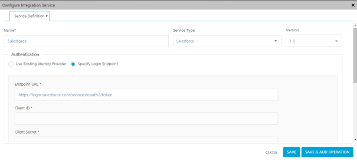
6.  Once the service is created, it is displayed in the Project Services list. You can then directly drag and drop the service onto a form and start using it.  
    

### Create an Object Service

You can view Object services in the Data & Services panel. You can also set up new data sources. Once you configure an Object service, you can view the request and response parameters.

To create a new Object service, follow these steps:

1.  In Volt MX Iris, open your project.
2.  From the **Data & Services** panel, expand **Project Services**.
3.  Click **Configure New**. A list of services that you can add appears.
4.  Under the Data Integration section, select an Object service. Here, **Data Storage** is the Object service.
    
    > **_Note:_** In Volt MX Iris V9 SP 2, the Data Storage Object service is available under the **Data Integration** section in the list of services.
    
    
    

1.  The **Configure Object Service** window appears, with **Endpoint Type** selected as **Storage** by default. You must type the **Name** of the Data Storage Object service and also specify other details in the necessary fields. Then either click **Save & Configure** to configure the object data model or click **Save** to just save the new service. For more information on how to create an Object service, click [here](../../../Foundry/voltmx_foundry_user_guide/Content/ObjectsServices/Objectservices_Stage1.md).
    
      
      
    
2.  After the service is created, it is displayed under **Project Services** > **Objects**. You can then directly drag and drop the service onto a form and start using it.  
      
    

### Create a Backend Workflow Service

You can view Backend Workflow services in the Data & Services panel. Using Workflow, you can visualize and design a backend process by simply dragging and dropping different types of nodes and connecting them as per the logic you need.

To create a new Backend Workflow service, do the following:

1.  In Volt MX Iris, open your project.
2.  From the **Data & Services panel**, expand **Project Services**.
3.  Click **Configure New** to configure a new Backend Workflow.  
    A list of services that you can configure appears.
4.   Under **Business Process**, select **Backend Workflow**.  
      
    

The **Configure Workflow Service** window appears.  

6.  In the **Name** field, type a unique name for the Backend Workflow service.
7.  From the **Linked Object** list, select the object to which you want to link the new Workflow service. You can either select an existing Object service or Create a new Object service.  
    
8.  From the **Nodes** pane, drag and drop the required nodes onto the canvas to create a process.  
    For more information on how to create a Backend Workflow service, click [here](../../../Foundry/voltmx_foundry_workflow/Content/Workflow.md#Create).
9.  Click **Save**. The service is created and appears in the Project Services list. The Workflow service invokes when you drag and drop the associated Object service onto a form and start using it.  
    

### Create a Rules Service

You can view a Rules services in the Data & Services panel. Using Rules, you can define and store your business logic as a set of rules, or a collection of rules stored as a Ruleset.

To create a new Rules service, do the following:

1.  In Volt MX Iris, open your project.
2.  From the **Data & Services panel**, expand **Project Services**.
3.  Click **Configure New**.  
    A list of services that you can configure appears.
4.   Under **Business Process**, select **Rules**.  
      
    

The **Configure Rules Service** window appears.  
  

6.  In the **Name** field, type a unique name for the Rules service, and also specify other details in the necessary fields.  
    For more information on how to create a Rules service, click [here](../../../Foundry/voltmx_foundry_user_guide/Content/Rules_as_a_Service.md#HowtoWriteRules-as-a-Service).
7.  Click **Save & Add Rule** to configure the Ruleset, or click **Save** to just save the new service.  
    After the service is created, it is displayed under **Project Services** > **Rules**.  
    

Use Project Services
--------------------

This section provides information on how to discover and use a Project service from the Data & Services panel.

### Use an Identity Project Service

To use an Identity Project service, do the following:

1.  In Volt MX Iris, open your project.
2.  Create a form; for example, frmSample.
3.  On frmSample, add button widgets to which you want to add the service.
4.  From the **Data & Services panel**, expand **Project Services**.  
    
5.  Click **Use Existing**.  
    A list of available services appears.  
    
6.  Click **Identity Service**.  
    The **Select Identity Service** dialog box appears.
7.  Select the required service from the list of available services, and then click **Add**.  
    The service appears in the Data & Services panel.
8.  Expand the service that you want to use and view the requests/responses of the service.
9.  Drag and drop appropriate services on to the buttons. The Identity service is associated with the form.

### Use an Integration Project Service

To use an Integration Project service, do the following:

1.  In Volt MX Iris, open your project.
2.  From the **Data & Services panel**, expand **Project Services**.  
    
3.  Click **Use Existing**.  
    A list of available services appears.  
    
4.  Click **Integration Service**.  
    The **Select Integration Service** dialog box appears.
5.  Select the required service from the list of available services, and then click **Add**.  
    The service appears in the Data & Services panel.
6.  Expand the service that you want to use and view the requests/responses of the service.
7.  Drag and drop the service onto your form. The service is associated with the form.

### Use an Object Project Service

To use an Object Project service, do the following:

1.  In Volt MX Iris, open your project.
2.  From the **Data & Services panel**, expand **Project Services**.  
    
3.  Click **Use Existing**.  
    A list of available services appears.  
    
4.  Click **Object Service**.  
    The **Select Object Service** dialog box appears.
5.  Select the required service from the list of available services, and then click **Add**.  
    The service appears in the Data & Services panel.
6.  Expand the service that you want to use and view the requests/responses of the service method.
7.  Drag and drop the service onto your form. The service is associated with the form.

### Use a Backend Workflow

To use a Backend Workflow service, do the following:

1.  In Volt MX Iris, open your project.
2.  From the **Data & Services panel**, expand **Project Services**.  
    
3.  Click **Use Existing**.  
    A list of available services appears.  
    
4.  Click **Backend Workflow**.  
    The **Select Workflow Service** dialog box appears.
5.  Select the required service from the list of available services, and then click **Add**.  
    The service appears in the Data & Services panel.
6.  Expand the Object service that you associated with the Backend Workflow, and view the requests/responses of the service method.
7.  Drag and drop the Object service onto your form. The service and the Workflow associated with the service are associated with the form.

### Use a Rules Service

To use a Rules service, do the following:

1.  In Volt MX Iris, open your project.
2.  From the **Data & Services panel**, expand **Project Services**.  
    
3.  Click **Use Existing**.  
    A list of available services appears.  
    
4.  Click **Rules Service**.  
    The **Select Rules Service** dialog box appears.
5.  Select the required service from the list of available services, and then click **Add**.  
    The service appears in the Data & Services panel.

### Disable/Enable the Categorization of Project Services

In Volt MX Iris V9 SP 2, the service categories are displayed under Project Services only when a service is linked from the Data & Services panel. In addition, an option to disable/enable the categorization of linked services under Project Services has been provided in the **Iris Preferences** window.

To disable/enable the categorization of linked services under Project Services, follow these steps:

1.  In Volt MX Iris, click **Edit** > **Preferences**. The **Iris Preferences** window appears.  
      
    
2.  Click the **VoltMX Foundry** tab.
3.  Under the **Data & Services Panel** section, the **Group project services into categories** check box is selected by default.  
      
    
4.  To disable the categorization of linked services under Project Services, clear the **Group project services into categories** check box.
5.  Click **Done**. The linked services under Data & Services panel > Project Services do not appear in the categories of either Identity, Integration, or Object services.  
      
    

> **_Note:_** To enable the categorization of linked services under Project Services again, go to Edit > Preferences > Volt MX Foundry tab and select the **Group project services into categories** check box. The linked services under Data & Services panel > Project Services appear in the categories of either Identity, Integration, or Object services respectively.  
  

### Unlink a Service

You can unlink a service from your project by right-clicking the service and selecting Unlink.

To unlink a service, follow these steps:

1.  In Volt MX Iris, open your project.
2.  From the **Data & Services** panel, expand **Project Services**. The list of available services appears.
3.  Right-click the service that you want to unlink. A list of options appears.  
    
4.  Select **Unlink**. The **Confirm Service Unlinking** window appears. This window provides details on the operations and their respective action sequences that will be unlinked for that service, and asks for your confirmation whether you want to unlink the service.
5.  Click **Ok**. The service is removed from the Project Services list.

### Edit a Service

You can edit a service that is added to your project by right-clicking the service and selecting Edit.

To edit a service, do the following:

1.  In Volt MX Iris, open your project.
2.  From the **Data & Services panel**, expand **Project Services**. The list of available services appears.
3.  Right-click the service that you want to edit. A list of options appears.  
    
4.  Select **Edit**. The service opens in Volt MX Foundry. Here, while editing an Object service, the **Configure Object Service** window appears.  
      
    

1.  Make the required changes, and then click **Save & Add Operation**. The selected service is updated with your changes.

Object Service-related Features
-------------------------------

You can use the Data & Services panel to perform the following actions related to Object Services:

*   [Generate Object Services UI for Responsive Web](#generate-object-services-ui-for-responsive-web)
*   [Generate CRUD Forms for an Object Service](#generate-crud-forms-for-an-object-service)
*   [Create a Data Table for an Object Service](#create-a-data-table-for-an-object-service)
*   [Configure an Object Data Model by Importing an Excel File](#configure-an-object-data-model-by-importing-an-excel-file)
*   [Customize the Generation of Data Model Objects](#customize-the-generation-of-data-model-objects)

### Generate Object Services UI for Responsive Web

In Volt MX Iris V9 SP 2, when you drag and drop service operations from the Data & Services panel onto Responsive Web forms, the following types of forms can be generated:

*   [List and Details Using Response](#list-and-details-using-response-form) (for Get operations)
*   [Grid Using Response](#grid-using-response-form) (for Get operations)
*   [Details Using Response](#details-using-response-form) (for Get operations)
*   [Entry](#entry-form) (for Create and Update operations)

To understand this feature in detail, let us consider a scenario where Steve (a low-code developer) wants to create an app called **Incident Management**. He has already created the associated Volt MX Foundry app, and now wants to configure the app's UI.

The Admin of an airport can use the Incident Management Responsive Web app to view, create, update, and assign incidents/tasks to relevant staff members. In addition, staff members can use the Incident Management Mobile app to view and act upon their assigned tasks as well as to create new tasks.

The Responsive Web and Mobile apps comprise of four forms: list, detail, update, and create.

> **_Note:_** When you drag service operations from the Data & Services panel and drop onto Responsive Web forms, auto-generated fields such as _CreatedBy_, _LastUpdatedBy_, _CreatedDateTime_, _LastUpdatedDateTime_, and _SoftDeleteFlag_ are not added to the forms by default. To add any of these fields to a Responsive Web form, drag the required operation parameter (for example, _CreatedDateTime_) from the Data & Services panel and drop onto the form. This feature is only applicable for Storage services.  
  
In case of other types of services, the Data & Services panel does not auto-generate the _SoftDeleteFlag_ and other object tracking fields. You must create a custom field on Volt MX Foundry, and use the field for tracking purposes.  
  
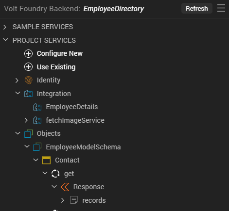

#### List and Details Using Response Form

When you drag and drop the Get operation in an Object service onto a Responsive Web form and select the **List and Details Using Response** option, this type of form is generated on the Project Canvas. A list and details form consists of a list of items and if a user selects a specific item, the details of that item are displayed on the right of the screen.

  
  

#### Grid Using Response Form

When you drag and drop the Get operation in an Object service onto a Responsive Web form and select the **Grid Using Response** option, this type of form is generated on the Project Canvas. A grid form is a tabular representation of list items. Users can select any row grid item, and they are navigated to the details screen of that item.

#### Details Using Response Form

When you drag and drop the Get operation in an Object service onto a Responsive Web form and select the **Details Using Response** option, a dialog box appears. If a Responsive Web list form already exists, the dialog box asks if you want to generate navigation from the link to the details form. Click **Yes** to generate a navigation link between the list and detail forms; otherwise, click **No**.

> **_Note:_** If multiple Responsive Web list forms are present, then you will need to choose one list form to create the navigation link.

A details form is then generated on the Project Canvas. The details form contains additional information of a list item. If you create the navigation link between the list and detail forms, users are taken to the detail form when they select a specific list item.

#### Entry Form

When you drag and drop either the Create or Update operation in an Object service onto a Responsive Web form, an Entry form is automatically generated on the Project Canvas.

Create Operation

When an entry form is added for a Create operation, users can specify the required details to create new list items. The following image illustrates the Create Incident screen of the Incident Management app. App users can leverage this screen to create new incident items and assign them to relevant people.  

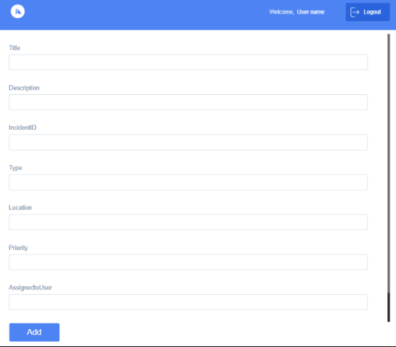

Update Operation

When an entry form is added for an Update operation, users can make the required modifications to existing list items. The **update** method automatically fetches the values of the selected record and pre-fills the details in the respective fields.

The following image illustrates the Update Incident screen of the Incident Management app.

### Generate CRUD Forms for an Object Service

In Volt MX Iris V9 SP 2, you can generate CRUD forms and associated form-navigation links for an Object service. If you have configured the data model for an Object service or linked your Volt MX Iris project to a Volt MX Foundry app with a defined Object service data model, you can leverage this feature. This enhancement is applicable for Object services on Mobile, Tablet, and Responsive Web (Desktop) channels.

You can generate CRUD forms at method-level, object-level, and at service-level.

> **_Note:_** When you use the generate forms feature, auto-generated fields such as _CreatedBy_, _LastUpdatedBy_, _CreatedDateTime_, _LastUpdatedDateTime_, and _SoftDeleteFlag_ are not added to the CRUD forms by default. To add any of these fields to a form, drag the required operation parameter from the Data & Services Panel and drop onto the form. This feature is only applicable for Storage services.  
  
In case of other types of services, the Data & Services panel does not auto-generate the _SoftDeleteFlag_ and other object tracking fields. You must create a custom field on Volt MX Foundry, and use the field for tracking purposes.  
  

> **_Note:_** When you drag and drop a method, object, or service from the Data & Services panel to anywhere on the [Storyboard view](Create_the_Storyboard_of_your_App.md) canvas, the relevant forms and associated [hard navigation links](Create_the_Storyboard_of_your_App.md#hardnavigationlink) between the forms are automatically generated.  
  
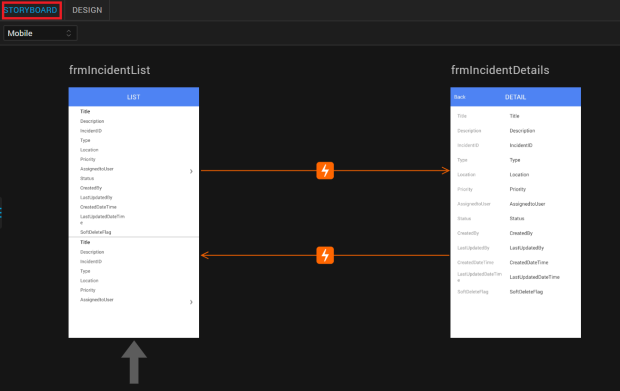

> **_Note:_** In Volt MX Iris V9 SP 2 SP2, when you select a **Generated Form** in the Data and Services panel at the Service-level, forms ignore the child objects.

**To generate CRUD forms for an Object service for Responsive Web (Desktop) channel, follow these steps:**

1.  In Volt MX Iris, configure the data model for a new or existing Object service. Alternatively, link your Volt MX Iris project to a Volt MX Foundry app with a defined Object service data model.  
    In this procedure, we will discuss the example of the Object service of the Incident Management app.
2.  Go to **Data & Services** > **Project Services**.
3.  Expand **Objects** > **CopyIncidentData** > **Incident**.  
      
    
4.  You can generate CRUD forms for any of the following items:
    
    *   **Method-level**: Right-click any method; for example, **get**. Select **Generate Forms** > **Desktop**. Two types of forms (Grid and Details) are generated with the respective navigation links between each other. An appropriate breadcrumb link is also displayed at the top of the Details form. Users can click the breadcrumb link to go back to the Grid screen of the app.  
          
        **Grid Form**  
          

          
          
          
        **Details Form**  
        

          
          
          
        If you perform the **Generate Forms** action for the **create** or **update** methods, only the Create/Update entry form is generated.  
          

          
          

        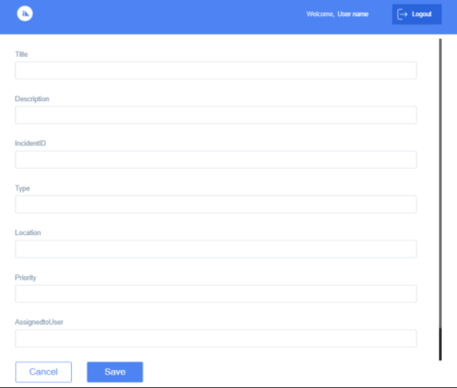

    *   **Object-level**: Right-click **Incident**, and then select **Generate Forms** > **Desktop**. Four types of forms (Grid, Details, Create entry form, and Update entry form) are generated with the respective navigation links among each other. An appropriate breadcrumb link is also displayed at the top of the Details, Create, and Update forms. Users can click the breadcrumb link to go back to the Grid screen of the app.  
          
        **Grid Form**  
          
          
          

        **Details Form**  
          
          

          
        **Create Form**  

          
          

          
        **Update Form**  
          

        

    *   **The Object service**: Right-click **CopyIncidentData**, and then select **Generate Forms** > **Desktop**. Five types of forms (Dashboard form, Grid, Details, Create entry form, and Update entry form) for each object in the Object service are generated, with the respective navigation links among each other.  
          
        The Dashboard form displays all the objects that are part of the selected Object service. From the Dashboard screen, app users can navigate to the respective Grid, Details, Create, and Update forms of the objects. If you have not defined the startup form of the app, the Dashboard form is made the startup form by default.  
          
        An appropriate breadcrumb link is also displayed at the top of the Grid, Details, Create, and Update forms. Users can click the breadcrumb link to go back to either the Dashboard screen or Grid form of the app, as appropriate.  
          
        **Dashboard Form (with _Incident_ object)**  
          
          
          
        **Grid Form**  
          
          
          
        **Details Form**  
          
          
          
        **Create Form**  
          
          
          
        **Update Form**  
          
        
        
    
    > **_Note:_** If an Object service contains multiple data model objects, then all available forms and navigation links for each data model object are generated.  
    For example, in the following image, the **excelInOrderManagement** Object service contains three data model objects: contact, department, and employee. So if you try to generate CRUD forms for the **excelInOrderManagement** Object service, all available forms and associated navigation links are generated for the contact, department, and employee data model objects.  
      
    
    

### Create a Data Table for an Object Service

In Volt MX Iris V9 SP 2, you can create a data table for an Object service. Several details such as data type, Primary key, nullable, and maximum length can also be specified for the fields of the Object Service.

> **_Note:_** You can create a data table for either an existing Volt MX Foundry app or for a new one.

**To create a data table for an Object service from within** Volt MX Iris**, follow these steps:**

1.  In Volt MX Iris, open your project.
    
2.  On the **Data & Services** panel, expand **Project Services**.
3.  Click **Configure New**. A list of services appears.
4.  Under the Data Storage section, click **Create Data Tables**. The **Edit Object Service** > **Data Model** > **Fields** window appears. A new Object is created in which you can quickly configure object fields. By default, every Object contains some system-generated fields.  
      
    

1.  Click **Add**. A new field is created in the fields definition table.
2.  Under the **Name** column, type the required name of the field. Here, **Version** is the field name.
3.  Under the **Type** column, select the data type of the field. The available data types include string, date, boolean, number, binary, and enum. The string data type is selected by default.

> **_Note:_** The Enumeration (**enum**) data type enables you to add a maximum of 50 comma-separated options as valid values in a field. For example, a field called **Priority** can have enumeration values such as Critical, High, Medium, Low and a field called **Gender** can have valid values such as Male, Female, Other. The enum data type is rendered as a drop-down list containing only those valid values that you defined, and users can choose only one option at a time for that field. This data type is available In Volt MX Iris V9 SP 2. For more information on how to configure the enum data type, click [here](../../../Foundry/voltmx_foundry_user_guide/Content/ObjectsServices/enumDatatypes.md).

1.  If you want to set the field as a Primary Key, select **Primary Key** as **True**. The Primary Key value is False by default.  
      
    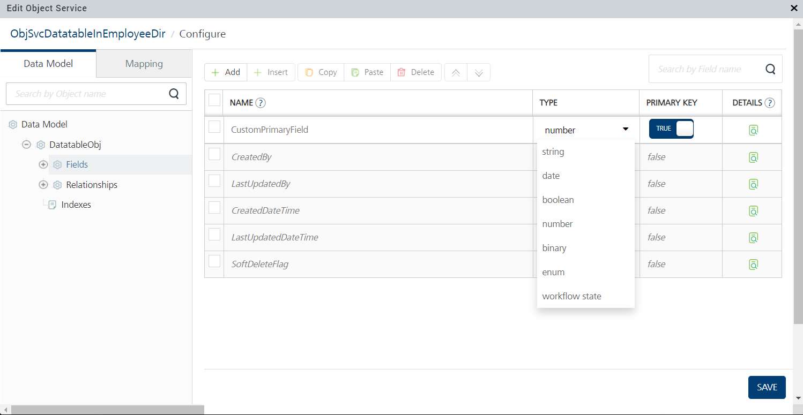
2.  If you want to view or modify any additional details of the field, click the View icon  on the field entry row. The field details window appears. You can view or modify any editable details, and then click **Save**.  
      
    
3.  Click **Save**, and then close the Edit Object Service window. The data table and new data table objects are created, and are displayed under **Project Services** > **Objects** as shown here.  
      
    

> **_Note:_** You can create multiple objects in the data table of an Object service by following this procedure. These objects are then displayed as _newObject<X>_ under Project Services on the Data & Services panel.

### Configure an Object Data Model by Importing an Excel File

In Volt MX Iris V9 SP 2, you can create an object data model for an Object service by importing a locally-stored Microsoft Excel file. With this feature, low-code developers have an easy and faster way to import an object data model from a locally-stored Excel file.

> **_Note:_** You can import an Excel file for either an existing Volt MX Foundry app or for a new one.

**To create an object data model by importing an Excel file for an Object Service from within** Volt MX Iris**, follow these steps:**

1.  In Volt MX Iris, open your project.
    
2.  On the **Data & Services** panel, expand **Project Services**.
3.  Click **Configure New**. A list of services appears.
4.  Under the Data Storage section, click **Import Excel File**. The **Import File** window appears.  
      
    
5.  You can perform any one of the following actions:
    
    *   Directly drag and drop the Excel file.
    *   Click **Browse** to search for, and then select the Excel file from your local system.  
          
        
    
    
6.  After the Excel file has been successfully uploaded, a confirmation message appears. Click **Next**.  
    If you want to delete the uploaded file and import a different Excel file instead, click the Delete  icon.  
      
    

1.  The uploaded Excel Sheet is selected by default. In the **Data Model Object Name** box, type the required name of the data model. If there are multiple sheets in the Excel file, you can add the name of each sheet.  
    You can add the underscore (\_) symbol in the data model object name. However, you cannot include any spaces or special characters in the data model object name.  
      
      
    
2.  Click **Import**. After the Excel sheet has been successfully imported, a window with a confirmation message appears. Click **Done**.  
      
      
    
3.  The **Edit Object Service** window for the respective Volt MX Foundry app appears. You can use this window to configure various items of the Object service data model, such as the Name, Description, Fields, Relationships, Indexes, and Primary Keys. For more information on how to configure the data model of an Object Service, refer the [Configuring a Data Model](../../../Foundry/voltmx_foundry_user_guide/Content/ObjectsServices/Stage_2.md) topic in the [VoltMX Foundry User Guide](../../../Foundry/voltmx_foundry_user_guide/Content/Introduction.md).  
      
    
4.  After you have configured the Object service data model, click **Save** and then close the **Edit Object Service** window. The object data model is created, and is displayed under **Project Services** > **Objects**.  
      
    

### Customize the Generation of Data Model Objects

In Volt MX Iris V9 SP 2, you can configure the generation of data model objects while designing your app. This enhancement enables you to select, reorder, and customize various properties of all the fields that you want to be displayed on the required screen of your app.

> **_Important:_** To dynamically configure the fields of the object model, you must click the parent container of the request/response parameter on the form. Then go to **Properties** panel > **Look** tab > **Dynamic Form** section, and click **Edit** beside **Customize fields**.  
In the following image, **flexIncident** is the parent container of the service parameter on the **frmStartUp** form. **Only while the parent container is selected, the Dynamic Form section appears under Properties panel > Look tab.**  

> **_Important:_** If you do not click the parent container of the request/response parameter on the form, the Dynamic Form section does not appear under Properties panel > Look tab. **While any child container of the service parameter or the form itself is selected, the Dynamic Form section does not appear.**  
In the following image, **flexHeader** is a child container of the service parameter on the **frmStartUp** form. While this child container is selected, the Dynamic Form section does not appear under Properties panel > Look tab.

To understand this feature in detail, let us consider a scenario where Steve (a low-code developer) wants to create an app called **Incident Management**. He has already created the associated Volt MX Foundry app, and now wants to configure the app's UI.

The Admin of an airport can use the Incident Management Responsive Web app to view, create, update, and assign incidents/tasks to relevant staff members. In addition, staff members can use the Incident Management Mobile app to view and act upon their assigned tasks as well as to create new tasks.

The Responsive Web and Mobile apps comprise of four forms: list, detail, update, and create.

This topic consists of the following sections:

*   [Prerequisites](#prerequisites)
*   [Configure Dynamic UI Properties](#configure-dynamic-ui-properties)

#### Prerequisites

*   Create a Volt MX Foundry app.
*   Link the Volt MX Foundry app to your Volt MX Iris project.

#### Configure Dynamic UI Properties

In this section, we will configure the dynamic properties of the fields on the Create Incident Entry screen of the Incident Management Mobile app:

1.  In your Volt MX Iris project, go to **Project Explorer** > **Mobile** > **Forms**, and then create a new form called **frmCreate**.
2.  Go to the **Data & Services** panel > **Project Services** > **Objects** > **CopyIncidentData** > **Incident**.  
      
    
3.  Drag and drop the **create** method onto the Project Canvas. The entry form is generated.
4.  On the Project Explorer, under **frmCreate**, click **flexIncident**. Here, flexIncident is the parent container of the create Request parameter.  
      
    
5.  Go to **Properties** panel > **Look** tab > **Dynamic Form**, and then click **Edit** beside **Customize fields**. The **Configure Entry Form** window appears.  
      
    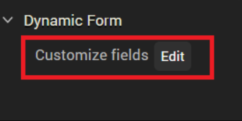  
    

You can use the **Configure Entry Form** window to configure the dynamic properties of the fields. In this procedure, we will discuss the following operations that can be performed on a field called **Priority** on the **frmCreate** form:

*   **Reorder a Field**: In the **Configure Entry Form** window, click the **Priority** field. Keep clicking the Move Up icon  until the **Priority** field is at the top of the list as shown.  
      
      
      
    **In List Using Details Forms**  
      
      
      
    **In Details Using Response Forms**  
      
    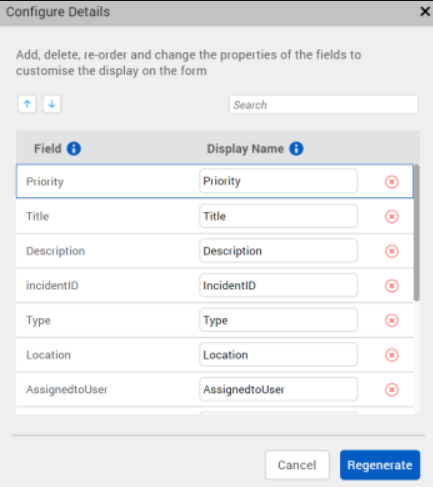  
      
    **In List and Details Forms**  
      
      
      
      
      
    **In Grid Forms**  
      
    

> **_Note:_** If you want to move a field down the order, select the field and click the Move Down icon  as many times as necessary.

*   **Add/Modify the Display Name and Placeholder Text**: In the **Configure Entry Form** window, for the **Priority** field, type the **Display Name** as **Incident Priority**. Similarly, type the **Placeholder Text** as **Incident Priority** as shown.  
    **Display Name** signifies the name of the field that is displayed on the screen. And **Placeholder Text** enables you to provide a help text about the field.  
      
      
      
    **In Details Using Response Forms**  
      
    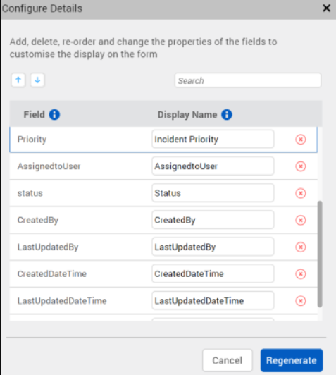  
      
    **In List and Details Forms**  
      
      
      
    **In Grid Forms**  
      
    

> **_Note:_** The Display Name and Placeholder Text fields are not applicable for list (List Using Response) forms. And the Placeholder Text field is not available for detail (Details Using Response) forms.

*   **Configure the Read-Only and Required Properties**: In the **Configure Entry Form** window, for the **Priority** field, select the **Read-Only** and **Required** check boxes.  
    **Read-only** fields signify that these fields cannot be edited by users. And **Required** fields signify that it is mandatory for users to specify the information for these fields; an asterisk is displayed on the UI for all **Required** fields.  
      
    

> **_Note:_** The Read-Only and Required check boxes are only applicable in Entry forms; as part of the **create** and **update** methods. These check boxes are not available in List Using Response and Details Using Response forms.

*   **Delete/Add a Field**: In the Configure Entry Form window, for the Priority field, click the Delete  icon. The Priority field is removed from the top of the list, moved to the bottom, and the text is displayed in gray color.  
      
      
      
    If you want to reinstate the Priority field, click the Add  icon beside it. The Priority field becomes active again.  
      
      
      
    **In List Using Response Forms**  
      
    **Delete Operation**  
      
      
      
    **Add Operation**  
      
      
      
    **In Details Using Response Forms**  
      
    Delete Operation  
      
      
      
    Add Operation  
      
      
      
    **In List and Details Forms**  
      
    **Delete Operation**  
      
      
      
      
      
    Add Operation  
      
      
      
      
      
    In Grid Forms  
      
    Delete Operation  
      
      
      
    Add Operation  
      
    

After you have performed the necessary operations for the **Priority** field in the **Configure Entry Form** window, click **Regenerate**. The dynamic properties of the **Priority** field are saved, and the updated **frmCreate** form is generated on the Project Canvas.  

Set Data for the Segment in a Component
---------------------------------------

To map data for the Segment in a component for different channels, follow these steps:

1.  In Volt MX Iris, create a component.
2.  Drag and drop a **get** method of an Integration or Object service (for example, _getCountries_) from the Data & Services panel onto the component that you just created. A dialog box appears asking you to select what type of form you want to generate: **List Using Response** or **Details Using Response**.
3.  Select the **List Using Response** option. A Segment (for example, _seggetCountries_) is added to the component, a list form is generated on the Project Canvas, and the mappings between various elements are auto-generated in [Mapping Editor](ActionsMapping.md).

1.  On the Project Canvas, change the channel of the component from Mobile to Tablet, or vice-versa. For example, if you had been using the **iOS Mobile: Native** channel, change it to **iOS Tablet: Native**.
2.  On Project Explorer, select the Segment of the component, and go to **Properties** panel > **Segment**.
3.  For the **Row Template** list box, select the **SampleRowTemplate** option.
4.  On Project Explorer, select the parent FlexContainer of the component, and then go to **Properties** panel > **Action**.
5.  Under the **Component** section, for the **onMapping** Event, click **Edit**. The **Action Editor** window appears, with **Diagram View** open by default.
6.  In the flow diagram, click the **Add Mapping** action. [Mapping Editor](ActionsMapping.md) opens on the right pane of [Action Editor](working_with_Action_Editor.md).
7.  Map the required service parameters to the Segment **rowData** and associated rowData elements, as shown here.  
      
    
8.  Click **Save**.
9.  Click **Code View** to see the code details of the data mappings.  
      
    **For Mobile**  
      
    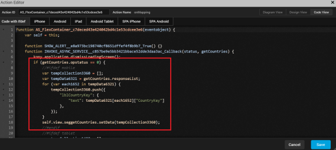  
      
    **For Tablet**  
      
    
10.  Click **Save**. You have successfully mapped service parameters to the Row Data widgets of the Segment in a component for the Mobile and Tablet channels.
11.  If you build the project for Mobile channel, only the Mobile-related code will be used during run time. Similarly, if you build the project for Tablet channel, only the Tablet-related code will be used during run time.

Send Data between Two Forms
---------------------------

Previously, if you wanted to send data from one form to another, you had to save the data in a global variable first and then you would be able to use it. From In Volt MX Iris, you can send data between two forms by using Action Editor. You can enter any data, such as an object or a variable, in the Action Editor UI and then send it to another form.

To send data between two forms, follow these steps:

1.  In Volt MX Iris, create a new project.
2.  Create two new forms; for example, say _frm1_ and _frm2_.
3.  Add a button to frm1.
4.  Select the button, and then go to **Properties > Action**.
5.  For the onClick Event, click **Edit**. The Action Editor appears.
6.  From the list of actions on the left, scroll to the **Navigation** section, and then click **Navigate to Form**. The navigation action is added to the button.  
    
7.  In the lower section of the Action Editor, select **frm2**.

> **_Note:_** Alternatively, you can click **Create New** to create a new form; say, **frm3**. And set the onClick navigation for the button to **frm3**.

1.  Select the **Pass data with navigation** check box. The form **frm1**and all of its widgets are listed in a nested structure along with defined local Variables, if any.
2.  You can select the required widget data properties or local variables of **frm1** to pass data on navigation from **frm2**. As you select multiple widget properties, the Navigation Object is constructed as key-value pairs.  
    
3.  Click **View Code** to view the default code for the Navigation Object that has been constructed.  
    Alternatively, you can select the Custom Input check box to create your customized Navigation Object or navigation flow data.
4.  Click **Generate Code** to verify the data that is sent to **frm2**.

To use the data that is received from frm1, follow these steps:

1.  Click **frm2**, and then go to **Properties > Action**.  
    
2.  For the onNavigate Event, click **Edit**. A confirmation dialog box appears stating that if you have already defined the onNavigate Event in FormController, the current action will not be respected.  
      
    
3.  Click **Ok**. The Action Editor appears.
4.  From the list of actions on the left, scroll to the **Functions** section, and then click **Add Snippet**. The code snippet is added to **frm2**.
5.  Click **Generate Code**. For this action sequence, you can access the data from the **eventobject** argument. This is the same argument that was passed from **frm1**.  
    
6.  Click **Close**.

Custom Verbs in Data and Services Panel
---------------------------------------

In Volt MX Iris V9 SP 2 SP2, the Data and Services panel lists the fields or attributes of a Custom Verb. You can drag and drop a Custom Verb from the Data and Services panel onto any Form. When a Custom Verb is added to a form, Volt MX Iris displays a pop-up to select the templates for both **Request** and **Response** UI generation. This allows you to generate the Form UI for the Custom Verbs.

If Custom Verb fields are not available in the Data and Services panel, or if you drag and drop a Custom Verb onto a Form, Volt MX Iris displays the following warning:

**The Request/Response query for this verb uses custom XML mapping in Foundry. Hence the UI generation and mapping feature is not supported in Iris**.

> **_Note:_** Volt MX Iris do not list the Request / Response fields of the Custom Verb in the following cases:  

*   In Volt MX Foundry when XML mapper is used instead of Visual Mapper to map the Object fields.  
    

*   In Volt MX Foundry when Object Service fields are not mapped to the respective sources (Integration Service Responses / Databases).

The UI / Form generation for the Custom Verb is not considered while executing **Generate Forms** action associated with the Service.

Add Child Objects to a Form
---------------------------

In Volt MX Iris V9 SP 2 SP2, the Data and Service panel lists the Child objects. you can drag and drop the Child Objects from the Data and Services panel onto a form. Iris generates a custom UI for the Child Object and sends the metadata to the Volt MX Foundry Console. This allows Iris to populate Object Service Response fields in the Data and Services panel.

When you add the Parent Object which contains Child Object onto a Form, UI is generated for Parent Object. Similarly, when you add the Child Object onto a Form, UI is generated for Child Object.

> **_Note:_** When **Include Related Objects** checkbox is enabled for a Parent Object that contains Child Object. While sending the metadata of the Parent Object to Volt MX Iris, the console includes the metadata of the Child Object. To know more on how to create a relation in Foundry. refer [Foundry Object Services](../../../Foundry/voltmx_foundry_user_guide/Content/ObjectsServices/Objectservices_Stage3.md).

Associated Data & Services Panel Features
-----------------------------------------

### Volt MX Foundry Node on the Data & Services Panel

In Volt MX Iris V9 SP 2, the **VoltMX Foundry node** and associated actions have been shifted from the Project Explorer to the Data & Services panel. This feature has been introduced to enable a unified and enhanced user experience of using Volt MX Foundry data and services from within Volt MX Iris.

Click the hamburger menu icon  at the upper-right corner of the Data & Services panel. From the list of options that appears, you can perform the following Volt MX Foundry\-related actions:

*   Open Volt MX Foundry Console
*   Create a Volt MX Foundry app
*   Link (your Volt MX Iris project) to an existing Volt MX Foundry app
*   Export app from Volt MX Iristo Foundry
*   Import App from Foundry to Volt MX Iris
*   Unlink a Volt MX Foundry app from your Volt MX Iris project
*   Configure Volt MX Foundry environments
*   View form mapping of linked Project Services
*   [Publish your Volt MX Irisapp to Volt MX Foundry](PublishVoltMXFoundryServicesApp.md)

### Mapping Event

Mapping event is available in the Mapping Editor. Service invocations dropped on a form or a FlexContainer in a canvas are mapped to the mapping event .

> **_Note:_** When you map the Request and Response nodes, the Mapping Editor prompts a warning message **The Request/Response query for this verb uses custom XML mapping in Foundry. Hence dynamic UI generation and mapping is not supported in Iris**.

  
  

> **_Note:_** If you add code to the preshow event dynamically, the new code added will override the mapping event.

### View Mapping

When **View Mapping** is selected for a service on the data panel, the associated action is displayed.

If more than one action sequence is associated to a service, a fly-out menu is displayed with a drop-down list. You can select the Mapping Action Sequence you want to view. This opens the Action Editor. For more information, refer [Action Editor](working_with_Action_Editor.md).

### Manual Refresh

You can refresh the data in the Data & Services panel manually by using the Refresh button. When you click **Refresh**, the Data & Services panel fetches the latest data from your associated Volt MX Foundry application. You can use this Refresh button to update any changes you made to your Volt MX Foundry service by using the Volt MX Foundry console, from within Volt MX Iris.

### Service Invocation

When a network call is made to invoke an async service, the action sequence appears in the Data & Services panel. For containers, when you drag and a drop an operation or the response from the data panel, the async service invocation is added to the mapping event. Response parameters are auto-generated on the form. You can also invoke an Identity service by using the drag-and-drop feature onto a login form. Network actions are used to generate the service invocation.

### Highlighted View of Mapped Widgets

When you select a service or its associated operation from the Data & Services panel, the mapped UI elements are highlighted on the form.

When the Data & Services panel goes out of focus or if you select another form, the highlight effect disappears.

### Delete Mapped Widgets

You can delete any mapped widget that is mapped to services by right-clicking the widget, and then selecting Delete. Iris displays a confirmation pop-up before you can proceed with the widget deletion. The display of this alert helps prevent any accidental deletions and service failures. Click Ok to delete the widget and all its children widgets along with the service mappings.

### Action Sequences

The following action sequences are auto-generated for responses.

#### Loading Indicator

When enabled, the loading progress of a service call is displayed until the response is completed. You also have the option to not display (dismiss) the loading indicator.

#### Data Type Conversion

When you map a non-matching data type, a popup appears alerting you of the same. The non-matching data type is then implicitly converted before being mapped.

> **_Note:_** The Calendar Date data type is not converted. But if the _date_ property of a Calendar widget is mapped to the _Date_ field of an Object service, the date is converted to ISO format at run time and is sent to the back end. When this date is read during run time, the ISO format of the date is converted back to the DD-MM-YYYY format.

> **_Note:_** You cannot map Boolean and Date fields to widget positional properties such as left, top, right, and bottom.

If you want to view the data type conversion, click **Generate Code** in the Action Editor.

The following data types are converted:

*   Boolean
*   String
*   Number (can be further converted as int and float)

#### Status Check

The Data & Services panel auto-generates actions to perform a service status check and map the widgets on the success of the service call.

You can also define your own IF condition blocks by using the Action Editor.
