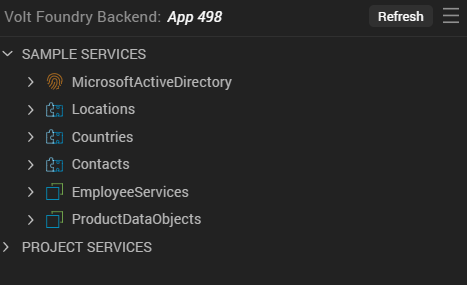

                          

Connect to Back-End Services by using Data & Services Panel
===========================================================

The **Data & Services** panel feature in Volt MX Iris enables you to link back-end data services to your application's user interface (UI) elements seamlessly, with low-code to no-code. You can use the sample services in the Data & Services panel to bind back-end services to your apps and test the UI. If you are an advanced user of Volt MX Iris and have previously created back-end services in your Volt MX Foundry instance, you can view those services in the Data & Services panel. Furthermore, you can create new back-end services from the Data & Services panel and associate the services with your apps.

The Data & Services panel leverages the **VoltMX Foundry Stub Back-End Response** feature. For more information on Volt MX Foundry Stub Back-End Response, click [here](../../../Foundry/voltmx_foundry_user_guide/Content/Stub.md).

The Data & Services panel is available in both Volt MX Iris and Volt MX Iris Classic, and it contains two lists: Sample Services and Project Services.

The Sample Services drop-down list contains various sample services that you can directly start using in your app. These configured sample services come pre-built with Volt MX Iris.

You can use Project Services to create a new service. You can now create, edit, and delete various services from within Iris. These services are as follows:

*   Identity
*   Integration
*   Object

The Data & Services panel consists of the following features:

*   [Use Sample Services](DataPanel.md#use-sample-services)
    *   [Use a Sample Identity Service](DataPanel.md#use-a-sample-identity-service)
    *   [Use a Sample Integration Service](DataPanel.md#use-a-sample-integration-service)
    *   [Use a Sample Object Service](DataPanel.md#use-a-sample-object-service)
*   [Use Existing Services](DataPanel.md#use-existing-services)
*   [Create and Use New Services](DataPanel.md#create-and-use-new-services)
    *   [Create an Identity Service](DataPanel.md#create-an-identity-service)
    *   [Create an Integration Service](DataPanel.md#create-an-integration-service)
    *   [Create an Object Service](DataPanel.md#create-an-object-service)
    *   [Create a Backend Workflow](DataPanel.md#create-an-integration-service)
*   [Use Project Services](DataPanel.md#use-project-services)
    *   [Use an Identity Project Service](DataPanel.md#use-an-identity-project-service)
    *   [Use an Integration Project Service](DataPanel.md#use-an-integration-project-service)
    *   [Use an Object Project Service](DataPanel.md#use-an-object-project-service)
    *   [Use a Backend Workflow](DataPanel.md#use-an-object-project-service)
    *   [Disable/Enable the Categorization of Project Services](DataPanel.md#disable/enablecategorizationofProjectServices)
    *   [Unlink a Service](DataPanel.md#unlink-a-service)
    *   [Edit a Service](DataPanel.md#edit-a-service)
*   [Object Service-related Features](DataPanel.md#object-service-related-features)
    
    *   [Generate Object Services UI for Responsive Web](DataPanel.md#generate-object-services-ui-for-responsive-web)
    *   [Generate CRUD Forms for an Object Service](DataPanel.md#generate-crud-forms-for-an-object-service)
        
    *   [Create a Data Table for an Object Service](DataPanel.md#create-a-data-table-for-an-object-service)
        
    *   [Configure an Object Data Model by Importing an Excel File](DataPanel.md#configure-an-object-data-model-by-importing-an-excel-file)
        
    *   [Customize the Generation of Data Model Objects](DataPanel.md#customize-the-generation-of-data-model-objects)
*   [Set Data for the Segment in a Component](DataPanel.md#set-data-for-the-segment-in-a-component)
*   [Send Data between Two Forms](DataPanel.md#send-data-between-two-forms)
*   [Associated Data & Services Panel Features](DataPanel.md#associated-data-amp-services-panel-features)
