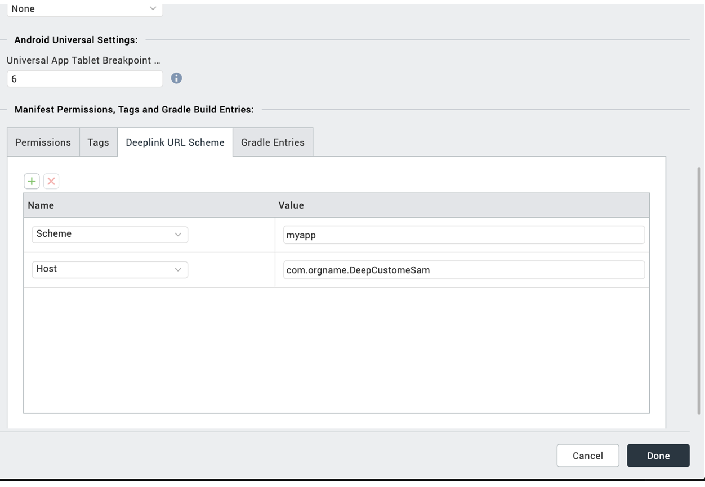
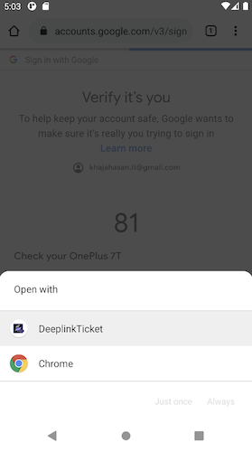
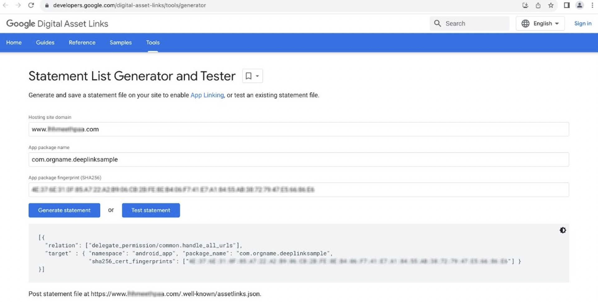
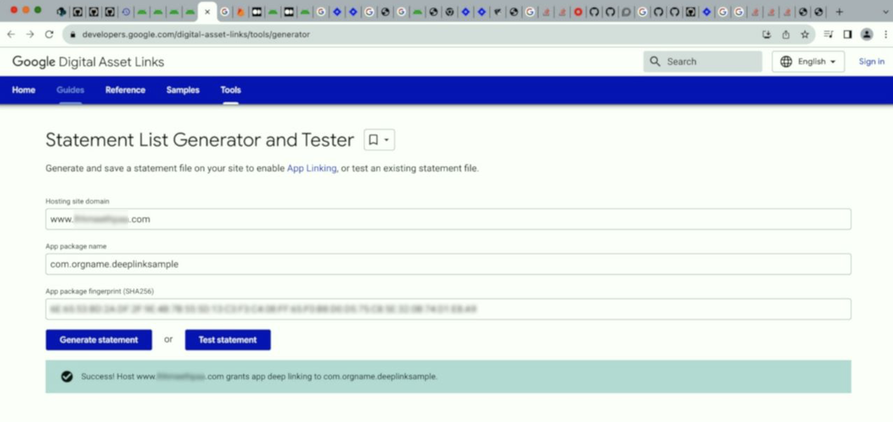
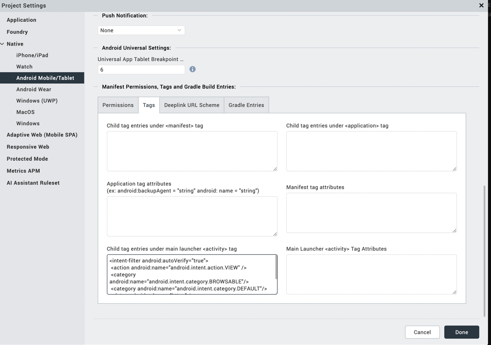

Deep Linking Guidelines for Android
==================================

We have 3 different types of links those are Handle URIs, Web links, and Android App Links as per [Android Developers Document](https://developer.android.com/training/app-links).

 
Handle URIs
------------

To create a custom app link, you need to use an anchor tag with the appropriate href attribute. For example:

``` 
HTML Code:
<a href="myapp://com.orgname.DeepCustomeSam">Deeplink</a>
``` 

  


<video width="320" height="240" controls>
  <source src="Resources/Images/DeepLinkUri_1.mp4" type="video/mp4">
</video>

Web links
-----------

**Web links** use the HTTP and HTTPS schemes and are handled differently on various Android versions. On Android 12 and higher, clicking a web link will always display the content in a web browser. On older Android versions, if your app or other apps installed on the user's device can handle the web link, users may not be directed to the browser directly. Instead, they will see a disambiguation dialog appear like below. This dialog allows the user to select one of multiple apps, including your app, that can handle the given deep link.

 


App links
-----------

**App links**, on the other hand, are web links that use the HTTP and HTTPS schemes and contain the autoVerify attribute. This attribute allows your app to designate itself as the default handler for a given type of link. When the user clicks on an Android App Link, your app opens immediately if it's installed, and the disambiguation dialog doesn't appear.

 
<h3>App links verification</h3>

To enable App Links, you need to serve a Digital Asset Links JSON file (assetlinks.json) on your website with HTTPS. This JSON file indicates the Android apps associated with the website and verifies the app's URL intents. The file uses the following fields to identify associated apps:
 
**package_name**: The application ID declared in the app's build.gradle file.
sha256_cert_fingerprints: The SHA256 fingerprints of your app’s signing certificate. You can generate the fingerprint via the Java keytool using the following command:
 
Use the below command to get SHA fingerprint: <br>
`keytool -list -v -keystore sample.keystore`

> **_Note_**: You can declare associations with multiple apps within the same assetlinks.json file, which should reside at https://www.example.com/.well-known/assetlinks.json.


1.	**Generate DigitalAssetlinks file**: To generate the assetslinks.json file and test it, you can use this [link](https://developers.google.com/digital-asset-links/tools/generator) or the Android Studio.

      

     
2. **Publishing the JSON**: To publish the JSON verification file, place the assetlinks.json file at the root of your website, accessible through:
Like  **${domain}/.well-known/assetlinks.json**.
 
``` 
Sample assetlinks.json

[{
"relation": ["delegate_permission/common.handle_all_urls"],
"target": {
    "namespace": "android_app",
    "package_name": “your package name”,
    "sha256_cert_fingerprints":
    [" your sha key"]
}
}]
```

Go to Project Setting > Native > Android Mobile/Tablet > Tags

Under tags, go to “Child tag entries under main launcher <activity\> Tag”

```
<intent-filter android:autoVerify="true">	
 <action android:name="android.intent.action.VIEW" />
 <category android:name="android.intent.category.BROWSABLE"/>
 <category android:name="android.intent.category.DEFAULT"/>
 <data android:scheme="https" />
 <data android:host=“ your domain” />
 </intent-filter>
```

 

And remove host and scheme under “Deeplink URL Scheme” tab for now.

We officially make the changes in our plugin as part of the next releases. Then you can remove the intent filter what we added under “Child tag entries under main launcher <activity\> Tag” and add host and scheme under “Deeplink URL Scheme” tab.
