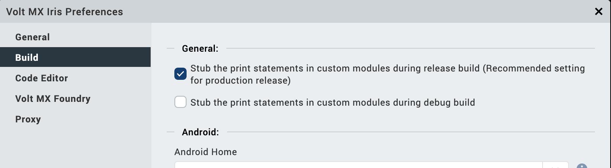

                         

Disable Print Statements in Builds
==================================

Using print statements is a common way of evaluating a build and assisting in its debugging. However, you may wish to disable the generation of print statements during a build, especially when generating a release build. Depending on your debugging methodologies, you may even want to disable print statements for debug builds as well.

By default, Volt MX Iris generates print statements for both Debug Mode and Release Mode builds.

To disable the generation of print statements during a build, do the following:

1.  On the **Edit** menu, click **Preferences**.
2.  From the left pane of the **Iris Preferences** dialog box, click **Build**.  
    The Build options appear in the right pane.
3.  Do one or both of the following, depending on whether you want to disable print statements for Debug Mode and Release Mode builds:

    *   **Release Mode builds.** To disable the generation of print statements during Release Mode builds, select the check box of the option titled **Stub the print statements in custom modules during release build**.
    *   **Debug Mode builds.** To disable the generation of print statements during Debug Mode builds, select the check box of the option titled **Stub the print statements in custom modules during debug build**.

    

4.  Click **Done**.
