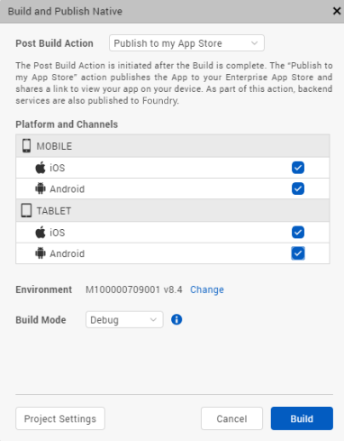
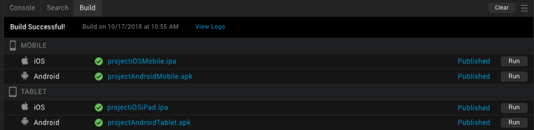
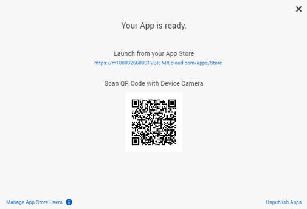
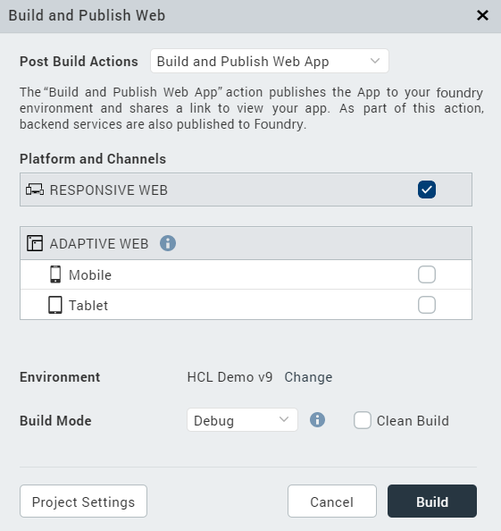
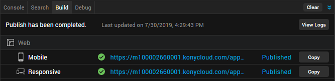
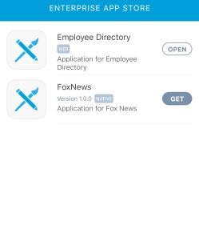
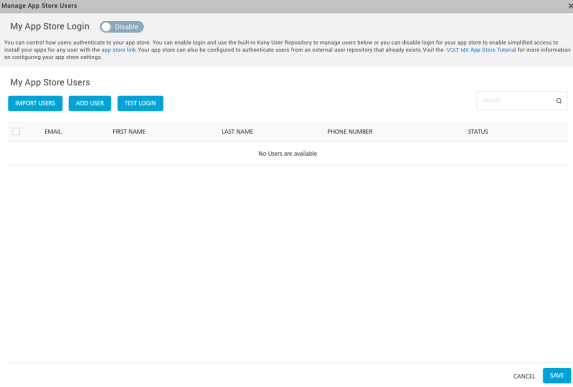

                          

Publish Apps to the Enterprise App Store
========================================

Overview
--------

All Volt MX Cloud users have access to an Enterprise App Store that enables users to securely distribute their apps within an Enterprise.

You can access Volt MX Iris Apps published from Iris and Foundry directly from the Enterprise App Store. Just like how you can access apps from the Android Play Store and the Apple App Store.

This feature allows you to maintain your own app store for your organization. To do so, you can create an app store on your Foundry cloud account. After an app is built, you can choose to publish the app to the Enterprise App Store available in your Volt MX Cloud account. You can then enable and customize access for certain users, using which they can access the various apps published on the Enterprise App Store.

This feature works with the help of the Build and Publish feature Once you have built your app using the build and publish feature, you can then choose to publish it to your EAS, using the Publish to my App Store action in Iris.

You can publish Native Apps and Web Apps to the Enterprise App Store. For information about how to publish apps to the Enterprise App Store, refer the following links:

*   [Publish Native Apps to the Enterprise App Store](#publish-native-apps-to-the-enterprise-app-store)
*   [Publish Web Apps to the Enterprise App Store](#publish-web-apps-to-the-enterprise-app-store)

Prerequisites
-------------

*   Access to a Volt MX Cloud account. If you do not have a cloud account, you can register for it at [VoltMX Cloud Registration](https://manage.hclvoltmx.com/registration).
*   Access to a Volt MX Cloud Build Environment version V8 SP4 or later.

*   For publishing to the Enterprise App Store, you must have Volt MX Foundry V8 SP4 or later.
*   Configure the various Project Settings.  
    Go to **Project** > **Settings** and configure the build settings for each Native platform. For more information on Project Settings, click [here](Project_Properties_in_VoltMX_Iris.md#project-settings-in).
*   Platform specific prerequisites:
    *   If you choose to build an application for the **iOS** platform, you must provide the Mobile Provision, .P12, P12 password, and the Development method. To do so, go to Project Settings > Native > iPhone/iPad. For more details on the iOS configurations, click [here](https://support.hcltechsw.com/csm?id=kb_article&sysparm_article=KB0083760).
    *   If you choose to build an application for the **Android** platform in **Release mode**, then the Android signing details are mandatory. To do so, go to Project Settings > Native > Android Mobile/Tablet. For more details on Android signing details, click [here](https://support.hcltechsw.com/csm?id=kb_article&sysparm_article=KB0083782).
    
    > **_Note:_** If you choose to build an application for the **Android** platform in **Debug mode**, no changes are required in the Project Settings. The build process begins immediately.
    
*   If you choose to build an application in **Protected mode**, then setting the public and private keys is mandatory. To do so, go to Project Settings > Protected Mode. For more details on how to generate public and private keys, click [here](ApplicationSecurity.md#rsa-key-pair-generation-encryption-and-usage).

Publish Native Apps to the Enterprise App Store
-----------------------------------------------

There are two ways to publish an app to the Enterprise App Store using Iris:

*   [Single click approach(Build and Publish)](#single-click-approach)
*   [Build and then Publish](#build-and-then-publish)

### Single click approach

To build and publish an application in one step, follow these steps:

1.  From the main menu on Volt MX Iris, select **Build**.
2.  From the context menu, select **Build and Publish Native**.
3.  Select the platforms and channels for which you want to build the application.
4.  From the **Post Build Action** drop-down menu, select **Publish to my App Store**.

    

    The Publish to my App Store action publishes the application to your Enterprise App Store and shares a link and a QR code to view the app on your mobile. As a part of this action, backend services are also published to Volt MX Foundry.

    > **_Note:_** To publish an app to the Enterprise App Store logging in to your Volt MX Account is mandatory.

5.  You can choose to change the cloud environment on which your app will be published. To do so click on **Change** beside the **Environment** option.  
    To change the Environment from the Project Settings, go to **Project Settings** > **VoltMX Foundry** and from the drop-down menu, select your desired environment.
6.  From the **Build Mode** drop-down list, select your desired build mode.

    *   **Debug mode** \- To help you identify and fix errors, Volt MX Iris emits the complete symbolic debug information . To lessen the amount of time necessary to complete the build, the build is not optimized for code execution, so it may tend to execute slower than a build optimized for release. Also, the inclusion of the symbolic debug information causes the final executable to be larger than a release build.
    *   **Release mode** - Volt MX Iris optimizes the build for execution, requiring more time to generate the build. It also does not emit the complete symbolic debug information, making the final executable smaller than a debug build.
    *   **Protected Mode** \- Applications built in Volt MX Iris can use the additional security enhancements by building the application in the _Protected Mode_. Volt MX IrisPlatform code for iOS and Android is equipped with mechanisms that can protect your application by detecting attacks like tampering, swizzling, debugging, jail breaking (iOS), rooting (Android), and information disclosure. Additional security mechanisms are provided through the use of White Box Cryptography to protect application business logic and source code. Application reacts to the attack by exiting upon detecting attacks to prevent further attempts.  
    If you choose to build an application in **Protected mode**, then setting the public and private keys is mandatory. To do so, go to **Project Settings** > **Protected Mode**. For more details on how to generate public and private keys, click [here](ApplicationSecurity.md#rsa-key-pair-generation-encryption-and-usage).
    *   **Test Mode** - To help you identify and fix errors, Volt MX Iris provides the ability to Test the application on the device or an emulator. When you build an app using the Test Mode, you can leverage the Jasmine testing framework of Volt MX Iris to thoroughly test your app and ensure your application is errors free. You can run jasmine test cases, test suites and test plans by building an app using the Test mode.

7.  Click **Build**. The build generation begins.  
    You can check the status of your build in the **Build** tab. It undergoes various actions, like Project compression, uploading the compressed project to the cloud, then the actual build begins. This process may take some time.  
    
8.  Upon successful build and publish, a confirmation window appears, which displays a link and a QR code to view the Enterprise App Store on your mobile device.  
    
9.  Type the App Store link on a browser on your mobile or scan the displayed QR code to launch the Enterprise App Store on your mobile.  
    

    > **_Note:_** For the first time, any user can access the published app, unless access to the app store is restricted by managing app store users.

10.  Your published app will be listed with the same name as your Iris Project. Click on **GET** to fetch the app from the Enterprise App Store and launch it on your device.
    
The logo of the application will be the image you set in **Project Settings** > **Native** > **Application Logo.** If you do not set an Application Logo, a default icon is displayed as the application logo.
    

### Build and then Publish

To build and then publish an application you can choose either of the other Post Build Actions available. The other two **Post Build Actions** are:

*   [Run on my Device](Cloud_Build_in_VoltMX_Iris.md#run-on-my-device): The Run on my Device action installs the application to your connected device and enables you to view the app on your device.
*   [Generate Native App](Cloud_Build_in_VoltMX_Iris.md#generate-native-app): The Generate Native App action generates the binaries for your Native application and saves it on your file system.

Publish Web Apps to the Enterprise App Store
--------------------------------------------

To build and publish a Web application, follow these steps:

1.  From the main menu on Volt MX Iris, select **Build**.
2.  From the context menu, select **Build and Publish Web**.  
    The Build and Publish Web window appears.

      

3.  Select the channels for which you want to build the application.
4.  You can choose to change the cloud environment on which your app will be published. To do so, click **Change** next to the **Environment** option.  
    To change the **Environment** from the Project Settings, go to **Project Settings** > **VoltMX Foundry** and from the drop-down menu, select an environment.
5.  Enable the **Publish to my App Store** option.  
    

    > **_Note:_** To publish an app to the Enterprise App Store, it is mandatory to log on to your Volt MX Account.

6.  From the **Build Mode** drop-down list, select a build mode.
7.  Click **Build**. The build generation begins. As a part of this action, backend services are also published to Volt MX Foundry.
    
    You can check the status of your build in the **Build** tab. Before the actual build starts, various actions such as project compression and upload of the compressed project to the cloud are performed. This process may take some time.
    
    
    
8.  Upon successful build and publish, a confirmation window appears. The window will display a link and a QR code to view the Enterprise App Store on a browser of your mobile device.
    
    
    
9.  Type the App Store link on a browser of your mobile or scan the displayed QR code to launch the Enterprise App Store on your mobile device.
    
    > **_Note:_** When an App is published for the first time, any user can access the app, unless access to the app store is restricted by managing app store users.
    
10.  The published app will be listed on the Enterprise App Store with the same name as your Iris Project. Click on **Open** to fetch the app from the Enterprise App Store and launch it on a browser of your mobile.

Manage App Store Users
----------------------

The Enterprise App Store(EAS) is an application to distribute your native apps. An organization that uses Volt MX EAS can customize the user access based on their requirements. To view and manage the active user list for any Volt MX EAS account there exists the Manage App Store Users window within VoltMX Iris.

You can access this window from the confirmation window that appears after the successful publish of an app to the EAS. The link to the application on the Enterprise App Store can be accessed by clicking on the **My App Store** button on the Header of the Iris App Canvas. You can also access the link to the application on the Enterprise App Store from the **Project Settings** \> **VoltMX Foundry** page.

To Manage app store users from Iris, do the following:

1.  From the confirmation window, click on the **Manage App Store Users** link. The Manage App Store Users window appears.  
    Using this window, you can manage users, enable access to install your apps for any user that has the app store link.
2.  You can import users, add new users and perform a test login from the Manage App Store window. These actions are specific to Volt MX user Repository.  
    

    > **_Note:_** By default, the Manage Users Login is disabled. The default authentication type for Volt MX EAS is Volt MX user Repository. So when an app is published to the EAS, all users registered in the Volt MX user Repository are authorized to access this app for the first time. You can change the authentication from Volt MX Foundry.

3.  On the **Manage App Store Users** window, toggle the **My App Store Login** switch to enable the access settings. You can now control the user authentication and access to your app store.
4.  You can go to Volt MX Foundry and enable authentication to authenticate users with the Identity services available in the Manage App Store Users window.

You can set up an identity service based on the type of the users who are allowed to access your application. For example: To restrict access to your organisation's internal audience, use Microsoft Active Directory authentication. To allow access of your application to a larger audience, you can use enterprise identity providers (Microsoft Active Directory, Volt MX SAP Gateway, Open LDAP, OAuth 2.0, Salesforce, Custom Identity Service, SAML, SiteMinder or Volt MX user Repository authentication) and social identity providers (Google, LinkedIn, Instagram, Amazon, Microsoft, Yahoo, BOX, Facebook).

   > **_Note:_** Setting up an identity service is optional. You can choose not to implement any authentication services for your application.

   > **_Important:_** For more information on Managing the Enterprise App Store, refer to [Enterprise App Store](../../../Foundry/voltmx_foundry_user_guide/Content/EnterpriseAppStore.md) on Volt MX Foundry.

Cancel publish to the EAS
-------------------------

You can cancel the publish during the build and publish process. Click on the **Cancel** button available in the Build tab in Iris to cancel the build and publish process at any time.

You cannot open a different project when one project is being built in Iris.

Unpublish an App from the EAS
-----------------------------

Once your app is published to the Enterprise App Store (EAS) , if you want to unpublish it for any reason, you can do so in Volt MX Iris. The Unpublish option is available in the confirmation window that appears after the successful publish of an app to the EAS.

To unpublish a Volt MX Iris app from the EAS, follow these steps:

1.  In Iris, from the blue header above the App Canvas, click **My App Store**.  

     

    The My App Store dialog box appears.  

    

    
2.  Click **Unpublish App**. The **Select Apps to unpublish** dialog box appears.
3.  Select the channels from which you want to unpublish the app, and then click **Unpublish**. The progress of the app-unpublish process appears in the Build tab. Once the app is successfully unpublished, a confirmation message appears.

> **_Note:_** You can also unpublish the published app through the Volt MX Foundry console. For more information, refer [Enterprise App Store on Volt MX Foundry](../../../Foundry/voltmx_foundry_user_guide/Content/EnterpriseAppStore.md).
