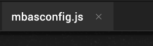

                         

Expand and Contract the Iris Canvas
=========================================

To maximize your work area on the Iris Canvas, you can expand it, regardless of whether you are working on a form, a code module, or an action sequence. When you maximize the Iris Canvas, it marginalizes the Project Explorer and Library Explorer on the left, the Properties pane on the right, and the Console along the bottom. Expanding the Iris Canvas works in both Single and Side by Side views. Contracting the Iris Canvas and restoring the Project Explorer, Library Explorer, Properties pane, and Console is as simple as a double-click.

To expand and contract the Iris Canvas, do the following:

1.  Along the top of the Iris Canvas, double-click the tab of the form, action sequence, or module that you want to see in an expanded manner. The user interface elements to the left, right, and below the Iris Canvas are marginalized.

3.  To contract the Iris Canvas, double-click the tab of the element you're working on. The user interface elements to the left, right, and below the Iris Canvas are restored to their previous dimensions.
