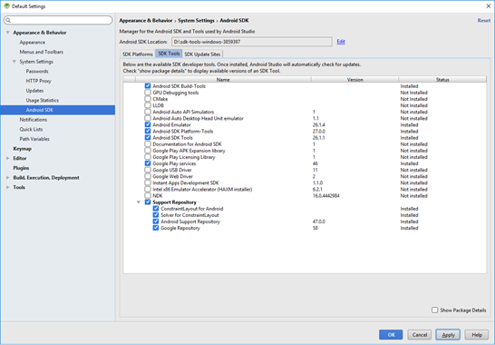
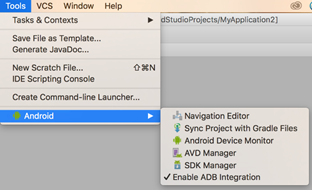

                          

You are here: Frequently Asked Questions

Frequently Asked Questions
==========================

Click the required topic to view the corresponding information.

Android SDK and Emulator Setup - FAQs
-------------------------------------

Below are some potential areas where you may encounter questions while setting up the Android SDK and Emulators.

In case you already have SDK and emulators configured for Android, you may not have to go through the setup process again. This section covers issues to assist with new Android SDK and Emulators setup.

This section is not intended to be used in isolation but must be used along with the Volt MX IrisSetup documentation.

[What do I need for setting up Android with my Volt MX Iris?](javascript:void(0);)

To be able to build (APK) and run applications for Android, at a minimum, you need the following setup:

*   Android SDK

In the case where you would like to set up and use a GUI version of the AVD Manager (for an Android Emulator) and SDK Manager (to download missing SDK components. Support and Google library components and emulator images), you will also need:

*   Android Studio

[Why do I need Android Studio?](javascript:void(0);) 

With version 25.3.0 of the Android SDK, Android had deprecated and removed the standalone AVD (Android Virtual Device) Manager and SDK Manager GUI tools from the Android SDK package. These tools are now only available as part of the Android Studio with GUI or through the command line. To use GUI to create Android Emulators and manage versions of SDK, Android expects its users to install Android Studio.

[What is an AVD Manager?](javascript:void(0);)

The AVD (Android Virtual Device) Manager is an Android SDK tool that helps you create and manage AVDs which allow Android developers to emulate an Android Device.

[I have downloaded the Android Studio, but I see errors in its console. For example, Failed to find the target with hash string android-26 in: <location>. Should I try to resolve these?](javascript:void(0);)

You do not need to resolve errors you see in Android Studio console. The Android Studio is only used for having a GUI interface to AVD Manager and SDK Manager. You may need to install the corresponding android-target which your Volt MX Iris project depends for compilation which is captured as `compileSdkVersion` in `build.gradle`.

[What is HAXM? Do I need it?](javascript:void(0);)

The Android Emulator supports several hardware acceleration features to improve performance and HAXM is one of them. HAXM or Hardware Accelerated Execution Manager is a Virtual Machine acceleration software to speed up Android Emulators.

HAXM can be used to speed up X86 based Emulators. AVDs that use an ARM or MIPS-based system images cannot be accelerated using HAXM.

You can always use ARM-based emulators however if your environment supports HAXM, it is recommended to set it up to speed up your emulators.

[How do I Setup HAXM?](javascript:void(0);)

You can read more about HAXM and steps on how to setup HAXM at [https://developer.android.com/studio/run/emulator-acceleration.html#accel-graphics](https://developer.android.com/studio/run/emulator-acceleration.md#accel-graphics).

[Will HAXM based emulator work on my machine?](javascript:void(0);)

HAXM based emulators do not work in all environments. You may need to make changes to your environment configuration and BIOS settings while setting up HAXM. HAXM does not work on a Parallels VM.

For detailed steps on how to setup HAXM, click [https://developer.android.com/studio/run/emulator-acceleration.html#accel-graphics](https://developer.android.com/studio/run/emulator-acceleration.md#accel-graphics)

[How can I use an X86 Emulator with Iris?](javascript:void(0);)

For creating x86 based emulator you need to

*   Install HAXM
*   Enable Virtualization extensions in your computer BIOS

[https://developer.android.com/studio/run/emulator-acceleration.html#accel-vm](https://developer.android.com/studio/run/emulator-acceleration.md#accel-vm)

To use an x86 Emulator with Iris, you need to build your Iris with X86 device support.

You can do this by following the below steps.

1.  Navigate to **Project Settings**.
2.  Select the **Native** tab and then Select the **Android** tab.
3.  Check the box for **Support x86 device** and then click **Finish**.

Now you can build your projects and test them using an x86 Emulator.

 [ Support 64-bit Devices option usage](javascript:void(0);)

If a user has checked the Support 64-bit Devices option and the built binary has 64 bit libraries, such apks would only install and run on emulators created on 64 bit architectures, i.e arm64 and x86\_64. There are some cases where the apk may contain only 32 bit libs, exception cases are captured in documentation.

[What if I have downloaded the Android SDK package (zipped) separate from Android Studio? How do I use that to create an AVD?](javascript:void(0);)

If a developer has downloaded just SDK tools package and wants to set up the full SDK out of it from Android studio from https://developer.android.com/studio/index.html, follow the below steps:

1.  In the downloaded and unzipped SDK folder, create folder platforms in parallel to the tools folder.
2.  Open Android Studio and navigate to **File** > **Project Structure**\> **SDK Location**\> **Android SDK Location**.
3.  Set the **Android SDK Location** path.
4.  Navigate to **File** > **Settings** > **Appearance & Behavior** > **System Settings** > **Android SDK**. The Android SDK settings window appears with the SDK Platforms tab open by default.
5.  Click the **SDK Tools** tab.
6.  Select the following components.
    1.  Android SDK Build Tools
    2.  Android Emulator
    3.  Android SDK Platform Tools
    4.  Android SDK Tools
    5.  Google Play Services
    6.  Support Repository (all the items under it)  
        
7.  Download at least one system Image from **SDK Platforms** tab and click **Apply** to download.
    
    Once the download is complete, under the Tools Menu in Android Studio, you should be able to see an Android option, which would allow you to create an AVD using AVD Manager.  
    
    

[Iris shows an error message (could not find platform folder) while trying to add the Android SDK location. What do I do?](javascript:void(0);)


To fix the platform folder issue, do the following:

1.  In the downloaded and unzipped SDK folder, create a folder **platforms** parallel to the **tools** folder.  
    Once you create the folder, you will be able to select the Android SDK location.
2.  Build your project for Android, and the build process will determine the required tools which are missing and will automatically download the required tools to update the Android SDK.
3.  Once the required tools are downloaded, you can set up your emulator and run your application.

[I have an Android SDK, but I do not have Android Studio installed. Will I still be able to Build & Run my Apps?](javascript:void(0);)

You will be able to build your apps using the Android SDK, but since you do not have an Android Studio, you will not have GUI to create AVDs to run your app on an emulator. However you can explore command line options to create AVD’s using the avdmanager tool.

For more information, refer: [https://developer.android.com/studio/command-line/avdmanager.html](https://developer.android.com/studio/command-line/avdmanager.md)

[My Emulator (AVD) does not launch. How do I validate that my emulator is working?](javascript:void(0);)

To launch the AVD you created, do the following:

1.  In your computer, add the following entries to the user path variable as part of the environment variables in the order of preference specified below. Prefix the entries to path.
    1.  AndroidSDKPath
    2.  AndroidSDKPath\\emulator\\
    3.  AndroidSDKPath\\tools\\
    4.  AndroidSDKPath\\platform-tools
2.  Set the ANDROID\_HOME variable to **AndroidSDKPath**.
3.  Restart the machine and try the command if the emulator configured is ARM based.  
    `emulator.exe -avd <avdname> -port 5554`
4.  Cross check if the right emulator is being picked from right SDK folder by using the below command in command prompt.  
    **Windows**:  
    `where emulator`  
    **MAC**:  
    `which emulator`  
    If the **AndroidSDKPath/emulator** folder and the **AndroidSDKPath/tools** folder contains the emulator.exe in the newly downloaded SDK, make sure the one under **emulator** is picked up.
5.  If the right path is not being picked up or if the emulator command fails to launch the AVD, clean up unnecessary **PATH** environment variable entries and check if it resolves the issue.

> **_Note:_** If the emulator does not launch after performing all the above steps, uninstall Volt MX Iris and install Volt MX Iris again.

> **_Important:_** It is recommended to configure Android SDK path entries before installing Volt MX Iris.

[When I ran my app on the emulator, the emulator launched, but my console continues to display waiting for device or stops at installing package. What should I do?](javascript:void(0);)

Sometimes the ARM-based emulators run extremely slow in some environments and may take upwards of 10 – 15 minutes for the emulator to launch the first time. You may want to wait and observe if this is the case on your environment. X86 Emulators usually launch much faster.

[Do I need to run the app every time I need to launch the emulator?](javascript:void(0);) 

No, you can use the **Launch Emulator** option under the build menu to directly launch the project in the emulator.

Jasmine Test Automation - FAQs
------------------------------

[Can we automate an app which is built in the Release mode?](javascript:void(0);) 

No, an app which is built in the **Release** mode cannot be automated. The preliminary condition to record or playback an application is that it must be built in the **Test** mode.

[Does connecting the device mean connecting via USB cable?](javascript:void(0);) 

The connection happens over the network. So, the device need not be connected via USB to the system on which the Volt MX Automator is launched.

[](javascript:void(0);)[Why does the “Device connected successfully” message not appear even after launching the app?](javascript:void(0);) 

*   Ensure the **build mode** is set as **Test** before you build and publish your application. If you are previewing the application using the live preview feature, ensure the **preview mode** is set as **Test**.
*   Check if the system on which Volt MX Automator is running and the device are on the same network.
*   Although the connected network is same for the system and the device, the app might be using inaccessible IP (Default gateway). To modify the IP, follow these steps:
    
    1.  From the main menu, navigate to **Edit** > **Preferences**.  
        The **Iris Preferences** window appears.
        
    2.  Uncheck the **Auto-detect System IP Address** check box.
    3.  For **Static IP**, enter the IP address to be used.
*   The port on which the Volt MX Automator is running might be unavailable. To modify the port number, follow these steps:
    1.  From the main menu, navigate to **Edit** > **Preferences**.
        
        *   For windows machine, navigate to **Edit** > **Preferences**.
        *   For mac machine, navigate to **VoltMX Iris** > **Preferences**.
        
        The **Iris Preferences** window appears.
        
    2.  From the left pane, select the **Test Recorder** section.
    3.  In the **General** section, modify the port number.
    4.  Click **Validate** to check the availability of the port.  
        If the port is available, an alert message **Port xxxx is available** appears.
    5.  Click **Done**.
    6.  Restart Iris.  
        
*   If you are using Android Pie device, refer [here](../../../Iris/iris_user_guide/Content/Android_Pie_Behavioral_Changes.md).
    

[Why am I not able to start Iris after making the addon changes?](javascript:void(0);) 

The addOn server runs on port 9111 by default. Make sure the port is not occupied.

If you want to use a different port, follow these steps:

*   1.  From the main menu, navigate to **Edit** > **Preferences**.
        
        *   For windows machine, navigate to **Edit** > **Preferences**.
        *   For mac machine, navigate to **VoltMX Iris** > **Preferences**.
        
        The **Iris Preferences** window appears.
        
    2.  From the left pane, select the **Test Recorder** section.
    3.  In the **General** section, modify the port number.
    4.  Click **Validate** to check the availability of the port.  
        If the port is available, an alert message **Port xxxx is available** appears.
    5.  Click **Done**.
    6.  Restart Iris.  
        

[Is await necessary for some APIs like wait, waitFor?](javascript:void(0);) 

Await is necessary for the APIs that are asynchronous to ensure that the APIs function synchronously.

[Why am I unable to see any recordable actions for a widget?](javascript:void(0);) 

The recording capability may not be available for a specified widget. However, you can add a code snippet manually by using the automation API. If an API is not available for a required action, please raise an ideation ticket on Base Camp.

[Why am I getting an exception and the app keeps crashing on playback?](javascript:void(0);) 

Make sure the APIs like wait/waitFor are properly used so that the test script waits before performing actions on the widgets.

[Why isn’t automation running on Android Pie and the above device?](javascript:void(0);) 

Since Android has blocked http calls in Pie, you must make certain changes as mentioned [here](https://stackoverflow.com/questions/51902629/how-to-allow-all-network-connection-types-http-and-https-in-android-9-pie), for the automation to work.

[How can I capture an event in a recording?](javascript:void(0);) 

Please raise an ideation ticket on basecamp.

General FAQs
------------

[During the application build process, the _Error while downloading plugins, please retry_ message appears. How do I resolve the error?](javascript:void(0);) 

The _Error while downloading plugins, please retry_ error may occur due to the following reasons:

*   Your system is part of a restricted network and you do not have permissions to access [http://download.voltmx.com](https://manage.hclvoltmx.com/oauth/authorize?oauth_token=412391110e2659835ebb58abab221976116b61c5&destination=downloads&).  
    In this case, provide the proxy details in the **Edit** > **Preferences** > **[Proxy](UseProxyServer.md#basic-proxy-configuration)** section of Volt MX Iris to resolve the issue.
*   The plugins have not been downloaded appropriately, or the download has failed.  
    In this case, delete the **<workpace>/.plugins** directory, and restart the build process.

[How do I save an image to a device?](javascript:void(0);) 

Use the following two APIs to create an Image object that can be saved to the image gallery.

*   [voltmx.image.createImage(rawBytes)](../../../Iris/iris_api_dev_guide/content/voltmximagenamespacefunctions.md#crtImg): Assigns the rawBytes to an Image Widget
*   [voltmx.image.createImageFromSnapShot(imageWidget)](../../../Iris/iris_api_dev_guide/content/voltmximagenamespacefunctions.md#imgSnap): Assigns a local image to an Image Widget

The following code snippet is an example that implements the APIs:

```
//Assign rawBytes to the Image widget
var imgObj = voltmx.image.createImage(this.view.img1.rawBytes);
//Assign local image to the Image widget
var imgObj = voltmx.image.createImageFromSnapShot(this.view.img1.rawBytes);
// Write the Image object to the gallery
var config = {
    albumName: "MyAlbum",
    extensionType: voltmx.image.ENCODE_PNG,
    onSuccess: this.successCallback,
    onFailure: this.failureCallback
};
imgObj.writeToMediaGallery(config);
```

> **_Note:_** In the Android Manifest file, add a new permission for **WRITE\_EXTERNAL\_STORAGE**.

[In an Android app, the Camera library does not work after the APK is generated, but it works when the app is previewed by using the HCL Volt MX app. How do I resolve this issue?](javascript:void(0);) 

To resolve this issue, ensure that you add the **CAMERA** and **WRITE\_EXTERNAL\_STORAGE** permissions for Android in the Project Settings > Native > Android > [Permissions](Native_App_Properties.md#GradleEntries) section of Volt MX Iris.

[How do I view a .pdf/.docx file from the phone gallery on both iOS and Android devices?](javascript:void(0);) 

If you generate native binaries for an app, you can use the [voltmx.phone.openMediaGallery](../../../Iris/iris_api_dev_guide/content/voltmx.phone_functions.md#phone.op) API to use any of the multimedia resources (image files, audio files, or video files) available in the media gallery of the device. You can use this API to view .docx files.

On iOS devices, you can use the [PDFView](../../../Iris/iris_api_dev_guide/content/voltmx.phone_functions.md#phone.op) widget to view the contents of a PDF file within your app.

For Android devices, to access PDF files in your app, you must create an FFI logic that will return the base64 string of the PDF file to the Volt MX server and store the data. Alternatively, you can view the content of a PDF in a Browser widget.

[How do I open a .md link from the Browser widget in an external browser?](javascript:void(0);) 

You can use the [voltmx.application.openURL](../../../Iris/iris_api_dev_guide/content/voltmx.application_functions.html#voltmx.app4) API to access a link from the Browser widget in an external browser.

The following code snippet is an example that implements the API:

```
Form1.browserTest.handleRequest = handleRequestCallback;
//Set The call back handleRequest
//Add the following code in the JS module
function handleRequestCallback(browserWidget, params) {
    var URL = params.originalURL;
    voltmx.print("Original URL >>> " + params.originalURL);
    voltmx.application.openURL(URL);
    if (URL != "about:blank") {
        voltmx.application.openURL(URL);
    }
}
```

[On iOS13 devices, a Responsive Web app crashes on the Safari Web Browser in Mobile View. How do I resolve this issue?](javascript:void(0);) 

In iOS13 devices, if a page takes more than a certain amount of time to render, the Safari web browser crashes. If you are viewing the app on the HCL Volt MX app, the browser redirects to the home page.

To resolve the browser crash issue on iOS13 devices, use the [voltmx.application.setApplicationBehaviors](../../../Iris/iris_api_dev_guide/content/voltmx.application_functions.md#voltmx.app5) API and add the following code snippet in the **PreAppinit** event of your app:

```
var isIOS13 = (/(iPad|iPhone);.*CPU.*OS 13_\d/i).test(navigator.userAgent);
if (isIOS13) {
    voltmx.application.setApplicationBehaviors({
        "disableForceRepaint": true
    });
}
```

[Is it possible to populate a segment from bottom to top?](javascript:void(0);) 

Yes, you can populate a Segment from bottom to top by following these steps:

1.  Store the length (number of rows) of the segment in an index variable.
2.  Repeat the following steps in a loop till the index value is greater than or equal to zero:
    1.  Reduce the value of the index by 1
    2.  Use the [addDataAt](../../../Iris/iris_widget_prog_guide/Content/Segment_Methods.md#addDataA) or [setDataAt](../../../Iris/iris_widget_prog_guide/Content/Segment_Methods.md#setDataA) method with the following parameters
        *   **data**: The data that you want to add to the row
        *   **rowIndex**: The current index of the segment

<!-- AI [How do I remove unused or duplicate skins from my project?](javascript:void(0);) 

Type the **list unused skins** command in the Volt MX IQ chat window. For the list of supported commands, refer to [Iris actions in Volt MX IQ](VoltMXIQCommands.md#top).
-->

[Is it possible to get a linear table (rows stacked horizontally) in a Segment?](javascript:void(0);) 

You can set the viewType property of the Segment to the **Page** view. Doing so creates a carousel view of the segment that displays one row on one page. You can also configure the carousel to display the rows sequentially by incrementing the **selectedIndex** value within a specific time interval. You can set a time interval by using the [voltmx.timer.schedule](../../../Iris/iris_api_dev_guide/content/voltmx.timer_functions.md#volt-mx-timer-schedule) API.

[How do I open an app by using it's bundle ID or Package name within another app?](javascript:void(0);) 

You can use NFIs to access an app within another app.

The following code snippet is an example that implements NFIs to access an app within another app:

```
openExternalApp: function(packageName) {
    try {
        var VoltMXMain = java.import("com.konylabs.android.KonyMain");
        var context = VoltMXMain.getAppContext();
        var pm = VoltMXMain.getAppContext().getPackageManager();
        var intent = pm.getLaunchIntentForPackage(packageName);
        if (intent !== null && intent !== undefined) {
            context.startActivity(intent);
        } else {
            var url = "https://play.google.com/store/apps/details?id=" + packageName;
            voltmx.application.openURL(url);
        }
    } catch (e) {
        voltmx.print("error opening app external: " + e);
    }
}
```
