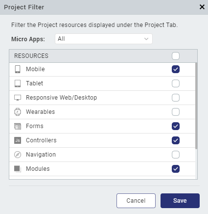
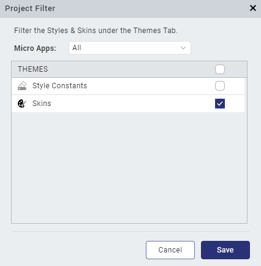
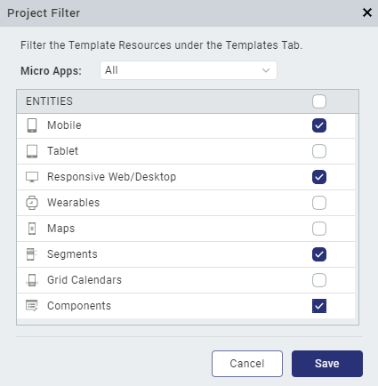
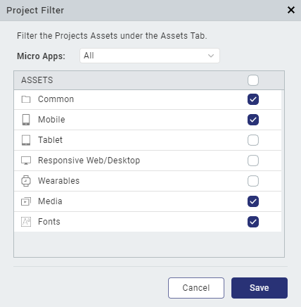

 

Apply Filters in the Project Explorer
=====================================

From V9 Service Pack 5, you can configure the visibility of the nodes in the Project Explorer for the complete project (or for each Micro App) by applying filters. You can apply filters in each tab (the Project, Themes, Templates, and Assets tabs) of the Project Explorer. only displays those resources that you select from the Project Filter dialog box in the Project Explorer.

To filter resources in the **Project** tab of the Project Explorer, follow these steps:

1.  In the Project Explorer, navigate to the **Project** tab.
2.  From the hamburger menu in the Project Explorer, click **Filter**.  
    The **Project Filter** dialog box appears.  
    

3.  From the **Micro Apps** field, select the micro apps that you want to filter.
4.  From the **Resources** section, select the filters that you want to apply for the micro apps.
5.  Click **Save**.  
    The selected micro apps are filtered based on the selected resources.  
    

To filter resources in the **Themes** tab of the Project Explorer, follow these steps:

1.  In the Project Explorer, navigate to the **Themes** tab.
2.  From the hamburger menu in the Project Explorer, click **Filter**.        
    The **Project Filter** dialog box appears.  
    

3.  From the **Micro Apps** field, select the micro apps that you want to filter.
4.  From the **Themes** section, select the filters that you want to apply for the micro apps.
5.  Click **Save**.  
    The selected micro apps are filtered based on the selected resources.

To filter resources in the **Templates** tab of the Project Explorer, follow these steps:

1.  In the Project Explorer, navigate to the **Templates** tab.
2.  From the hamburger menu in the Project Explorer, click **Filter**.  
    The **Project Filter** dialog box appears.  
    

3.  From the **Micro Apps** field, select the micro apps that you want to filter.
4.  From the **Entities** section, select the filters that you want to apply for the micro apps.
5.  Click **Save**.  
    The selected micro apps are filtered based on the selected resources.

To filter resources in the **Assets** tab of the Project Explorer, follow these steps:

1.  In the Project Explorer, navigate to the **Assets** tab.
2.  From the hamburger menu in the Project Explorer, click **Filter**.  
    The **Project Filter** dialog box appears.  
     

3.  From the **Micro Apps** field, select the micro apps that you want to filter.
4.  From the **Assets** section, select the filters that you want to apply for the micro apps.
5.  Click **Save**.  
    The selected micro apps are filtered based on the selected resources.
