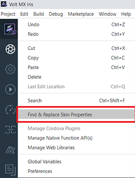
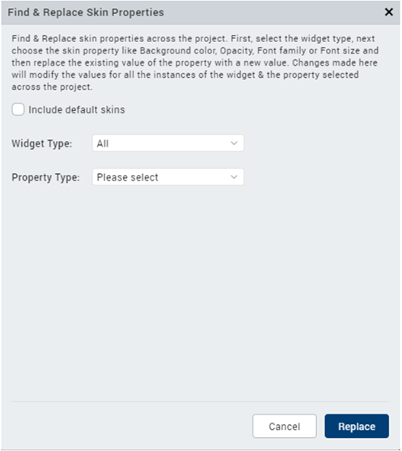
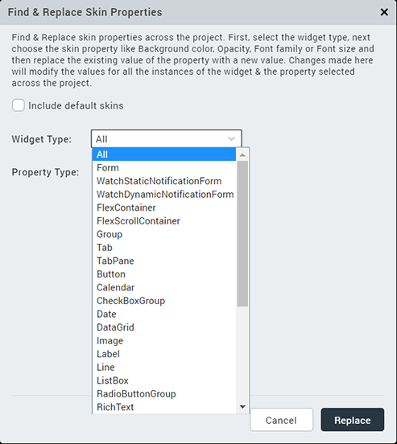
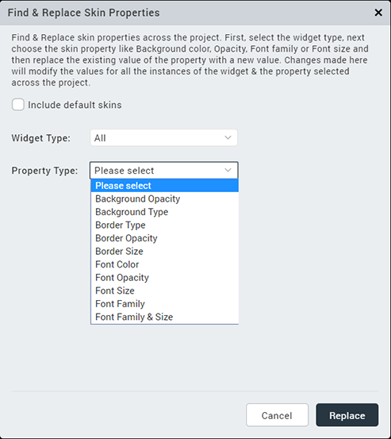
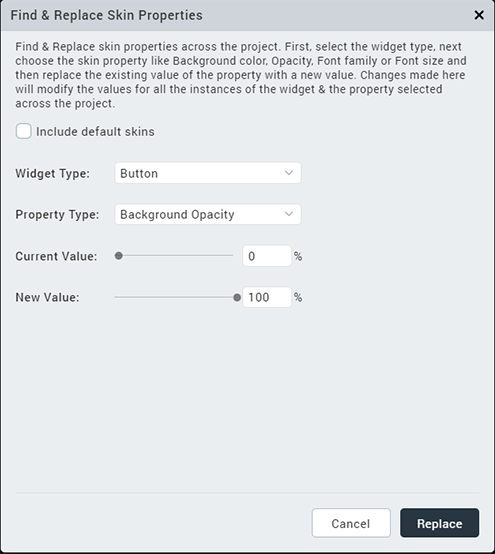

                          

Rebrand a Project
=================

As a developer, there might be instances where you create a base application that can later be customized based on the customer requirements.to customize the look of an app, developers had to navigate to each widget and update the Skin properties for each instance.

> **_Note:_** Before getting started with this feature, ensure that you have a good understanding of using [Skins and Themes in Volt MX Iris](Customizing_the_Look_and_Feel_with_Skins.md).

For instance, the HCL Infinity Retail Banking application is used as the base app on which customizations are made based on customer requirements. When a new prospect arrives, using the rebranding feature, you can change the generic branding of the Retail Banking application with a branding that is specific to the prospective customer. Alternatively, an existing customer can use this feature to change their branding, if there have been any changes to their corporate branding. For example, a change in the logo or corporate branding colors, etc.

In the V9 Service Pack 2 release, Volt MX Iris has introduced a new feature to rebrand apps, the **Find and Replace Skin Properties** option. This feature enables developers to customize the skin properties present in a current theme of the project.

Using the Find and Replace Skin Properties option, you can customize the **Background**, **Border**, and **Font** properties of the skins available in a theme across the project. The changes made in the **Find and Replace** interface will modify the values for all the instances of the property pertaining to the widget.

Find and Replace Skin Properties in Volt MX Iris
------------------------------------------------------

To customize the Skin properties based on the widget type, follow these steps.

1.  From the **Edit** menu of Volt MX Iris, select **Find and Replace Skin Properties**.  
      
    The **Find and Replace** dialog box appears.  
    
2.  From the **Widget Type** drop-down list, select the widget for which you want to set the properties.  
      
    
3.  From the **Property Type** drop-down list, select the Skin property that you want to change for the widget.  
      
    
    > **_Note:_** The Property Type list only displays properties that are specific to the selected widget. If the Widget Type is selected as `All`, the Property Type list displays the properties that are common to all the widgets.
    
4.  In the **Current Value** field, select the source value that you want to replace.
5.  In the **New Value** field, set the target value that you want to replace the source value with.
    
    > **_Note:_** If you want to change the properties of the **Default Iris Skins**, enable the **Include default skins** checkbox.
    
6.  Click **Replace**.
    
    Volt MX Iris internally checks the current theme for the list of skins associated with the selected widget type, and replaces the values of all the instances of the selected property.
    

After the find and replace action is complete, the changes reflect on the Iris canvas, and Volt MX Iris displays details of the modified properties in the **Skin** tab of the selected widget.  
The Console tab displays a list of the modified Skins.

### Limitations

The Find and Replace Skin properties option has the following limitations:

*   Dependent or Platform-specific Skin properties cannot be changed using the Find and Replace option.
*   The **Font size** can only be set in % units.
*   If Background Type or Border Type is selected in the Property Type field, the values of **Opacity** will only be modified for the Single Color and Two-Step Gradient options. The Opacity values for the Multi-step gradient will not be modified.
*   If you select **Image** as the **Background Type**, you must select the same list of platforms in the New Value field.
*   For the **Calendar** widget, skin properties for the Grid and Cell cannot be changed using the Find and Replace option.
*   For the **Switch** widget, the following properties are not updated when **All** is selected as the **Widget Type**.
    *   Background Left Color
    *   Background Right Color
    *   Background Left Opacity
    *   Background Right Opacity
    *   Font Left Color
    *   Font Right Color
    *   Font Left Opacity
    *   Font Right Opacity
