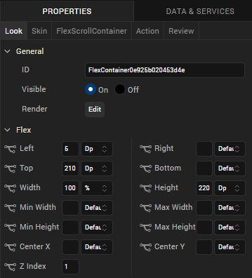
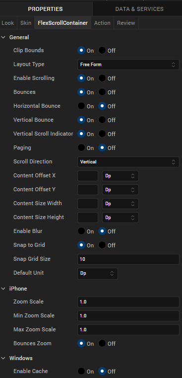

                          

FlexScrollContainer
-------------------

Use a FlexScrollContainer widget to create is a scrollable layout area on a form that can contain other widgets. It can contain any number of widgets within it. If you do not want the layout area to include scroll bars, use a FlexContainer widget. For more information, see [Convert Flex Container Widgets](PopulatingWidgets.md#convert-flex-container-widgets).

To learn how to use this widget programmatically, refer [VoltMX Iris Widget guide](../../../Iris/iris_widget_prog_guide/Content/FlexScrollContainer.md).

### Look Properties

Look properties define the appearance of the widget. The following are the major properties you can set:

*   Whether the widget is visible.
*   The platforms on which the widget is rendered.
*   How the widget aligns with its parent widget and neighboring widgets.
*   If the widget displays content, where the content appears.

For descriptions of the properties available on the Look tab of the Properties pane, see [Look](Look.md#Flex).

### Skin Properties

Skin properties define a skin for the widget, including background color, borders, and shadows. If the widget includes text, you can also specify the text font.

For a FlexScrollContainer, you can apply a skin and its associated properties for the following states:

  
| Skin | Definition |
| --- | --- |
| Normal | The default skin of the widget. |
| Focus | The skin applied when the widget has the focus. |
| Blocked UI | The skin applied to block the interface until the action in progress (for example, a service call) completes. > **_Note:_** Blocked UI is available only for SPA platforms. |

For more information about applying skins, see [Understanding Skins and Themes](Customizing_the_Look_and_Feel_with_Skins.md).

### FlexScrollContainer Properties

FlexScrollContainer properties specify properties that are available on any platform supported by Volt MX Iris, and assign platform-specific properties.

#### Clip Bounds

For Volt MX Iris Version 9.2 and later, specifies whether child widgets are clipped to the bounds of the FlexScrollContainer.

#### Layout Type

Specifies whether the widget content flows horizontally, vertically, or in both directions.

Default: Vertical

Following are the options:

*   Free Form: Navigation occurs in both directions.
*   Flow Vertical: Navigation is vertical.
*   Flow Horizontal: Navigation is horizontal. 

> **_Note:_**  
As per layout behavior changes for  FlexContainer introduced as part of 9.5 
When layout type of FlexContainer is set to <b>Flow Horizontal</b> then 
the <b>Left</b> property of all current child widgets of that FlexContainer will set to 0 
When layout type of FlexContainer is set to <b>Flow Vertical</b> then 
the <b>Top</b> property of all current child widgets of that FlexContainer will set to 0    

#### Enable Scrolling

Specifies whether scrolling is enabled.

#### Bounces

Specifies whether scroll bounce is enabled.

#### Horizontal Bounce

Specifies whether scroll bounce is enabled in the horizontal direction.

Default: Off

#### Vertical Bounce

Specifies whether scroll bounce is enabled in the vertical direction.

Default: On

#### Horizontal Scroll Indicator

Specifies whether the horizontal scroll indicator is enabled.

> **_Note:_** Depending on the platform, scroll indicators may be visible only during scrolling.

#### Vertical Scroll Indicator

Specifies whether the vertical scroll indicator is enabled.

> **_Note:_** Depending on the platform, scroll indicators may be visible only during scrolling.

#### Paging

Specifies the whether paging is enabled for scrolling.

#### Scroll Direction

Specifies the scroll direction, either horizontal, vertical, or both horizontal and vertical.

Default: Vertical

#### Content Offset X

Specifies the X coordinate of the top-left of the scrollable region. When content offset values are set, the FlexScrollContainer scrolls even if scrolling is disabled. The value does not reflect the actual computed offset.

#### Content Offset Y

Specifies the Y coordinate of the top-left of the scrollable region. When content offset values are set, the FlexScrollContainer scrolls even if scrolling is disabled. The value does not reflect the actual computed offset.

#### Content Size Width

Specifies the FlexScrollContainer width to accommodate all the widgets placed in it. The value does not reflect the actual computed content size.

#### Content Size Height

Specifies the FlexScrollContainer height to accommodate all the widgets placed in it. The value does not reflect the actual computed content size.

#### Snap to Grid

Specifies whether the widget aligns to the nearest intersection of lines in the grid, or other widgets.

#### Snap Grid Size

Specifies the grid size. This option is available only when **Snap to Grid** is enabled.

#### Default Unit

Specifies the default unit to be used for interpretation of numbers with no qualifiers when passed to layout properties.

Following are the options:

*   dp: Specifies the values in terms of device independent pixels.
*   px: Specifies the values in terms of device hardware pixels.
*   %: Specifies the values in percentage relative to the parent dimensions.

#### Zoom Scale

Specifies the scale factor applied to the FlexScrollContainer content.

Default:1

> **_Note:_** This property is specific to the iOS platform.

#### Min Zoom Scale

Specifies the minimum zoom scale factor that can be applied to the FlexScrollContainer.

Default: 1

> **_Note:_** This property is specific to the iOS platform.

#### Max Zoom Scale

Specifies the maximum zoom scale factor that can be applied to the FlexScrollContainer.

Default: 1

> **_Note:_** This property is specific to the iOS platform.

#### Bounces Zoom

Specifies whether the scroll view animates the content scaling when the scaling exceeds the maximum or minimum limits. If Bounces Zoom is set to On and zooming exceeds either the minimum or maximum limits for scaling, the scroll view temporarily animates the content scaling just past the limits before returning to them. If Bounces Zoom is set to Off, zooming stops immediately when it reaches scaling limits.

> **_Note:_** This property is specific to the iOS platform.

### Actions

Actions define what happens when an event occurs. On a FlexScrollContainer widget, you can run an action when the following events occur:

*   onScrollStart: The action is triggered when when the user starts scrolling the content. This event occurs asynchronously.
*   onScrollTouchReleased: The action is triggered when the user's touch is released from the touch surface. This event occurs asynchronously.
*   onScrolling: The action is triggered when scrolling is in progress. This event occurs asynchronously.
*   onDecelerationStarted: The action is triggered when the user stops scrolling but the content still moves before the content actually stops. This event occurs asynchronously.
*   onScrollEnd: The action is triggered when scrolling is ended. This event occurs asynchronously.
*   onTouchStart: The action is triggered when the user touches the touch surface. This event occurs asynchronously.
*   onTouchMove: The action is triggered when the touch moves on the touch surface continuously until movement ends. This event occurs asynchronously.
*   onTouchEnd: The action is triggered when the user's touch is released from the touch surface. This event occurs asynchronously.
*   widgetToZoom: An event callback is invoked by the platform to return one of the child widgets of source to zoom. The returning source itself makes the complete scroll container zoomable. If a null value is returned then the container does not zoom. This event occurs asynchronously.

> **_Note:_** This action is specific to the iOS platform.

*   onZoomStart: The action is triggered when the FlexScrollContainer is about to zoom. This event occurs asynchronously.

> **_Note:_** This action is specific to the iOS platform.

*   onZooming: The action is triggered when the FlexScrollContainer is zooming. This event occurs asynchronously.

> **_Note:_** This action is specific to the iOS platform.

*   onZoomEnd: The action is triggered when the zooming has ended. This event occurs asynchronously.

> **_Note:_** This action is specific to the iOS platform.

For more information, see [Add Actions](working_with_Action_Editor.md).

<table style="margin-left: 0;margin-right: auto;mc-table-style: url]('Resources/TableStyles/RevisionTable.css');" class="TableStyle-RevisionTable" cellspacing="0" data-mc-conditions="Default.md5 Only"><colgroup><col class="TableStyle-RevisionTable-Column-Column1" style="width: 26px;"> <col class="TableStyle-RevisionTable-Column-Column1"> <col class="TableStyle-RevisionTable-Column-Column1"></colgroup><tbody><tr class="TableStyle-RevisionTable-Body-Body1"><td class="TableStyle-RevisionTable-BodyE-Column1-Body1" data-mc-conditions="Default.HTML5 Only">Rev</td><td class="TableStyle-RevisionTable-BodyE-Column1-Body1" data-mc-conditions="Default.HTML5 Only">Author</td><td class="TableStyle-RevisionTable-BodyD-Column1-Body1" data-mc-conditions="Default.HTML5 Only">Edits</td></tr><tr class="TableStyle-RevisionTable-Body-Body1"><td class="TableStyle-RevisionTable-BodyE-Column1-Body1" data-mc-conditions="Default.HTML5 Only">8</td><td class="TableStyle-RevisionTable-BodyE-Column1-Body1" data-mc-conditions="Default.HTML5 Only">SHS</td><td class="TableStyle-RevisionTable-BodyD-Column1-Body1" data-mc-conditions="Default.HTML5 Only">SHS</td></tr><tr class="TableStyle-RevisionTable-Body-Body1"><td class="TableStyle-RevisionTable-BodyB-Column1-Body1" data-mc-conditions="Default.HTML5 Only">7.2.1</td><td class="TableStyle-RevisionTable-BodyB-Column1-Body1" data-mc-conditions="Default.HTML5 Only">SHS</td><td class="TableStyle-RevisionTable-BodyA-Column1-Body1" data-mc-conditions="Default.HTML5 Only">SHS</td></tr></tbody></table>
