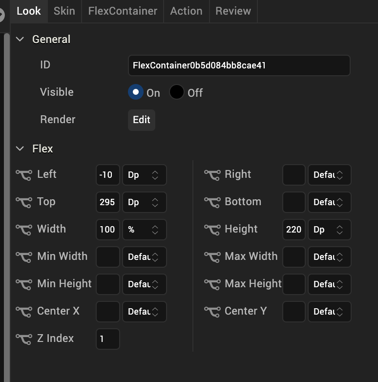
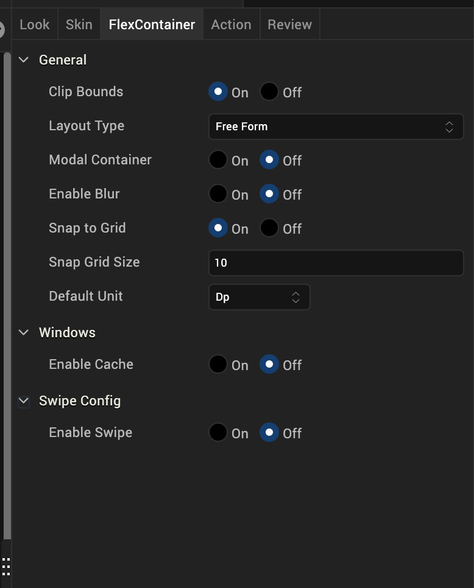

                           

FlexContainer
-------------

Use a FlexContainer widget to create a layout area on a form that can contain other widgets. If you want the layout area to include scroll bars, use a FlexScrollContainer widget. For more information, see [Convert Flex Container Widgets](PopulatingWidgets.md#convert-flex-container-widgets).

To learn how to use this widget programmatically, refer [VoltMX Iris Widget guide](../../../Iris/iris_widget_prog_guide/Content/FlexContainer.md).

### Look Properties

Look properties define the appearance of the widget. The following are the major properties you can set:

*   Whether the widget is visible.
*   The platforms on which the widget is rendered.
*   How the widget aligns with its parent widget and neighboring widgets.
*   If the widget displays content, where the content appears.

For descriptions of the properties available on the Look tab of the Properties pane, see [Look](Look.md#Flex).

#### Auto Growth of a FlexContainer Widget

You can specify that a FlexContainer widget dynamically adjusts its height based on the height of its child widgets by setting the Height property on the Look tab to _Preferred_. The height of the FlexContainer then adjusts when the height of any child widgets changes.

Following are important considerations for a FlexContainer that is set to adjust dynamically:

*   A FlexContainer will not dynamically adjust it has a static height; for example, if Top and Bottom values are set.
*   A FlexContainer that contains other dynamically-adjusting widgets adjusts it's height after the child widgets have adjusted. For example, if the FlexContainer contains another FlexContainer that is set to grow dynamically and a Segment2 widget with the Auto Grow property enabled, the height of the parent FlexContainer dynamically adjusts after the heights of the child FlexContainer and Segment2 widgets adjust.

The following table summarizes how to calculate the height of child widgets:

  
| Height | Center Y | Top | Bottom | Child Height |
| --- | --- | --- | --- | --- |
| Yes | Yes | Yes | Yes | centerY + height/2 + bottom |
| Yes | Yes | No | Yes | centerY + height/2 + bottom |
| Yes | Yes | Yes | No | centerY+ height/2 |
| Yes | Yes | No | No | centerY+ height/2 |
| No | Yes | Yes | Yes | (centerY – top) \* 2 + top + bottom |
| No | Yes | Yes | No | (centerY – top) \* 2 + top |
| No | Yes | No | Yes | centerY + bottom + cph/2 |
| No | Yes | No | No | centerY + CPH/2 |
| Yes | No | Yes | Yes | top + height + bottom |
| No | No | Yes | Yes | top + CPH + bottom |
| Yes | No | Yes | No | top + height |
| No | No | Yes | No | top + CPH |
| Yes | No | No | Yes | height + bottom |
| No | No | No | Yes | cph + bottom |
| Yes | No | No | No | height |
| No | No | No | No | CPH |

> **_Note:_** The Computed Preferred Height (CPH) is determined by the calculated height for the content-driven widget, the default value returned from the configuration file, and the calculated height of the Auto Grow Segment or FlexContainer.  

Limitations:

*   If top or bottom values of child widgets are not provided, then zero values are used when determining the height of a FlexContainer.
*   If the height of a widget changes when the widget's skin state changes (for example, from normal to focus), the height of a FlexContainer will not grow dynamically.
*   If a widget's top value is negative, then the widget will be clipped in case of **Free Form** and overlapped on the previous widget in **Flow Vertical**.
*   A FlexContainer will not grow dynamically when placed inside an HBox or a VBox.
    
    > **_Note:_** You can place a FlexContainer inside an HBox or VBox only while creating a Map or Gridcalendars template.
    
*   If clip bounds are disabled for a child FlexContainer, the children of the child FlexContainer that are out of the bounds do not affect the height of the parent FlexContainer. Only the heights of direct children of the parent FlexContainer are be used to determine its height.
*   A Segment template created using a FlexContainer will dynamically grow only when the Segment2 view type is **Table View**.
*   FlexContainer dynamic growth is not supported on a **Tab Widget**.
*   In the Windows Platform, the Segment2 Auto Grow property is not supported if the Segment 2 widget is placed inside a FlexContainer.

### Skin Properties

Skin properties define a skin for the widget, including background color, borders, and shadows. If the widget includes text, you can also specify the text font.

For a FlexContainer widget, you can apply a skin and its associated properties for the following states:

  
| Skin | Definition |
| --- | --- |
| Normal | The default skin of the widget. |
| Focus | The skin applied when the widget has the focus. |
| Blocked UI | The skin applied to block the interface until the action in progress (for example, a service call) completes. > **_Note:_** Blocked UI is available only for SPA platforms. |

For more information about applying skins, see [Understanding Skins and Themes](Customizing_the_Look_and_Feel_with_Skins.md).

### FlexContainer Properties

FlexContainer properties specify properties that are available on any platform supported by Volt MX Iris, and assign platform-specific properties.

  

#### Clip Bounds

Specifies whether to clip child widgets when they go out of boundaries.

#### Layout Type

Specifies whether the arrangement of widgets in the FlexContainer flows horizontally, vertically, or in both directions.

Default: Vertical

#### Child Widget Align

Specifies whether the arrangement of widgets in the child widget of the FlexContainer flows horizontally, vertically, or in both directions.

Default: Right to Left.

Iris generates **reverseLayoutDirection** property with **true** for Right to Left and Bottom to Top. Iris generates this property with **false** for Left to Right and Top to Bottom.

#### Snap to Grid

Specifies whether the widget aligns to the nearest intersection of lines in the grid, or other widgets.

#### Snap Grid Size

Specifies the grid size. This option is available only when **Snap to Grid** is enabled.

#### Default Unit

Specifies the default unit used for interpretation of numbers with no qualifiers when passed to layout properties.

Following are the options:

*   dp: Specifies the values in terms of device independent pixels.
*   px: Specifies the values in terms of device hardware pixels.
*   %: Specifies the values in percentage relative to the parent dimensions.

#### Swipe Config

From Volt MX Iris V9 onwards, you can configure the swipe functionality for a Segment widget. The Swipe config settings enable users to dismiss a row or to reveal certain actions when they swipe a row to the left or right.

> **_Note:_** The Swipe Config setting is applicable only on the Flex Container widget that is present inside a segment widget.

**To enable the swipe left or swipe right functionality on the rows of a Segment, follow these steps:**

1.  In Iris, from the **Project** explorer, navigate to a <channel> > **Forms**.
2.  Right-click **Forms** and then click **New Form**.
3.  Drag and drop a **Segment** widget onto the form, and then rename the Segment.
4.  On the Templates tab, go to **Mobile** > **Segment**.
5.  Right-click **Segment**, select **New Template**, and then rename the template as **Temp1**.
6.  On the **Project** Explorer, click the Segment widget.
7.  On the **Properties** panel, click the **Segment** tab. For **Row Template**, select **Temp1**.
8.  Go to the **Templates** Explorer, and then select the Flex Container under **Temp1**.
9.  On the **Properties** panel, click the **FlexContainer** tab. The **Swipe Config** section appears.
10.  Under the **Swipe Config** section, select **On** for **Enable Swipe**. The **Enable Swipe Left** and **Enable Swipe Right** settings appear.
    

 
11.  To enable a swipe left or swipe right functionality, select **On** for **Enable Swipe Left** or **Enable Swipe Right** 
    respectively. After the selection, right/left FlexContainers are added under the Swipe Container.
12.  Then, select the actions that the rows of a Segment must perform on swiping:
    *   **Swipe to Reveal:** Enables you to display the left or right swipe container when you swipe a row to the left or right. The right FlexContainer is visible when you swipe the row to the left and vice-versa.
    *   **Swipe to Dismiss:** Enables you to perform an action on a row when you swipe the row to the left or right.
13.  From the Templates Explorer, select the FlexContainer under the **Temp1** template.  
    If you select **Swipe to Dismiss**, the **onSwipeLeft** or **onSwipeRight** actions are available and can be configured under the **Action** tab of the Properties panel.
    
> **_Note:_** If you have not used a row template but dragged the widgets directly onto the Segment, the **onSwipeLeft**or **onSwipeRight** properties are available on the **Action** tab of the Segment.
    
14.  Click **Edit** beside the **onSwipeLeft** or **onSwipeRight** action. In the Action Editor, add the actions that the row must perform on swiping to left or right.
15.  To edit the Swipe Config settings, go to the Properties panel, and then click the **Segment** tab. Under **General** settings, click **Edit** beside the **Swipe Config** option.

The swipe functionality can be configured to a row of a segment through code by using the [widgetSwipeMove](../../../Iris/iris_widget_prog_guide/Content/Segment_Properties.md#widgetSwipeMove) property.

  > **_Note:_** On Android and SPA/Desktop Web platforms, if you reset the data of a Segment widget, make sure that you include entries for the widgets that are inside the swipe container. Otherwise, the widgets are not rendered at the run time.

### Actions

Actions define what happens when an event occurs. On a FlexContainer widget, you can run an action when the following events occur:

*   **onTouchStart:** The action is triggered when the user touches the touch surface. This event occurs asynchronously.
*   **onTouchMove:** The action is triggered when the touch moves on the touch surface continuously until movement ends. This event occurs asynchronously.
*   **onTouchEnd:** The action is triggered when the user touch is released from the touch surface. This event occurs asynchronously.
*   **onClick:** The action is triggered when the user clicks on the widget.
*   **onSwipeLeft:** This action is triggered when you swipe a row of a Segment widget to the left. This action is available only when the **enable Swipe** and **enable Swipe Left** options are enabled and the **Type** is set to **Swipe to Dismiss** for the Segment template.
    
*   **onSwipeRight:** The action is triggered when you swipe a row of a Segment widget to the right. This action is available only when the **enable Swipe** and **enable Swipe Right** options are enabled and the **Type** is set to **Swipe to Dismiss** for the Segment template.
    

For more information, see [Add Actions](working_with_Action_Editor.md).

<table style="margin-left: 0;margin-right: auto;mc-table-style: url]('Resources/TableStyles/RevisionTable.css');" class="TableStyle-RevisionTable" cellspacing="0" data-mc-conditions="Default.md5 Only"><colgroup><col class="TableStyle-RevisionTable-Column-Column1" style="width: 26px;"> <col class="TableStyle-RevisionTable-Column-Column1"> <col class="TableStyle-RevisionTable-Column-Column1"></colgroup><tbody><tr class="TableStyle-RevisionTable-Body-Body1"><td class="TableStyle-RevisionTable-BodyE-Column1-Body1" data-mc-conditions="Default.HTML5 Only">Rev</td><td class="TableStyle-RevisionTable-BodyE-Column1-Body1" data-mc-conditions="Default.HTML5 Only">Author</td><td class="TableStyle-RevisionTable-BodyD-Column1-Body1" data-mc-conditions="Default.HTML5 Only">Edits</td></tr><tr class="TableStyle-RevisionTable-Body-Body1"><td class="TableStyle-RevisionTable-BodyE-Column1-Body1" data-mc-conditions="Default.HTML5 Only">V8 SP2</td><td class="TableStyle-RevisionTable-BodyE-Column1-Body1" data-mc-conditions="Default.HTML5 Only">PG</td><td class="TableStyle-RevisionTable-BodyD-Column1-Body1" data-mc-conditions="Default.HTML5 Only">PG</td></tr><tr class="TableStyle-RevisionTable-Body-Body1"><td class="TableStyle-RevisionTable-BodyE-Column1-Body1" data-mc-conditions="Default.HTML5 Only">8</td><td class="TableStyle-RevisionTable-BodyE-Column1-Body1" data-mc-conditions="Default.HTML5 Only">SHS</td><td class="TableStyle-RevisionTable-BodyD-Column1-Body1" data-mc-conditions="Default.HTML5 Only">SHS</td></tr><tr class="TableStyle-RevisionTable-Body-Body1"><td class="TableStyle-RevisionTable-BodyB-Column1-Body1" data-mc-conditions="Default.HTML5 Only">7.2.1</td><td class="TableStyle-RevisionTable-BodyB-Column1-Body1" data-mc-conditions="Default.HTML5 Only">SHS</td><td class="TableStyle-RevisionTable-BodyA-Column1-Body1" data-mc-conditions="Default.HTML5 Only">SHS</td></tr></tbody></table>
