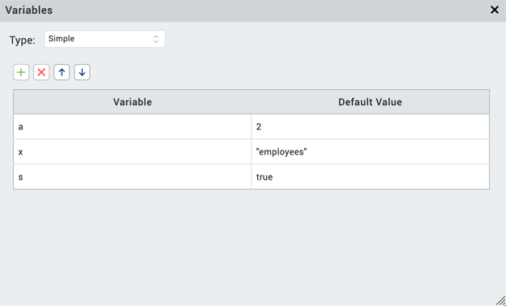
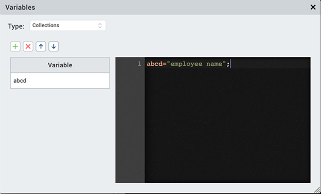

                         

Add Global Variables
--------------------

You add global variables to your project using the Global Variables dialog box. The variables added here are accessible globally, that is, they are accessible across:

*   All the containers in the application
*   Code modules
*   The Action Editor
*   The Mapping Editor

Alternatively, you can also add variables in the Action Editor as a part of the action items. The variables added in the Action Editor are local variables and are available only to the action items defined from that point onwards.

**_Notes:_***   All the global variables (except Pre Appinit) defined in the Global Variables dialog box are accessible in the code modules, but global variables that are defined in the code modules are not accessible from the Global Variables dialog box.
*   To ensure the best performance possible for your application, you should use global variables only if necessary. Be sure to delete any global variables that your app doesn't use.
*   Variables are application-related. After you log out from the application, the variables are no longer available.

Global Variables are of two types:

*   **Simple.** A variable that contains a single record.
*   **Collection.** A variable that contains multiple records. You can add as many records as you want to a collection.

### Add a Simple Global Variable

To add a Simple global variable, follow these steps:

1.  In Volt MX Iris, point to the **Edit** menu, and then click **Global Variables**. The **Variables** dialog box opens.
2.  From the **Type** list box, select **Simple**. The Simple variable can either be a String, Number, or a Boolean value. You must provide the String variable details in quotes.  
    
3.  In the **Variable** column field, type the name of the variable. You must enter a name that is unique to the application and one that is not used for another variable.
4.  In the **Default Value** column field, type the initial value that you want the variable to hold when the app is first opened.
5.  To add a new row for another variable, click the **+** icon. To delete an added variable, select the row and click the red **X** icon. If you want to modify the order of the variables, click the upper and lower arrow icons as required.
6.  Repeat steps 3 through 5 until you have added all the Simple variables that you want.
7.  Close the Variables dialog box by clicking the gray **X** icon at the upper-right corner of the dialog box.

### Add a Collection Global Variable

To add a Collection global variable, do the following:

1.  In Volt MX Iris, point to the **Edit** menu, and then click **Global Variables**. The **Variables** dialog box opens.
2.  From the **Type** list box, select **Collections**.
3.  In the **Variable** column field, type the name of the variable. You must enter a name that is unique to the application and one that is not used for another variable.
4.  In the right column, enter the assignment statements or function calls that you want in JSON format.
5.  To add a new row for another variable, click the **+** icon. To delete an added variable, select the row and click the red **X** icon. If you want to modify the order of the variables, click the upper and lower arrow icons as required.
6.  Repeat steps 3 through 5 until you have added all the Collection variables that you want.
7.  Close the Variables dialog box by clicking the gray **X** icon at the upper-right corner of the dialog box.

