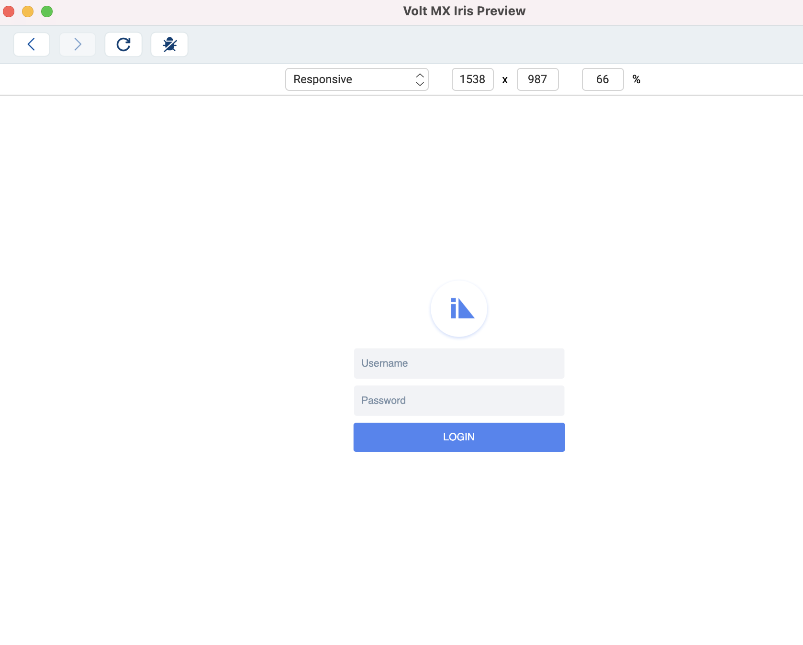
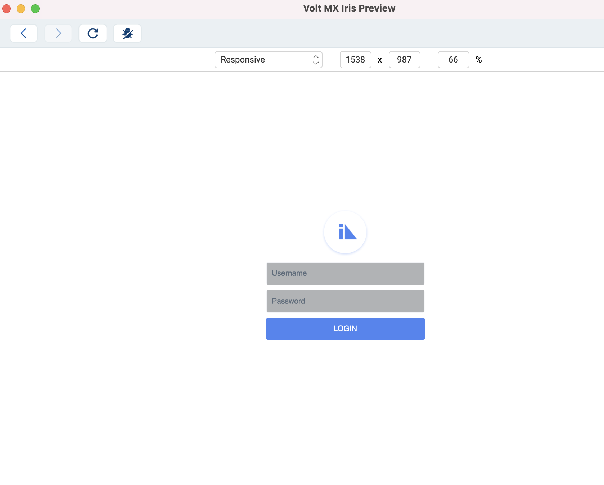

                         

##  Hot Reload Overview

Starting with  release, Volt MX Iris has introduced the Hot Reload feature in live preview. The Hot Reload feature improves the Live preview experience within Volt MX Iris by reducing the build and preview time of a live preview.

Using the Hot Reload key, developers can view their changes immediately, adjust their UI as required and fix any code issues. Developers can also build their UI incrementally by viewing their changes in the live preview using the Hot reload feature. The Hot reload feature also reduces the application build time. Earlier, to view changes in the live preview, developers always had to build the application.

While in the Iris canvas, you can use the Ctrl+Shift+R combination to invoke the Hot reload feature in the Live Preview window.

## Use the Hot Reload feature in Volt MX Iris

### Prerequisites

Following are the prerequisites to use the Hot Reload feature in Volt MX Iris :

* Ensure that you have a working Volt MX account.

* Ensure that you have Volt MX Iris V9 Service Pack 1 or later
  installed on your computer.

### Using Hot Reload

In the following steps, we will take you through the steps of using the Hot Reload feature using a sample app from the HCL Forge .

1.  In Volt MX Iris, from the main menu, navigate to **HCL Forge** \> **Browse**.
2.  In the search bar, Enter **RecipientsWeb**.  
    A list of applications appears.
3.  From the list, select **RecipientsWeb**.  
    The details of the RecipientsWeb app appears.
4.  Click **Import to Workspace**.  
    It may take some time for Iris to import the app.
5.  From the Main menu, go to **Build** > **Live Preview Settings**
6.  Select **Responsive Web**.  
    Ensure that any other selected platforms are unselected.
7.  Click **Save & Run**.  
    A dialogue with the Iris preview appears. 

      
    
8.  On the Iris canvas, change the button name from **Login** to **Submit**.
9.  Navigate to the preview window again and click on the Hot Reload key (Ctrl+shift+R).  
    Changes made on the form will reflect in the live preview window.  
    
    

Limitation 
-----------

*   Hot reload is only supported for MVC applications, changes are reflected in forms and controllers.
*   Hot Reload support only on the responsive web. This is to avoid any release mode security issues.
    
*   Hot reload works only on a top-level form that you are viewing.
    
*   If you make any changes to your Volt MX Foundry, the Hot Reload feature will not work. If foundry app changes are made, then you need to re initiate the preview.
*   Hot Reload will not reflect the changes in the items below.
    
    *   i18N resources
    *   Themes
    *   Custom widgets
    *   Custom fonts
    *   Templates
    *   Components
    *   Changes to module files except for form controllers.
        

Before you get started, ensure that you have following prerequisites.

*   Ensure that you have a working Volt MX account.
*   Ensure that you have installed on your computer.

> **_Note:_** From the V9 Service Pack 5 release, support for the Hot Reload feature has been added to MVC 2.0 apps, Form Controllers (including Form Controller Extensions), Segment Templates, and Components (including component controller modules, component controller extensions, and widget actions).