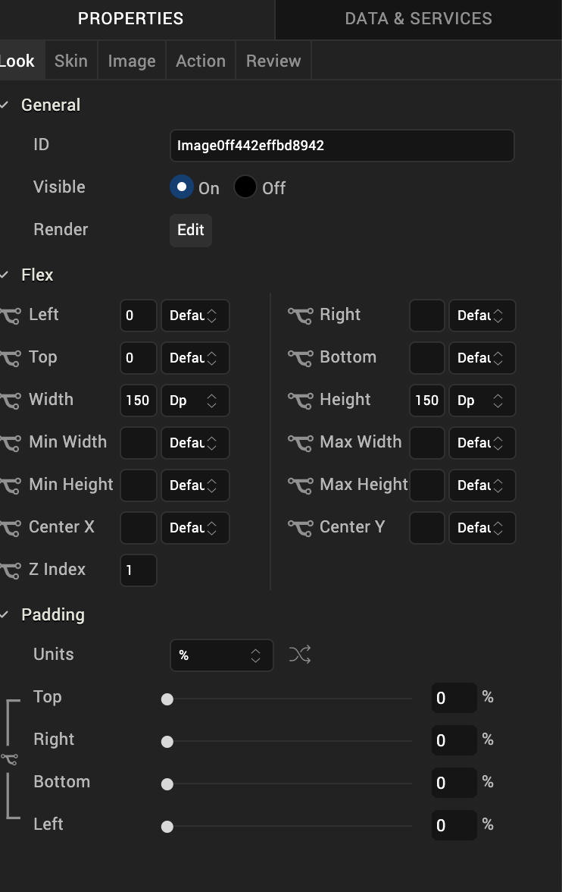
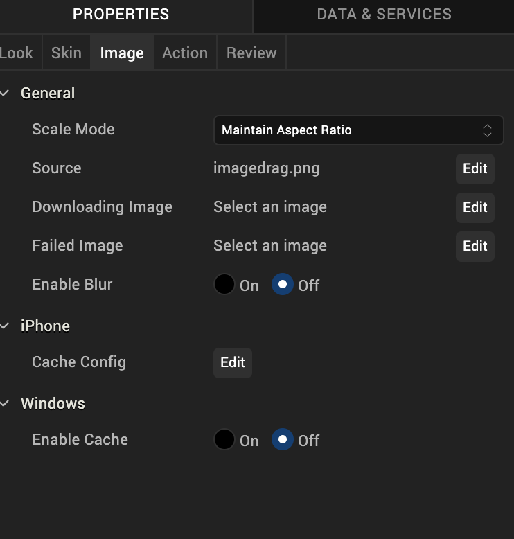

                           

Image
-----

Use an Image widget to display a graphic image such as a company logo, photo, or illustration in PNG, JPEG, GIF, or WebP format.

To learn how to use this widget programmatically, refer [VoltMX Iris Widget guide](../../../Iris/iris_widget_prog_guide/Content/Image.md).

### Important Considerations

The following are important considerations for an Image widget:

*   Before using an image in a project, copy the image to a project subfolder. For more information, see [Add and Manage Images and Other Media](Adding_and_Managing_Images.md).
*   On an Android device, imported images from a drawable folder are ignored during functional preview.
    
*   An Image file name must contain only lowercase characters and numbers, must begin with an alphabetic character, and can't be a JavaScript reserved word or keyword.

The following table shows examples of valid and invalid file names:

  
| Valid File Names | Invalid File Names | Remarks |
| --- | --- | --- |
| myicon.png | Myicon.png | The file name is invalid because it contains an uppercase character. |
| icon2.png | Icon\_2.png | The file name is invalid because it contains uppercase character and an underscore. |
| accntsummary.png | aCCNT&summary.png | The file name is invalid because it contains uppercase characters and special character. |
| accountdetails.png | Details.png | The file name is invalid because it contains an uppercase character. |
| flightstatus123.png | continue.png | The file name is invalid because it contains a Java keyword. |

### Look Properties

Look properties define the appearance of the widget. The following are the major properties you can set:

*   Whether the widget is visible.
*   The platforms on which the widget is rendered.
*   How the widget aligns with its parent widget and neighboring widgets.
*   If the widget displays content, where the content appears.

For descriptions of the properties available on the Look tab of the Properties pane, see [Look](Look.md#Flex).

### Skin Properties

Skin properties define a skin for the widget, including background color, borders, and shadows. If the widget includes text, you can also specify the text font.

> **_Note:_** On iOS and the Android platforms, rounded border skins are not supported.

For an Image widget, you can apply a skin and its associated properties for the following states:

  
| Skin | Definition |
| --- | --- |
| Normal | The default skin of the widget. |
| Hover Skin | The look and feel of the widget when the cursor hovers over the widget. > **_Note:_** Hover skins are available only on the Windows (native) Tablet platform. |

For more information about applying skins, see [Understanding Skins and Themes](Customizing_the_Look_and_Feel_with_Skins.md).

### Image Properties

Image properties specify properties that are available on any platform supported by Volt MX Iris, and assign platform-specific properties.

#### Scale Mode

Specifies how the image is scaled within the Image widget.

**Default**: Maintain Aspect Ratio

The following scale options are available:

*   Fit To Dimensions
*   Maintain Aspect Ration
*   Crop

#### Source

Specifies the source of the image to be displayed. You can specify an image from the Resources folder or an image URL.

To specify an image:

1.  Click the **Edit** button to open the Source dialog box.
2.  Do one of the following:

*   Locate and select the image you want from the list of available
    images.

   Enter a partial file name in the **Search** box to narrow down the number of images listed. You can also change how the images are displayed by clicking the Layout icons in the upper-left portion of the Source dialog box. You can display the image files as a grid of small previews; a list that includes file names, dimensions, and sizes; or as a file list with a preview pane that displays a preview of the currently highlighted image.

*   In the http Image URL text box, enter an image URL.

Click **Open**. The Source property displays the file name or URL of the image.

#### Downloading Image

Specifies the image displayed when the remote source is being downloaded.

To specify an image, click the **Edit** button open the **Downloading Image** dialog box. You can either select an available image or specify an image URL.

#### Failed Image

Specifies the image to be displayed when the remote resource is not available.

To specify an image, click **Edit** button to open the **Failed Image** dialog box. You can either select an available image or specify an image URL.

#### Tool Tip

For the Windows Tablet platform, specifies a message that displays when you hover the mouse pointer over the widget .

### Actions

Actions define what happens when an event occurs. On an Image widget, you can run an action when the following event occurs:

*   onDownloadComplete: The action is triggered when the image download is complete.
*   onTouchStart: The action is triggered when the user touches the touch surface. This event occurs asynchronously.
*   onTouchMove: The action is triggered when the touch moves on the touch surface continuously until movement ends. This event occurs asynchronously.
*   onTouchEnd: The action is triggered when the user touch is released from the touch surface. This event occurs asynchronously.

For more information, see [Add Actions](working_with_Action_Editor.md).

### Placement Inside a Widget

The following table summarizes where an Image widget can be placed:

<table style="mc-table-style: url('Resources/TableStyles/Basic.css');" class="TableStyle-Basic" cellspacing="0"><colgroup><col class="TableStyle-Basic-Column-Column1"> <col class="TableStyle-Basic-Column-Column1"></colgroup><tbody><tr class="TableStyle-Basic-Body-Body1"><td class="TableStyle-Basic-BodyE-Column1-Body1">Flex Form</td><td class="TableStyle-Basic-BodyD-Column1-Body1">Yes</td></tr><tr class="TableStyle-Basic-Body-Body1"><td class="TableStyle-Basic-BodyE-Column1-Body1">VBox Form</td><td class="TableStyle-Basic-BodyD-Column1-Body1">Yes</td></tr><tr class="TableStyle-Basic-Body-Body1"><td class="TableStyle-Basic-BodyE-Column1-Body1">FlexContainer</td><td class="TableStyle-Basic-BodyD-Column1-Body1">Yes</td></tr><tr class="TableStyle-Basic-Body-Body1"><td class="TableStyle-Basic-BodyE-Column1-Body1">FlexScrollContainer</td><td class="TableStyle-Basic-BodyD-Column1-Body1">Yes</td></tr><tr class="TableStyle-Basic-Body-Body1"><td class="TableStyle-Basic-BodyE-Column1-Body1">Scroll Box</td><td class="TableStyle-Basic-BodyD-Column1-Body1">Horizontal Orientation - Yes Vertical Orientation- Yes</td></tr><tr class="TableStyle-Basic-Body-Body1"><td class="TableStyle-Basic-BodyE-Column1-Body1">Tab</td><td class="TableStyle-Basic-BodyD-Column1-Body1">Yes</td></tr><tr class="TableStyle-Basic-Body-Body1"><td class="TableStyle-Basic-BodyE-Column1-Body1">Segment</td><td class="TableStyle-Basic-BodyD-Column1-Body1">Yes</td></tr><tr class="TableStyle-Basic-Body-Body1"><td class="TableStyle-Basic-BodyE-Column1-Body1">Popup</td><td class="TableStyle-Basic-BodyD-Column1-Body1">Yes</td></tr><tr class="TableStyle-Basic-Body-Body1"><td class="TableStyle-Basic-BodyB-Column1-Body1">Template&nbsp;</td><td class="TableStyle-Basic-BodyA-Column1-Body1">Header- NoFooter- No</td></tr></tbody></table>

<table style="margin-left: 0;margin-right: auto;mc-table-style: url]('Resources/TableStyles/RevisionTable.css');" class="TableStyle-RevisionTable" cellspacing="0" data-mc-conditions="Default.md5 Only"><colgroup><col class="TableStyle-RevisionTable-Column-Column1" style="width: 26px;"> <col class="TableStyle-RevisionTable-Column-Column1"> <col class="TableStyle-RevisionTable-Column-Column1"></colgroup><tbody><tr class="TableStyle-RevisionTable-Body-Body1"><td class="TableStyle-RevisionTable-BodyE-Column1-Body1" data-mc-conditions="Default.HTML5 Only">Rev</td><td class="TableStyle-RevisionTable-BodyE-Column1-Body1" data-mc-conditions="Default.HTML5 Only">Author</td><td class="TableStyle-RevisionTable-BodyD-Column1-Body1" data-mc-conditions="Default.HTML5 Only">Edits</td></tr><tr class="TableStyle-RevisionTable-Body-Body1"><td class="TableStyle-RevisionTable-BodyE-Column1-Body1" data-mc-conditions="Default.HTML5 Only">8</td><td class="TableStyle-RevisionTable-BodyE-Column1-Body1" data-mc-conditions="Default.HTML5 Only">SHS</td><td class="TableStyle-RevisionTable-BodyD-Column1-Body1" data-mc-conditions="Default.HTML5 Only">SHS</td></tr><tr class="TableStyle-RevisionTable-Body-Body1"><td class="TableStyle-RevisionTable-BodyB-Column1-Body1" data-mc-conditions="Default.HTML5 Only">7.2.1</td><td class="TableStyle-RevisionTable-BodyB-Column1-Body1" data-mc-conditions="Default.HTML5 Only">SHS</td><td class="TableStyle-RevisionTable-BodyA-Column1-Body1" data-mc-conditions="Default.HTML5 Only">SHS</td></tr></tbody></table>
