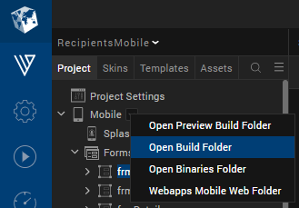
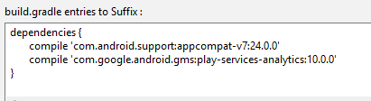

                         

You are here: Appendix B: Android Build Environment and Configurations

Android Build Environment and Configurations
============================================

Android developers can customize and configure Android build environments using the following information:

1.  [Access the Generated Android Project for Volt MX Iris Application](#access-the-generated-android-project-for-application)
2.  [Main Activity and its Life Cycle Methods](#main-activity-and-its-life-cycle-methods)
3.  [Android Pre-compile and Post-compile Ant Tasks Support](#android-pre-compile-and-post-compile-ant-tasks-support)
4.  [Support for Integrating Android Third-Party Libraries With Volt MX Iris project](#support-for-integrating-android-third-party-libraries-with-volt-mx-iris-project)
5.  [Network Security Configuration](#network-security-configuration)

Access the Generated Android Project for Volt MX Iris Application
-----------------------------------------------------------------------

If an application is built in Volt MX Iris for the Android platform, a corresponding native Android project is generated.

Changes made to the project can be compiled in the command line using `gradle assembleDebug`, `gradle assembleRelease` by navigating to the native Android application folder in the command line.

To access the generated Android project, do the following: 

1.  In Volt MX Iris, in the Project Explorer, on the Project tab, click the context menu arrow for your platform of choice (e.g. Mobile), and then click Open Build Folder.
2.  Launch Volt MX Iris.
3.  In Volt MX Iris, in the Project Explorer, on the **Project** tab, click the context menu arrow for your platform of choice (e.g. Mobile), and then click **Open Build Folder**. Open the build folder. A folder opens with the directory structure
     `<WorkSpace>\temp\<AppID>`.

     

4.  Navigate to the respective folder: 
    *   **Mobile**: `<WorkSpace>\temp\<AppID>\build\luaandroid\dist\<AppID>`.
    *   **Tablet**: `<WorkSpace>\temp\<AppID>\build\luatabrcandroid\dist\<AppID>`.

Main Activity and its Life Cycle Methods
----------------------------------------

If the application package name is **com.xyz.sample** and the Application ID is **SampleApplication**, the Volt MX Iris build process generates a Main Activity Java source file with Application ID as its name in the following path: 

*   **Mobile**: `<WorkSpace>\temp\SampleApplication\build\luaandroid\dist\SampleApplication\src\com\xyz\sample\SampleApplication.java`
*   **Tablet**:  `<WorkSpace>\temp\SampleApplication\build\luatabrcandroid\dist\SampleApplication\src\com\xyz\sample\SampleApplication.java`

A developer can add custom code and add/modify overridden Android activity life cycle methods such as onCreate(), onStart(), onResume(), onPause(), onStop(), onRestart(), onDestroy(), onNewIntent(Intent), and so on. A developer can also invoke any third-party APIs directly from overridden life cycle methods of the class.

While enhancing the Java file, a developer needs to remember the following points: 

1.  You can enhance the auto-generated methods in this class, but you must not remove any auto-generated code.
2.  While overriding life cycle methods, you must call the superclass implementation of each life cycle method.
3.  While using the pre-compile task feature(described in next section), to overwrite the generated Main Activity file with the modified file, a developer may need to maintain separate Main Activity Java source files for debug and release modes, because they differ in certain functions or parameters.

Android Pre-compile and Post-compile Ant Tasks Support
------------------------------------------------------

A developer can perform custom tasks before and after compiling the generated native Android application using **androidprecompiletask.xml** and **androidpostcompiletask.xml**.

For example, a developer can perform the following pre-compile tasks using androidprecompiletask.xml: 

1.  Overwrite the generated Main Activity Java file with modified file in `<AppID>\src\<packagepath>\` folder .
2.  Copy the modified Android application build XML file to the native Android folder.
3.  Copy any custom libs, assets, res, and other files/folders into the native Android hierarchy.
4.  Append custom properties to project.properties or local.properties, etc.

For example, you can perform the following post-compile tasks using androidpostcompiletask.xml: 

1.  Automating signing of an application with a release key.
2.  Trigger a security scan on a generated APK for security flaws.
3.  Trigger automation on a compiled APK file and publish results.
4.  Check-in code in GIT repositories.

A developer can copy these XMLs into Volt MX Iris project workspace base directory with same names (**androidprecompiletask.xml** and **androidpostcompiletask.xml**).

A template **androidprecompiletask.xml** file is available at `<WorkSpace>\temp\<AppID>\build\luaandroid\extres`. This XML is available under `extres` folder after building any sample project. This XML file contains build parameter information useful to perform the tasks explained in the example above.

> **_Note:_** The pre- and post- compile Ant tasks can support integration with external tools such as binary protection tools, static analyzer tools, and so on.

Support for Integrating Android Third-Party Libraries With Volt MX Iris project
-------------------------------------------------------------------------------------

Since VoltMX's build system is based on Gradle, integrate third party Android library format (.aar) files into the project by copying .aar files to the required path.

Similarly, third-party java class (.jar) files can also be integrated into the project by copying .jar files to the required path.

*   For mobile - `<WorkSpace>\<Application>\resources\customlibs\lib\android`
*   For tablet - `<WorkSpace>\<Application>\resources\customlibs\lib\tabrcandroid`

If the library format's .aar or .jar file depends on other libraries, add them to your project.

> **_Important:_** If the included dependencies have an associated order among them, they must be added in same order. For more information on dependency order, see [Dependency order](https://developer.android.com/studio/build/dependencies.md#dependency_order).

For Volt MX Iris, use the **build.gradle entries to Suffix** Gradle property to add dependencies. For example, if your .aar file or .jar file depends on _Appcompat_ and _Play Services Analytics_, you can add the following dependency entries.



For information on Gradle properties, see [Set Native App Properties](Native_App_Properties.md).


```
< concat destfile = "${app.dir}/build.gradle"
append = "true" > $ {
    line.separator
}
dependencies.compile 'com.android.support:appcompat-v7:24.0.0' < /concat>
```
```
< concat destfile = "${app.dir}/build.gradle"
append = "true" > $ {
    line.separator
}
dependencies.compile 'com.google.android.gms:play-services-analytics:10.0.0' < /concat>
```


Network Security Configuration
------------------------------

For privacy policy Google Android has changed the network security configuration from Android 9 (API level 28 ) and upper versions.   

Starting with Android 9 (API level 28), cleartext support is disabled by default. previous it is by default enabled ( upto Android 8.1(API level 27)) .

So if you want build starting with Android 9 ( API level 28) you have to allow **android:usesCleartextTraffic="true"** .

Two ways you can allow:
*   You can write code level inside your app - res/xml/network_security_config.xml

`<?xml version="1.0" encoding="utf-8"?> <network-security-config> <domain-config cleartextTrafficPermitted="true"> <domain includeSubdomains="true">api.example.com(to be adjusted)</domain> </domain-config> </network-security-config>`

*   You can use as a TAG in Iris setting 


