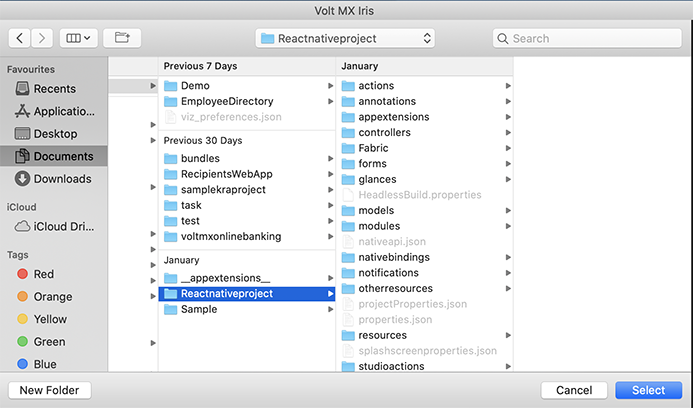

                         


Integrate a React Native App to Volt MX App
===========================================

Using this feature, you can integrate a React Native app (which is developed in React Native framework) to an app (which is developed in Volt MX Iris framework). The React Native app is embedded into the Volt MX Iris form through a container, called as the React Native Container. Furthermore, some APIs are used to communicate between the React Native app's JavaScript framework and the Volt MX app's Volt MX Iris framework.

React Native is a framework developed by Facebook. React Native is used to create cross-platform mobile applications.


For more information on the container and communication APIs that are essential to integrate a React Native app to a Volt MX Iris app, refer these sections:

*   [React Native Container](../../../Iris/iris_widget_prog_guide/Content/react_Native_Container.md)
*   [Communication APIs for React Native App](../../../Iris/iris_api_dev_guide/content/communication_api_for_react_native.md)

Prerequisites
-------------

Before you try to integrate the React Native app into your Volt MX Iris project, ensure that you compile the reactNative project and run it at least once (by which you can confirm that the project is error-free).

Requirements for the React Native Project
-----------------------------------------

For integrating the reactNative app into your Volt MX Iris project, the requirements for the reactNative Project are as follows:

*   You must create the reactNative project by using the **react-native init <AppName>** command.
    
*   If multiple React Native apps are used in the Volt MX Iris app, ensure that all React Native apps have the same dependency versions (for example, react-native": "0.57.0 ). Verify the **package.json** file of the React Native app to identify the dependencies.  
    
    > **_Note:_** The supported React Native version in Volt MX Iris is 0.59.x and not any other version above that.  
      
    For the Android OS, if the React Native version is less than 0.58.0, then the React Native apps bundles only armeabi-v7a, arm64-v8a and x86 .so files but not the x86\_64 .so file. If the version is equal to or greater than the version. 0.58.0, then both 32- and 64-bit architectures .so files of arm and x86 are bundled with React Native app.  
      
    To check the path of the React Native app version, navigate to the React native workspace and open the **package.json** file. **<react-native app workspace>/package.json**
    
*   Ensure that the node dependencies of the reactNative project are installed. If they are not installed , install it by using the **npm install** command.

> **_Note:_** For iOS, the application code inside the React Native AppDelegate class is ignored. Multiple apps must not have the same class files or classes with the same name.

Manually Integrate a React Native App to a Volt MX Iris App
-----------------------------------------------------------------

In this section, you will learn how to integrate a React Native app to a Volt MX Iris app manually.

> **_Important:_** Currently, Volt MX Iris does not provide the support to directly integrate a React Native app to a Volt MX Iris app. As a result, you must perform the steps mentioned in the following sections to execute the integration process.

### Common Steps

1.  In the root folder of your Volt MX Iris Application workspace, create a folder and name it as **ReactNativeProjects**.  
      
    
    
2.  Copy the React Native app(s) to the **ReactNativeProjects** folder.  
    For iOS, follow these steps:
    
    1.  Create a package.json file in the **ReactNativeProjects**. This json file must contain a JSON object with a single key-value pair, where the key is **dependencies** and its value is an array of react-native dependencies mentioned in each package.json file of all the React Native apps. For example,  
        **//package.json file content**  
        **{**  
        **"dependencies": \["react","react-native","react-navigation"\]**  
        **}**
        
    2.  If the React Native apps contain pod dependencies, create a pod file in the ReactNativeProjects folder and mention all the pod dependencies for all the React Native apps, with the target as **KRelease** inside the pod file.
3.  Run the following platform-specific React Native command from each ReactNative app root folder to generate the hierarchical JavaScript bundle:
    
    *   For Android:  
        **react-native bundle --platform android --dev false --entry-file index.js --bundle-output android/app/src/main/assets/&lt;AppName&gt;/index.android.bundle --assets-dest android/app/src/main/res**
    
    > **_Note:_** Create the assets folder (under &lt;reactNativeApp&gt;/android/app/src/main/) and also &lt;AppName&gt; folder under assets, if they do not exist.
    
    *   For iOS:  
        **react-native bundle --entry-file index.js --platform ios --dev false --bundle-output ios/&lt;AppName&gt;/main.jsbundle --assets-dest ios**
    
    > **_Note:_** Replace &lt;AppName&gt; with the app's **name** key value that is available in the app.json file, which is located at the root folder of the each ReactNative project.
    

### Enable React Native for Andorid

You can enable the React Native feature for Android by adding its corresponding properties to the androidbuild.properties file. For detailed information on the manual steps of this process, click [here](Native_App_Properties.md#React_Native).

### Enable React Native for iOS

The manual steps to enable the React Native feature for iOS are as follows:

1.  In Volt MX Iris, go to **Product > Build**, select the iOS Build option, and then click **Build**.
2.  In the Console, a link will be generated, which is the path to the created KAR file.
3.  Click the link. The KAR file location opens.
4.  Rename the **voltmxappiphone.KAR** file to **voltmxappiphone.zip**
5.  Unzip the voltmxappiphone.zip file, and then paste the ReactNativeProjects folder (which is present at root folder of app. workspace) in the unzipped folder.
6.  Include the following key in the **application.properties** file of the project:<br>`enableReactNative = true`
6.  Compress the contents of the unzipped folder to create an archive (zip).
7.  Rename the zip with extension as KAR; this creates a KAR file that contains React Native apps.
8.  Navigate back to Iris, go to **Product** > **Run As**, and then select the iOS emulator. The relevant logs in the Console are generated.
9.  In the Console, a link to the path of **VMAppWithVoltMXlib** is created.
10.  Click the link to open the VMAppWithVoltMXlib location.
11.  Go to the **gen** folder inside the VMAppWithVoltMXlib folder in the terminal.
12.  Enter the **perl extract.pl modified\_KAR\_file location** command to perform the KAR file extraction.
13.  After the Perl extract is complete, under the **Edit Scheme Build** options, Select Build Order as Manual Order option for the release scheme.
14.  For pods after the Perl extract, the **VMAppWithVoltMXLib.xcworkspace** file will be created; use this file to build the application.  
    If this file is present, the you must add the **$(inherited)** flag under the **Other Linker** flag setting.
15.  The third-party React Native libs that depend on pods should set the Framework Search Path, Library Search Path, and Header Search Path as **$(SRCROOT)/../../../../../Pods/** recursive.
16.  If the pods require any specific build settings, such as enable modules, deployment target, and swift version, you must set them.
17.  If the third-party React libraries have specific fonts, you must add those files to the project and also to the Info.plist file.
18.  If the app depends on any other framework or library file other than pods, you must add them to the project.
19.  If you are building in DEBUG mode, set BUILD ACTIVE ARCHITECTURES to YES.

Resolutions for Android Build Failure Issues
--------------------------------------------

For Android, React Native apps are added as libraries to the Volt MX Iris app, which might result in the failure of the build due to many reasons. Here are a few build failure issues when the React Native app is embedded and built for Android:

*   minSDKVersion of the Volt MX Iris app is lesser than one of the integrated React Native apps  
    **Resolution**: Ensure that the Volt MX Iris app's minSDKVersion value is equal to or greater than that of the integrated React Native app.
    
    *   Build Failure due to conflict of Gradle dependencies versions (caused by using different versions of Gradle dependencies ) in the Volt MX Iris app and the React Native app and its libraries. For example, com.android.support:appcompat-v7:26.1.0.  
        **Resolutions**:
        *   Modify the build.gradle file of the React Native apps and its corresponding libraries to use the dependency versions same as that of Volt MX Iris versions.
            
            1.  Location of the build.gradle file in the React Native app: _<reactNativeAppRootFolderPath>/android/app:build.gradle_
            
            > **_Note:_** The latest React Native apps use support libraries version variable as ext block of the build.gradle file, which is located at _<reactNativeAppRootFolderPath >/android_. You can modify the supportLibVersion from this location.  
            The relevant example is as follows.
            
            > ```
ext {............
            >     supportLibVersion = "26.1.0"
            > }
            > 
            > ```
            
        
        1.  The build.gradle location of the Libraries that is embedded in the React Native app is as follows: _<reactNativeAppRootFolderPath>/nodemodules/<libraryName>/android/build.gradle_
            
            > **_Note:_** You can view which libraries/modules are added to the React Native app by opening the settings.gradle file, which is located at _<reactnativeApp>/android_.
            
```
ext {............
                supportLibVersion = "26.1.0"
            }
            
```
            
            ext {............ supportLibVersion = "26.1.0" }
            
        
        *   Specify the Gradle system to use the given dependency version through the configuration strategy by adding the following code in the build.gradle file of the Volt MX Iris app. To add the code in the build.gradle file, do the following:  
            Go to **Project Settings > Native > Android**, scroll down to the **Manifest Properties & Gradle Build Entries** section, and then select the **Gradle Entries** tab.  
              
              
```
configurations.all {
                resolutionStrategy {
                    force "com.android.support:recyclerview-v7:27.1.1"
                    force "com.android.support:appcompat-v7:27.1.1"
                }
            }
            
```
            
            Click [here](https://developer.android.com/studio/build/dependencies#resolution_errors) to resolve other types of Gradle-dependency issues, such as duplicate classes.
            
    
    *   Build failure due to not identifying the React Native app's Gradle dependencies.  
        **Resolution**: Add all respositories of the React Native app mentioned in the build.gradle (<reactNativeApp>/android) file to the Volt MX Iris app's build.gradle file. To add the repositories in the build.gradle file, do the following:  
        Go to **Project Settings > Native > Android**, scroll down to the **Manifest Properties & Gradle Build Entries** section, and then select the **Gradle Entries** tab.  
          
```
allprojects {
            repositories {
                mavenLocal() google() jcenter() maven { // All of React Native (JS, Obj-C sources, Android binaries) is installed from npmurl "$rootDir/../node_modules/react-native/android"}maven {url 'https://maven.google.com/'name 'Google'}maven { url "https://jitpack.io" }}}
        
```
*   Build failure due to using different Build Tools versions in the Volt MX Iris app and the React Native app.  
    **Resolution**: Use the same Build Tools version in the React Native app as that of the Volt MX Iris Build Tools version.

> **_Note:_** The Build Tools versions are mentioned in the app module build.gradle file.

> ```
android {
>         ..........
>     buildToolsVersion '27.0.3'
> }
> 
> ```

*   Manifest merge conflicts  
    **Resolution**: Click [here](https://developer.android.com/studio/build/manifest-merge) to solve Manifest merge conflicts.

VoltMX's Gradle Plugin, Build Tools, and Gradle Dependencies
-------------------------------------------------------------

The relevant information on VoltMX's Gradle Plugin, Build Tools, and Gradle Dependencies for V9 SP2 is as follows.

> **_Note:_** The versions will change based on the plugins, so always refer the plugin corresponding to the build.gradle file for the exact Volt MX Iris versions used .

Location of the build.gradle file: _<workspace>/temp/<appName>build/<luaandroid/luatabrcandroid>dist/<appName>:_

Here is an example of a build.gradle file.

```
/** gradle android plugin version **/  
classpath 'com.android.tools.build:gradle:3.2.1'  
/** compileSDKVersion **/  
28  
/** build_tools_version **/  
28.0.3  
/** gradle version **/  
gradle 4.6  
/** support library dependencies **/  
implementation 'com.android.support:recyclerview-v7:28.0.0'  
implementation 'com.android.support:appcompat-v7:28.0.0'  
/** Google play services dependencies versions **/  
//maps  
implementation 'com.google.android.gms:play-services-maps:11.6.0'  
//locationlibversion  
implementation 'com.google.android.gms:play-services-location:11.6.0'  
//multidex_dependency  
implementation 'com.android.support:multidex:1.0.0'  
//dependencies_google_play_wearable_version  
implementation 'com.google.android.gms:play-services-wearable:11.6.0'  
//dependencies_android_support_wearable_version  
implementation 'com.google.android.support:wearable:2.0.2'  
//dependencies_android_wearable_wearable_version  
compileOnly 'com.google.android.wearable:wearable:2.0.2'  
//dependencies_google_fcm_messaging  
implementation 'com.google.firebase:firebase-messaging:11.6.0'  
//dependencies_google_play_pay_version  
implementation 'com.google.android.gms:play-services-wallet:11.6.0'  
//classpath_google_services  
classpath 'com.google.gms:google-services:3.1.0'  

```
