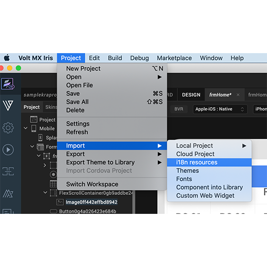

                         

You are here: Export Internationalization Resources

Internationalizing (i18n) Application Content
=============================================

The process of designing or developing an application in such a way that it supports various languages and regions is referred to as _Internationalization_, also known as _i18n_. In Volt MX Iris, the i18n features make it possible to build your app for various language locales without making changes to the application code or logic. By setting up the locales that you want to support and then adding what amounts to a vocabulary list for each locale, your app can become functional in multiple languages. Each entry that you make is called a key, and defines a given term in each of the locales that you want your application to support.

<!-- AI Volt MX IQ supports all locales supported by Google Translate. For the locales that are not directly supported by Iris, Google Translate is used for the translation internally, and the locale is added as a custom locale. Iris supports all the locales that are supported by Google Translate except Hebrew and Serbo-Croatian.

-->

The following topics lead you through the process of implementing i18n functionality in an app:

[Create Locales](#create-locales)

[Add i18n Content for Each Locale](#add-i18n-content-for-each-locale)

[Assign an i18n Key to a Widget](#assign-an-i18n-key-to-a-widget)

[Search for An i18n Key](#search-for-an-i18n-key)

[View a Locale Using the Preview App](#view-a-locale-using-the-preview-app)

In addition, you can also export a project's i18n settings and import them into another project.

[Export Internationalization Settings](#export-internationalization-settings)

[Import Internationalization Settings](#import-internationalization-settings)

[Updating i18N Keys on Android Applications](#updating-i18n-keys-on-android-applications)

Create Locales
--------------

To create locales, do the following:

1.  In Volt MX Iris, on the **Project** mwnu, click **Settings**.  
    The Project Settings window appears.
2.  In Application, select **Enable** under **Internationalization (118N)**.  
    A few new options appear.  
    
3.  Click **Configure**.
4.  Click **Configure Locales**.
5.  On the Predefined tab, select the checkboxes of the locales that you want your app to support. If you do not see the locale you want, click the Custom tab, and then add your own locale, giving it values for Language, Country, and Locale. For these values, use the patterns found in the predefined locales as examples to guide you.

    >**_Notes:_**   The Locale field must use the format aa\_AA or aa. For example, jp\_JP, or jp would be a valid locale name.

*   The Country field can only contain letters.
*   The Language field must begin with a letter.

6.  Once you have created your locales, click **OK**. The Configure Internationalization dialog box now has a column for each locale you created. For every locale you configure, a corresponding empty folder is created in your workspace using the following path:  
      `<workspace>\<application>\resources\common`  
       You can add images to this folder which you can use in the project for corresponding locale.  
    
7.  Set the default locale by selecting the locale you want from the Default Locale drop-down list.  
8.  Click **Finish**.  
    With your locales chosen, you can now define i18n keys for each locale.

Add i18n Content for Each Locale
--------------------------------

When it comes to adding i18n content to your application, you have a couple of options:

*    You can add i18n content within Volt MX Iris
    *   By adding i18n keys one after the other manually, or
    *   By adding all the i18n keys at once from a resource bundle
*   You can add i18n content programmatically from the code using APIs.

### Add i18n Keys Manually

This procedure assumes that you have already created the locales that you want your app to support. For more information, see [Create Locales](#create-locales).

To add i18n keys manually, do the following:

1.  In Volt MX Iris, on the navigate the **Project** > **Settings**
2.  In Application, select **Enable** under **Internationalization (118N)**.  

    A few new options appear.  
    
3.  Click **Configure**.
4.  In the Configure Internationalization dialog box, an initial row for an i18n key and the locales you want your app to support is displayed. In the Key field, type a name for your key, such as _key001_.
5.  In each locale's field for the key you just named, enter the word or phrase for the term you're defining. For instance, if you're entering the Spanish equivalent for the English phrase _Sign In_, you would enter _Iniciar Sesión_.
6.  Add a new row for each key you create by clicking the plus sign button.
7.  Repeat the steps to create a new row again for each new key you want to create.

      

8.  Click **Finish**.

> **NOTE:** From the Volt MX Iris V9 Service Pack 5 release, you can provide a title for the pop-up of rooted (or jail-broken) devices without changing the AppID. To do so, add a new row in the **Configure Internationalization** dialog box with the key set as `ROOT_DETECTION_TITLE`. Provide the name to be displayed as the pop-up title of the rooted device as the value of the ROOT_DETECTION_TITLE key.
> You can also set a default title for the pop-up by using the `default_root_detection_title` key in the following locations:
> 
> * infoplist_configuration.json file on the iOS platform.
> * res/values folder of the build folder on the Android platform.
> 
> If you do not configure the default key or the custom key, Iris displays the AppID as the pop-up title of rooted devices.

### Add i18n Programmatically Using APIs

For information on how to use APIs to programmatically add i18n functionality to an app, see the API Guide.

Assign an i18n Key to a Widget
------------------------------

To assign an i18n key to a widget, do the following:

1.  Using either the Project Explorer or the Iris Canvas, select a widget.
    
    The text of a widget uses the default language of the project.
    
2.  On the Look tab of the Properties pane, select the key you want from the **Text i18n Key** drop-down list, or using the search icon, search and filter for the key you want.
    
    > **_Note:_** For Group Widgets (such as ComboBox, DataGrid, and CheckBoxGroup) and Segment Widget, you assign i18n keys in the Master Data.
    

Search for An i18n Key
----------------------

When adding editing, or deleting i18n keys, you can make it easier to locate particular keys by searching for them.

To search for an i18n key, do the following:

1.  In Volt MX Iris, on the navigate the **Project** > **Settings**
2.  In Application, select **Enable** under **Internationalization (118N)**.  
    A few new options appear.  
    
3.  Click **Configure**.
4.  In the **Search** text box, type text that matches the key you're looking for. Keys that contain the text you type are listed in the table of i18n keys.

View a Locale Using the Preview App
-----------------------------------

To get a sense for what the user will experience when viewing an app in a particular locale, you can use the Volt MX Iris preview feature. The preview feature builds a preview version of the app, posts it to the cloud, and then gives you a publish code that you—or anyone you give the code to—can use to view the app on a device, such as a smartphone. The device simply needs to have the Volt MX Iris Preview App installed, which is available free from Volt MX on your device's app store.

To view a locale using the Preview App, do the following:

1.  In Volt MX Iris, on the navigate the **Project** > **Settings**
2.  In Application, select **Enable** under **Internationalization (118N)**.  
    A few new options appear.  
    
3.  Click **Configure**.
4.  Click **Configure Locales**.
5.  Select the locale you want from the Default Locale drop-down list.
6.  Follow the instructions provided in the topic, [Preview an App on a Device](PreviewAnAppOnADevice.md#FunctionalPreviewEnterprise.md).

Export Internationalization Settings
------------------------------------

You can export your i18n settings so that you can import them for use in a different Volt MX Iris project. From V9 SP2 onwards, you can export your i18n settings either as a JSON or as a CSV file format.

To export i18n settings, you can perform any of the following actions.

### From the Project Menu

1.  In Volt MX Iris, on the **Project** menu in Volt MX Iris) , point to **Export**, and then click **i18n resources**.  
      

    

2.  Select the file format as either **JSON** or **CSV**. The Save As dialog box appears.
3.  Navigate to the folder where you want to save the i18n settings, and then click **Save**. Volt MX Iris exports the i18n resources as a zipped file.

### From the Configure Internationalization Window

1.  In Volt MX Iris, on the navigate the **Project** > **Settings**
2.  In Application, select **Enable** under **Internationalization (118N)**.  
    A few new options appear.  
    
3.  Click **Configure**.
4.  Click the **export** icon beside the Configure Locales button.
5.  Select the file format as either **JSON** or **CSV**. The Save As dialog box appears.
    
6.  Navigate to the folder where you want to save the i18n settings, and then click **Save**. Volt MX Iris exports the i18n resources as a zipped file.  

    

Import Internationalization Settings
------------------------------------

If you have the exported i18n settings from another Volt MX Iris project, you can import them into the project you're working on. From V9 SP2 onwards, you can import i18n settings either as a JSON or as a CSV file format.

To import i18n settings, do the following:

1.  In Volt MX Iris, on the **Project** menu, point to **Import**, and then click **i18n resources**.
2.  In the Open dialog box, navigate to the zipped file that contains the i18n settings you want to import, select the file, and then click **Open**.

### Important Considerations

The following are important considerations when importing i18n keys:

*   If the current project contains i18n keys, the imported keys are added to the existing i18n file.
*   If the name of an existing key is the same as an imported key, then the imported key values overwrite the existing key values.
*   If the name of an existing key is the same as an imported key but the locales are different, then only those locales that are common are overwritten.
*   If the imported i18n keys have locales that are not defined in the current project, then Volt MX Iris activates these locales in the current project, and then assigns the imported i18n values.

### Resource Bundle

A resource bundle is a properties file that contains all the i18n keys, along with their values. It is locale-specific, that is, you will have one resource bundle per locale. To use resource bundles, you design your application to access the locale of choice at run-time, depending on the language the user chooses to display the app in. When the user chooses a different language, the resource bundle for that locale is implemented. A resource bundle follows the naming convention of `<language_Country>.properties`. For example,

*   For the United States English locale, the resource bundle is en\_US.properties
*   For the French Canadian locale, the resource bundle is fr\_CA.properties.

Updating i18N Keys on Android Applications
------------------------------------------

If your Android app is published even once, when you modify the app (including i18N locales, values), you must ensure to change the version of the app from project settings. Modifying the Version Number and Version Code are mandatory steps for the changes to reflect in the app.

To update the Version Number, do the following:

1.  From the **Project** menu, navigate to **Settings**.  
    The **Settings** window opens.
2.  In the **Application** tab, update the version number to the next version. For example, if the **Version** is 1.0.0, modify it to 1.0.1
3.  Click **Finish**.

To update the Version Code, do the following:

1.  From the **Project** menu, navigate to **Settings**.  
    The **Settings** window opens.
2.  Navigate to **Native** > **Android**.  
    The Android tab contents appear. By default, the Mobile/Tablet tab displays.
3.  Update the entry in the **Version Code**. For example, if the **Version Code** is 1.0, modify it to 1.1
4.  Click **Finish**.
