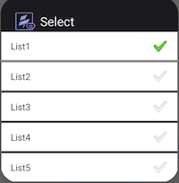

                           


ListBox
-------

Use a List Box widget to display a drop-down list of items. You can then click on an item to select it. You can now add a list box to a segment. When you add a list box to a segment, you can:

*   Assign data to the list box easily as when you add the list box to a segment, the widget data map is automatically assigned to the list box.
*   Dynamically assign data to the list box using the mandated format for list box. i.e. `[["key1", "value1"],["key2", "value2"],["key3", "value3"]`

When the list box is selected, the wheel pops-up in iOS. The segment row will not cover/hide the row. If the segment height isn't enough for the list box to expand, the segment expands to display the list box. This may distort the UI temporarily.

When the onRowClick event is triggered in a segment, the selected list box data is passed on to the action. If the default option is mentioned, then it is passed on in \["key1","value1"\] format. If a default option is not mentioned, then null is assigned to the list box value. The list box is activated only when the segment row is in focus. You cannot open multiple list-boxes simultaneously.

To learn how to use this widget programmatically, refer [VoltMX Iris Widget guide](../../../Iris/iris_widget_prog_guide/Content/ListBox.md).

#### Example

```
var masterData = [{
        "ListBoxadd": {
            "masterData": [
                ["lb1", "ListBox One"],
                ["lb2", "ListBox Two"],
                ["lb3", "ListBox Three"]
            ],
            "selectedKey": ["lb1"]
        },
   }, {},{}];
   this.view.DataSegment.rowTemplate = "rowFlex";
   this.view.DataSegment.sectionHeaderTemplate = "";
   this.view.DataSegment.widgetDataMap =  {
                    "rowFlex": "rowFlex",
                    "ListBoxadd": "ListBoxadd"
                };
   this.view.DataSegment.setData(masterData);

```

### Look Properties

Look properties define the appearance of the widget. The following are the major properties you can set:

*   Whether the widget is visible.
*   The platforms on which the widget is rendered.
*   How the widget aligns with its parent widget and neighboring widgets.
*   If the widget displays content, where the content appears.


For descriptions of the properties available on the Look tab of the Properties pane, see [Look](Look.md#Flex).

### Skin Properties

Skin properties define a skin for the widget, including background color, borders, and shadows. If the widget includes text, you can also specify the text font.

For a ListBox widget, you can apply a skin for the following states:

  
| Skin | Definition |
| --- | --- |
| Normal | The default skin of the widget. |
| Focus | The skin applied when the focus is on the widget. |
| Native Field | The skin applied to each item in the ListBox popup window. |
| Native Field Focus | The skin applied when an item in the ListBox popup window has the focus. |
| Blocked UI | The skin applied to block the interface until the action in progress (for example, a service call) completes. > **_Note:_** The Blocked UI skin property is available only for SPA platforms. |
| Placeholder | Reads the font color set in the skin and ignores other attributes. Android does not support setting a background color for a placeholder. |
| Hover Skin | The look and feel of a widget when the cursor hovers over the widget. > **_Note:_** Hover skins is available only on the Windows (native) Tablet platform. |

For more information about applying skins, see [Understanding Skins and Themes](Customizing_the_Look_and_Feel_with_Skins.md).

### ListBox Properties

ListBox properties specify properties that are available on any platform supported by Volt MX Iris, and assign platform-specific properties.

> **_Note:_** In this section, properties that can be forked are identified by an icon  located to the left of the property. For more information, see [Fork a Widget Property](Forking.md#fork-a-widget-property).


#### Master Data

Specifies the set of values displayed in the list box. To enter or add values, click the **Edit** button to open the **Master Data** dialog box.


The **Master Data** dialog box contains the following columns:

*   Key: The unique identifier of each list box entry.
*   Display Value: The values displayed in the list box.
*   Select Key : Specifies the default list box value.

To add List box values, click **Add**. To delete a list box entry, click inside a cell, and then click **Delete**. Click **Apply** to create the master data.

#### View Type

Specifies the list box view mode. Select a view type from the View Type drop-down list under either the iPhone or Android properties. The options available for iOS and Android vary.


##### View Types for iOS

Following are the options available for iOS platform:

*   **List.** Displays the list items in a conventional, drop-down format.
*   **Table.** Displays all available list items. The selected item has a check mark next to it.
*   **Toggle.** Displays all available items as a series of side by side segments. The background of the selected item is a different color from the other options. This color is referred to as the Tint Color, and you can change it by setting Enable Tint Color to **On**, and then selecting the color you want from the color palette. In addition, you can select one of three styles for the toggle: Plain, Bordered, or Bar. To distribute the segments in equal proportions, set the Equal Segments option to **On**.
*   **On-screen Wheel.** Similar to the iOS Picker control, presents the list options as a cylinder that you rotate to make your selection.

##### View Types for Android

Following are the options available for the Android platform:

*   **List.** Displays the list items in a conventional, drop-down format.
*   **Spinner.** Displays the list options as though they're on a cylinder that you rotate to make your selection.

#### Drop Down Image

Specifies the image used for the drop-down box indicator. The default is an inverted triangle.

To specify a different image or a platform-specific image, click the **Edit** button to open the **Drop Down Image** dialog box.


Select the desired platform and click inside corresponding **Value** field. From the **Select Image** dialog box, you can either select an available image or provide an image URL.

#### Selected Image

Specifies the image to be displayed when you make a selection.

> **_Note:_** If you specify a **Selected Image**, make sure to also specify an **Unselected Image**.

To specify a default image or a platform-specific image, click the **Edit** button to open **Selected Image** dialog box.


Select the desired platform and click inside corresponding **value** field. From the **Select Image** dialog box, you can either select an available image or provide an image URL.

#### Unselected Image

Specifies the image to be displayed when a selection is cleared.

> **_Note:_** If you specify a **Selected Image**, make sure to also specify an **Unselected Image**.

To specify a default image or a platform-specific image, click the **Edit** button to open the **Unselected Image** dialog box.


Select the desired platform and click inside corresponding **value** field. From the **Select Image** dialog box, you can either select an available image or provide an image URL.

#### Placeholder

Specifies temporary or substitute text displayed until a selection is made; for example, a hint provided as a word or phrase.

> **_Note:_** This property is specific to the iOS platform.

#### Popup Icon

Specifies the icon that appears on the top left of the popup window's title area.



To select a popup icon, click the **Edit** button to open the **Popup Icon** dialog box. Select an image and click **OK**.

> **_Note:_** This property is specific to the Android platform.

#### Popup Title

Specifies the list box title text.

> **_Note:_** This property is specific to the Android platform.

#### Tool Tip

For the Windows Tablet platform, specifies a message that displays when you hover the mouse pointer over the widget .

### Actions

Actions define what happens when an event occurs. On a ListBox widget, you can run an action when the following event occurs:

*   onSelection: The action is triggered when an item is selected.
*   onTouchStart: The action is triggered when the user touches the touch surface. This event occurs asynchronously.
*   onTouchMove: The action is triggered when the touch moves on the touch surface continuously until movement ends. This event occurs asynchronously.
*   onTouchEnd: The action is triggered when the user touch is released from the touch surface. This event occurs asynchronously.

For more information, see [Add Actions](working_with_Action_Editor.md).

### Placement Inside a Widget

The following table summarizes where a ListBox widget can be placed:

<table style="mc-table-style: url('Resources/TableStyles/Basic.css');" class="TableStyle-Basic" cellspacing="0"><colgroup><col class="TableStyle-Basic-Column-Column1"> <col class="TableStyle-Basic-Column-Column1"></colgroup><tbody><tr class="TableStyle-Basic-Body-Body1"><td class="TableStyle-Basic-BodyE-Column1-Body1">Flex Form</td><td class="TableStyle-Basic-BodyD-Column1-Body1">Yes</td></tr><tr class="TableStyle-Basic-Body-Body1"><td class="TableStyle-Basic-BodyE-Column1-Body1">VBox Form</td><td class="TableStyle-Basic-BodyD-Column1-Body1">Yes</td></tr><tr class="TableStyle-Basic-Body-Body1"><td class="TableStyle-Basic-BodyE-Column1-Body1">FlexContainer</td><td class="TableStyle-Basic-BodyD-Column1-Body1">Yes</td></tr><tr class="TableStyle-Basic-Body-Body1"><td class="TableStyle-Basic-BodyE-Column1-Body1">FlexScrollContainer</td><td class="TableStyle-Basic-BodyD-Column1-Body1">Yes</td></tr><tr class="TableStyle-Basic-Body-Body1"><td class="TableStyle-Basic-BodyE-Column1-Body1">ScrollBox</td><td class="TableStyle-Basic-BodyD-Column1-Body1">Horizontal Orientation - YesVertical Orientation- Yes</td></tr><tr class="TableStyle-Basic-Body-Body1"><td class="TableStyle-Basic-BodyE-Column1-Body1">Tab</td><td class="TableStyle-Basic-BodyD-Column1-Body1">Yes</td></tr><tr class="TableStyle-Basic-Body-Body1"><td class="TableStyle-Basic-BodyE-Column1-Body1">Segment</td><td class="TableStyle-Basic-BodyD-Column1-Body1">No</td></tr><tr class="TableStyle-Basic-Body-Body1"><td class="TableStyle-Basic-BodyE-Column1-Body1">Popup</td><td class="TableStyle-Basic-BodyD-Column1-Body1">Yes</td></tr><tr class="TableStyle-Basic-Body-Body1"><td class="TableStyle-Basic-BodyB-Column1-Body1">Template&nbsp;</td><td class="TableStyle-Basic-BodyA-Column1-Body1">Header- NoFooter- No</td></tr></tbody></table>


