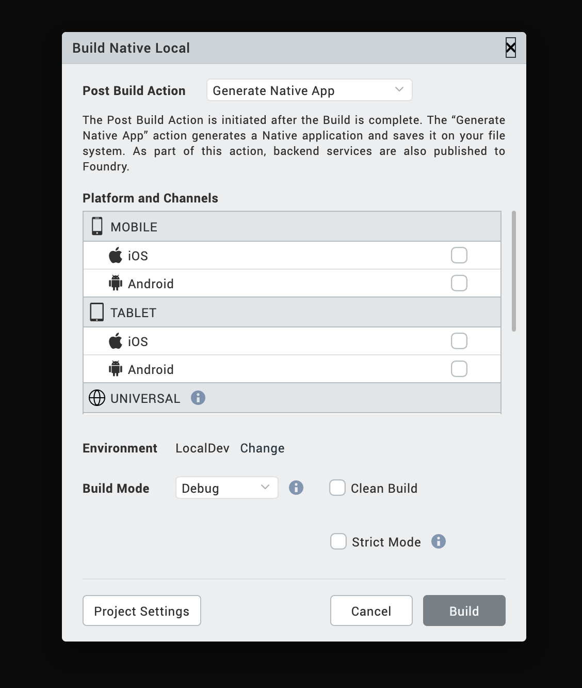
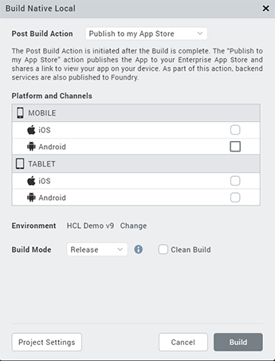
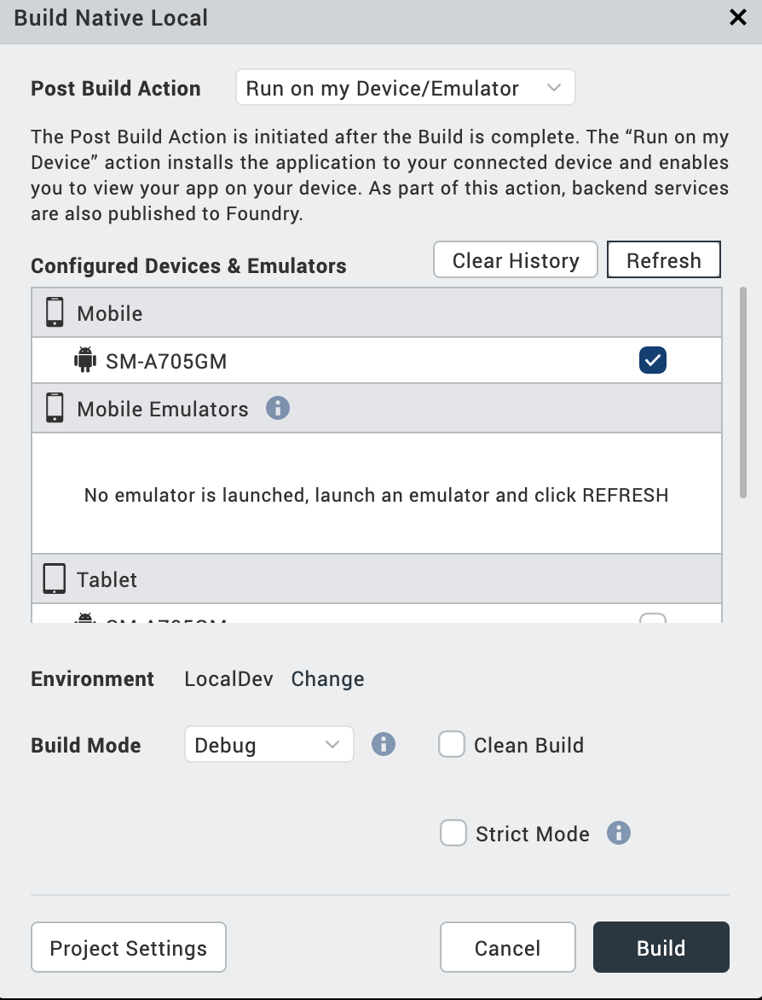
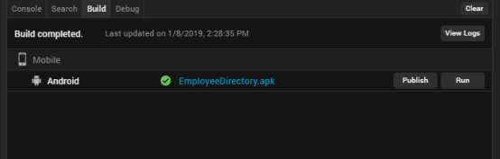

                         

Build Native Local on Volt MX Iris
========================================

> **_Note:_** Volt MX 9.2 does not support the building of Windows native applications. Please disregard all references to Windows in this topic.

Overview
--------

**Build Native Local**, a feature introduced in Volt MX Iris V9, is used to build native app binaries in Volt MX Iris and store the binaries on a local machine.  
For example, if you have an Android device connected to your system, you can generate the .apk file locally and run it on your device by using adb.

Through the _build_ process, application components are collected and repeatedly compiled for testing purposes, to ensure a reliable final product. The build process creates new resources, updates the existing resources, or does both.

After you develop an application, you must build the application to do the following:

*   Test the application for its performance and appearance on a device or on emulators.
*   Install the application on devices.

> **_Note:_** The plugins for the native builds will be downloaded when you build the app for the first time. Hence, it may take longer to build the app for the first time. Any subsequent builds will be [incremental](#incremental-build) and faster.

If you add an external asset or library to the Iris project after a full build, you must clean up the project using the **Clean Build** option. The **Clean Build** option erases files that were generated during the previous build and makes the project ready for the subsequent build. Once the project is cleaned, Iris will perform a full build the next time you trigger a build.

If you do not clean the project and perform a build, Iris will not take into consideration the assets and libraries added while performing the build.

### Incremental Build

When an app is built for the first time, a full build is performed. The subsequent builds are incremental. In an incremental build, the previously built state of the project is used and only those resources that are changed since the last build are regenerated.

You do not have to perform an incremental build and a full build separately. Iris will automatically decide whether to perform a full build or an incremental build based on the changes made.

The following are the scenarios where the build is always a full build.

*   If controllers that interact with the NFI are modified.
*   If the Project Settings for Android Mobile/Tablet are modified.

Prerequisites
-------------

**Following are the prerequisites to build a native app on a local machine within Volt MX Iris**:

*   Access to a Volt MX Foundry Environment. You must sign in to Volt MX Iris using the login credentials of either your Volt MX Foundry Cloud or on-premise environments.  If you want to use the Volt MX Foundry on-premise environment, you must [configure Volt MX Iris to connect to the Volt MX Foundry URL](LogInUsingCustAuth.md)	.

*   For publishing to the Enterprise App Store, you must have Volt MX Foundry V8 SP4 or later.
*   Configure the various Project Settings.  
    Go to **Project** > **Settings** and configure the build settings for each Native platform. For more information on Project Settings, click [here](Project_Properties_in_VoltMX_Iris.md#project-settings-in-volt-mx-iris).
*   Platform specific prerequisites:
    *   If you choose to build an application for the **iOS** platform, you must provide the Development method, Development Team ID and Keychain password. To do so, go to **Project Settings** > **Native** > **iPhone/iPad**. For more details on the iOS configurations, click [here](iOS_Automatic_Output_Generation.md).
    
    > **_Note:_** If you do not configure the project settings, the Build process generates a .kar file.
    
    *   If you choose to build an application for the **Android** platform, you must provide the paths of the Android Home and Java Home. To do so, go to **Edit** > **Preferences** > **Build**. Under the Android section, provide the location of the **Android Home** and **Java Home**.
        
        > **_Note:_** 
         1. From Iris versions 9.2.69/9.5.21 and above, Java Home should point to Java version 11. Java version 8 is no longer supported. 2. On Mac machines, while browsing for Iris Preferences, you can use Command + Shift + . to view hidden folders such as the Library, System, etc.
        
    *   If you choose to build an application for the **Android** platform in **Release mode**, then the Android signing details are mandatory. To do so, go to **Project Settings** > **Native** > **Android Mobile/Tablet**. For more details on Android signing details, click [here](https://support.hcltechsw.com/csm?id=kb_article&sysparm_article=KB0083782).
    *   If you choose to build an application for the **Windows** platform, you must ensure that you have [Setup the Development Environment](BuildApplicationsForWindows10.md#development-environment-setup) on your machine, and provide the windows application settings at ****Project Settings** > **Native** > **Windows****. For more details, click [here](Project_Properties_in_VoltMX_Iris.md#windows).
        *   A Universal Windows app can be generated through a PWA app. Hence, ensure that you provide the PWA URL in the **Project Settings** > **Native** > **[Windows](Project_Properties_in_VoltMX_Iris.md#windows)** settings. In addition to the PWA URL, and the Development Environment Setup, you must also have Windows SDK version 10.0.17763.0 or later installed on your device.
    
    > **_Note:_** You can generate a binary for a Windows app only on a Windows machine.
    
*   If you choose to build an application in **Protected mode**, then setting the public and private keys is mandatory. To do so, go to **Project Settings** > **Protected Mode**. For more details on how to generate public and private keys, click [here](ApplicationSecurity.md#rsa-key-pair-generation-encryption-and-usage).

Post Build Actions
------------------

The Build Native Local option in Volt MX Iris builds the application for the selected native platforms and performs the selected Post Build Action. You must choose the Post Build Action in the **Build Native Local** window, before the build process begins. There are three types of Post Build Actions:

*   [Generate Native App](#generate-native-app) – This action generates the binaries and build logs for your Native application and saves it on your file system
*   [Publish to my App Store](#publish-to-my-app-store) – This action publishes the application to your Enterprise App Store
*   [Run on my Device](#run-on-my-device) – This action installs the application to your connected device and enables you to view your app on your device

The Post Build Action is initiated after the Build is complete.

### Generate Native App

The Generate Native App action generates the binaries and build logs for your Native application and saves it on your file system. The Iris project does not have to be linked to Volt MX Foundry to complete this action.

Once the build is completed,

*   If you have successfully built your Iris project for the Android channel, you will get Android mobile and/or tablet native APKs in your project's **VoltMX Iris workspace > binaries > local** folder.
*   If you have successfully built your Iris project for the iOS channel, you will get iOS mobile and/or tablet native IPAs in your project's **VoltMX Iris workspace > binaries > local** folder.
*   If you have successfully built your Iris project for the Windows channel, you will get windows mobile and/or tablet native APPXs in your project's **VoltMX Iris workspace > binaries > local** folder.

You can generate native apps even for the Universal channel by selecting a platform from the Universal section. This generates the APK, IPA or APPX for each of the platforms and channels selected.

To understand any build failures, you can go through the log file. To understand Run and Publish actions related to this type of Build, refer [Post Successful Build](#post-successful-build).

### Publish to my App Store

The Publish to my App Store action generates native app binaries and publishes the application to your Enterprise App Store. After a successful publish, a confirmation window appears, which shares a link to view the Enterprise app store on your device.

To publish an app to the Enterprise App Store, logging in to your Volt MX Account is mandatory.

> **_Note:_** You cannot build apps for the universal channel using this option.

For more information on Publish to my App Store, click [here](EAS.md#publish-apps-to-the-enterprise-app-store).

### Run on my device

The Run on my Device action installs the application to your connected device and enables you to view your app on your device.

Establish a USB connection between the computer that built the app, and your device.

> **_Important:_** **USB Tethering for iOS devices on Windows Machine:**  
**Prerequisites** - Ensure that the latest version of iTunes is installed on the Windows machine. Before you start viewing the app on your iOS device by using the USB feature on Volt MX App, open iTunes on your Windows machine.

If you connect your device to the system after selecting the post build action, use the **Refresh** option to refresh the list of available devices that are connected to the system.

Use the **Clear History** option to clear out old entries of devices that are not connected to the system.

Once this action is completed, by default Android devices launch the app. Whereas, for iOS devices you need to explicitly launch the app by tapping on the app icon.

Build a Native App Locally
--------------------------

To build an application, follow these steps:

1.  On your Volt MX Iris, from the main menu, select **Build**.
2.  From the context menu, select **Build Native Local**.
3.  Select the platforms and channels for which you want to build the application.
4.  From the **Post Build Action** drop-down menu, select the desired **Post Build Action**. For more details about the Post Build Action, click [here](#post-build-actions).
5.  You can choose to change the cloud environment on which your app is to be published. To do so, click **Change** beside the **Environment** option. By default, the Environment displayed is the one that was last selected.
6.  From the **Build Mode** drop-down list, select your desired build mode.

    *   **Debug mode** \- To help you identify and fix errors, Volt MX Iris emits the complete symbolic debug information . To lessen the amount of time necessary to complete the build, the build is not optimized for code execution, so it may tend to execute slower than a build optimized for release. Also, the inclusion of the symbolic debug information causes the final executable to be larger than a release build.
    *   **Release mode** - Volt MX Iris optimizes the build for execution, requiring more time to generate the build. It also does not emit the complete symbolic debug information, making the final executable smaller than a debug build.
    *   **Protected Mode** \- Applications built in Volt MX Iris can use the additional security enhancements by building the application in the _Protected Mode_. Volt MX IrisPlatform code for iOS and Android is equipped with mechanisms that can protect your application by detecting attacks like tampering, swizzling, debugging, jail breaking (iOS), rooting (Android), and information disclosure. Additional security mechanisms are provided through the use of White Box Cryptography to protect application business logic and source code. Application reacts to the attack by exiting upon detecting attacks to prevent further attempts. If you choose to build an application in **Protected mode**, then setting the public and private keys is mandatory. To do so, go to **Project Settings** > **Protected Mode**. For more details on how to generate public and private keys, click [here](ApplicationSecurity.md#rsa-key-pair-generation-encryption-and-usage).
    *   **Test Mode** - To help you identify and fix errors, Volt MX Iris provides the ability to Test the application on the device or an emulator. When you build an app using the Test Mode, you can leverage the Jasmine testing framework of Volt MX Iris to thoroughly test your app and ensure your application is errors free. You can run jasmine test cases, test suites and test plans by building an app using the Test mode.

7. If you do not want to use the SHA1, MD2, MD4, and MD5 hashing algorithms in your application, check **Strict Mode**. If you do use any of those algorithms, leave **Strict Mode** unchecked. Otherwise, you will receive an "Unsupported algorithm" error message.

8.  Click **Build**. The build generation begins.

    You can check the status of your build in the Build tab. It undergoes various actions, like Project compression, uploading the compressed project to the cloud, and then the actual build begins. This process may take some time.

    If there are any errors, they appear in the Build tab.

9.  From the Build tab, click **View logs** to open the build logs for the build service on your system.

    > **_Note:_** The app generated using the Build Native Local option cannot be viewed on the Volt MX VoltMX app.

Post Successful Build
---------------------

Once the build is completed, the details of the generated binaries are provided in the Build tab.

*   Click on the binaries to open the path of the binaries in your local machine.
*   Click **Run** to run the app on your local device. If your post build action is already selected as Run on my Device, then the Run option is not enabled and there is no need to explicitly run the app again.
*   Click **Publish** to publish the App on Enterprise App Store. If your post build action is already selected as Publish to my App Store, then the Publish option is not enabled and there is no need to explicitly publish the app again.
*   Click **View Logs** to view the build related logs.

> **_Note:_** When an application is built for the Windows platform, the Publish and Run options are inactive.

