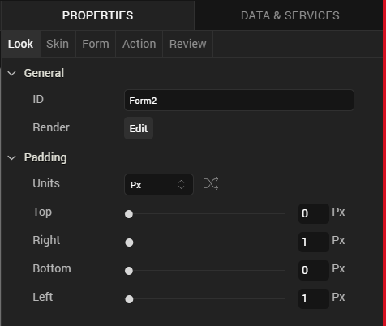
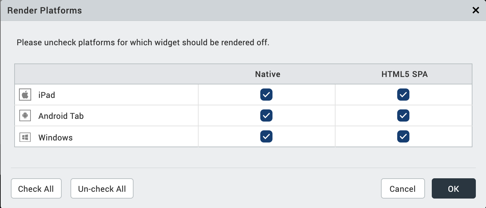
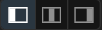
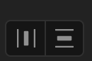

                          

Look Properties
===============

This topic describes the properties located on the **Look** tab of the Properties Editor.

**_Note:_** Some of the properties covered in this topic may not be applicable for all widgets.

The following are the Look properties available for widgets placed on a Flex form.

### ID

Denotes the name of a widget. When a widget is added to a form, a unique name is assigned to the widget. You can rename a widget by entering a new name in the **ID** box.

> **_Note:_** You can also rename a widget from the Project Explorer by right-clicking a widget, and then clicking **Rename**.

### Visible

Controls whether or not the widget is visible to the user of the app.

*   To make a widget visible, click **On**.
*   To make a widget invisible, click **Off**.

### Render

Defines whether a widget appears on a specific platform. By default, a widget is rendered for all platforms.

To change what platforms a widget is rendered for, do the following:

1.  In the Properties Editor, on the **Look** tab of a widget, click the **Edit** button that corresponds to the Render property. The Render Platforms dialog box displays.
2.  Clear the check box of the platforms for which the widget should not be rendered, and then click **OK**.

#### **The Difference between Render and Visible**

Rendering refers to the commitment of resources to generate a widget in an app for a particular platform. To be visible refers to whether the user of an app can see and interact with a rendered widget. Functionally speaking, rendering must take place before a widget can be made visible or invisible. If a widget is not rendered, the value of it's visibility property is irrelevant.

### Content Align

Allows you to define how content lines up within the widget. Following alignment options are available:

1.  Horizontal Alignment : Aligns content relative to the left and right margins of the widget.
2.  Allows you to align the content horizontal.
    
    > **_Note:_** Horizontal alignment of a widget is possible only when the Expand Horiz property is enabled.
    
3.  Vertical Alignment: Allows you to align the content vertically. This type of alignment is possible only when:
    *   Two or more widgets are placed inside a container (with horizontal orientation) such as HBox.
    *   Widget whose content is to be aligned vertically should not occupy maximum height.

You can define the content alignment of a widget specific to a platform by forking **Content Align**. For more information, see [Fork a Widget Property](Forking.md#fork-a-widget-property).

### Widget Pinning

Specifies how a widget is aligned with respect to the boundaries of its parent widget and its neighboring widgets (within the same container widget). The following alignment options are available:

**Horizontal Alignment:**

- **Pin to Left:** Aligns the widget horizontally and pins it to the left boundary of the parent widget. The value of the left property of the widget is set to 0. You can also use the shortcut keys **Shift + Alt + Left Arrow** to pin widgets to the left.
- **Pin to Center:** Aligns the widget horizontally and pins it at the center of the parent widget. The value of the Center X property of the widget is set to 0. You can also use the shortcut keys **Shift + Alt + C** to pin widgets to the center.
- **Pin to Right:** Aligns the widget horizontally and pins it to the right boundary of the parent widget. The value of the right property of the widget is set to 0. You can also use the shortcut keys **Shift + Alt + Right Arrow** to pin widgets to the right.

**Vertical Alignment:**

- **Pin to Top:** Aligns the widget vertically and pins it to the top boundary of the parent widget. The value of the top property of the widget is set to 0. You can also use the shortcut keys **Shift + Alt + Top Arrow** to pin widgets to the top.
- **Pin to Middle:** Aligns the widget vertically and pins it at the center of the parent widget. The value of the Center Y property of the widget is set to 0. You can also use the shortcut keys **Shift + Alt + M** to pin widgets to the middle.
- **Pin to Bottom:** Aligns the widget vertically and pins it to the bottom boundary of the parent widget. The value of the bottom property of the widget is set to 0. You can also use the shortcut keys **Shift + Alt + Bottom Arrow** to pin widgets to the bottom.

**Distribute Multiple Widgets:**

- **Distribute Horizontally:** Aligns the selected widgets across the horizontal axis of the parent widget with equal spacing between the widgets. You can also use the shortcut keys **Shift + Alt + H** to distribute widgets horizontally.
- **Distribute Vertically:** Aligns the selected widgets across the vertical axis of the parent widget with equal spacing between the widgets. You can also use the shortcut keys **Shift + Alt + I** to distribute widgets vertically. 

### Text

Specifies the text displayed on a widget.

### Display Text

Specifies whether the text should be displayed on a widget.

*   To display text on a widget, click **On**.
*   To hide the text on a widget, click **Off**.

You can choose to display the text specific to a platform by forking **Display Text**. For more information, see [Fork a Widget Property](Forking.md#fork-a-widget-property).

### Flex Properties

The Flex properties enables you to resize, move and position a widget.

### Left

Determines the left edge of the widget and measured from the left bound of the parent container.

### Right

Determines the right edge of the widget and measured from the right bound of the parent container.

### Top

Determines the top edge of the widget and measured from the top bounds of the parent container.

### Bottom

Determines the bottom edge of the widget and measured from the bottom bounds of the parent container.

### Width

Width determines the width of the widget as measured along the x-axis.

Following are the options that can be used as units of width:

*   %: Specifies the values in percentage relative to the parent dimensions.
*   px: Specifies the values in terms of device hardware pixels.
*   dp: Specifies the values in terms of device independent pixels.
*   Default: Specifies the unit that is considered as default. The default unit is specified in the Flex form's platform specific property: Default Unit.
*   Preferred Size: When this option is specified, the layout uses preferred height of the widget as height and preferred size of the widget is determined by the widget and may varies between platforms.

### Height

Height determines the height of the widget as measured along the y-axis (height of the parent). You can use any of the following options:

*   %: Specifies the values in percentage relative to the parent dimensions.
*   px: Specifies the values in terms of device hardware pixels.
*   dp: Specifies the values in terms of device independent pixels.
*   Default: Specifies the unit that is considered as default. The default unit is specified in the Flex form's platform specific property: Default Unit.
*   Preferred Size: When this option is specified, the layout uses preferred height of the widget as height and preferred size of the widget is determined by the widget and may varies between platforms.

### Min Width

Specifies the minimum width of the widget. This property is considered only when width property is not specified.

### Max Width

Specifies the maximum width of the widget. This property is considered only when width property is not specified.

### Min Height

Specifies the minimum height of the widget. This property is considered only when height property is not specified.

### Max Height

Specifies the maximum height of the widget. This property is considered only when height property is not specified.

### Center X

The Center X property refers to the center of the widget as measured from the left boundary of the parent container.

> **_Note:_** If the Layout Type is set as Horizontal, Center X is measured from the right edge of the left sibling widget.

### Center Y

The Center Y property refers to the center of the widget as measured from the top boundary of the parent container.

> **_Note:_** If the Layout Type is set as Vertical, Center Y is measured from the bottom edge of the top sibling widget.

### Z Index

Specifies the stack order of the widgets. A widget with a higher Z Index is in front of the those with a lower Z Index.

> **_Note:_** Modifying the zIndex does not modify the order of widgets inside a flex container. If widgets are overlapping with each other with the same zIndex, then the widget order decides the order of overlapping. Last added widget will be displayed on top.

Default:1 (Indicates the widgets is lowest bottom in the layer hierarchy.)

