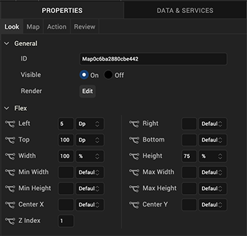
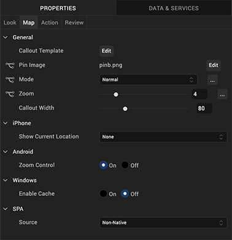
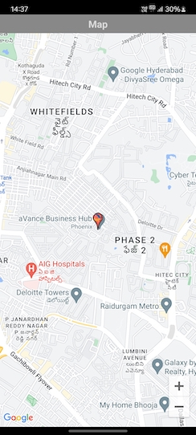
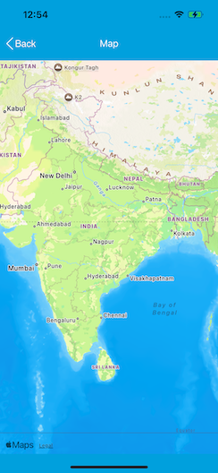

                           

Map
---

Use a Map widget to display locations on a map. Platforms such as iPhone (above 3.0) and Android provide a native map widget, that can be displayed as part of an application. The following table shows the available mapping services:

  
| Platform | Mapping Service |
| --- | --- |
| Android | Google Maps |
| iPhone | Google Maps |
| Mobile Web (advanced) | Google Static Maps, Native maps of the device, and interactive maps (Java script) |

On platforms where a native map widget is not available, the Map widget integrates with Google Maps to display a static image with zoom and pan controls. You can customize the map view.

To learn how to use this widget programmatically, refer [VoltMX Iris Widget guide](../../../Iris/iris_widget_prog_guide/Content/Map.md).

*   Mobile Web ](basic) and Non-Touch.md devices support only static maps.
*   On the Android platform, the Map widget is not available in a popup window.

### Look Properties

Look properties define the appearance of the widget. The following are the major properties you can set:

*   Whether the widget is visible.
*   The platforms on which the widget is rendered.
*   How the widget aligns with its parent widget and neighboring widgets.
*   If the widget displays content, where the content appears.

For descriptions of the properties available on the Look tab of the Properties pane, see [Look](Look.md#Flex).

### Map Properties

Map properties specify properties that are available on any platform supported by Volt MX Iris, and assign platform-specific properties.

> **_Note:_** In this section, the properties that can be forked are identified by an icon  located to the left of the property. For more information, see [Fork a Widget Property](Forking.md#fork-a-widget-property).

#### Callout Template

Specifies a template for a map callout (for example, a pin) that indicates a particular location on a map. The template can include Label, Link, RichText, Button, and Image widgets.

> **_Note:_** If a template is not specified, the platform-specific default callout is used.

For information about creating a callout template, see [Templates:Maps](Templates.md#maps).

To specify a template, click **Edit** to open the **Callout Templates** dialog box, and then choose a template from the list of available templates.

#### Pin Image

Specifies the pin image to use to indicate a location on map. A default image is provide by the system.

To specify a pin image, click the **Edit** button to open the **Pin Image** dialog box. To change the default pin image, select Default and then select a pin image from the value list. To specify a platform-specific pin image, select the platform and then select a pin image from the list.

#### Mode

Specifies the map viewing mode. The mode can be one of the following:

*   Normal: A traditional map view of roads, parks, borders, etc.
*   Satellite: A map showing aerial imagery.
*   Street: A map with street-level imagery.
*   Hybrid: A street map superimposed on satellite map.
*   Terrain: A map showing the surface of the land in 3D view.
*   Polygon: A map showing the polygonal area specified in the locationdata property.
*   Traffic: A map showing streets with different colors to indicate traffic congestion. Green indicates low traffic, orange indicates medium traffic and red indicates heavy traffic.

Select a value from the **Mode** list to specify a default mode that is applied to all platforms. To provide a platform-specific mode, you can fork the **Mode** property. See [Fork a Widget Property](Forking.md#fork-a-widget-property) for more details.

#### Source

Specifies the map source. The map source can be one of the following:

*   Native: The application uses mapKey and provider properties to fetch the map. The fetched map is interactive with the ability to zoom and pan.
    
    > **_Note:_** Polygon view on the advanced Mobile Web platform is available only when the source is set to non-native.
    
*   Non Native: The application uses the map that is on the device.

> **_Note:_** SPA platforms support only Google Static Maps as a source. Static maps are directly requested from Google for a given latitude and longitude. Volt MX Irisdoes not support any other option because the size of the get request URL could be larger than 256 characters, causing the request to fail.

Select a value from the **Map Source** list to specify a default map source that is applied for all the platforms. To provide a platform-specific map source, you can fork the **Map Source** property. See [Fork a Widget Property](Forking.md#fork-a-widget-property) for more details.

#### Zoom Level

Specifies the zoom level for the current map view. The range varies from platform to platform.

Select a value from the zoom level slider to specify a default zoom level that is applied for all the platforms. To provide a platform-specific zoom level, you can fork the **Zoom Level** property. See [Fork a Widget Property](Forking.md#fork-a-widget-property) for more details.

#### Full Screen Widget

Specifies whether the Map widget occupies the full screen.

> **_Note:_** This property is available only on VBox forms.

#### Callout Width

Specifies the width of the callout on the map. You can specify a value between 1 and 100 that represents a percentage relative to the width of the Map widget. For example, a callout width of 100 uses the full width of the widget. If the specified value is less than 1 or more than 100, the callout width is set to 80 percent.

#### Height

Specifies the height of the map as a percentage relative to the value of the [Height Reference](#height-reference) property.

> **_Note:_** This property is not available on Flex Forms.

#### Height Reference

Specifies how the map height is calculated:

*   Form Reference: The map height is calculated as a percentage of the form height, excluding headers and footers. This option does not apply to a Map widget on a popup or template.
*   Parent Width: If the Map widget is on a popup or template, the width is calculated based on the width of the parent container.

> **_Note:_** This property is not available on Flex Forms.

#### Show Current Location

Specifies whether and how the current location on the map is indicated:

*   None: The current location is not indicated.
*   Pin: The current location is indicated by a pin.
*   Circle: The current location is indicated by a circle.

> **_Note:_** This property is specific to the iOS platform.

#### Zoom Control

Specifies whether to display the zoom control on the map.

> **_Note:_** This property is specific to the Android platform.

### Actions

Actions define what happens when an event occurs. On a Camera widget, you can run an action when the following events occur:

*   onClick: The action is invoked by the platform when the map is clicked.
*   onPinClick: The action is triggered when a user clicks the map pin, passing the selected _locationdata_ to the callback.
*   onSelection: The action is triggered when a user clicks on a map callout.
*   onMapLoaded: The action is invoked by the platform when map rendering is complete.
*   onBoundsChanged: The action is invoked by the platform when the content of the map changes

For more information, see [Add Actions](working_with_Action_Editor.md).

### Placement inside a Widget

The following table summarizes where a Map widget can be placed:

<table style="mc-table-style: url('Resources/TableStyles/Basic.css');" class="TableStyle-Basic" cellspacing="0"><colgroup><col class="TableStyle-Basic-Column-Column1"> <col class="TableStyle-Basic-Column-Column1"></colgroup><tbody><tr class="TableStyle-Basic-Body-Body1"><td class="TableStyle-Basic-BodyE-Column1-Body1">Flex Form</td><td class="TableStyle-Basic-BodyD-Column1-Body1">Yes</td></tr><tr class="TableStyle-Basic-Body-Body1"><td class="TableStyle-Basic-BodyE-Column1-Body1">VBox Form</td><td class="TableStyle-Basic-BodyD-Column1-Body1">Yes</td></tr><tr class="TableStyle-Basic-Body-Body1"><td class="TableStyle-Basic-BodyE-Column1-Body1">FlexContainer</td><td class="TableStyle-Basic-BodyD-Column1-Body1">Yes</td></tr><tr class="TableStyle-Basic-Body-Body1"><td class="TableStyle-Basic-BodyE-Column1-Body1">FlexScrollContainer</td><td class="TableStyle-Basic-BodyD-Column1-Body1">Yes</td></tr><tr class="TableStyle-Basic-Body-Body1"><td class="TableStyle-Basic-BodyE-Column1-Body1">HBox</td><td class="TableStyle-Basic-BodyD-Column1-Body1">Yes</td></tr><tr class="TableStyle-Basic-Body-Body1"><td class="TableStyle-Basic-BodyE-Column1-Body1">VBox</td><td class="TableStyle-Basic-BodyD-Column1-Body1">Yes</td></tr><tr class="TableStyle-Basic-Body-Body1"><td class="TableStyle-Basic-BodyE-Column1-Body1">ScrollBox</td><td class="TableStyle-Basic-BodyD-Column1-Body1">Horizontal Orientation -YesVertical Orientation- Yes</td></tr><tr class="TableStyle-Basic-Body-Body1"><td class="TableStyle-Basic-BodyE-Column1-Body1">Tab</td><td class="TableStyle-Basic-BodyD-Column1-Body1">Yes</td></tr><tr class="TableStyle-Basic-Body-Body1"><td class="TableStyle-Basic-BodyE-Column1-Body1">Segment</td><td class="TableStyle-Basic-BodyD-Column1-Body1">No</td></tr><tr class="TableStyle-Basic-Body-Body1"><td class="TableStyle-Basic-BodyE-Column1-Body1">Popup</td><td class="TableStyle-Basic-BodyD-Column1-Body1">Yes</td></tr><tr class="TableStyle-Basic-Body-Body1"><td class="TableStyle-Basic-BodyB-Column1-Body1">Template&nbsp;</td><td class="TableStyle-Basic-BodyA-Column1-Body1">Header- NoFooter- No</td></tr></tbody></table>

### Widget Appearance on Platforms

The appearance of the Map widget varies as follows:

  
| Platform | Appearance |
| --- | --- |
| Android |  |
| iOS |  |
| SPA |  |

