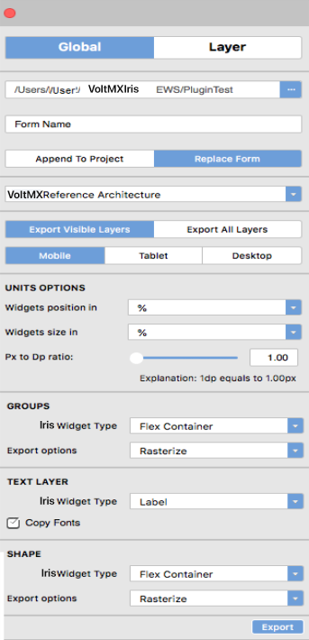
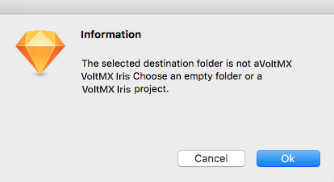
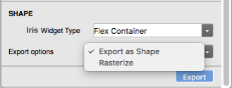
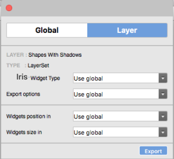
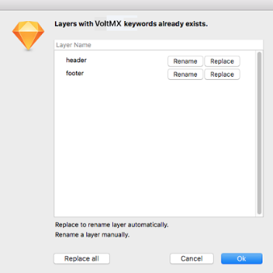
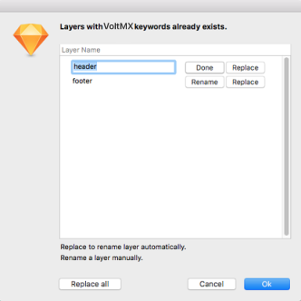

Integration with Sketch
=======================

With the Volt MX Iris plugin for Sketch app, you can convert your Sketch design into forms, widgets, and image assets that you can then open in VoltMX Iris. So even if you don't begin your app design in VoltMX Iris, if you're using Sketch as a design environment, you can seamlessly continue the designing of your app in VoltMX Iris, picking up where you left off in Sketch.

The Volt MX Iris plugin for Sketch is compatible with Sketch Version 60 and later. This plugin is supported in Volt MX Iris version V8 SP4 and later.

Importing a Sketch design into Volt MX Iris involves the following tasks:

*   [Install the VoltMX Iris Plugin for Sketch](#install-the-volt-mx-iris-plugin-for-sketch)
*   [Export a Sketch Design to VoltMX Iris](#export-a-sketch-design-tovoltmx-iris)
*   [Open an Exported Sketch Project in VoltMX Iris](#open-an-exported-sketch-project-involtmx-iris)

<iframe src="https://www.youtube.com/embed/CyYC3x0nzAg" allowfullscreen=""></iframe>

Install the Volt MX Iris Plugin for Sketch
------------------------------------------------

Applicable for _VoltMX Iris on Mac devices._

**To install the VoltMX Iris plugin for Sketch, do the following:**

1.  Download the Sketch plugin installer for Volt MX Iris from the [VoltMX Base Camp](https://community.hclvoltmx.com/downloads).  
    The installer is downloaded as a zip file to your computer.
2.  Extract the contents of the zip file.
3.  Double-click the **voltmxiris.sketchplugin** app plugin.  
    The app is installed to the correct location on your computer so that it is available in Sketch.  

Export a Sketch Design to VoltMX Iris
--------------------------------------------

Using the VoltMX Iris  plugin for Sketch , you export your Sketch project as a VoltMX Iris Project that you can then open in VoltMX Iris. In preparing a project for export, you set the global, default export options, set the export options you want for individual layers (overriding the global settings for that particular layer), and indicate the channel you want the project to be exported for.

This procedure assumes that you have already installed the VoltMX Iris Sketch Plugin. For more information, see [Install the Volt MX Iris Plugin for Sketch](#install-the-plugin-for-sketch).

**To export a Sketch project to VoltMX Iris, do the following:**

1.  In Sketch, open the project you want to export to VoltMX Iris.
2.  Open the VoltMX Iris plugin by clicking the  **Plugins**  menu, next click  **VoltMX Iris**\> **Export Panel**.
3.  From the VoltMX Iris plugin, click **Global**. The plugin looks like this.

      

4.  Specify the name of your exported project by setting its path. The folder you create or select becomes the exported project's VoltMX Iris project name. To set the path, click the ellipsis button (…) of the Project Name text box, and then navigate to the path where you want to save the exported project to, creating a new folder, if necessary.  
    When you have finished, click  **OK** .

     > **_Note:_** You must set the export destination of the Sketch project to a Volt MX Iris project folder or to an empty folder. You cannot export a Sketch project to a non-empty folder.

     From Volt MX Iris version V8 SP3 onwards, you will be shown this dialog.  

     

5.  If you are saving the project to a folder that you have already exported to, indicate whether you want to append the project to the existing exported content as an additional form (or forms), or overwrite and replace the existing exported content. To do so, click either  **Append to Project**  or  **Replace Form** . By default, the VoltMX Iris plugin appends to any existing projects.
6.  Select whether you want to export as Free Form or Volt MX Reference Arch project. If an existing project is selected, then this will get auto populated.
7.  Select whether you want to export only the visible layers (as set on the Sketch), or export all layers regardless of whether they're visible or not.
8.  Indicate the type of channel that you want to export the project to by selecting either  **Mobile** , **Tablet**, or **Desktop** . The default value is **Mobile** .
9.  Set the units options for the size and position of elements. You can select from the following:

    *   **Px.**  Uses pixels as the unit for the dimensions and positioning of project elements for VoltMX Iris. Pixels are a fixed, physical unit and do not scale proportionately depending on the resolution of a devices screen. The rendering of an app on a low-resolution device will appear larger and more pixelated than it would on a higher-resolution device.
    *   **Dp.**  Uses density-independent pixels, which is based upon the physical density of a device's screen. This allows the dimensions of the elements of your design to scale in size depending upon the screen resolution of your target device. Because the Dp unit is relative to a 160 dpi (dots per inch) screen, one dp is equal to one pixel on a 160 dpi screen. The ratio of dp to pixels varies with the screen density of the device. To accommodate this, you can set the dp-to-pixel ratio in the VoltMX Iris plugin, which is described in the next step.
    *   **%.** Sizes the various elements of the project as a percentage of the parent container of the project. The horizontal value and vertical value of the parent container are designated as 100% for their respective dimensions.

10.  Set the ratio between pixels (Px) and density-independent pixels (Dp). This ratio is used only if you are using Dp as your unit of choice for element sizes or positioning. This ratio varies from device to device, depending on the physical density of pixels on the device's screen. Increasing the value of the ratio increases the number of pixels that equal one Dp. For instance, a value of 2.25 indicates that 2.25 pixels equals 1 Dp. To determine the ratio that you should use for your device, use the following formula:  
    Px = DP\*(The device's dpi/160)
11.  Set the kind of widget you want the Sketch layers to be converted to on a default basis for Layer Groups, Text layers, and all other layers (i.e. Shape layers). To simplify the conversion process from a Sketch project to a VoltMX Iris project, you can globally determine the default type of widget that a given type of layer gets converted to. However, if you want to override the global value for a specific layer, you can do so (as described in step 13). The VoltMX Iris plugin categorizes the layers available in Sketch into three types of layers: Layer Groups, Text layers, and all other layers (i.e. Shape layers). The following table illustrates the global values that you can set for each of these three types of layers.

| Sketch Layer | Volt MX Iris Widget Options |
| --- | --- |
| **Group Layer**. Defined as any layer that has layers, project elements, or other assets nested within it. You can mask group of shapes into a Group Layer which then can be rasterized. | Flex ContainerFlex Scroll Container |
| **Text Layer**. Any layer created using a Sketch Text. | Label (default)ButtonText AreaText Box |
| **Shape Layer**.  Defined as any layer other than a Layer Group or Text Layer. An Shape layer may consist of rasterized pixels. | Image (default)Flex ContainerFlex Scroll Container Button |

1.  Select the global export option for Group and Shape layers. Depending on the VoltMX Iris widget type that you selected for Shape layers, you can have such elements converted in either of the following two ways:

    *   **Export as Shape.** The Shape layers are exported as the widget type selected in the Iris Widget Type drop-down list, and the layer styles are converted to the equivalent styles supported under VoltMX Iris skin properties. This option is not available if the Iris Widget Type you select is **Image**.  
    
    *   **Rasterize.** The layer is rasterized (flattened to pixels) and cropped, and saved as a .png file. If the Iris Widget Type you select is either a Flex Container, a Scroll Flex Container, or a Button, the resulting converted widget uses the generated .png file as an image background in VoltMX Iris. And corresponding SVG files are also generated in resources/svg folder in Volt MX Iris project. Which developer can use to get platform specific vector drawable.

2.  Set export options for individual layers. For any of the layers you're exporting, you can override some of the global export options. This is especially helpful if, for example, you want to convert a particular layer into a Flex Scroll Container instead of a Flex Container, or to size a given layer as a percentage of the parent container rather than using whatever unit you selected as your global export option.

    To set export options for individual layers, at the top of the VoltMX Iris plugin, click **Layer**. Next, from the Sketch Layer tab, select the layer you want to custom configure, and then select the export options you want for that layer for the Iris Widget Type, and the type of units you want to use for the converted widget's positioning and sizing. Select the next layer you want to customize, and repeat.

    > **_Note:_** There will be no layer specific setting for symbols(user widgets in Volt MX Iris).

1.  Once you have set all the global and layer-specific export options for your layers in a Artboard or a group, you will need to select the Artboards you want to export. You have the following options:
    *   Export an Artboard or a group.
    *   Export multiple Artboards(Export Limit: 15 Artboards)
    *   Export a page(Export Limit: 10 Artboards)
    *   > **_Note:_** The Groups present in the page will not get exported, only the Artboards will.

2.  From Volt MX Iris version V8 SP3 onwards, after you click on Export, you will be asked if you want to export the project as a zip folder or as a Volt MX Iris project folder. You can choose to generate a zip folder to be able to import the Sketch project in Volt MX Iris.
3.  Once the exportation is finished, you will be able to view the exported project in the Iris Project whose path you had mentioned initially.  
    If you did not export the Sketch project directly to a Iris project, then navigate on your computer to the folder where you exported the Sketch project, copy the folder, and then paste it into the desired VoltMX Iris workspace folder. The default workspace folder for VoltMX Iris is:  
    `/Users/Username/VoltMXIrisEWS/`

Open an Exported Sketch Project in VoltMX Iris
-----------------------------------------------------

Once you have exported a Sketch project using the VoltMX Iris plugin and have copied it to your VoltMX Iris workspace, you can open it in VoltMX Iris.

**To open an exported Sketch project in VoltMX Iris, do the following:**

1.  If VoltMX Iris is already open, on the **Project** menu, click **Refresh**. Otherwise, launch VoltMX Iris.
2.  Do one of the following:

    *   On the VoltMX Iris launch screen, if VoltMX Iris is pointing to the workspace where you pasted the project, VoltMX Iris lists your exported Sketch project among recent projects. Click it.
    *   On the **Project** menu in VoltMX Iris, point to **Open**, and then select from the list of available projects the project you exported from Sketch.

3.  On the Project Explorer, click the **Project** tab, open the channel that you converted the Sketch project to, open **Forms**, and then double-click any of the forms listed. The form appears on the Iris workspace.  

    Ensure that your widget name does not conflict with another widget. Ensure that the widget name is also not a Volt MX Iris keyword. If your widget name conflicts with another widget name, Iris displays a message. Using the options on the screen, you can rename or replace your widget name.  

    
4.  Click on **Replace all** to rename all the layers automatically. Click on **Replace** to rename a specific layer automatically. or,  
    Click on **Rename** and type a different name for a specific layer. Click **Done** to save the change.  

     

5.  Click **Ok** to save the changes.

Limitations
-----------

While converting Sketch layers to VoltMX Iris widgets, the plugin has the following limitations:

*   **Export** is supported for Group and ArtBoard Layer only, otherwise will throw an error.
*   You cannot export a Sketch document or a Sketch Page directly. You can only export a Artboard or a Group Layer.
*   In case of **Fills**, **Borders** and **Shadows** only the first enabled entry is considered during **Export**.
*   Multiple symbols with the same name cannot be exported.
*   After you export symbols to a Iris project in one instance and then try to export additional symbols to the same project at a later instance, the previously exported symbols are ignored. This is because symbols are exported as components to the Iris project.

Best Practices
--------------

To optimize the conversion of Sketch elements into VoltMX Iris elements, we recommend that you create your Sketch project using the following best practices.

*   Only export images as needed, and avoid exporting .png files for anything other than icons or actual images and photos.
*   Avoid using keywords that iris uses to avoid any issues while importing the exported project in Volt MX Iris.
*   Do not rasterize text layers, since these can be exported as labels, text boxes, rich text, or button widgets directly into VoltMX Iris.
*   Make sure you have the fonts installed for the current user at the following path : **~/Library/Fonts/**.
*   SVG files are generated in resources/svg folder in Volt MX Iris project. Which developer can use to get platform specific vector drawable.
*   Instead of exporting each shape as image, it is recommended to **Mask** group of related shapes into a **Group Layer** and then export as image.
*   Use appropriate size mask, when masking shapes to a Group Layer. Otherwise images dimensions and size will be large.
*   Use ArtBoard Layer to define required Form, instead of Group Layer.
*   Avoid empty groups and shapes as these will increase unused widgets in Volt MX Form. You can make them invisible in Sketch if required.
