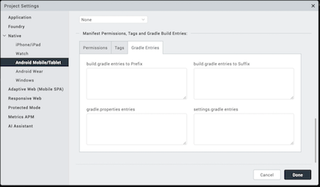
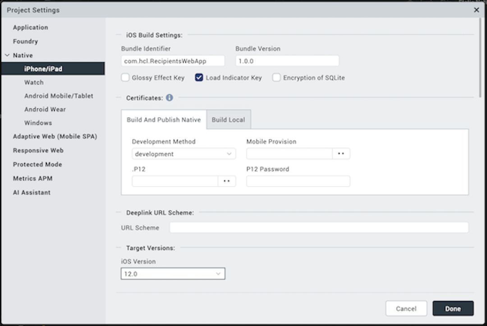
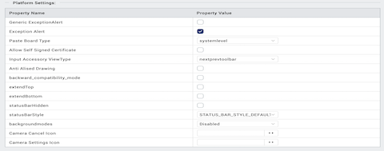
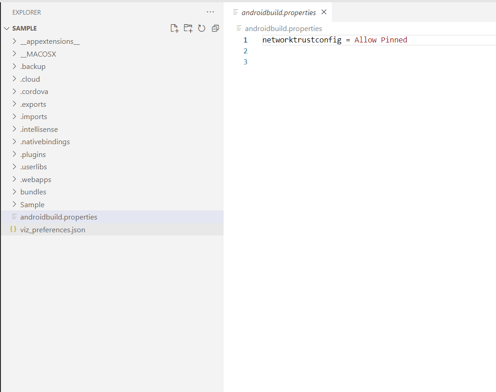

                          


## <a id="set-native-app-properties"></a> Set Native App Properties


Native app properties are divided into two categories: those that are common to all platforms, and those that are platform-specific. These properties range from the logo image your app displays to the types of screens and SDKs the app supports, and how certificates are handled.

In Volt MX Iris V9 SP 2, you can also enable certain Android features [by manually adding the corresponding properties to the androidbuild.properties file](#add-android-properties-to-androidbuild-properties-file).

To set Native app properties, follow these steps:

1.  In Volt MX Iris, from the Project Explorer, click **Project Settings**. The Project Settings window appears.
2.  Click the **Native** tab. A list of sub-tabs appears.
3.  Click the **General** sub-tab, and set the following properties:
    1.  Enter a **Name** for the Native channel version of the application. If no name is specified, the Application ID specified under **Application Properties** is used.
        
        > **_Note:_** For iOS applications, if the Name of the app has non-English characters, you must add the `unicodeAppNameFlag: true` key in the `infoplist_configuration.json` file.
        
    2.  From the Application Logo, you must browse and select an image file for the logo.
        
        > **_Important:_***   The logo you specify here will be renamed to `icon.png` while building the application on the iPhone platform.
        *   For Desktop, the icon dimension must be in multiples of 8. Minimum pixels can be 8 x 8 and maximum pixels can be 248 x 248.
        
4.  Click the **Android** sub-tab, and set the following properties:
    
    
    
    1.  **Package Name**: Package name is a unique name to identify a specific application. It is generally in the format `domain.company.application`.  
        
        > **_Note:_** The name you specify for _Android Package_ must contain at least two segments.
        
        A segment is a valid Java package name. The following are a few examples of valid Android Package names:
        
        *   `com.hcl.<ApplicationName>`
        *   `com.voltmx.<ApplicationName>`
        *   `com.voltmxsolutions.<ApplicationName>`
        *   `com.voltmx.<ApplicationName>_Android`.
    2.  **Version Code**. This is an internal version number. This number is used to determine whether the application is a recent version. This version number is not shown to users. The value must be an integer. You can increase each version by one to indicate a newer version.
    3.  In the **SDK Versions** section:
        *   Select the **Minimum** SDK Version that needs to be supported for the application.
            
            > **_Note:_** The application must be built with a minimum version matching the device SDK version. For example, a device with 5.0 version of SDK cannot run an application built on 4.0.
            
        *   Select the **Target** SDK Version that needs to be supported for the application.
            
            > **_Note:_** The Target SDK Version must be greater than or equal to the Minimum SDK Version.
            
        *   Select the **Maximum** SDK Version that needs to be supported for the application.
    4.  **Signing** - Use this option to sign the android binary automatically during the build process.
        *   **Key Alias**\- Use this option to enter the alias of the key.
        *   **Key Password** - Use this option to enter the password for the key.
        *   **Store File** - Use this option to locate and configure the store file.
        *   **Store Password** - Use this option to enter the password for the store.
    5.  Android Architectures Support
        1.  **Support x86 Devices** - Select this option to support any Android-x86 devices.
        2.  **Support 32-bit Devices** - Select this option to build an Android APK with 32-bit support. Once you select this option, only 32-bit `.so` files (armeabi-v7a and x86) are packed and the application leaves out 64-bit `.so` files (arm64-v8a and x86\_64). If you do not select the Support 32-bit devices option, 64-bit libraries /`.so` files (arm64-v8a and x86\_64) are packed by default.  
            
            > **_Note:_** From Volt MX Iris V9 onwards, 64-bit APK’s are generated, by default.
            
            > **_Note:_** From August 1st 2019 onwards, all apps published on Google Play must support 64-bit architectures.
            
            To support both 64-bit and 32-bit architectures in Google Play store, you must make sure that you perform the following actions:
            
            *   Build the 32-bit and 64-bit APKs with two different version codes, which are separated by at least 1000.  
                For example, `64-bit version code = 32-bit version code + 1000`.
            *   Ensure that the third-party libraries (`AAR` files) contain the respective `.so` files in all supported architectures: lib/armeabi-v7a, lib/arm64-v8a, and lib/x86 lib/x86\_64 for 32-bit and 64-bit architectures, respectively.
            
            > **_Note:_** To enable your application to be built with both 32-bit and 64-bit native libraries, refer to [Support for 32-bit and 64-bit Architectures in a Single APK](#support-for-32-bit-and-64-bit-architectures-in-a-single-apk).
            
    6.  In the **Supported Screens** section:
        *   **Any Density** - If this option is enabled, the application can accommodate any screen density for a resource. You do not have to use this option if your app directly manipulates bitmaps. Generally this option must always be set to true.
        *   **Small Screens** - If this option is enabled, the application supports smaller screen form-factors. A small screen is one with a smaller aspect ratio than the normal (traditional HVGA) screen. An application that does not support small screens is not available for small screen devices from external services (such as Google Play).
        *   **Normal Screens** - If this option is enabled, the application supports normal screen form-factors. Traditionally, this is an HVGA medium density screen, but WQVGA low density and WVGA high density are also considered to be normal.
        *   **Large Screens** - If this option is enabled, the application supports larger screen form-factors. A large screen is defined as a screen that is significantly larger than a normal handset screen, and might require some special care on the application's part to make good use of it. The application may rely on resizing by the system to fill the screen.
            
            If this option is unchecked, it enables screen compatibility mode.
            
        *   **Extra Large Screens** - If this option is enabled, the application supports extra large screen form-factors. An extra large screen is defined as a screen that is significantly larger than a large screen, for example, tablet (or something larger) and may require special care on the application's part to make good use of it. The application may rely on resizing by the system to fill the screen. If the option is unchecked, this will generally enable screen compatibility mode.
        *   **Resizable** - If this option is enabled, the application is resizable for different screen sizes. This property is deprecated by Android SDK and is supported only for customers on the 2.6 plug-in. This property enables you to run an application in the compatibility mode. For more information, see [Support Screen Elements for the Android App Manifest](http://developer.android.com/guide/topics/manifest/supports-screens-element.html).
    7.  In the **Install Location** section:
        *   **Use Location Preference**. This property defines the location where the application is deployed.
            
            *   **Auto** - Indicates that the application is deployed on the device and can be moved to the SD Card later if required.
            *   **Prefer SD Card** - Implies that the application is deployed on the storage card and cannot later be moved to the device memory.
            
            > **_Note:_** This works only if the Minimum SDK is 2.3 or above.
            
    8.  In the **Miscellaneous** section:
        *   **Enable Local Notifications** - Select this option to enable notifications scheduled by an app and delivered on the same device. They are suited for the apps with time-based behaviors, such as calendar events.
        *   **Enable Payment API** - Selecting this option enables online transactions in applications.
        *   **Use Google Play Location Services** - Select this option to enable location service based on the Google Play Location Service API.
        *   **Support SQL DB Encryption (FIPS)**\- In Android, if you select this option, Volt MX Iris automatically bundles Federal Information Processing Standard (FIPS) compliant SQL Cipher third-party library with the application. After the application is complied with this option selected, the APIs in Web SQL support database encryption. For more info, see [API Reference Guide > Offline Data Access APIs > Web SQL APIs.](../../../Iris/iris_api_dev_guide/content/data_store_library.md)
            
        
        *   **Bundle OpenSSL Library**\- In Android, if you select Bundle OpenSSL Library option, Volt MX Iris automatically bundles a third-party OpenSSL native library along with the application. The following APIs use this OpenSSL library to support additional hashing algorithms than the algorithms supported by Native Android SDK (Java Implementation). For information on supported algorithms in these APIs, see [API Reference Guide > Cryptography APIs.  
            ](../../../Iris/iris_api_dev_guide/content/cryptography.md)
            1.  [voltmx.crypto.createPBKDF2Key](../../../Iris/iris_api_dev_guide/content/voltmx.crypto_functions.md#voltmx.cry)
            2.  [voltmx.crypto.createHMacHash](../../../Iris/iris_api_dev_guide/content/voltmx.crypto_functions.md#voltmx.cry2)
             
            
        *   **Disable Application Screenshot** - This option specifies whether the user can take a screenshot of your application.
        *   **Enable File Upload** - Enables you to upload files to a remote sever by using the [HttpRequest API](../../../Iris/iris_api_dev_guide/content/voltmx.net_functions.md#HttpRequ).  <h3 id="actionBa"></h3>  
        *   **ActionBar** - Enabled only if target SDK is 3.0 or above. Use this option to enable _Action Bar_ feature. 
        *   **Network Trust Config** - Using this option, you can control the certificates that are used.
            *   **None** - No certificates are allowed. This means that if the certificate is present in the Android Trust store, it will allow the N/W call to proceed; otherwise, it throws an exception. With this option, servers having non-trusted or self-signed certificates are not accessible via the app on the device.
            *   **All** - All types of certificates are allowed regardless of whether they are bundled. This option is useful during the development phase of an app, but not for publication. With this option, all servers are accessible regardless of the kind of certificate they hold (i.e. self-signed, non-trusted, trusted). Due to the lack of security inherent in this option, the Google Play store rejects such apps when they are submitted for publication.
            *   **Allow Bundled** - Only the certificates that are bundled along with the app are allowed. With this option, the app can communicate **only** with servers that have the certificate(s) that are bundled with the app.
                *   To bundle the certificate in the application, copy the certificate under the following folder: For mobile, `<workspace>/<app>/resources/mobile/native/android/assets/certs`. For tablet, `<workspace>/<app>/resources/tablet/native/androidtab/assets/certs`
                    
                    > **_Note:_** If an _assets_ folder does not exist, create an _assets_ folder under respective locations as indicated above.  
                    Create _certs_ directory under the _assets_ folder and add all the certificates into this folder.
                    
                    > **_Important:_** Allow Bundled option will not work in Android 2.3.x OS versions due to certificate chaining issue (causes certificate exception). This is a known Android native issue. For more information, see [Issue 25152](https://code.google.com/p/android/issues/detail?id=25152&can=1&q=%22certification_path%22&colspec=ID_Type_Status_Owner_Summary_Stars) on the Android Open Source Project Issue Tracker. Among other topics, Issue 25152 documents that to make the bundled option work in Android 2.3.x devices, the root CA needs to be omitted from the server end.
                    
            *   **Allow Pinned** - Only the certificates that are pinned or associated to the host. Pinning makes use of knowledge of the pre-existing relationship between the user and an organization or service to make the security-related decisions better.
    9.  **Splash Screen Orientation Mode** - When resource folders are created from IDE by **Add resource folders** option, then directories like drawable-port and drawable-land are created automatically inside the directory `<workspace>/<app>/resources/mobile/native/android`.
        *   **Portrait** - Use this option if splash screen support is required only for portrait mode, and copy it inside drawable-port folder.
        *   **Landscape** - Use this option if splash screen support is required only for landscape mode, and copy it inside drawable-land folder.
        *   **Both** - Use this option if splash screen support is required for both modes. If splash screen images are different images, then place the image in their respective directories. If you use same image for both modes, then copy the resources under `mobile > native > android` instead of drawable-port or drawable-land folder.
    10. In **Push Notification** section:
        *   **GCM** - Select this option to enable Push Notifications for the application. This option copies the libraries required for push notification into the project during build time.
            
            > **_Important:_** GCM (Google Cloud Messaging) is supported only for Android SDK Versions 2.3 and above.
            
            *   **Custom GCM Broadcast Receiver (Optional)** - If your application requires to override the default GCM broadcast receiver behavior, you can provide your own custom broadcast receiver. To customize the GCM receiver, see [Customizing GCM Broadcast Receiver](Custom_GCM.md).
        *   **FCM** Select this option to enable Push Notifications for the application. This option copies the libraries required for push notification into the project during build time.
            *   **Custom FCM Service (Optional)** - If your application requires to override the default FCM service, you can provide your own custom FCM service. To customize the FCM service, see [Customizing FCM Service](Custom_FCM.md).
    11. In **Manifest Properties** section:
        *   **Permissions** tab: Set the permissions to _true_ or _false_ based on the application requirements. Set the appropriate permissions for Android Manifest file. For more information, see [The Android Manifest File](AndroidManifest_File.md).
            
            1.  To enable permissions, select the permissions from the left pane and click **Add >**.
            2.  To disable permissions, select the permissions from the right pane and click **< Remove**.
                
                
                
                > **_Important:_** Add the `WRITE_EXTERNAL_STORAGE` setting if you need to save images in an external storage like SD Card.
                
        *   **Tags** tab: You can add tags to the Android manifest file directly from Volt MX Iris by specifying tag entries and attributes on the Tags tab. You can specify child tag entries and attributes for <manifest> and <application> tags, and the Main Launcher <activity> tag. For more information on the tags you can add with the manifest or application tags, see [http://developer.android.com/guide/topics/manifest/manifest-intro.html](http://developer.android.com/guide/topics/manifest/manifest-intro.html).
        
        
        
        For more information on the tags you can add, see [http://developer.android.com/guide/topics/manifest/manifest-intro.html](http://developer.android.com/guide/topics/manifest/manifest-intro.html).
        
        *   **Gradle Entries** tab: You can use the Gradle Entries tab to import additional gradle packages, apply external plugins, or specify build-related configuration information, build dependencies, or the location of any external repositories or modules used by your Android application.
        
        
        
        You can specify build.gradle entries as a prefix or suffix entries:
        
        *   Prefix entries are added just below any existing import statements in the build.gradle build script file. Use prefix entries to import additional gradle packages, or to specify external plugins to use in the build.
        
        *   Suffix entries are appended to the end of the generated build.gradle file. Use suffix entries to customize build logic; for example, to add compilation dependencies such as Google and Android support repositories, local library modules, or local and remote repository paths. For more information, see [Organizing Build Logic](https://docs.gradle.org/current/userguide/organizing_build_logic.md).
        
        Use the gradle.properties entry to configure project-wide Gradle settings, such as the Gradle daemon's maximum heap size or proxy settings. For more information, see [The Build Environment](https://docs.gradle.org/current/userguide/build_environment.md).
        
        Use the settings.gradle entry to specify external modules (Gradle-based third-party Android libraries) to include when building your application. For more information, see [Configure Your Build](https://developer.android.com/studio/build/index.md).
        
5.  Under **iPhone/iPad/Watch** tab, set the following properties:



1.  **Bundle Identifier** - Provide an unique name that identifies the application bundle. This is usually in three parts and follows the convention of `com.voltmx.<appname>`.
2.  **Bundle Version** - A number that identifies the version of the application bundle.
3.  **Apply Glossy Effect to App Icon** - Specifies if the glossy effect must be applied to the app icon. The default value is _false_.
4.  **Target Versions** - Choose the deployment target version for your application.<br> _Note_: The minimum iOS deployment target is 12.0.<br>For Watch, the minimum watch OS deployment target is 4.0
4.  **Deeplink URL Scheme**: Specifies a url to which the application will deep-link to. If the application name is southwest then the url scheme that the other applications can use to launch the southwest application is _southwest://_. For more information about deep-linking, see [Appendix E: the App Service Event](AppServiceEvent.md).
    *   **Platform Settings**: Using the Platform Settings Area, you can set certain default properties for an application for iPhone.
        
        
        
        *   Generic exception alert: When true, generic exception alerts like "system error" are fired and when false detailed exception message is shown as alert. Best practice is to be use true for release mode and false for debug mode.
        *   Exception alert: When true, system throughs the exception alerts otherwise (with false) app would crash in case of exception instead of alert. Best practice is to be use true for release mode and true for debug mode.
        *   Globals monitoring: If set to true, the information like number of variables of the given type used in the app. Possible types are Strings, tables, numbers, closures, forms, other objects is printed in the logs.
        *   Paste Board Type: It will allow the user to copy paste content from the app to external writable area like message etc. system level - it will allow to copy paste into other applications. Applevelpersistent - it will allow to copy paste within the app and the messages are persistent will be available across the app restarts. Applevelnonpersistent - it will allow to copy paste within the app and the messages are Not persistent and will not be available across the app restarts. Nopasteboard - it will not allow paste anywhere.
        *   Allow Self Signed Certificate: By default it is false, if true, it allows self signed certificate for development.
            
            > **_Note:_** Self Signed Certificate option is only applicable if you use Network APIs in your application.
            
        *   Input Accessory View Type: The input accessory view type for widgets like text box, calendar, grouped widgets etc where you have next previous cancel buttons. This can be overridden by form level Input Accessory View Type.
        *   Anti Aliased Drawing: If set to true, allows smoother widgets and layout without any jagged edges.
        *   Camera Settings: Allows to set images to the icons which appear on the camera such as cancel icon, settings icon, tapanywhere.
        *   Backward\_compatibility\_mode: By default it is false, if true it will allow the application feature to behave as it would have behaved on earlier version (if there is any behavioral change in the latest version)
5.  **Push Certificate** - Choose the required option from the list to either enable push notifications in different types of environments. You can also disable receiving push notifications for any environment. This field contains the following options:
    
    *   **development**: Select this option to receive push notifications when in the developer environment.
    *   **production**: Select this option to receive push notifications when in the production environment.
    *   **None**: Select this option to disable push notifications in any environment.
    
    > **_Note:_** This feature is available In Volt MX Iris V9 SP 2 FP19 onwards, and is available in both Volt MX Iris Classic and Volt MX Iris.  
    
6.  **Application Launch Mode for iPad** - specifies the default mode of launching the application on iPad. _Portrait_ is the default value.
7.  **Supported Orientations for iPad** - specifies the supported orientations for the iPad. This depends on the launch mode. The different orientations for a form and at application level are listed.
8.  Sets the iOS capabilities with apple defined entitlement key and value based on the application requirements. For more information, refer [the Volt Mx Iris Configuration File](Adding_iOS_app_Capabilities.md).

Add Android Properties to androidbuild.properties File
------------------------------------------------------

From V8 SP4 onwards, you can enable or disable certain Android features by adding the corresponding properties to the `androidbuild.properties` file. You must first create the `androidbuild.properties` file in your Volt MX Iris project workspace (**workspaceLocation\\\\project**) as shown in the image.



> **_Note:_** If the same property is passed from Volt MX Iris in future plugins, the Volt MX Iris property takes precedence.

### Enable Android Features

You can enable the following Android features by adding these properties in the androidbuild.properties file:

#### Public Key Pinning

You can enable the [Public Key Pinning](Public_Key_Pinning.md) feature by specifying the following property in the [androidbuild.properties file](#add-android-properties-to-androidbuild-properties-file) as shown.

This feature is enabled only if the `networktrustconfig` property is set as `Allow Pinned` in the [androidbuild.properties file](#add-android-properties-to-androidbuild-properties-file).

```
networktrustconfig = Allow Pinned			

```

#### APK Tamper Protection

The APK Tamper Protection feature helps you to verify if an APK has been tampered with (modified from its original version). If a tamper is detected, the application safely exits during the bootup process. This is an optional feature that is supported only in Release and Protected modes. APK Tamper Protection is available from V8 SP4 onwards. From V8 SP4 Fixpack 20 onwards, support for Google Play App Signing has been added. Google Play App Signing is a mandatory signup for [Android App Bundle support](#generate-android-app-bundle).

This feature is enabled only if the `addAPKTamperProtection` property is set as `true` in the [androidbuild.properties file](#add-android-properties-to-androidbuild-properties-file).

```
addAPKTamperProtection = true

```

For this feature to work, you must provide either of the information as follows:

*   Add KeyStore entries from the Signing section in Iris: **Project Settings > Native > Android > Mobile/Tablet > Signing**.
*   Alternatively, you can add the developerSigningKeyHash key in the androidbuild.properties file.  
    An example of a typical developerSigningKeyHash is shown here.

```
developerSigningKeyHash:2otpMeAC68KCm7Q+F48tzTFtzmU=

```

The developerSigningKeyHash key helps you to utilize the APK Tamper Protection feature in the following scenarios:

*   Google Play App Signing, where the key used to sign the APK that is being uploaded is different from the final APK delivered to customers from Google Play. For more information on how the Google Play App Signing process works, click [here](https://support.google.com/googleplay/android-developer/answer/7384423).
*   CI/Cloud build environment, without actually revealing the original developer signing KeyStore information.

##### Generate the developerSigningKeyHash Key for Google Play App Signing

1.  When customers enroll into the Google Play App Signing process , the **SHA-256** or **SHA-1** hash of the public key can be obtained. They can obtain the hash by signing in to Google Play Store Console, navigating to **Release Management** > **App Signing**, and then copying the **SHA-256/SHA-1 certificate fingerprint**.
2.  Go to `<WorkSpace>\temp\<AppID>\build\luaandroid\extres`.
3.  Locate and open the `PrintApkSignatureHash.jar` file.
4.  Run the following command to generate the developerSigningKeyHash:  
    `java -jar PrintApkSignatureHash.jar --fingerprint "<Hash-Algorithm>: <certificate fingerprint in Hexadecimal>"`  
    Here, `Hash-Algorithm` can either be `SHA-1` or `SHA-256`.  
    For example:
```
java - jar PrintApkSignatureHash.jar--fingerprint“ SHA256: EB: 71: 4E: 90: 3D: 2A: 7E: 14: 4B: D1: 73: 47: 3A: EA: 3D: 06: C5: F2: 69: B5: DC: BB: 28: 44: A0: 8D: AC: 17: E7: F2: 7F: 8F”
    
```
5.  Here is a sample output that is generated
```
developerSigningKeyHash : xxxxxxxxxxxxxxxxxx
    
```
6.  Copy and paste the output value in the `androidbuild.properties` file.

##### Important Points

1.  If you specify KeyStore entries through Volt MX Iris, the KeyStore entries will take precedence over the developerSigningKeyHash key until In Volt MX Iris V9 SP 2 Fixpack 19.
2.  In Volt MX Iris V9 SP 2Fixpack 20 onwards, if you specify Iris KeyStore entries and developerSigningKeyHash, both items are respected simultaneously and the app is launched if any one of these items matches. This enhancement helps you to test the APK locally before uploading it to Google Play.
3.  If you do not want to upload the Upload Signing key to the CI cloud, use the `uploadSigningKeyHash` property in the **androidbuild.properties** file as an alternative to specifying KeyStore entries.
4.  You must provide either the KeyStore or uploadSigningKeyHash to test Google Play App Signing locally for the enrolled APK, which is tamper-protected. If you do not provide any of those values, the test APK that is generated will be signed by the debug key and the APK will not boot as the hash validation process fails at run time.

##### Generate the developerSigningKeyHash Key by using the KeyStore File

To manually sign the application by using your own keystore file, follow these steps:

1.  Go to `<WorkSpace>\temp\<AppID>\build\luaandroid\extres`.
2.  Locate and open the `PrintApkSignatureHash.jar` file.
3.  Run either of the following commands to generate the developerSigningKeyHash:
    
    *   For apps built In Volt MX Iris V9 SP 2Fixpack 19 or earlier, use the following command. This command generates the hash with SHA-1 algorithm.  
        `java -jar PrintApkSignatureHash.jar keyStorePath keyStorePassword keyAlias`
    *   For apps built In Volt MX Iris V9 SP 2 Fixpack 20 or later, use the following command. This command generates the hash with either SHA-1 or SHA-256 algorithm, depending on the `-- algorithm` input parameter.  
        `java -jar PrintApkSignatureHash.jar –-storepath keyStorePath –-storepass keyStorePassword –-alias keyAlias --algorithm hash-logo`
    
    Here, the items are as follows:
    
    *   **keyStorePath**: Path to your actual developer signing key, which is used to upload your app's APK to the Google Play Store.
    *   **keyStorePassword**: Password of your developer KeyStore.
    *   **keyAlias**: Signing key alias of your developer KeyStore.
    *   **hash-algo**: Hashing algorithm that is used to generate the signing key hash. It can either be `SHA-1` or `SHA-256`.
        
        > **_Note:_** If the hash is generated with SHA-256 algorithm, the hash will not work for apps built In Volt MX Iris V9 SP 2 Fixpack 19 or earlier. However, if the hash is generated with SHA-1 or SHA-256 algorithm, the hash will work for apps built In Volt MX Iris V9 SP 2 Fixpack 20 or later.
        
4.  Here is a sample output that is generated.
    
    developerSigningKeyHash : xxxxxxxxxxxxxxxxxx  
    
    > **_Note:_** If you are generating the hash of the upload signing key to support Google Play App Signing, use `uploadSigningKeyHash` as the key instead of `developerSigningKeyHash`.
    
5.  Copy and paste the output value in the `androidbuild.properties` file.

#### Support for 32-bit and 64-bit Architectures in a Single APK

From V9 onwards, when you enable the `support64bit` property in the `androidbuild.properties` file and select the **Support 32-bit Devices** check box from **Project Settings > Native > Android**, the Volt MX Iris Android build generates a `Fat` application. This `Fat` application supports all architectures: armeabi-v7a, x86, arm64-v8a, and x86\_64.

```
support64bit = true

```

> **_Note:_** Volt MX Iris recommends that you use a `Fat` binary for testing purposes only, and Volt MX does not recommend you to upload a `Fat` binary to Google Play. Use either the [Split APK](#split-apks-based-on-supported-architecture) feature or the [Android App Bundle](#generate-android-app-bundle) feature to reduce the size of the binary that is downloaded to customers' devices.

#### Split APKs based on Supported Architecture

Bundling all architectures into a single fat APK increases the APK size of the app that is delivered to customers. This APK Splitting feature, which has been introduced from V8 SP4 Fixpack 12 GA onwards, helps you to decrease the APK size that is downloaded based on the target platform architecture. For more information on the splitting of APKs, click [here](https://developer.android.com/studio/build/configure-apk-splits).

You must enable the `splitapks` property as `true` in the [androidbuild.properties file](#add-android-properties-to-androidbuild-properties-file). This action generates the architecture-specific individual .apk files and universal .apk file that supports all the architectures. This approach reduces the size of the .apk file.

```
splitapks = true

```

> **_Note:_** Based on the specified value of the [support64bit](#support-for-32-bit-and-64-bit-architectures-in-a-single-apk) property in the [androidbuild.properties](#add-android-properties-to-androidbuild-properties-file) file as well as on the selection of the [Support x86 Devices](#Supportx86Devices) and [Support 32-bit Devices](#Support32bit) check boxes in the Volt MX Iris Project Settings, the Volt MX Iris Android build generates a set of APKs, each with a single supported architecture.

*   Architecture-specific .apk files are generated with this naming convention: `<appid>-<architecture>-<buildtype>.apk`  
    Consider an app with appid as **VoltMXSample**, for which the 64-bit ARM APK names for Debug and Release modes are as follows:
    *   Debug mode: **VoltMXSample-arm64-v8a-debug.apk**
    *   Release Unsigned mode: **VoltMXSample-arm64-v8a-release-unsigned.apk**
    *   Release Signed mode: **VoltMXSample-arm64-v8a-release-signed.apk**
*   Universal .apk files with all selected architectures are generated with this naming convention: `<appid>-universal-<buildtype>.apk`  
    Consider an app with appid as **VoltMXSample**, for which the APK names for Debug and Release modes are as follows:  
    *   Debug mode: **VoltMXSample-universal-debug.apk**
    *   Release Unsigned mode: **VoltMXSample-universal-release-unsigned.apk**
    *   Release Signed mode: **VoltMXSample-universal-release-signed.apk**

The APKs are generated under the following paths:

*   For Mobile: **<workspace>\\temp\\<appid folder>\\build\\luaandroid\\dist\\<appid folder>\\build\\outputs\\apk** folder.
*   For Tablet: **<workspace>\\temp\\<appid folder>\\build\\luatabandroid\\dist\\<appid folder>\\build\\outputs\\apk** folder.

> **_Note:_** For architecture-specific .apk files, the version code of the individual .apk file must be unique. This is because since both 32-bit and 64-bit APKs are supported in 64-bit devices, there will be a conflict while choosing the APK file. Specifying a higher version code for the 64-bit APK file results in a greater precedence, and thus the 64-bit APK file would be chosen for a 64-bit device. This process helps to leverage the higher performance of a 64-bit APK in a 64-bit device.

The Volt MX Iris Android `build.gradle` file automatically handles the use cases related to APK versioning in the following manner:

1.  The Volt MX Iris Android `build.gradle` file assigns **architecture codes** in the following order of priority:  
    **'armeabi-v7a':1 < 'x86':2 < 'arm64-v8a':3 < 'x86\_64':4**
2.  The final Google Play version code of the individual .apk file is: **{(architecture code) \* 1000} + (version code from project settings)**  
    For example, if the version code in the Volt MX Iris Project Settings is 3. Then, the Google Play version codes of each architecture APK is as follows:
    
    *   armeabi-v7a: **1003** {(1 \* 1000) +3 }
    *   x86 : **2003** {(2 \* 1000) +3 }
    *   arm64-v8a : **3003** {(3 \* 1000) +3 }
    *   x86\_64 : **4003** {(4 \* 1000) +3 }
    
    > **_Note:_** If you want to split APKs based on density along with architecture, customize the build by adding the appropriate `build.gradle` entries in the **[Gradle Entries tab](#GradleEntries)** > **[build.gradle entries to Suffix](#Suffixentries)** section.
    

#### Generate Android App Bundle

Google Play’s Dynamic Delivery feature uses your Android App Bundle to build and serve APKs that are optimized for each device configuration. This results in a smaller app download for customers by removing unused code and resources needed for other devices. The support for Android App Bundle generation has been added from V8 SP4 Fixpack 12 GA onwards. For more information about Android App Bundle, refer Google's Android App [here](https://developer.android.com/platform/technology/app-bundle).

To enable the Generate Android App Bundle feature, you must set the `generateAppBundle` property as `true` in the [androidbuild.properties file](#add-android-properties-to-androidbuild-properties-file). The Volt MX Iris Android build then generates the binary in App Bundle (aab) format. The AAB file is a Google Play upload format file, and is not an installable file.

> **_Note:_** Volt MX Iris and CI builds in Volt MX Iris do not provide support for the generation of binaries in the Android App Bundle (aab) format. You must configure Volt MX Iris to [support the generation of 32-bit and 64-bit architectures in a single APK](#support-for-32-bit-and-64-bit-architectures-in-a-single-apk) for generating the Android App Bundle.

```
generateAppBundle = true

```

The AAB file is generated in the following paths after the build:

*   For Mobile : **<workspace>\\temp\\<appid folder>\\build\\luaandroid\\dist\\<appid folder>\\build\\outputs\\bundle** folder.
*   For Tablet : **<workspace>\\temp\\<appid folder>\\build\\luatabandroid\\dist\\<appid folder>\\build\\outputs\\bundle** folder.

> **_Note:_** The Volt MX Iris Android build generates an AAB file with all the selected architectures. The selected architectures are based on the specified value of the [support64bit property](#support-for-32-bit-and-64-bit-architectures-in-a-single-apk) in the [androidbuild.properties file](#add-android-properties-to-androidbuild-properties-file) as well as on the selection of the [Support x86 Devices](#Supportx86Devices) and [Support 32-bit Devices](#Support32bit) check boxes from the Volt MX Iris Project Settings.

To test how Google Play uses the AAB file to generate APKs and how those APKs behave when deployed to a device, follow these steps:

1.  Download [bundletool.](https://github.com/google/bundletool/releases)
    
    > **_Note:_** Android provides a tool, named [bundletool](https://github.com/google/bundletool/releases), to extract APKs from the AAB file and test them. For more information on the usage of bundletool, click [here](https://developer.android.com/studio/command-line/bundletool).  
    
2.  Extract the **APKs set** file from the aab file by using this command:  
    `java -jar bundletool.jar build-apks --bundle=<app-id>.aab --output=<app-id>.apks --overwrite`  
    Here, **APKs set** is an archive file with the extension as **.apks**.
3.  The following command fetches the configuration details of the connected device and installs the device-compatible set of APKs:  
    `java -jar bundletool.jar install-apks --apks=<app-id>.apks --device-id=serial-id`  
    Here, **\--device-id**: Optional parameter that helps to install the device-compatible set of APKs to a specific device (identified by **serial-id**), when multiple devices are connected.  
    **serial-id**: Device identifier that the **adb devices** command returns.
    
    > **_Note:_** If you want to estimate the download size of the APKs from Google Play, generate the device-specific set of APKs by following the procedure specified [here](https://developer.android.com/studio/command-line/bundletool#device_specific_apks).
    

As part of the V8 SP4 Fixpack 12 GA release, the Dynamic Delivery feature (on-demand delivery of modules when an app developer requests) is not supported for Volt MX Iris framework libraries. You can, however, implement the Dynamic Delivery feature for third-party libraries by using FFI code.

To sign the App Bundle file and ensure that the file is ready to be uploaded to Google Play, follow these steps

1.  It is mandatory that you enroll into the Google Play App Signing process for you to be able to upload your App Bundle to the Play Console. Otherwise, you cannot upload the App Bundle to Google Play. For more information on how the Google Play app signing process works, click [here](https://support.google.com/googleplay/android-developer/answer/7384423).
2.  The Release build generates a signed App Bundle with the Release Key value, which is specified in Volt MX Iris. This Release Key is usually either the Upload Key (if you have already enrolled for the Google Play App Signing process) or the actual Release Key (if you are opting for the Google Play App Signing process for the first time to submit an update in the form of an App Bundle to the existing app in Google Play). The signed App Bundle can then be uploaded to Google Play. While delivering optimized APKs to the device, Google Play signs the APKs with its own app signing key.
3.  If the Release Key value is not specified in Volt MX Iris, the Release build generates an unsigned App Bundle. The **jarsigner** command can be used to sign the aab file. For further information on jarsigner, click [here](https://docs.oracle.com/javase/8/docs/technotes/tools/windows/jarsigner.md).  
    `jarsigner -verbose -sigalg SHA1withRSA -digestalg SHA1 -keystore <keystorefile>  
    <app bundle file> alias_name`
    
    > **_Note:_** apksigner is not supported to sign the App Bundle.
    
4.  In Debug build, Gradle automatically signs the App Bundle with the Android SDK Debug Key.

Google Play services include services such as Maps, Push Notification, Geofencing, Metrics, Places, etc. These services access is authorized using an API key. The API key is associated with a developer key for authentication, quota, and billing purposes.

When the Upload Signing Key is different from the Google App Signing Key and if you have registered only the upload key against the API key, Google Play services may fail when the user installs the APK from the Google Play store.

To overcome this, you must register Google App signing key as well with the same API key in the Google Play console. The same applies to external services such as OAuth, Facebook, Twitter APIs, etc. You must register the Google App Signing Key against those services.

#### locationListenerType

The locationListenerType property specifies the location permissions. The permissions can be coarse or fine and are either in the background or foreground. Based on the listener type, an appropriate entry is added to the AndroidManifest.xml file.

**Sample Usage**

`locationListenerType = always`

If the developer does not set the value for the property, the default value is foreground.

**Possible Values**

*   **foreground** - ACCESS\_FINE\_LOCATION, ACCESS\_COARSE\_LOCATION permissions, and location listener/receiver entries needed to listen to location updates in the foreground get added to the AndroidManifest file.
*   **background** - ACCESS\_BACKGROUND\_LOCATION and WAKE\_LOCK permissions will be added to the AndroidManifest file in addition to the entries added by the foreground type.
    *   WAKE\_LOCK is required to support Background location access using the job intent service implementation for devices below Android Oreo(API 27).
    *   ACCESS\_BACKGROUND\_LOCATION is required for requesting the background location access on Android 10 (API 29) and above devices. For more information, see [Android documentation](https://developer.android.com/training/location/receive-location-updates#request-background-location).
*   **always** - A foreground service and FOREGROUND\_SERVICE permission is added in the AndroidManifest file in addition to the entries added by the background type.
    *   These entries help to start a foreground service in case the user denies ACCESS\_BACKGROUND\_LOCATION and also to have continued access to the location while the app moves to the background by the user and even when the device is locked. For more information, see [Android documentation](https://developer.android.com/training/location/receive-location-updates#continue-user-initiated-action).

> **_Note:_** locationListenerType is respected if the Use Google play Location services checkbox is selected in **Project Settings** >**Native** > **Android**

#### Bundle a Customized Cordova-Generated Android Project

To bundle the [manually customized version of your Cordova-generated Android project](CreateCordovaApplications.md#manually-customize-the-cordova-generated-android-project), you must set the `cordovabuildmode` property as `incremental` in the [androidbuild.properties file](#add-android-properties-to-androidbuild-properties-file). This feature is available In Volt MX Iris V9 SP 2 Fixpack 47.

```
cordovabuildmode = incremental
```

For more information about how to manually customize the Cordova-generated Android project, click [here](CreateCordovaApplications.md#manually-customize-the-cordova-generated-android-project).

#### Enable HeadlessLauncher activity

In an app that contains a flow wherein an external activity (such as a payment flow) is launched through app interaction, issues may occur when the app is moved to the background and launched again.

If a user moves the app to the background by pressing the **Home button** after the external activity flow is launched, and launches the app again (through the app launcher), the external activity flow is destroyed when the app moves to the foreground. However, if the user launches the application from the **Recent Apps** tray instead of through the **App Launcher**, the state of the external activity is retained. To mitigate this Native Android issue, you must use the HeadlessLauncher activity. Support for the HeadlessLauncherActivity has been added from Volt MX Iris V9 Service Pack 1.

To enable HeadlessLauncherActivity, add the following entry in the [androidbuild.properties file](#add-android-properties-to-androidbuild-properties-file).

```
useHeadlessLauncherActivity = true   
/*adds headless launcher activity as root activity of the app*/
```

> **_Note:_** This solution is purely based on current Android Native behavior observed for `singleTask` mode launcher activity and is not an Android-documented approach. This approach may not work in the future if the Android Framework implementation for Launch Modes is modified.

##### Customize HeadlessLauncherActivity

You can customize the HeadlessLauncherActivity to add additional functionality. To create and use a custom HeadlessLauncherActivity, follow these steps:

1.  Add the `useCustomHeadlessLauncherActivity = true` entry in the androidbuild.properties file.
2.  Create and bundle a `.jar` or `.aar` file that contains the custom implementation and extends the VoltMXHeadlessLauncherActivity class. For example, `CustomHeadlessLauncherActivity extends com.konylabs.android.VoltMXHeadlessLauncherActivity`.
    
    Place the file in the following location:
    
    *   For Mobile apps: `<WorkSpace>/<app>/resources/customlibs/lib/android`
    *   For Tablet apps: `<WorkSpace>/<app>/resources/customlibs/lib/tabrcandroid`
3.  Add related Activity tags in the Android Manifest file. For example:
```
<activity android:theme="@style/Theme.AppCompat.NoActionBar 
    android:name="com.example.CustomHeadlessLauncherActivity" >  
    <intent-filter>  
    <action android:name="android.intent.action.MAIN" />  
    <category android:name="android.intent.category.LAUNCHER" />  
    </intent-filter>  
    </activity>
```
    
    In case of a `.aar` file, add the activity tag as part of the AndroidManifest.xml in the .aar file.
    
    In case of a `.jar` file, add the custom activity tag in the **Project Settings** → **Native** → **Android Mobile/Tablet** → **Tags** → **Child tag entries under <application> tag.**
    
    > **_Note:_** To avoid any flickering during launch, ensure that the android:theme is the same as the theme of the auto-generated activity that extends VoltMXMain.  
    Details of the auto-generated activity and its theme are available in the AndroidManifest.xml with the same class name as the Application ID.
    

###### Customize the auto-generated Main activity that extends VoltMXMain

You can customize the auto-generated Main activity to add additional functionality. To create and use a custom MainActivity that extends the VoltMXMain activity, follow these steps:

> **_Note:_** These steps can be followed independent of the usage of the `useCustomHeadlessLauncherActivity` and the `useHeadlessLauncherActivity` properties.

1.  Create and bundle a `.jar` or `.aar` file that contains the custom Activity class implementation and extends the VoltMXMain class. For example, `CustomMainActivity extends com.konylabs.android.KonyMain`.  
    
    Place the file in the following location:
    
    *   For Mobile apps: `<WorkSpace>/<app>/resources/customlibs/lib/android`
    *   For Tablet apps: `<WorkSpace>/<app>/resources/customlibs/lib/tabrcandroid`
    
    Override the required Activity Class methods and invoke necessary superclass methods from the overridden methods so that the functionality does not break.
    
    For example:
    
```
    CustomMainActivity extends com.konylabs.android.KonyMain{  
    public void onCreate(Bundle savedInstanceState) {  
    super.onCreate(Bundle savedInstanceState);  
    //Your custom functionality  
    }  
    }
```
2.  Add related Activity tags in the Android Manifest file. For example, `android:name = <CustomMainActivity>`.
    
    *   In case of a `.aar` file, add the activity tag as part of the AndroidManifest.xml in the .aar file.
    *   In case of a `.jar` file, add the custom activity tag in the **Project Settings** → **Native** → **Android Mobile/Tablet** → **Tags** → **Main Launcher <activity> Tag attributes.**
    
    > **_Note:_** The <CustomMainActivity> must be the fully qualified path of the custom activity or the path relative to the package name of the current application.
    

#### Android 11 Package Visibility Updates

Android 11 introduces restrictions on how apps query and interact with other apps installed on a device. When you try to invoke a specific app or query the list of installed apps on the device, the returned list is filtered . Apps must use the `<queries>` element to define other packages that interact with the app. For more information, Refer [Package Visibility](https://developer.android.com/training/basics/intents/package-visibility).

If an app runs on Android 11 (Target SDK level 30, or later) devices, you must include one of the following entries in the **Android Manifest** file of the app:

*   Add the `<queries>` child tag. Within the `<queries>` tag, you can specify packages by name, by intent signature, or by provider authority.
*   Add a permission to include all the packages present in the device. For example, `<uses-permission android:name=“android.permission.QUERY_ALL_PACKAGES”/>`.

##### Protected Mode Behavior

Based on the Package Visibility behavior updates, when you build an Android 11 (Target SDK level 30, or later) app in **Protected Mode**, by default, the `<uses-permission android:name=“android.permission.QUERY_ALL_PACKAGES”/>` permission is added in the Android Manifest file for Protected Mode Builds to work seamlessly. If you do not want this permission to be automatically added, you must add the `donotAddQueryAllPackages = true` entry in the **androidbuild.properties** file of the project source directory.

From June 2022, Google is restricting the use of this permission to limit the visibility into other applications installed on the device. Its usage is still officially allowed for apps which has core functionality  of types Security apps , antivirus ,browser apps , device management apps or Accessibility apps. If the core functionality matches any of these  or if you think your application justifies the usage of the current permission by following below android suggested way using the inputs as part of this knowledge article.

#### Android links

[package-visibility](https://developer.android.com/training/package-visibility/declaring) <br>
[googleplay](https://support.google.com/googleplay/android-developer/answer/10158779#zippy=%2Cinvalid-uses)

For security reasons we strongly suggest re-submitting your apps and appealing to get this permission using our provided materials and explanations why the permission is required for your application , however the usage of this technique is just supportive algorithm that serve only as backup or deprecated technique. So If Android Playstore denies your request we suggest to temporarily disabling the techniques that use this permission by declaring the flag in androidbuild.properties as `donotAddQueryAllPackages = true`. The majority of the guards can function just as efficient in most of the situations even with these techniques disabled. 

### Guidelines for appealing to playstore 

An explanation of why the app requires broad app-visibility? (Playstore question)
 
Volt Iris sdk provides comprehensive solution that ensures that the Android application is running in a secure environment without tampering. Root, Hook, and Emulator detection provide a well-rounded coverage of various attack vectors that can compromise application behavior and put user at risk. Scanning other installed applications is one of key aspects of ensuring a safe execution environment. By examining the actions and permissions of these applications we can determine if an application is malicious or not. Attackers can gain root access to the device and compromise application behavior, stealing user’s private data. These attacks target financial, medical, and similar security-heavy applications that implement payment gateways or uses third party payment sdk's for which  correct and safe execution is critical.
 
Why using a less-wide search is not possible ?
There are millions of different Android malware in the world and the amount is rapidly growing. Some of those even re-use package names of real applications or randomly generate new ones. It is impossible to list all the malware database in the QUERY_ALL_PACKAGES definition.

Why using SafetyNet Verify Apps API is not enough?
 
There are multiple reasons why the Verify Apps is not a practical solution for financial customers where detection speed and trust are particularly important:

1. The Verify Apps feature must be enabled by the user.
2. The warning about a malicious app must not be ignored by
   the user, what most people commonly do.
3. The Verify Apps feature uses an outdated database that 
   cannot detect the latest malware. After testing this feature with the latest and most popular malware we found that less than half of the malware samples were reported while our algorithm scored more than 90% detection rate.

#### QUERY_ALL_PACKAGES permission funcitonality:
 
#### The Flow of the Functionality:

1. The on-device algorithm reads AndroidManifest.xml from other
   applications and reads the following info:

    * Permissions
	* Broadcast Receivers
	* Services
	* Actions of intent filters

    No personal user data is ever captured or stored.

2. The gathered data is then passed to our internal proprietary
   algorithm that decides if said application is potentially malicious or not. The algorithm only returns a score and does not store the data.

3. If the algorithm decides that the application can be malicious,
   the application info is then securely sent to internal sdk servers where its signature is verified against server database. The result is then returned to the device where the proper action can be taken.
    
   The algorithm has a low probability of false positives, so in the vast majority of cases the scanned application is considered safe, and all collected data is immediately discarded.
   Only the data about confirmed malicious applications is stored on the system and presented to the user. All the information (including the app and package name) is discarded if the application is safe.
 
   We detect malicious applications by examining the code, assets or permissions of other installed applications. We only scan for malicious actions, no other data is being searched for or collected.

   VoltIris sdk never accesses any of the user’s private data. All the information about installed legitimate applications is immediately discarded and never stored anywhere .we only collect indications of compromise from malicious apps.

   All the application scanning is performed internally in a protected container. The scanning algorithm is protected from tampering, so information about other installed applications cannot be extracted.

#### Security Provider Patching

The Android Framework relies on Security Providers to provide secure network communications. However, you might find intermittent vulnerabilities in the default security provider. To protect against such vulnerabilities, [Google Play Services](https://developer.android.com/google/play-services) provides a way to automatically update the security provider to enhance device protection.

By using the [voltmx.gms.installSecurityProvider](../../../Iris/iris_api_dev_guide/content/introduction.md) or [voltmx.gms.installSecurityProviderAsync](../../../Iris/iris_api_dev_guide/content/introduction.md) APIs, you can ensure that the device has the latest updates that protect against security exploits. These APIs install a new security provider in the application process, **GmsCore\_OpenSSL**, that is set as the default security provider for the app. The security provider must be installed every time you restart an application process.

To support the Security Crypto Provider Patching, you must add/modify the following entries in the androidbuild.properties file:

*   **Add Google Play Base Library Dependencies**
    
    To add the GMS (Google Mobile Services or Google Play Services) Library Dependencies, you must add the `supportGooglePlayBaseLib = true` entry in the **androidbuild.properties** file of the project. When you add this entry, the `com.google.android.gms:play-services-base` library dependency is added in the build.gradle file of the app.
    
    > **_Note:_** If other APIs such as Map APIs are included in the project, you may not need to add this entry in the androidbuild.properties file.
    
*   **Security Provider Patching during Application boot-up**
    
    To support security provider patching during the application boot-up process, you must add the `patchSecurityProvider` key in the **androidbuild.properties** file of the project. The value of the **patchSecurityProvider** key must be set to `sync` for synchrounous and `async` for asynchrounous patching.
    
    > **_Note:_** In case of synchronous patching, the time taken for patching adds to the time taken for boot-up.
    
    Security provider patching takes about 280 ms in low-end devices and 100 ms in high-end devices for the first time after the application is installed. Due to ART-JIT optimizations, subsequent launches of the application (after the process is killed) may be faster than the first boot-up after the install. If a security provider is available for an app, subsequent launches will not add to the overhead time for an app as the launches will be quick (less than 10ms even on low-end devices).
    
    > **_Note:_** Security Provider Patching during the app boot-up process only works if the device has the latest version of the crypto provider (that is offered by the Google Play Services library). If the Google Play Services is not up-to-date, security provider patching is skipped in silent mode.
    

##### Enable all supported TLS protocols and ciphers

During network communication (while using the voltmx.net APIs), only a subset of the TLS protocols and ciphers (that are supported by the device) are enabled for an SSL handshake. To have greater control over the enabled protocols and ciphers used in a network, developers can modify the following configurations in the androidbuild.properties file of the project:

*   **enableAllSupportedProtocolsAndCiphersAfterProviderUpdate**
    
    Set the value of this property to **true** to enable all the TLS protocols and ciphers (that are supported by the device) during the SSL handshake, after the provider update is successful. When you set the value of this property to true, you can enable the latest TLS protocols and ciphers on older devices as well. When you set the value of this property to **false**, only the default TLS protocols and ciphers (that are supported by the device) are enabled for the SSL handshake.  
    The value of this property is set as **true**, by default.
    
*   **enableAllSupportedProtocolsAndCiphers**
    
    Set the value of this property to **true** to enable all the TLS protocols and ciphers (that are supported by the device) during the SSL handshake, irrespective of a provider update. When you set the value of this property to **false**, only the default TLS protocols and ciphers (that are supported by the device) are enabled for the SSL handshake.  
    The value of this property is set as **false**, by default.
    
    > **_Note:_** In normal circumstances, you must not set the value of this property to true, as deprecated protocols and ciphers may also be enabled on the device.
    

#### Configure Tablet Size for Universal App Binaries

For Universal App Binaries, you can configure the minimum length threshold that identifies a device as a Tablet. As Universal App Binaries can run on both Mobile and Tablet devices, configuring the threshold for a Tablet device enables developers to provide a uniform user experience based on the device type and orientation.

To configure the threshold value that identifies a device as a Tablet, add the following key in the androidbuild.properties file:  
`tabletBreakPointInInches=<length in inches>`

The default value for the **tabletBreakPointInInches** key is 6 inches.

> **_Note:_** This feature is available from the Volt MX Iris V9 ServicePack2 Fixpack 7 release.

#### Support for splashOrientationClassifier Property

The **splashOrientationClassifier** property is a sub-level property of the **Splash Screen Orientation Mode** (specified in the **Project Settings > Android** section) that provides screen orientation modes at a granular-level for a particular Splash Screen Orientation mode.

You can specify the **splashOrientationClassifier property** in the **androidbuild.properties** file as follows:

```
splashOrientationClassifier =  "SCREEN_ORIENTATION_USER_LANDSCAPE";
```
Based on the value of the Splash Screen Orientation Mode property, the values of the splashOrientationClassifier property are as follows:


<table>
    <colgroup><col style="width: 35%;" class="TableStyle-TemenosTables-Column-Column1">
    
    <col style="width: 70%;" class="TableStyle-TemenosTables-Column-Column1">
    
    </colgroup><thead>
        <tr class="TableStyle-TemenosTables-Head-Header1" data-mc-conditions="">
            <th class="TableStyle-TemenosTables-HeadE-Column1-Header1" style="text-align: center;" data-mc-conditions="Default.V9SP3" scope="col" valign="middle"><b>Splash Screen Orientation Mode</b>
            </th>
            <th class="TableStyle-TemenosTables-HeadD-Column1-Header1" style="text-align: center;" data-mc-conditions="Default.V9SP3" scope="col" valign="middle"><b>splashOrientationClassifier</b>
            </th>
        </tr>
    </thead>
    <tbody>
        <tr class="TableStyle-TemenosTables-Body-Body1" style="height: 56px;" data-mc-conditions="">
            <td class="TableStyle-TemenosTables-BodyE-Column1-Body1" data-mc-conditions="Default.V9SP3">landscape</td>
            <td class="TableStyle-TemenosTables-BodyD-Column1-Body1">
                <p data-mc-conditions="Default.V9SP3">SCREEN_ORIENTATION_LANDSCAPE</p>
                <p data-mc-conditions="Default.V9SP3">SCREEN_ORIENTATION_REVERSE_LANDSCAPE</p>
                <p data-mc-conditions="Default.V9SP3">SCREEN_ORIENTATION_SENSOR_LANDSCAPE</p>
                <p data-mc-conditions="Default.V9SP3">SCREEN_ORIENTATION_USER_LANDSCAPE</p>
            </td>
        </tr>
        <tr class="TableStyle-TemenosTables-Body-Body1" style="height: 56px;" data-mc-conditions="">
            <td class="TableStyle-TemenosTables-BodyE-Column1-Body1" data-mc-conditions="Default.V9SP3">portrait</td>
            <td class="TableStyle-TemenosTables-BodyD-Column1-Body1">
                <p data-mc-conditions="Default.V9SP3">SCREEN_ORIENTATION_PORTRAIT</p>
                <p data-mc-conditions="Default.V9SP3">SCREEN_ORIENTATION_REVERSE_PORTRAIT</p>
                <p data-mc-conditions="Default.V9SP3">SCREEN_ORIENTATION_SENSOR_PORTRAIT</p>
                <p data-mc-conditions="Default.V9SP3">SCREEN_ORIENTATION_USER_PORTRAIT</p>
            </td>
        </tr>
        <tr class="TableStyle-TemenosTables-Body-Body1" style="height: 56px;" data-mc-conditions="">
            <td class="TableStyle-TemenosTables-BodyE-Column1-Body1" data-mc-conditions="Default.V9SP3">Device Default</td>
            <td class="TableStyle-TemenosTables-BodyD-Column1-Body1">
                <p data-mc-conditions="Default.V9SP3">SCREEN_ORIENTATION_UNSPECIFIED</p>
                <p data-mc-conditions="Default.V9SP3">SCREEN_ORIENTATION_FULL_SENSOR</p>
                <p data-mc-conditions="Default.V9SP3">SCREEN_ORIENTATION_SENSOR</p>
            </td>
        </tr>
        <tr class="TableStyle-TemenosTables-Body-Body1" style="height: 56px;" data-mc-conditions="">
            <td class="TableStyle-TemenosTables-BodyB-Column1-Body1" data-mc-conditions="Default.V9SP3">Both</td>
            <td class="TableStyle-TemenosTables-BodyA-Column1-Body1">
                <p data-mc-conditions="Default.V9SP3">SCREEN_ORIENTATION_BEHIND</p>
                <p data-mc-conditions="Default.V9SP3">SCREEN_ORIENTATION_FULL_USER</p>
                <p data-mc-conditions="Default.V9SP3">SCREEN_ORIENTATION_LOCKED</p>
                <p data-mc-conditions="Default.V9SP3">SCREEN_ORIENTATION_NOSENSOR</p>
                <p data-mc-conditions="Default.V9SP3">SCREEN_ORIENTATION_USER</p>
            </td>
        </tr>
    </tbody>
</table>

> **_Note:_** The value of the splashOrientationClassifier property is only respected when you provide a valid value corresponding to a particular Splash Screen Orientation Mode (as specified in the table). For example, if you are using the portrait Splash Screen Orientation Mode, you can only provide a value for the splashOrientationClassifier property from the following:
>
>*   SCREEN_ORIENTATION_PORTRAIT
>*   SCREEN_ORIENTATION_REVERSE_PORTRAIT
>*   SCREEN_ORIENTATION_SENSOR_PORTRAIT
>*   SCREEN_ORIENTATION_USER_PORTRAIT

<!--
For more information on the values of the splashOrientationClassifier property, refer Android Screen Orientation Values.
-->

#### Enable Support for SMS Retriever

By using the SMS Retriever, you can implement SMS-based user verification in an app without requesting users to manually type verification codes, and without requesting for any additional app permissions.


To enable support for SMS Retriever, add the **addSMSRetrieverSupport** key in the androidbuild.properties file:

```
addSMSRetrieverSupport = <UI or Non-UI>
```

Set the value of the addSMSRetrieverSupport key to **UI** or **Non-UI** to fetch the required Gradle entries.

For more information on the SMS Retriever API, refer [voltmx.phone.retrieveSMS API](../../iris_api_dev_guide/content/voltmx.phone_functions.html).
