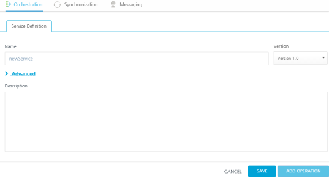

                          

Orchestration
=============

Service orchestration is the coordination or integration of several services and exposing them as a single service. The mix of services supports the automation of business processes.

The following types of Orchestration services are available in Volt MX Foundry:

*   [Composite Services](#composite-services): Allows you to run two or more services either concurrently or sequentially.
*   [Looping Services](#looping-services): Allows you to run a single service in a loop till the loop ends or an exit criteria is met.

Composite Services
------------------

Volt MX  Foundry supports the following type of Orchestration Services:

Composite Services is a combination of two or more services. You can specify the order of execution for the services. The order can be sequential or concurrent.

*   **Sequential** indicates that the services will be invoked in the order you specify. And also, the output of one service becomes an input to the next service. This service is useful in the following case:
    *   **Movie booking portal**: After you purchase a movie ticket, you are provided with an option to order food items that would be delivered at a specified time during the movie.
*   **Concurrent** indicates that the services are invoked independent of each other. Invoking and execution of one service does not affect the execution of other services.
    *   News Portal: Portal such as Google News ([http://google.com/news](http://google.com/news)) run multiple services simultaneously to get news on various topics such as business, technology, entertainment, sports, and Science.
        

Looping Services
----------------

**Looping Services** is a type of service that runs in a loop for the specified number of times. The specified service gets invoked and executed multiple times till the loop ends or an exit criteria is met.

The looping service is useful in the following cases:

*   If you want to fetch the stock price and display it.
    
*   If you want to retrieve the weather details.
    
*   If you want to display the current news.
    

Features of Orchestration Service
---------------------------------

*   You can select multiple services or operations.
*   All the defined services need not be of the same type. For example, your Orchestration services can contain a combination of Looping service, Concurrent service, and Sequential service.
*   You can add an existing Orchestrations services to a new service.
*   For creating a new composite service, you select the services from the existing **Integration Services** and **Orchestration Services**.

Creating a New Composite Service
--------------------------------

To create a composite service, follow these steps:

1.  In Volt MX Iris, open either an existing application or create a new one.
2.  If you have not done so already, log in to your Volt MX account. To do so, in the top right corner of the Volt MX Iris window, click **Login**. The Volt MX Account sign-in window opens. Enter your email and password credentials for your Volt MX user account, and then click **Sign in**.
3.  Create a new Volt MX Foundry application or use an existing one. To do so, on the **Data and Services** panel, click the context menu arrow, and then click either **Create New App**, or **Use Existing App**, and then select from the Volt MX Foundry Application dialog box the services application that you want to publish. The Volt MX Foundry Console opens.

    

    > **_Note:_** If you want to associate your Volt MX Iris project with a different Volt MX Foundry app, on the **Project** tab of the Project Explorer, click the context menu arrow for **VoltMX Foundry**, and then click **Unlink App**. To link to a different Volt MX Foundry app, click the context menu arrow for **VoltMX Foundry**, and then click either **Create New App**, or **Use Existing App**.

4.  To create a new integration service, on the **Integration** tab, click **CONFIGURE NEW**. The **Service Definition** section appears.

    

5.  Go to the **Orchestration** tab. The page lists the existing services (if any).
    
     
    
6.  Click **CONFIGURE NEW**.

      

7.  The **Composite Services Configuration** page is displayed. Update the following details :
    1.  **Name** : Type a new name for this service. Ensure that name is unique and does not conflict with an existing service.
        
        > **_Note:_** Service name should not contain special characters, must begin with a letter, and should be between 4 and 30 characters long.
        
    2.  Select a JAR File from the list or you can click **Upload New**to add a new JAR file.
        
        > **_Note:_** JAR files are available globally within the same Volt MX account. That is, a JAR file created for one app is available for another app provided that both the apps are created using the same Volt MX account.
        
    3.  Add a description for the service in **Description** text area.
    4.  Click **Save**.
8.  Click **Add Operation**. The New Operation tab appears.
9.  Provide a name and security level for the operation.
10.  In the Operation Type list, select **Composite**.
11.  Select a service execution mode from the list.
12.  Click **Advanced** link and provide a custom code if required.
13.  Click **Save Operation**.
14.  To close the Volt MX Foundry Console and return to the panes, views, and tabs of the Volt MX Iris integrated development environment (IDE), from the Quick Launch Bar along the upper left edge of Volt MX Iris, click the Workspace icon . Since you are still logged in to your Volt MX account, Volt MX Iris continues to have access to your Volt MX Foundry services.

Creating a New Looping Service
------------------------------

To create a Looping service, follow these steps:

1.  In Volt MX Iris, open either an existing application or create a new one.
2.  If you have not done so already, log in to your Volt MX account. To do so, in the top right corner of the Volt MX Iris window, click **Login**. The Volt MX Account sign-in window opens. Enter your email and password credentials for your Volt MX Cloud account, and then click **Sign in**.
3.  Create a new Volt MX Foundry application or use an existing one. To do so, on the **Data and Services** panel, click the context menu arrow, and then click either **Create New App**, or **Use Existing App**, and then select from the Volt MX Foundry Application dialog box the services application that you want to publish. The Volt MX Foundry Console opens.

    

    > **_Note:_** If you want to associate your Volt MX Iris project with a different Volt MX Foundry app, on the **Project** tab of the Project Explorer, click the context menu arrow for **VoltMX Foundry**, and then click **Unlink App**. To link to a different Volt MX Foundry app, click the context menu arrow for **VoltMX Foundry**, and then click either **Create New App**, or **Use Existing App**.

4.  Go to the **Orchestration** tab. The page lists the existing services (if any).
5.  In the **Add Orchestration**, click **Create Looping**.
6.   The **Looping Services Configuration** page is displayed. Update the following details :
    1.  **Name of the service**: Type a new name for this service. Ensure that name is unique and does not conflict with an existing service name.
    2.  **Left Pane**: Lists all the existing Integration Service and Orchestration Services available for the app. From here, select an orchestration Service or an operation from an integration service by clicking **Add**.
    3.  **Central Pane**: Displays the operation or the orchestration service added from the left pane. You can delete an operation or a service by clicking the **Delete** button.
    4.  **Right Pane**: Contains the following options:
        1.  **Select Jar File**: Allows you to select an existing JAR file.
            
            > **_Note:_** JAR files are available globally within the same Volt MX account. That is, a JAR file created for one app is available for another app provided that both the apps are created using the same Volt MX account.
            
        2.  **Choose File**: Allows you to select a new JAR file from your machine. Click **Choose File**, and then select a file from your machine.
        3.  **Preprocessor class**: It is a component that is invoked before passing the data to the external data source. This enables the developer to include any business logic on the data before forwarding the request to the external data source.
        4.  **PostProcessor class**: It is a component invoked after the data is received from the external data source but before that data is returned to the mobile device. This enables the developer to include any business logic on the data before sending the response to the mobile device.
        5.  **Configuration Params**: Here, you specify the looping conditions that include:
            *   **Max Loop Count**: Specifies the number of times the service included in the looping service must get executed.
            *   **Input Parameter Separator**: Specifies the character that separates the input parameters of a service.
                
            *   **Break Loop Parameter Name**: Specifies if there are any breakout parameters for the execution of the looping service. The breakout parameter will be a part of the result returned from the service call within a loop.
                
            *   **Break Loop Parameter Value**: Specifies the value for the breakout parameter of the looping service. If the value of the breakout parameter returned from the service matches with the given value, it breaks out of the loop.
    5.  Click **Save** to create a new looping service.
    6.  To close the Volt MX Foundry Console and return to the panes, views, and tabs of the Volt MX Iris integrated development environment (IDE), from the Quick Launch Bar along the upper left edge of Volt MX Iris, click the Workspace icon . Since you are still logged in to your Volt MX account, Volt MX Iris continues to have access to your Volt MX Foundry services.

Use an existing Service
-----------------------

Volt MX  Foundry allows you to use an existing Orchestration Service.

To use an existing Orchestration Service, follow these steps:

1.  Go to the **Orchestration** tab. The page lists the existing services (if any).
2.  In the **Add Orchestration**, click **Use Existing**.
3.  In the **Existing services** page, a list of existing services are displayed. Hover over a service, click the **Settings** button to view **Share** and **Clone** options.
    *   Click **Share**, to reuse an existing service. Changes made to this service will affect all the apps using this service.
        
        > **_Note:_** If a service is a part of a published app, you can rename that service only after the app is unpublished.
        
    *   Click **Clone**, to duplicate an existing service. Changes made to this service will have no impact on the original service.
4.  Based on the type of service (Composite or looping), one of the following page is displayed: the [Composite Services Configuration](#Composite_Services_Configuration) page or the [Looping Services Configuration](#Looping_Services_Configuration) page.

Existing Services - Actions
---------------------------

You can perform following actions on an existing service:

*   **Edit**: Allows you to edit a service. After you edit a service, you need to republish all the apps that are using the service to apply the changes.
    
    > **_Note:_** If a service is a part of a published app, you can rename that service only after the app is unpublished.
    
*   **Clone**: Allows you to duplicate an existing service. Changes made to a cloned service will not impact the original service.
*   **Sample Code**: A dynamic code is generated based on the configuration of a service. You can use this code in your SDK.
*   **Delete**: Allows you to delete a service.
    
    > **_Note:_** If a service is a part of a published app, you can delete that service only after you unlink the service from all the published app.
    
*   **Unlink**: Allows you remove the service from the Orchestration tab of an app. When a service is unlinked, it is disassociated from a particular app.
    
    > **_Note:_** If you wanted to add an unlinked service, see [Use an existing Service](#use-an-existing-service).
